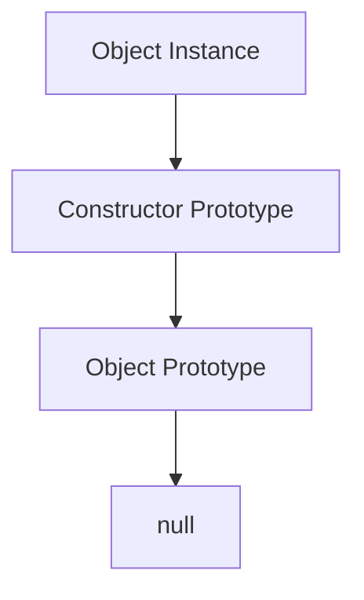

## 4.13 Effective Use of Prototypes

In this section, we delve into the powerful concept of prototypes in JavaScript, a fundamental aspect of the language that enables efficient method sharing and inheritance. Understanding and effectively using prototypes can significantly enhance your ability to write efficient, maintainable, and scalable JavaScript code.

### Understanding JavaScript Prototypes

JavaScript is a prototype-based language, which means that inheritance is achieved through prototypes rather than classical inheritance models found in languages like Java or C++. Every JavaScript object has a prototype, which is another object from which it inherits properties and methods.

#### The Prototype Chain

When you try to access a property or method on an object, JavaScript first looks at the object itself. If it doesn't find the property there, it looks at the object's prototype, and then the prototype's prototype, and so on, until it reaches the end of the chain. This is known as the prototype chain.

```javascript
function Person(name) {
    this.name = name;
}

Person.prototype.greet = function() {
    console.log(`Hello, my name is ${this.name}`);
};

const alice = new Person('Alice');
alice.greet(); // Output: Hello, my name is Alice
```

In the example above, the `greet` method is defined on `Person.prototype`, which means all instances of `Person` can access this method through the prototype chain.

### Adding Methods to a Constructor's Prototype

One of the most efficient ways to share methods across instances of a constructor function is by adding them to the constructor's prototype. This ensures that all instances share the same method, rather than each instance having its own copy, which saves memory.

```javascript
function Car(make, model) {
    this.make = make;
    this.model = model;
}

Car.prototype.getDetails = function() {
    return `${this.make} ${this.model}`;
};

const car1 = new Car('Toyota', 'Corolla');
const car2 = new Car('Honda', 'Civic');

console.log(car1.getDetails()); // Output: Toyota Corolla
console.log(car2.getDetails()); // Output: Honda Civic
```

In this example, `getDetails` is shared across all instances of `Car`, demonstrating efficient memory usage.

### Prototypal Inheritance Patterns

Prototypal inheritance allows objects to inherit directly from other objects. This can be more flexible than classical inheritance and is a natural fit for JavaScript's dynamic nature.

#### Object.create

The `Object.create` method is a powerful way to create a new object with a specified prototype. This method allows for more direct inheritance without the need for constructor functions.

```javascript
const animal = {
    speak() {
        console.log(`${this.name} makes a noise.`);
    }
};

const dog = Object.create(animal);
dog.name = 'Rex';
dog.speak(); // Output: Rex makes a noise.
```

Here, `dog` inherits from `animal`, gaining access to the `speak` method.

#### Constructor Functions and Prototypes

Constructor functions are a common way to create objects with shared methods in JavaScript. By attaching methods to the constructor's prototype, you can ensure that all instances share the same methods.

```javascript
function Animal(name) {
    this.name = name;
}

Animal.prototype.speak = function() {
    console.log(`${this.name} makes a noise.`);
};

const cat = new Animal('Whiskers');
cat.speak(); // Output: Whiskers makes a noise.
```

### Optimizing Memory Usage

By sharing methods through prototypes, you can optimize memory usage in your applications. Each instance of an object does not need its own copy of every method, which can lead to significant memory savings, especially in applications with many instances.

#### Example: Memory Optimization

Consider a scenario where you have a large number of objects that need to perform the same operation. By using prototypes, you can ensure that this operation is defined once and shared across all instances.

```javascript
function User(name) {
    this.name = name;
}

User.prototype.sayHello = function() {
    console.log(`Hello, ${this.name}`);
};

const users = [];
for (let i = 0; i < 1000; i++) {
    users.push(new User(`User${i}`));
}

users[0].sayHello(); // Output: Hello, User0
```

In this example, the `sayHello` method is shared across 1000 instances, demonstrating efficient memory usage.

### Risks of Modifying Built-In Prototypes

While modifying built-in prototypes (such as `Array.prototype` or `Object.prototype`) can be tempting, it is generally considered bad practice. Doing so can lead to unexpected behavior and conflicts, especially when working with third-party libraries.

#### Example: Avoid Modifying Built-In Prototypes

```javascript
// Bad practice: Modifying Array.prototype
Array.prototype.last = function() {
    return this[this.length - 1];
};

const numbers = [1, 2, 3];
console.log(numbers.last()); // Output: 3
```

While this might seem convenient, it can cause issues if another library also modifies `Array.prototype` or if future versions of JavaScript introduce a method with the same name.

### Best Practices for Using Prototypes

- **Use Prototypes for Shared Methods**: Define methods on the prototype to ensure they are shared across instances.
- **Avoid Modifying Built-In Prototypes**: Modifying built-in prototypes can lead to conflicts and unexpected behavior.
- **Use `Object.create` for Direct Inheritance**: This method provides a clean way to set up inheritance without constructor functions.
- **Understand the Prototype Chain**: Knowing how the prototype chain works is crucial for debugging and designing efficient code.

### Visualizing the Prototype Chain

To better understand how the prototype chain works, let's visualize it using a diagram.



**Diagram Description**: This diagram illustrates the prototype chain in JavaScript. An object instance points to its constructor's prototype, which in turn points to the object prototype, ending with `null`.

### Try It Yourself

Experiment with the code examples provided. Try adding new methods to prototypes, creating objects using `Object.create`, and observing how changes to prototypes affect instances. Consider the following challenges:

- Modify the `Car` example to include a method that calculates the age of the car based on a `year` property.
- Create a new object using `Object.create` and add properties to it. Observe how these properties are accessed through the prototype chain.

### Knowledge Check

Let's reinforce what we've learned with some questions and exercises.

- What is the primary benefit of using prototypes for method sharing?
- Why should you avoid modifying built-in prototypes?
- How does `Object.create` differ from using a constructor function?

### Summary

In this section, we've explored the effective use of prototypes in JavaScript, a powerful feature that enables efficient method sharing and inheritance. By understanding and leveraging prototypes, you can write more efficient and maintainable code. Remember to avoid modifying built-in prototypes and to use `Object.create` for clean inheritance patterns.

### Embrace the Journey

Remember, mastering prototypes is just one step in your journey to becoming a proficient JavaScript developer. Keep experimenting, stay curious, and enjoy the process of learning and growing your skills.

## Quiz: Mastering JavaScript Prototypes



### What is the primary benefit of using prototypes for method sharing in JavaScript?

- [x] Efficient memory usage
- [ ] Faster execution time
- [ ] Easier debugging
- [ ] Better security

> **Explanation:** Prototypes allow methods to be shared across instances, reducing memory usage.

### Which method is used to create a new object with a specified prototype?

- [x] Object.create
- [ ] Object.assign
- [ ] Object.defineProperty
- [ ] Object.freeze

> **Explanation:** `Object.create` is used to create a new object with a specified prototype.

### Why should you avoid modifying built-in prototypes?

- [x] It can lead to conflicts and unexpected behavior
- [ ] It improves performance
- [ ] It makes code easier to read
- [ ] It enhances security

> **Explanation:** Modifying built-in prototypes can cause conflicts with other code and future JavaScript versions.

### What does the prototype chain end with?

- [x] null
- [ ] undefined
- [ ] Object.prototype
- [ ] Function.prototype

> **Explanation:** The prototype chain ends with `null`.

### Which of the following is a best practice when using prototypes?

- [x] Use prototypes for shared methods
- [ ] Modify built-in prototypes
- [ ] Avoid using prototypes
- [ ] Use prototypes for private data

> **Explanation:** Using prototypes for shared methods is a best practice to optimize memory usage.

### What is a potential risk of modifying built-in prototypes?

- [x] Conflicts with third-party libraries
- [ ] Improved performance
- [ ] Easier debugging
- [ ] Enhanced readability

> **Explanation:** Modifying built-in prototypes can lead to conflicts with third-party libraries.

### How does `Object.create` differ from using a constructor function?

- [x] It allows direct inheritance without constructor functions
- [ ] It requires more memory
- [ ] It is slower
- [ ] It is less flexible

> **Explanation:** `Object.create` allows for direct inheritance without the need for constructor functions.

### What is the purpose of the prototype chain?

- [x] To enable inheritance of properties and methods
- [ ] To improve performance
- [ ] To simplify code
- [ ] To enhance security

> **Explanation:** The prototype chain enables inheritance of properties and methods.

### Which of the following is NOT a benefit of using prototypes?

- [x] Enhanced security
- [ ] Efficient memory usage
- [ ] Method sharing
- [ ] Inheritance

> **Explanation:** Prototypes do not enhance security; they are used for method sharing and inheritance.

### True or False: Modifying built-in prototypes is a recommended practice.

- [ ] True
- [x] False

> **Explanation:** Modifying built-in prototypes is not recommended as it can lead to conflicts and unexpected behavior.


