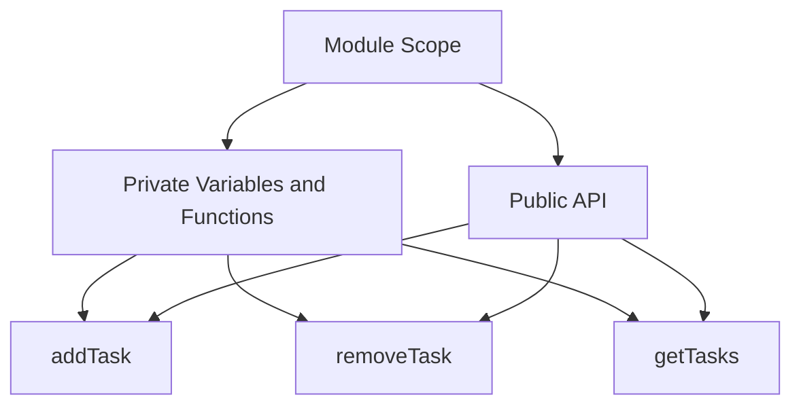

## 4.14 The Revealing Module Pattern

### Introduction

In the world of JavaScript development, organizing code efficiently is crucial for maintaining readability, scalability, and ease of maintenance. The Revealing Module Pattern is a design pattern that enhances the traditional Module Pattern by providing a clear structure for defining public and private members within a module. This pattern is particularly useful in JavaScript due to its flexible nature and the absence of built-in access modifiers like those found in languages such as Java or C++.

### Principles of the Revealing Module Pattern

The Revealing Module Pattern is built on the foundation of the Module Pattern, which encapsulates code within a function scope to create private variables and functions. The key principle of the Revealing Module Pattern is to return an object that explicitly maps private functions and variables to public ones. This approach improves code readability and maintenance by making it clear which parts of the module are intended for public use and which are internal.

#### Key Concepts

- **Encapsulation**: Encapsulate code within a function to create private scope.
- **Public API**: Define a clear public API by returning an object that exposes only the intended public members.
- **Private Members**: Keep internal logic and variables private, accessible only within the module.
- **Readability**: Enhance readability by clearly distinguishing between public and private members.

### Structuring Modules with Private and Public Functions

Let's explore how to implement the Revealing Module Pattern with a practical example. We'll create a simple module that manages a list of tasks.

```javascript
const TaskManager = (function() {
    // Private variables and functions
    let tasks = [];

    function addTask(task) {
        tasks.push(task);
    }

    function removeTask(task) {
        const index = tasks.indexOf(task);
        if (index > -1) {
            tasks.splice(index, 1);
        }
    }

    function getTasks() {
        return tasks.slice(); // Return a copy to prevent external modification
    }

    // Public API
    return {
        add: addTask,
        remove: removeTask,
        list: getTasks
    };
})();

// Usage
TaskManager.add('Learn JavaScript');
TaskManager.add('Write Code');
console.log(TaskManager.list()); // ['Learn JavaScript', 'Write Code']
TaskManager.remove('Learn JavaScript');
console.log(TaskManager.list()); // ['Write Code']
```

#### Explanation

- **Private Members**: The `tasks` array and the functions `addTask`, `removeTask`, and `getTasks` are private, accessible only within the module.
- **Public API**: The returned object exposes `add`, `remove`, and `list` as public methods, mapping them to the corresponding private functions.
- **Encapsulation**: The module encapsulates the task management logic, preventing direct access to the `tasks` array from outside the module.

### Advantages of the Revealing Module Pattern

The Revealing Module Pattern offers several advantages that make it a popular choice among developers:

1. **Improved Readability**: By clearly defining which functions and variables are public, the pattern enhances code readability and makes it easier for developers to understand the module's intended usage.

2. **Ease of Maintenance**: The explicit mapping of private to public members simplifies maintenance. Changes to the internal implementation do not affect the public API, reducing the risk of breaking external code.

3. **Encapsulation**: The pattern enforces encapsulation, protecting internal logic and data from external interference. This encapsulation helps prevent accidental modifications and enhances security.

4. **Consistency**: The pattern provides a consistent structure for defining modules, making it easier to apply across different projects and teams.

### Comparison with the Standard Module Pattern

The Revealing Module Pattern builds upon the standard Module Pattern by introducing a more explicit and organized approach to defining public and private members. Let's compare the two patterns:

#### Standard Module Pattern

```javascript
const Module = (function() {
    // Private variables and functions
    let privateVar = 'I am private';

    function privateFunction() {
        console.log(privateVar);
    }

    // Public API
    return {
        publicFunction: function() {
            privateFunction();
        }
    };
})();

// Usage
Module.publicFunction(); // Logs: 'I am private'
```

#### Revealing Module Pattern

```javascript
const RevealingModule = (function() {
    // Private variables and functions
    let privateVar = 'I am private';

    function privateFunction() {
        console.log(privateVar);
    }

    // Public API
    return {
        publicFunction: privateFunction
    };
})();

// Usage
RevealingModule.publicFunction(); // Logs: 'I am private'
```

#### Key Differences

- **Explicit Mapping**: The Revealing Module Pattern explicitly maps private functions to public ones, making the public API clear and intentional.
- **Readability**: The Revealing Module Pattern improves readability by reducing the need for additional wrapper functions, as seen in the standard Module Pattern.
- **Maintenance**: The explicit mapping in the Revealing Module Pattern simplifies maintenance by clearly defining the relationship between private and public members.

### JavaScript Unique Features

JavaScript's flexibility and dynamic nature make it an ideal language for implementing the Revealing Module Pattern. The pattern leverages JavaScript's function scope to create private members and uses object literals to define the public API. This approach aligns well with JavaScript's prototypal inheritance and functional programming capabilities.

### Design Considerations

When using the Revealing Module Pattern, consider the following design considerations:

- **Performance**: The pattern introduces a slight overhead due to the creation of closures. However, this overhead is generally negligible for most applications.
- **Complexity**: For simple modules, the pattern may introduce unnecessary complexity. Consider the pattern's benefits against the module's complexity.
- **Compatibility**: Ensure compatibility with older JavaScript environments if necessary, as the pattern relies on closures and function scope.

### Try It Yourself

To deepen your understanding of the Revealing Module Pattern, try modifying the code examples provided. Experiment with adding new private functions and exposing them through the public API. Consider how changes to the internal implementation affect the module's behavior.

### Visualizing the Revealing Module Pattern

To better understand the structure of the Revealing Module Pattern, let's visualize the relationship between private and public members using a diagram.



**Diagram Description**: This diagram illustrates the structure of the Revealing Module Pattern. The module scope contains private variables and functions, which are mapped to the public API. The public API exposes only the intended public members, ensuring encapsulation and readability.

### Knowledge Check

To reinforce your understanding of the Revealing Module Pattern, consider the following questions:

1. What is the main advantage of using the Revealing Module Pattern over the standard Module Pattern?
2. How does the Revealing Module Pattern improve code readability?
3. What are the potential performance considerations when using the Revealing Module Pattern?
4. How does the pattern enforce encapsulation in JavaScript?
5. What is the role of closures in the Revealing Module Pattern?

### Conclusion

The Revealing Module Pattern is a powerful design pattern that enhances code organization, readability, and maintenance in JavaScript. By clearly defining public and private members, the pattern provides a structured approach to module design, making it easier for developers to understand and maintain their code. As you continue your journey in mastering JavaScript design patterns, consider incorporating the Revealing Module Pattern into your projects to improve code quality and maintainability.

## Test Your Knowledge: The Revealing Module Pattern in JavaScript



### What is the primary benefit of the Revealing Module Pattern?

- [x] Improved readability and maintenance
- [ ] Increased performance
- [ ] Simplified syntax
- [ ] Enhanced security

> **Explanation:** The Revealing Module Pattern improves readability and maintenance by clearly defining public and private members.

### How does the Revealing Module Pattern enhance code readability?

- [x] By explicitly mapping private functions to public ones
- [ ] By reducing the number of lines of code
- [ ] By using fewer variables
- [ ] By avoiding closures

> **Explanation:** The pattern enhances readability by explicitly mapping private functions to public ones, making the public API clear.

### What is a potential performance consideration when using the Revealing Module Pattern?

- [x] Slight overhead due to closures
- [ ] Increased memory usage
- [ ] Slower execution time
- [ ] Reduced compatibility

> **Explanation:** The pattern introduces a slight overhead due to the creation of closures, but this is generally negligible.

### How does the Revealing Module Pattern enforce encapsulation?

- [x] By keeping internal logic and data private
- [ ] By using global variables
- [ ] By exposing all functions
- [ ] By avoiding function scope

> **Explanation:** The pattern enforces encapsulation by keeping internal logic and data private, accessible only within the module.

### What is the role of closures in the Revealing Module Pattern?

- [x] To create private scope for variables and functions
- [ ] To increase execution speed
- [ ] To simplify syntax
- [ ] To avoid using objects

> **Explanation:** Closures create a private scope for variables and functions, essential for the pattern's encapsulation.

### Which of the following is a key feature of the Revealing Module Pattern?

- [x] Explicit mapping of private to public members
- [ ] Use of global variables
- [ ] Avoidance of function scope
- [ ] Simplified syntax

> **Explanation:** The pattern features explicit mapping of private to public members, enhancing readability and maintenance.

### What is a potential drawback of using the Revealing Module Pattern?

- [x] Slight performance overhead
- [ ] Increased complexity for simple modules
- [ ] Reduced readability
- [ ] Lack of encapsulation

> **Explanation:** The pattern may introduce a slight performance overhead due to closures, but this is generally negligible.

### How does the Revealing Module Pattern compare to the standard Module Pattern?

- [x] It provides explicit mapping of private to public members
- [ ] It uses more global variables
- [ ] It avoids using closures
- [ ] It simplifies syntax

> **Explanation:** The Revealing Module Pattern provides explicit mapping of private to public members, unlike the standard Module Pattern.

### What is the main purpose of the public API in the Revealing Module Pattern?

- [x] To expose intended public members
- [ ] To increase execution speed
- [ ] To simplify syntax
- [ ] To avoid using objects

> **Explanation:** The public API exposes intended public members, making the module's usage clear and intentional.

### True or False: The Revealing Module Pattern is ideal for all types of JavaScript modules.

- [ ] True
- [x] False

> **Explanation:** The pattern may introduce unnecessary complexity for simple modules, so it's important to consider its benefits against the module's complexity.



Remember, this is just the beginning. As you progress, you'll build more complex and interactive web pages. Keep experimenting, stay curious, and enjoy the journey!
