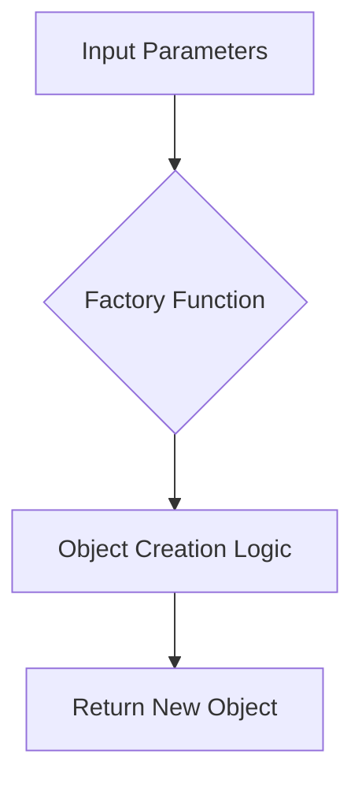

## 4.15 The Factory Function Pattern

In the world of JavaScript, creating objects is a fundamental task. While constructor functions and classes are common methods for object instantiation, factory functions offer a flexible and powerful alternative. In this section, we will delve into the Factory Function Pattern, exploring its benefits, use cases, and how it can be effectively utilized in modern web development.

### What is a Factory Function?

A factory function is a function that returns a new object. Unlike constructor functions, which require the `new` keyword and often involve the use of `this`, factory functions provide a more flexible approach to object creation. They can encapsulate complex logic, return different types of objects, and avoid the pitfalls associated with `this` and `new`.

#### Key Characteristics of Factory Functions

- **No `new` Keyword**: Factory functions do not require the `new` keyword for instantiation.
- **No `this` Binding**: They do not rely on `this`, reducing the risk of context-related bugs.
- **Flexible Return Types**: Factory functions can return objects of different types or configurations based on input parameters.
- **Encapsulation**: They can encapsulate complex logic for object creation, making the code more modular and maintainable.

### Factory Functions vs. Constructor Functions

To understand the advantages of factory functions, let's compare them with constructor functions.

#### Constructor Functions

Constructor functions are a traditional way to create objects in JavaScript. They are invoked using the `new` keyword, which creates a new instance of the object and binds `this` to it.

```javascript
function Car(make, model) {
  this.make = make;
  this.model = model;
}

const myCar = new Car('Toyota', 'Corolla');
console.log(myCar); // Car { make: 'Toyota', model: 'Corolla' }
```

#### Factory Functions

Factory functions, on the other hand, are regular functions that return an object. They do not require the `new` keyword and do not use `this`.

```javascript
function createCar(make, model) {
  return {
    make: make,
    model: model
  };
}

const myCar = createCar('Toyota', 'Corolla');
console.log(myCar); // { make: 'Toyota', model: 'Corolla' }
```

### Benefits of Using Factory Functions

Factory functions offer several advantages over constructor functions, making them a preferred choice in many scenarios.

#### Avoiding `this` and `new`

One of the main benefits of factory functions is that they avoid the use of `this` and `new`. This reduces the risk of errors related to incorrect context binding, which is a common issue in JavaScript.

#### Flexibility in Object Creation

Factory functions can return different types of objects based on input parameters or internal logic. This flexibility is particularly useful when creating objects with varying configurations or when implementing design patterns like the Strategy Pattern.

```javascript
function createVehicle(type, make, model) {
  if (type === 'car') {
    return { type, make, model, wheels: 4 };
  } else if (type === 'motorcycle') {
    return { type, make, model, wheels: 2 };
  }
  return { type, make, model, wheels: 0 };
}

const myCar = createVehicle('car', 'Toyota', 'Corolla');
const myBike = createVehicle('motorcycle', 'Yamaha', 'MT-07');
console.log(myCar); // { type: 'car', make: 'Toyota', model: 'Corolla', wheels: 4 }
console.log(myBike); // { type: 'motorcycle', make: 'Yamaha', model: 'MT-07', wheels: 2 }
```

#### Encapsulation of Complex Logic

Factory functions can encapsulate complex logic for object creation, making the code more modular and easier to maintain. This is especially beneficial in large applications where object creation involves multiple steps or dependencies.

```javascript
function createUser(name, role) {
  const permissions = role === 'admin' ? ['read', 'write', 'delete'] : ['read'];
  return {
    name,
    role,
    permissions
  };
}

const adminUser = createUser('Alice', 'admin');
const regularUser = createUser('Bob', 'user');
console.log(adminUser); // { name: 'Alice', role: 'admin', permissions: ['read', 'write', 'delete'] }
console.log(regularUser); // { name: 'Bob', role: 'user', permissions: ['read'] }
```

### Use Cases for Factory Functions

Factory functions are particularly useful in scenarios where flexibility, encapsulation, and simplicity are desired.

#### Creating Configurable Objects

When objects need to be created with different configurations based on input parameters, factory functions provide a clean and efficient solution.

#### Implementing Design Patterns

Factory functions are a natural fit for implementing design patterns that require object creation, such as the Factory Pattern, Singleton Pattern, and Strategy Pattern.

#### Avoiding `this` and `new` Pitfalls

In situations where the use of `this` and `new` can lead to errors or confusion, factory functions offer a safer alternative.

### Visualizing the Factory Function Pattern

Let's visualize the Factory Function Pattern to better understand its structure and flow.



**Diagram Description**: This diagram illustrates the flow of a factory function. Input parameters are passed to the factory function, which contains the object creation logic. The function then returns a new object based on the logic and parameters.

### JavaScript Unique Features

JavaScript's dynamic nature and first-class functions make factory functions particularly powerful. The ability to return different types of objects, use closures, and encapsulate logic are all enhanced by JavaScript's features.

#### Closures

Factory functions can leverage closures to maintain private state or encapsulate logic that should not be exposed.

```javascript
function createCounter() {
  let count = 0;
  return {
    increment: function() {
      count++;
      return count;
    },
    decrement: function() {
      count--;
      return count;
    }
  };
}

const counter = createCounter();
console.log(counter.increment()); // 1
console.log(counter.decrement()); // 0
```

### Differences and Similarities with Other Patterns

Factory functions are often compared to constructor functions and classes. While they serve a similar purpose in object creation, factory functions offer more flexibility and simplicity.

#### Similarities

- Both factory functions and constructor functions are used for object creation.
- They can both encapsulate logic for initializing objects.

#### Differences

- Factory functions do not require the `new` keyword or `this`.
- They can return different types of objects, whereas constructor functions typically return instances of a specific type.

### Design Considerations

When deciding whether to use factory functions, consider the following:

- **Complexity**: If object creation involves complex logic or multiple configurations, factory functions are a good choice.
- **Context**: If managing `this` and context is a concern, factory functions provide a safer alternative.
- **Flexibility**: If you need to return different types of objects or configurations, factory functions offer the necessary flexibility.

### Try It Yourself

Experiment with the following code examples to deepen your understanding of factory functions. Try modifying the input parameters or the logic within the factory functions to see how the output changes.

```javascript
function createAnimal(type, name) {
  if (type === 'dog') {
    return { type, name, sound: 'bark' };
  } else if (type === 'cat') {
    return { type, name, sound: 'meow' };
  }
  return { type, name, sound: 'unknown' };
}

const myDog = createAnimal('dog', 'Rex');
const myCat = createAnimal('cat', 'Whiskers');
console.log(myDog); // { type: 'dog', name: 'Rex', sound: 'bark' }
console.log(myCat); // { type: 'cat', name: 'Whiskers', sound: 'meow' }
```

### Knowledge Check

- What are the main benefits of using factory functions over constructor functions?
- How can factory functions encapsulate complex logic?
- In what scenarios are factory functions preferable to constructor functions?

### Summary

Factory functions provide a flexible and powerful way to create objects in JavaScript. By avoiding the pitfalls of `this` and `new`, offering flexibility in return types, and encapsulating complex logic, they are an excellent choice for many object creation scenarios. As you continue your journey in mastering JavaScript design patterns, consider incorporating factory functions into your toolkit for more efficient and maintainable code.

### Mastering JavaScript Factory Functions Quiz



### What is a key characteristic of factory functions?

- [x] They do not require the `new` keyword.
- [ ] They rely on the `this` keyword.
- [ ] They must return a specific object type.
- [ ] They are only used in ES6 classes.

> **Explanation:** Factory functions do not require the `new` keyword and do not rely on `this`, making them flexible and easy to use.

### How do factory functions differ from constructor functions?

- [x] Factory functions do not use `this`.
- [ ] Factory functions require the `new` keyword.
- [ ] Constructor functions can return different object types.
- [ ] Factory functions are only used in Node.js.

> **Explanation:** Factory functions do not use `this` and do not require the `new` keyword, unlike constructor functions.

### What advantage do factory functions offer in object creation?

- [x] They can return different types of objects.
- [ ] They always return the same object type.
- [ ] They require more boilerplate code.
- [ ] They are less flexible than constructor functions.

> **Explanation:** Factory functions can return different types of objects based on input parameters or logic, offering flexibility in object creation.

### Which of the following is a benefit of using factory functions?

- [x] Encapsulation of complex logic.
- [ ] Increased reliance on `this`.
- [ ] Mandatory use of `new`.
- [ ] Limited to simple object creation.

> **Explanation:** Factory functions can encapsulate complex logic, making code more modular and maintainable.

### In what scenario are factory functions preferable?

- [x] When creating objects with varying configurations.
- [ ] When using the `new` keyword is necessary.
- [ ] When `this` is required for context.
- [ ] When only one type of object is needed.

> **Explanation:** Factory functions are preferable when creating objects with varying configurations, as they offer flexibility and simplicity.

### What is a common use case for factory functions?

- [x] Implementing design patterns like the Factory Pattern.
- [ ] Creating instances of a single class.
- [ ] Requiring the `new` keyword for instantiation.
- [ ] Avoiding encapsulation of logic.

> **Explanation:** Factory functions are commonly used to implement design patterns that require flexible object creation, such as the Factory Pattern.

### How can factory functions leverage closures?

- [x] By maintaining private state.
- [ ] By exposing all internal logic.
- [ ] By requiring the `new` keyword.
- [ ] By avoiding encapsulation.

> **Explanation:** Factory functions can leverage closures to maintain private state or encapsulate logic, enhancing modularity.

### What is a potential pitfall of using constructor functions?

- [x] Incorrect context binding with `this`.
- [ ] Lack of flexibility in object creation.
- [ ] Inability to encapsulate logic.
- [ ] Over-reliance on closures.

> **Explanation:** Constructor functions can lead to incorrect context binding with `this`, which is avoided with factory functions.

### Which JavaScript feature enhances the power of factory functions?

- [x] First-class functions.
- [ ] The `new` keyword.
- [ ] Strict reliance on `this`.
- [ ] Limited return types.

> **Explanation:** JavaScript's first-class functions enhance the power of factory functions by allowing them to encapsulate logic and return different types.

### True or False: Factory functions can only return objects of a single type.

- [ ] True
- [x] False

> **Explanation:** Factory functions can return objects of different types, offering flexibility in object creation.



Remember, this is just the beginning. As you progress, you'll build more complex and interactive web applications. Keep experimenting, stay curious, and enjoy the journey!
