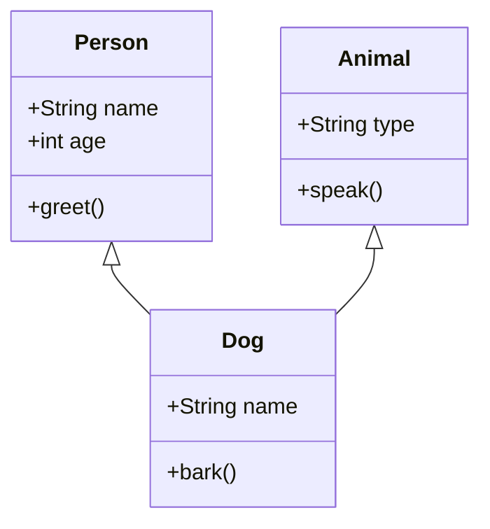

## 4.16 The Constructor Pattern

The Constructor Pattern is a fundamental concept in JavaScript that allows developers to create object instances and set up inheritance hierarchies. This pattern is integral to object-oriented programming (OOP) in JavaScript and provides a way to encapsulate data and behavior within objects. In this section, we will explore how constructors work in JavaScript, provide examples of defining constructor functions, discuss setting up prototypes and inheritance, and compare the Constructor Pattern with ES6 classes.

### Understanding Constructors in JavaScript

In JavaScript, a constructor is a special type of function that is used to create and initialize objects. When a function is invoked with the `new` keyword, it acts as a constructor. The `new` keyword creates a new object, sets the `this` context to the newly created object, and returns the object.

#### Defining Constructor Functions

To define a constructor function, you simply create a regular function. By convention, constructor function names are capitalized to distinguish them from regular functions.

```javascript
function Person(name, age) {
  this.name = name;
  this.age = age;
}

// Creating an instance of Person
const person1 = new Person('Alice', 30);
console.log(person1.name); // Output: Alice
console.log(person1.age);  // Output: 30
```

In the example above, `Person` is a constructor function. When `new Person('Alice', 30)` is called, a new object is created, and the `this` keyword inside the `Person` function refers to this new object. The properties `name` and `age` are assigned to this object.

#### Setting Up Prototypes and Inheritance

JavaScript uses prototypes to implement inheritance. Every function in JavaScript has a `prototype` property, which is an object that contains properties and methods that should be shared among instances created by the constructor.

```javascript
function Animal(type) {
  this.type = type;
}

Animal.prototype.speak = function() {
  console.log(`${this.type} makes a sound.`);
};

const dog = new Animal('Dog');
dog.speak(); // Output: Dog makes a sound.
```

In this example, the `speak` method is added to the `Animal` prototype. This means that all instances of `Animal` will have access to the `speak` method.

##### Inheritance with Constructors

To set up inheritance using constructors, you can assign an instance of the parent constructor's prototype to the child constructor's prototype.

```javascript
function Dog(name) {
  Animal.call(this, 'Dog');
  this.name = name;
}

Dog.prototype = Object.create(Animal.prototype);
Dog.prototype.constructor = Dog;

Dog.prototype.bark = function() {
  console.log(`${this.name} barks.`);
};

const rover = new Dog('Rover');
rover.speak(); // Output: Dog makes a sound.
rover.bark();  // Output: Rover barks.
```

Here, `Dog` inherits from `Animal`. The `Dog` constructor calls the `Animal` constructor using `Animal.call(this, 'Dog')`, ensuring that the `type` property is set. The `Dog` prototype is set to a new object created from `Animal.prototype`, and the `constructor` property is reset to `Dog`.

### Naming Conventions

In JavaScript, it is a common convention to capitalize the names of constructor functions. This helps distinguish constructor functions from regular functions and indicates that the function is intended to be used with the `new` keyword.

### Comparing with ES6 Classes

ES6 introduced the `class` syntax, which provides a more concise and readable way to create constructor functions and set up inheritance. Although classes in JavaScript are syntactic sugar over the existing prototype-based inheritance, they make the code easier to understand and maintain.

```javascript
class Person {
  constructor(name, age) {
    this.name = name;
    this.age = age;
  }

  greet() {
    console.log(`Hello, my name is ${this.name}.`);
  }
}

const person2 = new Person('Bob', 25);
person2.greet(); // Output: Hello, my name is Bob.
```

#### Inheritance with ES6 Classes

Inheritance with ES6 classes is straightforward and uses the `extends` keyword.

```javascript
class Animal {
  constructor(type) {
    this.type = type;
  }

  speak() {
    console.log(`${this.type} makes a sound.`);
  }
}

class Dog extends Animal {
  constructor(name) {
    super('Dog');
    this.name = name;
  }

  bark() {
    console.log(`${this.name} barks.`);
  }
}

const max = new Dog('Max');
max.speak(); // Output: Dog makes a sound.
max.bark();  // Output: Max barks.
```

In this example, `Dog` extends `Animal`, and the `super` keyword is used to call the parent class's constructor.

### When to Use Constructor Functions vs. ES6 Classes

- **Constructor Functions**: Use when working with legacy codebases or when you need to support environments that do not support ES6.
- **ES6 Classes**: Use for new projects or when you want to take advantage of modern JavaScript features. Classes provide a cleaner and more intuitive syntax for defining constructors and inheritance.

### Visualizing the Constructor Pattern

Below is a diagram illustrating how the Constructor Pattern works in JavaScript, showing the relationship between constructor functions, prototypes, and instances.



### Key Participants

- **Constructor Function**: A function used to create and initialize objects.
- **Prototype**: An object associated with a constructor function that contains shared properties and methods.
- **Instance**: An object created using a constructor function.

### Applicability

- Use the Constructor Pattern when you need to create multiple instances of an object with shared properties and methods.
- Ideal for setting up inheritance hierarchies in JavaScript.

### Design Considerations

- Ensure that constructor functions are capitalized to distinguish them from regular functions.
- Always use the `new` keyword when invoking a constructor function to avoid unexpected behavior.
- Be mindful of memory usage when adding methods to the prototype instead of the constructor function itself.

### JavaScript Unique Features

- JavaScript's prototype-based inheritance allows for dynamic inheritance and method sharing among instances.
- The `new` keyword is essential for creating instances using constructor functions.

### Differences and Similarities

- **Constructor Functions vs. ES6 Classes**: Both achieve the same goal of creating objects and setting up inheritance, but classes provide a more modern and readable syntax.
- **Prototype-based Inheritance**: Both approaches use prototypes under the hood, but classes abstract away the complexity.

### Try It Yourself

Experiment with the following code examples by modifying the properties and methods. Try creating additional methods or subclasses to see how inheritance works in practice.

```javascript
function Vehicle(type) {
  this.type = type;
}

Vehicle.prototype.drive = function() {
  console.log(`${this.type} is driving.`);
};

function Car(brand) {
  Vehicle.call(this, 'Car');
  this.brand = brand;
}

Car.prototype = Object.create(Vehicle.prototype);
Car.prototype.constructor = Car;

Car.prototype.honk = function() {
  console.log(`${this.brand} car honks.`);
};

const myCar = new Car('Toyota');
myCar.drive(); // Output: Car is driving.
myCar.honk();  // Output: Toyota car honks.
```

### Knowledge Check

- What is the purpose of the `new` keyword in JavaScript?
- How do you define a constructor function in JavaScript?
- What is the role of the `prototype` property in JavaScript?
- How does inheritance work with constructor functions?
- What are the benefits of using ES6 classes over constructor functions?

### Summary

The Constructor Pattern is a powerful tool in JavaScript for creating object instances and setting up inheritance hierarchies. By understanding how constructors, prototypes, and inheritance work, you can create robust and maintainable code. Whether you choose to use constructor functions or ES6 classes, both approaches provide the flexibility needed for modern web development.

Remember, this is just the beginning. As you progress, you'll build more complex and interactive web pages. Keep experimenting, stay curious, and enjoy the journey!

## Quiz: Mastering JavaScript Constructor Pattern



### What is the main purpose of a constructor function in JavaScript?

- [x] To create and initialize objects
- [ ] To define global variables
- [ ] To execute asynchronous code
- [ ] To handle events

> **Explanation:** Constructor functions are used to create and initialize objects in JavaScript.

### How do you create an instance of an object using a constructor function?

- [x] By using the `new` keyword
- [ ] By calling the function directly
- [ ] By using the `this` keyword
- [ ] By using the `instanceof` operator

> **Explanation:** The `new` keyword is used to create an instance of an object using a constructor function.

### What is the role of the `prototype` property in JavaScript?

- [x] To share properties and methods among instances
- [ ] To store private variables
- [ ] To handle errors
- [ ] To manage event listeners

> **Explanation:** The `prototype` property is used to share properties and methods among instances created by a constructor function.

### How do you set up inheritance using constructor functions?

- [x] By using `Object.create` and setting the prototype
- [ ] By using the `extends` keyword
- [ ] By using the `super` keyword
- [ ] By using the `bind` method

> **Explanation:** Inheritance is set up using `Object.create` to set the prototype of the child constructor function.

### What is a key difference between constructor functions and ES6 classes?

- [x] ES6 classes provide a more modern and readable syntax
- [ ] Constructor functions are faster
- [ ] ES6 classes do not support inheritance
- [ ] Constructor functions are only used in Node.js

> **Explanation:** ES6 classes provide a more modern and readable syntax for defining constructors and inheritance.

### Why is it important to capitalize constructor function names?

- [x] To distinguish them from regular functions
- [ ] To make them run faster
- [ ] To enable inheritance
- [ ] To prevent errors

> **Explanation:** Capitalizing constructor function names helps distinguish them from regular functions.

### What happens if you forget to use the `new` keyword with a constructor function?

- [x] The `this` keyword will refer to the global object
- [ ] The function will not execute
- [ ] An error will be thrown
- [ ] The function will return `undefined`

> **Explanation:** If the `new` keyword is not used, `this` will refer to the global object, leading to unexpected behavior.

### How do ES6 classes handle inheritance?

- [x] Using the `extends` and `super` keywords
- [ ] Using `Object.create`
- [ ] Using the `bind` method
- [ ] Using the `prototype` property

> **Explanation:** ES6 classes use the `extends` and `super` keywords to handle inheritance.

### What is a benefit of using prototypes in JavaScript?

- [x] Efficient memory usage by sharing methods
- [ ] Faster execution of code
- [ ] Simplified error handling
- [ ] Easier debugging

> **Explanation:** Prototypes allow for efficient memory usage by sharing methods among instances.

### True or False: ES6 classes are a completely new concept in JavaScript.

- [ ] True
- [x] False

> **Explanation:** ES6 classes are syntactic sugar over the existing prototype-based inheritance in JavaScript.


