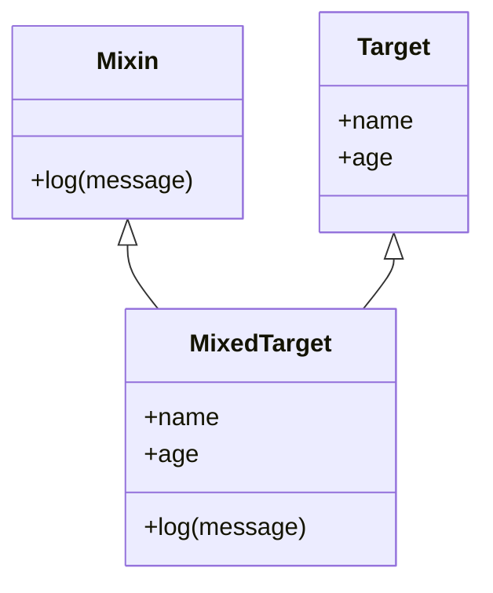

## 4.17 The Mixin Pattern

### Introduction to the Mixin Pattern

In JavaScript, the Mixin Pattern is a powerful tool for sharing functionality between objects without relying on classical inheritance. Unlike traditional inheritance, which can lead to rigid and tightly coupled code structures, mixins provide a flexible way to compose behaviors and properties into objects. This pattern is particularly useful in JavaScript, where the language's prototypal inheritance model allows for dynamic and flexible object composition.

### What is a Mixin?

A mixin is a class or object that provides methods and properties that can be used by other classes or objects. Mixins allow you to extend the functionality of objects by "mixing in" additional behaviors. This is achieved by copying properties and methods from one object to another, enabling objects to share functionality without forming a parent-child relationship.

### Implementing Mixins in JavaScript

Let's explore how to implement mixins in JavaScript with practical examples. We'll start with a simple mixin and gradually build upon it to demonstrate more complex scenarios.

#### Basic Mixin Example

Consider a scenario where we have multiple objects that need logging functionality. Instead of duplicating the logging code in each object, we can create a mixin:

```javascript
// Define a simple logging mixin
const loggerMixin = {
  log(message) {
    console.log(`[LOG]: ${message}`);
  }
};

// Create an object and mix in the logger functionality
const user = {
  name: 'Alice',
  age: 30
};

// Mix in the logger
Object.assign(user, loggerMixin);

// Use the mixed-in method
user.log('User logged in.'); // Output: [LOG]: User logged in.
```

In this example, we define a `loggerMixin` object with a `log` method. We then use `Object.assign()` to copy the properties of `loggerMixin` into the `user` object, allowing `user` to use the `log` method.

#### Shallow Copying vs. Deep Copying

When implementing mixins, it's important to understand the difference between shallow copying and deep copying of properties. `Object.assign()` performs a shallow copy, meaning that only the top-level properties are copied. If a property is an object or array, only the reference is copied, not the actual data.

##### Shallow Copy Example

```javascript
const mixin = {
  data: { value: 42 }
};

const target = {};
Object.assign(target, mixin);

console.log(target.data.value); // Output: 42

// Modifying the original mixin affects the target
mixin.data.value = 100;
console.log(target.data.value); // Output: 100
```

In the example above, modifying the `data` property in the `mixin` object affects the `target` object because they share the same reference.

##### Deep Copy Example

To perform a deep copy, you can use libraries like Lodash or implement a custom deep copy function:

```javascript
function deepCopy(source) {
  return JSON.parse(JSON.stringify(source));
}

const deepMixin = {
  data: { value: 42 }
};

const deepTarget = deepCopy(deepMixin);

console.log(deepTarget.data.value); // Output: 42

// Modifying the original mixin does not affect the target
deepMixin.data.value = 100;
console.log(deepTarget.data.value); // Output: 42
```

In this example, we use `JSON.parse(JSON.stringify(source))` to create a deep copy of the `deepMixin` object, ensuring that changes to the original do not affect the copy.

### Use Cases for Mixins

Mixins are particularly useful in scenarios where you need to share functionality across multiple objects without creating a complex inheritance hierarchy. Here are some common use cases:

#### Code Reusability

Mixins promote code reusability by allowing you to define common functionality once and reuse it across different objects. This reduces code duplication and makes maintenance easier.

#### Composition Over Inheritance

Mixins support the principle of composition over inheritance, allowing you to compose objects with specific behaviors rather than relying on a rigid class hierarchy. This leads to more flexible and modular code.

#### Cross-Cutting Concerns

Mixins are ideal for implementing cross-cutting concerns, such as logging, authentication, or event handling, which are needed across different parts of an application.

### Handling Property Conflicts

One potential issue with mixins is property conflicts, where multiple mixins define the same property or method. This can lead to unexpected behavior if not handled properly.

#### Resolving Conflicts

To resolve property conflicts, you can implement a strategy to handle duplicate properties. One approach is to use a naming convention or prefix to differentiate properties from different mixins.

```javascript
const mixinA = {
  log() {
    console.log('Mixin A log');
  }
};

const mixinB = {
  log() {
    console.log('Mixin B log');
  }
};

const target = {};

// Mix in both mixins
Object.assign(target, mixinA, mixinB);

// Resolve conflict by choosing which method to use
target.log = mixinA.log;

// Use the resolved method
target.log(); // Output: Mixin A log
```

In this example, we resolve the conflict by explicitly choosing which `log` method to use after mixing in both `mixinA` and `mixinB`.

### Advanced Mixin Techniques

#### Functional Mixins

Functional mixins are functions that return an object with properties and methods to be mixed into a target object. This approach allows for more dynamic and flexible mixin creation.

```javascript
function loggerMixin() {
  return {
    log(message) {
      console.log(`[LOG]: ${message}`);
    }
  };
}

const user = {
  name: 'Bob',
  age: 25
};

// Mix in the logger using a functional mixin
Object.assign(user, loggerMixin());

user.log('User logged out.'); // Output: [LOG]: User logged out.
```

#### Multiple Inheritance with Mixins

JavaScript does not support multiple inheritance, but mixins can simulate this behavior by allowing an object to inherit properties from multiple sources.

```javascript
const mixinA = {
  greet() {
    console.log('Hello from Mixin A');
  }
};

const mixinB = {
  farewell() {
    console.log('Goodbye from Mixin B');
  }
};

const target = {};

// Mix in both mixins
Object.assign(target, mixinA, mixinB);

target.greet(); // Output: Hello from Mixin A
target.farewell(); // Output: Goodbye from Mixin B
```

### JavaScript Unique Features

JavaScript's prototypal inheritance model and dynamic nature make it particularly well-suited for implementing mixins. The language's flexibility allows for easy property copying and dynamic method addition, enabling powerful mixin implementations.

### Differences and Similarities with Other Patterns

Mixins are often compared to other patterns like inheritance and interfaces. While inheritance creates a parent-child relationship, mixins provide a more flexible way to share functionality without forming such a hierarchy. Unlike interfaces, which define a contract for classes to implement, mixins provide actual implementations that can be reused.

### Design Considerations

When using mixins, consider the following design considerations:

- **Avoid Overuse**: While mixins are powerful, overusing them can lead to complex and hard-to-maintain code. Use them judiciously to avoid creating a tangled web of dependencies.
- **Property Conflicts**: Be mindful of property conflicts and implement strategies to resolve them, such as using naming conventions or explicit conflict resolution.
- **Performance**: Mixing in large numbers of properties can impact performance. Consider the performance implications when designing mixins.

### Try It Yourself

To deepen your understanding of mixins, try modifying the examples provided. Experiment with creating your own mixins, resolving property conflicts, and using functional mixins. Consider how mixins can be applied to your own projects to reduce code duplication and enhance modularity.

### Visualizing Mixins

To better understand how mixins work, let's visualize the process of mixing properties into an object using a Mermaid.js diagram.



**Diagram Description**: This diagram illustrates how the `Mixin` and `Target` classes contribute their properties to the `MixedTarget` class, which combines the properties and methods of both.

### References and Links

For further reading on mixins and related concepts, consider the following resources:

- [MDN Web Docs: Mixins](https://developer.mozilla.org/en-US/docs/Web/JavaScript/Guide/Inheritance_and_the_prototype_chain#Mixins)
- [JavaScript Design Patterns](https://www.patterns.dev/posts/classic-design-patterns/)
- [Lodash Documentation](https://lodash.com/docs/)

### Knowledge Check

- What is a mixin, and how does it differ from classical inheritance?
- How can you resolve property conflicts when using multiple mixins?
- What are the benefits of using functional mixins?
- How does JavaScript's prototypal inheritance model support mixins?

### Exercises

1. Create a mixin that adds event handling capabilities to an object. Implement methods for adding, removing, and triggering events.
2. Implement a deep copy function that handles nested objects and arrays. Use it to create a mixin that deeply copies properties into a target object.
3. Design a set of mixins for a simple game engine, including mixins for rendering, physics, and input handling.

### Summary

The Mixin Pattern is a versatile tool in JavaScript for sharing functionality between objects without classical inheritance. By understanding how to implement mixins, handle property conflicts, and leverage JavaScript's unique features, you can create more modular and reusable code. Remember, this is just the beginning. As you progress, you'll discover more ways to apply mixins and other design patterns to enhance your JavaScript applications. Keep experimenting, stay curious, and enjoy the journey!

## Quiz: Mastering the Mixin Pattern in JavaScript



### What is a mixin in JavaScript?

- [x] A pattern for sharing functionality between objects without classical inheritance.
- [ ] A method for creating classes in JavaScript.
- [ ] A way to define private properties in objects.
- [ ] A tool for managing asynchronous code.

> **Explanation:** A mixin is a pattern for sharing functionality between objects without classical inheritance, allowing for flexible composition of behaviors.

### How can you resolve property conflicts when using multiple mixins?

- [x] By explicitly choosing which method to use after mixing in.
- [ ] By avoiding the use of mixins altogether.
- [ ] By using only one mixin at a time.
- [ ] By renaming all properties to avoid conflicts.

> **Explanation:** Property conflicts can be resolved by explicitly choosing which method to use after mixing in, ensuring the desired behavior is maintained.

### What is the difference between shallow copying and deep copying?

- [x] Shallow copying copies only top-level properties, while deep copying copies nested objects.
- [ ] Shallow copying copies nested objects, while deep copying copies only top-level properties.
- [ ] Shallow copying creates a new object, while deep copying modifies the original object.
- [ ] Shallow copying is faster than deep copying.

> **Explanation:** Shallow copying copies only top-level properties, whereas deep copying involves copying nested objects and arrays as well.

### Which of the following is a benefit of using functional mixins?

- [x] They allow for more dynamic and flexible mixin creation.
- [ ] They enforce strict type checking.
- [ ] They automatically resolve property conflicts.
- [ ] They improve performance by reducing memory usage.

> **Explanation:** Functional mixins allow for more dynamic and flexible mixin creation, enabling the composition of behaviors at runtime.

### What is a common use case for mixins?

- [x] Implementing cross-cutting concerns like logging or authentication.
- [ ] Creating complex inheritance hierarchies.
- [ ] Defining private properties in objects.
- [ ] Managing asynchronous code execution.

> **Explanation:** Mixins are commonly used for implementing cross-cutting concerns, such as logging or authentication, across different parts of an application.

### What is a potential issue with using mixins?

- [x] Property conflicts between mixins.
- [ ] Increased memory usage.
- [ ] Reduced code readability.
- [ ] Difficulty in debugging.

> **Explanation:** A potential issue with using mixins is property conflicts, which can occur when multiple mixins define the same property or method.

### How does JavaScript's prototypal inheritance model support mixins?

- [x] By allowing dynamic and flexible object composition.
- [ ] By enforcing strict class hierarchies.
- [ ] By providing built-in mixin support.
- [ ] By requiring all objects to inherit from a single prototype.

> **Explanation:** JavaScript's prototypal inheritance model supports mixins by allowing dynamic and flexible object composition, enabling the mixing of properties and methods.

### What is the purpose of using a deep copy function in mixins?

- [x] To ensure that changes to the original object do not affect the mixed-in object.
- [ ] To improve performance by reducing memory usage.
- [ ] To automatically resolve property conflicts.
- [ ] To enforce strict type checking.

> **Explanation:** A deep copy function ensures that changes to the original object do not affect the mixed-in object, preserving the integrity of the copied properties.

### Which of the following is NOT a characteristic of mixins?

- [x] They create a parent-child relationship between objects.
- [ ] They allow for code reusability.
- [ ] They support composition over inheritance.
- [ ] They can be used to implement cross-cutting concerns.

> **Explanation:** Mixins do not create a parent-child relationship between objects; instead, they provide a flexible way to share functionality without forming such a hierarchy.

### True or False: Mixins can be used to simulate multiple inheritance in JavaScript.

- [x] True
- [ ] False

> **Explanation:** True. Mixins can simulate multiple inheritance by allowing an object to inherit properties from multiple sources, providing a flexible way to compose behaviors.


