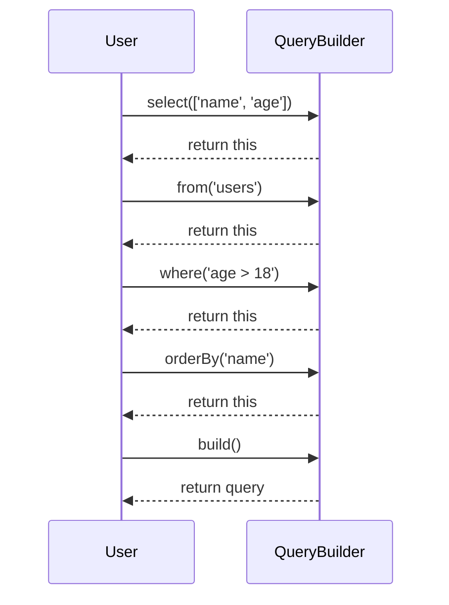

## 4.18 The Fluent Interface Pattern

### Introduction to Fluent Interfaces

The Fluent Interface Pattern is a design pattern that allows for more readable and expressive code through method chaining. This pattern is particularly useful in JavaScript, where it can enhance the readability of complex configurations and operations by allowing multiple method calls to be chained together in a single statement. The key idea is to return the object itself from each method, enabling the chaining of subsequent method calls.

### Understanding Fluent Interfaces

Fluent interfaces are designed to provide a more natural and readable way of interacting with objects. By returning the current object instance from each method, developers can chain method calls together, creating a flow that resembles natural language. This pattern is especially beneficial when configuring objects or performing a series of operations that need to be executed in a specific order.

#### Key Characteristics of Fluent Interfaces

- **Method Chaining**: Each method returns the object itself, allowing for a sequence of method calls.
- **Readability**: The code reads like a sentence, making it easier to understand and maintain.
- **Expressiveness**: Complex configurations can be expressed concisely.

### Method Chaining: Building Complex Configurations

Method chaining is the core mechanism behind fluent interfaces. Let's explore how this works with a simple example:

```javascript
class Car {
  constructor() {
    this.color = 'white';
    this.model = 'sedan';
    this.engine = 'V4';
  }

  setColor(color) {
    this.color = color;
    return this; // Return the object itself
  }

  setModel(model) {
    this.model = model;
    return this; // Return the object itself
  }

  setEngine(engine) {
    this.engine = engine;
    return this; // Return the object itself
  }

  build() {
    console.log(`Building a ${this.color} ${this.model} with a ${this.engine} engine.`);
    return this; // Return the object itself
  }
}

// Usage
const myCar = new Car();
myCar.setColor('red').setModel('convertible').setEngine('V6').build();
```

In this example, the `Car` class uses method chaining to allow for a fluent configuration of a car object. Each method returns the `Car` instance (`this`), enabling the chaining of methods like `setColor`, `setModel`, and `setEngine`.

### Benefits of Fluent Interfaces

1. **Improved Readability**: Fluent interfaces make code more readable by reducing the need for intermediate variables and making the code flow like natural language.
2. **Reduced Boilerplate**: By chaining methods, you can avoid repetitive code and reduce boilerplate.
3. **Enhanced Expressiveness**: Complex configurations and operations can be expressed in a concise and expressive manner.

### Popular Libraries Utilizing Fluent Interfaces

Several well-known JavaScript libraries utilize the fluent interface pattern to enhance usability and readability:

- **jQuery**: One of the most popular JavaScript libraries, jQuery uses fluent interfaces extensively. For example, you can chain multiple DOM manipulation methods together:

  ```javascript
  $('#myElement').css('color', 'red').slideUp(200).slideDown(200);
  ```

- **Moment.js**: A library for parsing, validating, manipulating, and formatting dates. Moment.js uses fluent interfaces to allow for chaining date manipulation methods:

  ```javascript
  const date = moment().add(7, 'days').subtract(1, 'months').format('YYYY-MM-DD');
  ```

### Designing APIs with Fluent Interfaces

When designing APIs that support fluent interfaces, consider the following guidelines:

1. **Return `this`**: Ensure that each method returns the current object instance to enable chaining.
2. **Consistent Method Naming**: Use consistent and descriptive method names to enhance readability.
3. **Logical Method Order**: Design methods to be called in a logical sequence, reflecting the natural order of operations.
4. **Avoid Side Effects**: Methods should avoid unexpected side effects to maintain predictability.

### Implementing Fluent Interfaces: A Step-by-Step Guide

Let's implement a simple fluent interface for a `QueryBuilder` class that constructs SQL queries:

```javascript
class QueryBuilder {
  constructor() {
    this.query = '';
  }

  select(fields) {
    this.query += `SELECT ${fields.join(', ')} `;
    return this;
  }

  from(table) {
    this.query += `FROM ${table} `;
    return this;
  }

  where(condition) {
    this.query += `WHERE ${condition} `;
    return this;
  }

  orderBy(field, direction = 'ASC') {
    this.query += `ORDER BY ${field} ${direction} `;
    return this;
  }

  build() {
    return this.query.trim() + ';';
  }
}

// Usage
const query = new QueryBuilder()
  .select(['name', 'age'])
  .from('users')
  .where('age > 18')
  .orderBy('name')
  .build();

console.log(query); // Outputs: SELECT name, age FROM users WHERE age > 18 ORDER BY name ASC;
```

In this example, the `QueryBuilder` class allows for the fluent construction of SQL queries. Each method returns the `QueryBuilder` instance, enabling the chaining of methods like `select`, `from`, `where`, and `orderBy`.

### Visualizing Fluent Interfaces

To better understand the flow of method chaining in fluent interfaces, let's visualize the process using a sequence diagram:



This diagram illustrates the sequence of method calls in the `QueryBuilder` class, showing how each method returns the `QueryBuilder` instance to enable chaining.

### JavaScript Unique Features

JavaScript's dynamic nature and flexible object model make it particularly well-suited for implementing fluent interfaces. The ability to easily return `this` and dynamically add methods to objects enhances the expressiveness of fluent interfaces.

### Differences and Similarities with Other Patterns

Fluent interfaces are often confused with the Builder pattern, as both involve constructing complex objects. However, the Builder pattern typically involves a separate builder class, while fluent interfaces are integrated directly into the object being configured.

### Design Considerations

When implementing fluent interfaces, consider the following:

- **Error Handling**: Ensure that errors are handled gracefully within the chain.
- **Method Overloading**: Support method overloading to provide flexibility in method calls.
- **Documentation**: Provide clear documentation to guide users in using the fluent interface effectively.

### Try It Yourself

Experiment with the `QueryBuilder` example by adding new methods or modifying existing ones. Try creating a method for `groupBy` or `having` to extend the functionality of the query builder.

### Conclusion

The Fluent Interface Pattern is a powerful tool for enhancing the readability and expressiveness of JavaScript code. By enabling method chaining, fluent interfaces allow for more natural and concise configurations, making code easier to read and maintain. As you continue to explore and implement fluent interfaces, remember to focus on readability, consistency, and logical method order to create intuitive and effective APIs.

### Knowledge Check

## Mastering Fluent Interfaces in JavaScript: Quiz



### What is the primary benefit of using fluent interfaces in JavaScript?

- [x] Improved readability and expressiveness
- [ ] Enhanced performance
- [ ] Reduced memory usage
- [ ] Simplified error handling

> **Explanation:** Fluent interfaces improve readability and expressiveness by allowing method chaining, making code more concise and natural to read.


### Which of the following libraries is known for using fluent interfaces?

- [x] jQuery
- [ ] Lodash
- [ ] Axios
- [ ] D3.js

> **Explanation:** jQuery is known for its use of fluent interfaces, allowing for method chaining in DOM manipulation.


### In a fluent interface, what should each method return?

- [x] The current object instance
- [ ] A new object instance
- [ ] A boolean value
- [ ] An error message

> **Explanation:** Each method in a fluent interface should return the current object instance to enable method chaining.


### What is a common use case for fluent interfaces?

- [x] Building complex configurations
- [ ] Performing simple arithmetic operations
- [ ] Handling asynchronous operations
- [ ] Managing global state

> **Explanation:** Fluent interfaces are commonly used for building complex configurations, allowing for a more readable and expressive code structure.


### Which method in the `QueryBuilder` example is responsible for finalizing the query?

- [x] `build()`
- [ ] `select()`
- [ ] `from()`
- [ ] `where()`

> **Explanation:** The `build()` method in the `QueryBuilder` example is responsible for finalizing and returning the constructed query.


### What is a key characteristic of fluent interfaces?

- [x] Method chaining
- [ ] Asynchronous execution
- [ ] Immutable data structures
- [ ] Static typing

> **Explanation:** Method chaining is a key characteristic of fluent interfaces, allowing for a sequence of method calls on the same object.


### How can fluent interfaces enhance code maintainability?

- [x] By reducing boilerplate and improving readability
- [ ] By enforcing strict typing
- [ ] By minimizing memory usage
- [ ] By simplifying error handling

> **Explanation:** Fluent interfaces enhance code maintainability by reducing boilerplate and improving readability, making the code easier to understand and maintain.


### Which of the following is a guideline for designing APIs with fluent interfaces?

- [x] Return `this` from each method
- [ ] Use global variables extensively
- [ ] Avoid method overloading
- [ ] Minimize method chaining

> **Explanation:** A guideline for designing APIs with fluent interfaces is to return `this` from each method to enable method chaining.


### What is a potential drawback of fluent interfaces?

- [x] Difficulty in debugging
- [ ] Increased memory usage
- [ ] Reduced code readability
- [ ] Limited expressiveness

> **Explanation:** A potential drawback of fluent interfaces is difficulty in debugging, as errors may be harder to trace in a chain of method calls.


### True or False: Fluent interfaces are only applicable to JavaScript.

- [ ] True
- [x] False

> **Explanation:** False. Fluent interfaces are not limited to JavaScript and can be implemented in various programming languages to enhance code readability and expressiveness.



Remember, this is just the beginning. As you progress, you'll build more complex and interactive applications using fluent interfaces. Keep experimenting, stay curious, and enjoy the journey!
