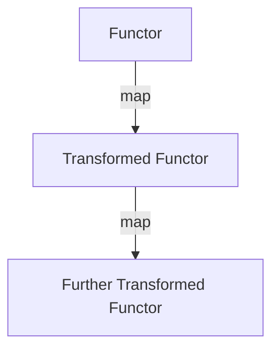

---

linkTitle: "4.2.1 Functors"
title: "Understanding Functors in JavaScript and TypeScript: A Comprehensive Guide"
description: "Explore the concept of functors in functional programming, their implementation in JavaScript and TypeScript, and their applications in modern software development."
categories:
- Functional Programming
- JavaScript
- TypeScript
tags:
- Functors
- Functional Programming
- JavaScript
- TypeScript
- Design Patterns
date: 2024-10-25
type: docs
nav_weight: 4210

canonical: "https://softwarepatternslexicon.com/patterns-js/4/2/1"
license: "© 2024 Tokenizer Inc. CC BY-NC-SA 4.0"
---

## 4.2.1 Functors

### Introduction

In the realm of functional programming, **functors** serve as a fundamental concept that allows for the application of functions over wrapped values. They provide a powerful abstraction for handling data types in a generic manner, enabling developers to write cleaner and more maintainable code. This article delves into the intricacies of functors, their implementation in JavaScript and TypeScript, and their practical applications.

### Understanding the Concept

A **functor** is essentially a type that can be mapped over. It provides a structure that holds values and allows functions to be applied to these values without altering the structure itself. This is achieved through the implementation of a `map` method, which is central to the functor's functionality.

#### Key Characteristics

- **Map Method:** The core of a functor is its `map` method, which applies a given function to the values contained within the functor and returns a new functor with the transformed values.
- **Functor Laws:** To qualify as a functor, the `map` method must adhere to two fundamental laws:
  - **Identity Law:** Mapping the identity function over a functor should yield the same functor. Mathematically, `F.map(x => x)` should be equivalent to `F`.
  - **Composition Law:** Mapping a composition of two functions over a functor should be equivalent to mapping each function in sequence. Formally, `F.map(x => f(g(x)))` should be equivalent to `F.map(g).map(f)`.

### Implementation Steps

To implement a functor in JavaScript or TypeScript, follow these steps:

1. **Define a Functor:** Create a class or type that includes a `map` method.
2. **Implement the Map Method:** Ensure the `map` method accepts a function and applies it to the functor's value(s).
3. **Return a New Functor:** The `map` method should return a new functor containing the result of the function application.

### Code Examples

#### Simple Functor Implementation

Let's start with a basic implementation of a `Container` or `Box` functor:

```typescript
class Box<T> {
  constructor(private value: T) {}

  map<U>(fn: (value: T) => U): Box<U> {
    return new Box(fn(this.value));
  }

  getValue(): T {
    return this.value;
  }
}

// Usage
const numberBox = new Box(5);
const incrementedBox = numberBox.map(x => x + 1);
console.log(incrementedBox.getValue()); // Output: 6
```

#### Arrays as Built-in Functors

In JavaScript, arrays are natural functors as they implement the `map` method:

```javascript
const numbers = [1, 2, 3];
const doubledNumbers = numbers.map(x => x * 2);
console.log(doubledNumbers); // Output: [2, 4, 6]
```

### Use Cases

Functors are particularly useful in scenarios where operations need to be applied over values within a context, such as optional values or lists. They provide a consistent interface for transforming data without having to manually handle the underlying structure.

#### Custom `Maybe` Functor

A common use case is handling nullable values gracefully. Here's how you can implement a `Maybe` functor:

```typescript
class Maybe<T> {
  constructor(private value: T | null) {}

  map<U>(fn: (value: T) => U): Maybe<U> {
    if (this.value === null) {
      return new Maybe<U>(null);
    }
    return new Maybe<U>(fn(this.value));
  }

  getValue(): T | null {
    return this.value;
  }
}

// Usage
const maybeValue = new Maybe(10);
const transformedValue = maybeValue.map(x => x * 2);
console.log(transformedValue.getValue()); // Output: 20

const nullValue = new Maybe<number>(null);
const transformedNull = nullValue.map(x => x * 2);
console.log(transformedNull.getValue()); // Output: null
```

### Considerations

When working with functors, it's crucial to ensure that the functor laws are respected. This guarantees consistent behavior and predictable transformations.

- **Identity Law:** Ensure that mapping the identity function over a functor returns the same functor.
- **Composition Law:** Verify that mapping a composition of functions is equivalent to mapping each function in sequence.

It's also important to distinguish functors from other abstractions like monads and applicatives, which provide additional capabilities beyond simple mapping.

### Visual Representation

Below is a conceptual diagram illustrating the functor pattern:



### Conclusion

Functors are a powerful tool in functional programming, offering a way to apply functions over wrapped values consistently. By adhering to the functor laws, developers can create robust and reusable abstractions that simplify data transformations. Whether you're working with optional values, lists, or custom data types, functors provide a flexible and reliable framework for functional operations.

## Quiz Time!



### What is a functor in functional programming?

- [x] A type that can be mapped over, applying a function to the values it contains.
- [ ] A type that stores multiple functions.
- [ ] A type that cannot be altered.
- [ ] A type that only holds primitive values.

> **Explanation:** A functor is a type that allows functions to be applied to its contained values through a `map` method.

### Which method must a functor implement?

- [x] map
- [ ] filter
- [ ] reduce
- [ ] forEach

> **Explanation:** The `map` method is essential for a functor, enabling the application of functions to its values.

### What does the identity law state for functors?

- [x] F.map(x => x) is equivalent to F.
- [ ] F.map(x => x) is equivalent to F.map(x => x + 1).
- [ ] F.map(x => x) is equivalent to F.map(x => x * 2).
- [ ] F.map(x => x) is equivalent to F.map(x => x - 1).

> **Explanation:** The identity law ensures that mapping the identity function over a functor returns the same functor.

### What does the composition law state for functors?

- [x] F.map(x => f(g(x))) is equivalent to F.map(g).map(f).
- [ ] F.map(x => f(g(x))) is equivalent to F.map(f).map(g).
- [ ] F.map(x => f(g(x))) is equivalent to F.map(x => g(f(x))).
- [ ] F.map(x => f(g(x))) is equivalent to F.map(x => x).

> **Explanation:** The composition law ensures that mapping a composition of functions is equivalent to mapping each function in sequence.

### Which of the following is a built-in functor in JavaScript?

- [x] Array
- [ ] Object
- [ ] String
- [ ] Number

> **Explanation:** Arrays in JavaScript are built-in functors as they implement the `map` method.

### What is the purpose of the `map` method in a functor?

- [x] To apply a function to the values contained within the functor and return a new functor.
- [ ] To filter values based on a condition.
- [ ] To reduce values to a single output.
- [ ] To iterate over values without returning a new functor.

> **Explanation:** The `map` method applies a function to the functor's values and returns a new functor with the transformed values.

### What is a common use case for functors?

- [x] Applying operations over values in a context, such as optional values or lists.
- [ ] Storing multiple functions for later use.
- [ ] Creating immutable data structures.
- [ ] Managing state in an application.

> **Explanation:** Functors are used to apply operations over values within a context, such as handling optional values or lists.

### How does a `Maybe` functor handle nullable values?

- [x] By returning a new `Maybe` functor with the transformed value or null if the original value was null.
- [ ] By throwing an error if a null value is encountered.
- [ ] By ignoring null values and proceeding with non-null values.
- [ ] By converting null values to zero.

> **Explanation:** A `Maybe` functor gracefully handles nullable values by returning a new functor with the transformed value or null.

### What distinguishes functors from monads?

- [x] Functors only provide mapping capabilities, while monads offer additional operations like flatMap.
- [ ] Functors can only hold primitive values, while monads can hold any type.
- [ ] Functors are immutable, while monads are mutable.
- [ ] Functors are specific to JavaScript, while monads are specific to TypeScript.

> **Explanation:** Functors provide mapping capabilities, whereas monads offer additional operations like `flatMap` for chaining transformations.

### True or False: Functors must adhere to both the identity and composition laws.

- [x] True
- [ ] False

> **Explanation:** Functors must adhere to the identity and composition laws to ensure consistent and predictable behavior.


