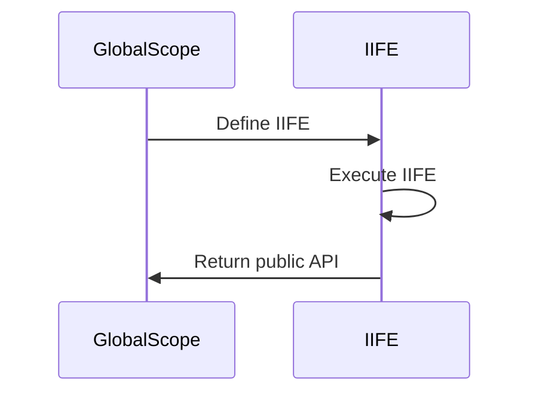

## 4.2 IIFE (Immediately Invoked Function Expression)

In the world of JavaScript, the Immediately Invoked Function Expression (IIFE) stands out as a powerful pattern that has been used extensively to manage scope and avoid variable collisions. This section will delve into what an IIFE is, its syntax, and its practical applications in JavaScript development.

### What is an IIFE?

An IIFE, or Immediately Invoked Function Expression, is a JavaScript function that runs as soon as it is defined. It is a design pattern that is often used to create a private scope for variables, thereby avoiding polluting the global scope. This is particularly useful in JavaScript, where variables declared with `var` are function-scoped and can lead to unintended interactions if not properly managed.

#### Syntax of an IIFE

The syntax of an IIFE involves wrapping a function in parentheses and then immediately invoking it with another set of parentheses. Here's a basic example:

```javascript
(function() {
    // Code here runs immediately
    console.log("This is an IIFE!");
})();
```

In this example, the function is defined and immediately executed. The outer parentheses `()` are crucial as they convert the function declaration into a function expression, which can then be invoked immediately.

### Creating Private Scopes with IIFEs

One of the primary uses of IIFEs is to create a private scope for variables. This is achieved by encapsulating variables within the function, preventing them from being accessed or modified from outside the function. This technique is particularly useful for avoiding variable collisions in larger codebases.

#### Example: Avoiding Variable Collisions

Consider the following example where an IIFE is used to encapsulate variables:

```javascript
var globalVar = "I'm a global variable";

(function() {
    var localVar = "I'm a local variable inside an IIFE";
    console.log(localVar); // Outputs: I'm a local variable inside an IIFE
})();

console.log(globalVar); // Outputs: I'm a global variable
// console.log(localVar); // Uncaught ReferenceError: localVar is not defined
```

In this example, `localVar` is defined within the IIFE and is not accessible outside of it, thus preventing any potential conflicts with other variables in the global scope.

### Utility Functions Wrapped in IIFEs

IIFEs are often used to encapsulate utility functions that should not be exposed to the global scope. This practice helps maintain a clean global namespace and reduces the risk of naming collisions.

#### Example: Encapsulating Utility Functions

```javascript
var myUtilities = (function() {
    function privateUtility() {
        console.log("This is a private utility function");
    }

    return {
        publicUtility: function() {
            console.log("This is a public utility function");
            privateUtility();
        }
    };
})();

myUtilities.publicUtility(); // Outputs: This is a public utility function
                             // Outputs: This is a private utility function
// myUtilities.privateUtility(); // Uncaught TypeError: myUtilities.privateUtility is not a function
```

In this example, `privateUtility` is a function that is not accessible from outside the IIFE, while `publicUtility` is exposed and can be used externally.

### Use Cases for IIFEs in Modern JavaScript

With the introduction of `let` and `const` in ES6, the need for IIFEs to manage variable scope has diminished somewhat, as these keywords provide block-level scoping. However, IIFEs still have their place in modern JavaScript development.

#### Legacy Code and Compatibility

IIFEs are particularly useful in legacy codebases where `var` is predominantly used. They provide a straightforward way to encapsulate variables without refactoring large amounts of code to use `let` or `const`.

#### Module Pattern

Before the advent of ES6 modules, IIFEs were commonly used to implement the module pattern in JavaScript. This pattern allows developers to create modules with private and public members, similar to classes in other programming languages.

#### Example: Module Pattern with IIFE

```javascript
var myModule = (function() {
    var privateVar = "I am private";

    function privateMethod() {
        console.log("Accessing private method");
    }

    return {
        publicMethod: function() {
            console.log("Accessing public method");
            privateMethod();
        }
    };
})();

myModule.publicMethod(); // Outputs: Accessing public method
                         // Outputs: Accessing private method
// console.log(myModule.privateVar); // Undefined
```

In this example, `privateVar` and `privateMethod` are encapsulated within the IIFE and are not accessible from outside, while `publicMethod` is exposed as part of the module's public API.

### IIFEs in Design Patterns

IIFEs play a crucial role in various design patterns, particularly in the context of JavaScript's module system and encapsulation strategies. They are often used in conjunction with other patterns to achieve more complex functionality.

#### Singleton Pattern

The Singleton pattern, which ensures that a class has only one instance and provides a global point of access to it, can be implemented using an IIFE.

```javascript
var singleton = (function() {
    var instance;

    function createInstance() {
        var object = new Object("I am the instance");
        return object;
    }

    return {
        getInstance: function() {
            if (!instance) {
                instance = createInstance();
            }
            return instance;
        }
    };
})();

var instance1 = singleton.getInstance();
var instance2 = singleton.getInstance();

console.log(instance1 === instance2); // true
```

In this example, the IIFE is used to encapsulate the `instance` variable, ensuring that it cannot be accessed or modified from outside the singleton module.

### JavaScript Unique Features

JavaScript's unique features, such as its first-class functions and dynamic nature, make IIFEs a powerful tool for developers. The ability to create functions on the fly and immediately execute them allows for flexible and efficient code organization.

#### Differences and Similarities with Other Patterns

IIFEs are often compared to other patterns such as closures and modules. While closures provide a way to maintain state across function calls, IIFEs are primarily used for immediate execution and scope encapsulation. Modules, on the other hand, are a more structured way of organizing code, often using IIFEs as a foundational building block.

### Try It Yourself

To better understand IIFEs, try modifying the examples provided. Experiment with adding more functions and variables within the IIFE, and observe how they interact with the global scope. Consider how you might use IIFEs in your own projects to manage scope and avoid variable collisions.

### Visualizing IIFE Execution

To further illustrate how IIFEs work, let's visualize the execution flow using a Mermaid.js diagram:



This diagram shows the sequence of events when an IIFE is defined and executed. The IIFE is defined in the global scope, executed immediately, and then returns any public API to the global scope.

### Knowledge Check

Before moving on, let's review some key points about IIFEs:

- **What is the primary purpose of an IIFE?**
  - To create a private scope for variables and avoid polluting the global namespace.

- **How does an IIFE differ from a regular function?**
  - An IIFE is executed immediately upon definition, whereas a regular function must be explicitly called.

- **Why might you use an IIFE in modern JavaScript, despite the availability of `let` and `const`?**
  - IIFEs are still useful for encapsulating code in legacy systems and implementing certain design patterns.

### Summary

In this section, we've explored the concept of Immediately Invoked Function Expressions (IIFEs) in JavaScript. We've seen how they can be used to create private scopes, encapsulate utility functions, and implement design patterns such as modules and singletons. Despite the introduction of block-scoped variables with `let` and `const`, IIFEs remain a valuable tool in a JavaScript developer's toolkit.

Remember, mastering IIFEs is just one step on your journey to becoming a proficient JavaScript developer. Keep experimenting, stay curious, and enjoy the journey!

## Test Your Knowledge on JavaScript IIFE (Immediately Invoked Function Expression)



### What is the primary purpose of an IIFE in JavaScript?

- [x] To create a private scope for variables
- [ ] To declare global variables
- [ ] To define a class
- [ ] To handle asynchronous operations

> **Explanation:** IIFEs are used to create a private scope for variables, preventing them from polluting the global namespace.

### How is an IIFE executed?

- [x] Immediately upon definition
- [ ] When called explicitly
- [ ] When the page loads
- [ ] When a button is clicked

> **Explanation:** An IIFE is executed immediately upon definition, as indicated by the parentheses following the function expression.

### Which of the following is a correct syntax for an IIFE?

- [x] `(function() { console.log("IIFE"); })();`
- [ ] `function() { console.log("IIFE"); }();`
- [ ] `function IIFE() { console.log("IIFE"); }`
- [ ] `console.log("IIFE");`

> **Explanation:** The correct syntax for an IIFE involves wrapping the function in parentheses and immediately invoking it with another set of parentheses.

### What is a common use case for IIFEs in modern JavaScript?

- [x] Encapsulating code in legacy systems
- [ ] Defining global variables
- [ ] Creating classes
- [ ] Handling events

> **Explanation:** IIFEs are commonly used to encapsulate code in legacy systems where `var` is predominantly used.

### How do IIFEs help in avoiding variable collisions?

- [x] By creating a private scope for variables
- [ ] By declaring variables globally
- [ ] By using `let` and `const`
- [ ] By using classes

> **Explanation:** IIFEs help avoid variable collisions by creating a private scope for variables, preventing them from interfering with other variables in the global scope.

### What role do IIFEs play in the module pattern?

- [x] They encapsulate private variables and methods
- [ ] They define public APIs
- [ ] They handle asynchronous operations
- [ ] They manage event listeners

> **Explanation:** In the module pattern, IIFEs are used to encapsulate private variables and methods, exposing only the public API.

### Can IIFEs be used to implement the Singleton pattern?

- [x] Yes
- [ ] No

> **Explanation:** IIFEs can be used to implement the Singleton pattern by encapsulating the instance variable and ensuring only one instance is created.

### What is the difference between an IIFE and a closure?

- [x] An IIFE is executed immediately, while a closure maintains state across function calls
- [ ] An IIFE is a type of closure
- [ ] A closure is executed immediately, while an IIFE maintains state
- [ ] There is no difference

> **Explanation:** An IIFE is executed immediately upon definition, while a closure is a function that maintains state across function calls.

### How do IIFEs contribute to code organization?

- [x] By encapsulating code and reducing global namespace pollution
- [ ] By declaring all variables globally
- [ ] By defining classes
- [ ] By handling asynchronous operations

> **Explanation:** IIFEs contribute to code organization by encapsulating code and reducing global namespace pollution.

### True or False: IIFEs are no longer useful in modern JavaScript due to `let` and `const`.

- [ ] True
- [x] False

> **Explanation:** While `let` and `const` provide block-level scoping, IIFEs are still useful for encapsulating code in legacy systems and implementing certain design patterns.




