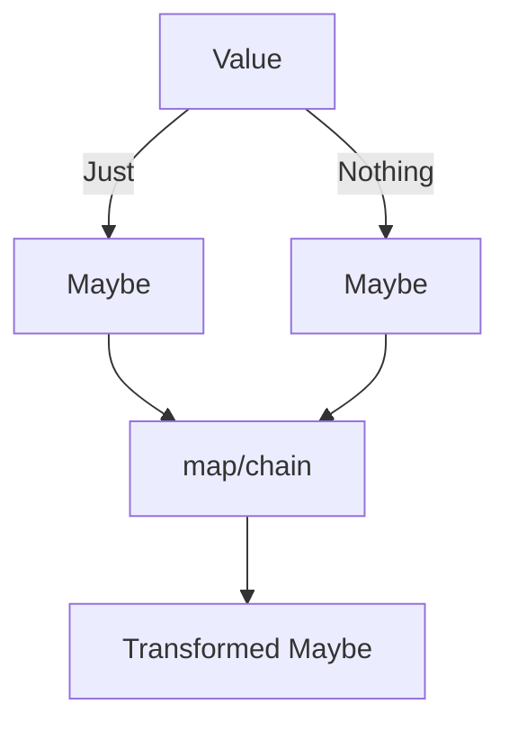

## 4.3.1 Maybe Monad

Functional programming offers powerful paradigms for handling data and computations in a safe and predictable manner. One such paradigm is the use of monads, which encapsulate behavior and side effects. In this section, we will delve into the Maybe Monad, a functional design pattern that elegantly handles computations involving optional values.

### Understand the Intent

The Maybe Monad is designed to:

- **Handle Optional Values:** It provides a way to work with values that might be absent, without resorting to explicit null checks.
- **Prevent Runtime Errors:** By encapsulating the possibility of `null` or `undefined`, it helps prevent runtime errors that occur due to dereferencing absent values.

### Implementation Steps

To implement the Maybe Monad, follow these steps:

1. **Define a `Maybe` Type:** The `Maybe` type has two variants:
   - **`Just`**: Represents a container holding a value.
   - **`Nothing`**: Represents the absence of a value.

2. **Implement `map` and `chain` Methods:** These methods allow safe operations on the contained value, propagating the absence if necessary.

### Code Examples

Below is a TypeScript implementation of the Maybe Monad:

```typescript
class Maybe<T> {
  private constructor(private value: T | null) {}

  static just<T>(value: T): Maybe<T> {
    return new Maybe(value);
  }

  static nothing<T>(): Maybe<T> {
    return new Maybe<T>(null);
  }

  isNothing(): boolean {
    return this.value === null;
  }

  map<U>(fn: (value: T) => U): Maybe<U> {
    if (this.isNothing()) {
      return Maybe.nothing<U>();
    }
    return Maybe.just(fn(this.value as T));
  }

  chain<U>(fn: (value: T) => Maybe<U>): Maybe<U> {
    if (this.isNothing()) {
      return Maybe.nothing<U>();
    }
    return fn(this.value as T);
  }

  getOrElse(defaultValue: T): T {
    return this.isNothing() ? defaultValue : (this.value as T);
  }
}

// Usage example
const maybeValue = Maybe.just(5);
const result = maybeValue
  .map(x => x * 2)
  .map(x => x + 1)
  .getOrElse(0);

console.log(result); // Outputs: 11
```

### Use Cases

The Maybe Monad is particularly useful in scenarios where functions might return `null` or `undefined`. For example:

- **Fetching Data:** When fetching data from an API, the response might be absent or incomplete.
- **User Input:** Handling optional user input where some fields may not be provided.

### Practice

Consider refactoring code that involves multiple null checks to use the Maybe Monad. This not only improves readability but also enhances safety by structuring the handling of absent values.

### Considerations

- **Code Clarity:** The Maybe Monad improves code clarity by making the handling of optional values explicit.
- **Safety:** It provides a structured way to deal with absence, reducing the risk of runtime errors.
- **Value Extraction:** When necessary, use methods like `getOrElse` to safely extract the value, providing a default if absent.

### Visual Aids

Here's a conceptual diagram illustrating the Maybe Monad:



### Advantages and Disadvantages

**Advantages:**

- **Safety:** Reduces runtime errors by handling optional values safely.
- **Clarity:** Makes the presence or absence of values explicit in the code.

**Disadvantages:**

- **Complexity:** Introduces additional abstraction, which might be overkill for simple cases.
- **Learning Curve:** Requires understanding of functional programming concepts.

### Best Practices

- **Use Consistently:** Apply the Maybe Monad consistently across your codebase to handle optional values.
- **Combine with Other Monads:** Consider combining with other monads like `Either` for more complex error handling.

### Comparisons

The Maybe Monad can be compared to other error-handling patterns like:

- **Null Checks:** Directly checking for `null` or `undefined`, which can clutter the code.
- **Try-Catch:** Useful for handling exceptions but not ideal for optional values.

### Conclusion

The Maybe Monad is a powerful tool in the functional programming toolkit, offering a robust way to handle optional values in JavaScript and TypeScript. By encapsulating the presence or absence of values, it enhances code safety and clarity.

## Quiz Time!



### What is the primary intent of the Maybe Monad?

- [x] To handle computations with optional values without explicit null checks.
- [ ] To perform asynchronous operations.
- [ ] To manage state in applications.
- [ ] To handle exceptions in a program.

> **Explanation:** The Maybe Monad is designed to handle computations involving optional values, preventing runtime errors due to null or undefined values.

### Which of the following represents the absence of a value in the Maybe Monad?

- [ ] Just
- [x] Nothing
- [ ] Null
- [ ] Undefined

> **Explanation:** In the Maybe Monad, `Nothing` represents the absence of a value.

### What method would you use to safely operate on a value within a Maybe Monad?

- [x] map
- [ ] reduce
- [ ] filter
- [ ] forEach

> **Explanation:** The `map` method is used to safely operate on a value within a Maybe Monad.

### How does the Maybe Monad prevent runtime errors?

- [x] By encapsulating the possibility of null or undefined values.
- [ ] By using try-catch blocks.
- [ ] By logging errors to the console.
- [ ] By ignoring null values.

> **Explanation:** The Maybe Monad encapsulates the possibility of null or undefined values, preventing runtime errors.

### What TypeScript method can be used to extract a value from a Maybe Monad with a default?

- [x] getOrElse
- [ ] extract
- [ ] retrieve
- [ ] fetch

> **Explanation:** The `getOrElse` method is used to extract a value from a Maybe Monad, providing a default if the value is absent.

### Which of the following is NOT a variant of the Maybe type?

- [ ] Just
- [x] Either
- [ ] Nothing
- [ ] All

> **Explanation:** `Either` is not a variant of the Maybe type; it is a separate monad used for error handling.

### What is a potential disadvantage of using the Maybe Monad?

- [x] It introduces additional abstraction.
- [ ] It increases runtime errors.
- [ ] It makes code less readable.
- [ ] It is incompatible with TypeScript.

> **Explanation:** The Maybe Monad introduces additional abstraction, which might be unnecessary for simple cases.

### In which scenario is the Maybe Monad particularly useful?

- [x] When dealing with functions that may return null or undefined.
- [ ] When performing mathematical calculations.
- [ ] When rendering UI components.
- [ ] When managing application state.

> **Explanation:** The Maybe Monad is useful when dealing with functions that may return null or undefined.

### What does the `chain` method do in the context of a Maybe Monad?

- [x] It allows safe operations that return another Maybe Monad.
- [ ] It concatenates strings.
- [ ] It performs asynchronous operations.
- [ ] It logs values to the console.

> **Explanation:** The `chain` method allows safe operations that return another Maybe Monad, enabling chaining of computations.

### True or False: The Maybe Monad can be combined with other monads for complex error handling.

- [x] True
- [ ] False

> **Explanation:** True. The Maybe Monad can be combined with other monads like `Either` for more complex error handling scenarios.


