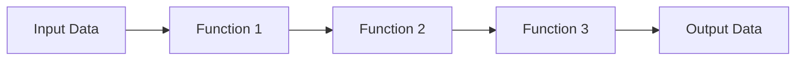

---

linkTitle: "4.3.3 Function Pipeline"
title: "Function Pipeline in JavaScript and TypeScript: A Comprehensive Guide"
description: "Explore the Function Pipeline pattern in JavaScript and TypeScript, learn how to chain functions for efficient data processing, and discover best practices for implementation."
categories:
- JavaScript
- TypeScript
- Functional Programming
tags:
- Function Pipeline
- Functional Design Patterns
- JavaScript
- TypeScript
- Data Transformation
date: 2024-10-25
type: docs
nav_weight: 4330

canonical: "https://softwarepatternslexicon.com/patterns-js/4/3/3"
license: "© 2024 Tokenizer Inc. CC BY-NC-SA 4.0"
---

## 4.3.3 Function Pipeline

### Introduction

In the realm of functional programming, the function pipeline pattern stands out as a powerful tool for composing functions in a clean and readable manner. This pattern allows developers to chain multiple functions together, where the output of one function becomes the input to the next. This approach not only enhances code readability but also promotes maintainability and scalability.

### Detailed Explanation

#### Understand the Concept

The function pipeline pattern is akin to an assembly line in a factory, where each station (function) performs a specific task on the product (data) before passing it to the next station. This pattern is particularly useful when you need to process data through multiple steps in a structured and efficient way.

#### Implementation Steps

1. **Use the `pipe` or `compose` Function:**
   - The `pipe` function applies functions from left to right, while `compose` applies them from right to left.
   
2. **Arrange Functions in Order:**
   - Functions should be arranged in the order they need to be applied, ensuring that the output of one function matches the expected input of the next.

#### Code Examples

Let's implement a simple data transformation pipeline using the `pipe` function in JavaScript/TypeScript.

```typescript
// Define a pipe function
const pipe = (...fns: Function[]) => (x: any) => fns.reduce((v, f) => f(v), x);

// Define some simple functions
const add = (x: number) => x + 1;
const multiply = (x: number) => x * 2;
const subtract = (x: number) => x - 3;

// Create a pipeline
const pipeline = pipe(add, multiply, subtract);

// Execute the pipeline
console.log(pipeline(5)); // Output: 9
```

In this example, the `pipe` function takes a series of functions and returns a new function that applies these functions in sequence to a given input.

#### Use Cases

The function pipeline pattern is ideal for scenarios where data needs to be processed through multiple transformations. Common use cases include:

- Data validation and sanitization
- Complex data transformations
- Formatting and preparing data for output

#### Practice

Let's create a more complex pipeline that processes input data through validation, transformation, and formatting functions.

```typescript
// Define a validation function
const validate = (input: string) => {
  if (!input) throw new Error("Invalid input");
  return input;
};

// Define a transformation function
const toUpperCase = (input: string) => input.toUpperCase();

// Define a formatting function
const addExclamation = (input: string) => `${input}!`;

// Create a pipeline
const stringPipeline = pipe(validate, toUpperCase, addExclamation);

// Execute the pipeline
try {
  console.log(stringPipeline("hello")); // Output: HELLO!
} catch (error) {
  console.error(error.message);
}
```

This pipeline validates the input, transforms it to uppercase, and then formats it by adding an exclamation mark.

#### Considerations

- **Readability:** The function pipeline pattern enhances readability by expressing operations in a left-to-right sequence, which is intuitive for most developers.
- **Function Signatures:** Ensure that the output type of one function matches the input type of the next to avoid runtime errors.

### Visual Aids

Below is a conceptual diagram illustrating the function pipeline pattern:



### Advantages and Disadvantages

#### Advantages

- **Improved Readability:** Code is easier to read and understand.
- **Modularity:** Functions can be easily reused and tested independently.
- **Maintainability:** Changes to the pipeline can be made by simply adding or removing functions.

#### Disadvantages

- **Error Handling:** Managing errors across multiple functions can be challenging.
- **Function Compatibility:** Ensuring compatible function signatures can require additional type checking.

### Best Practices

- **Use TypeScript:** Leverage TypeScript's type system to ensure function compatibility within the pipeline.
- **Error Handling:** Implement robust error handling mechanisms to gracefully manage exceptions.
- **Documentation:** Document each function's purpose and expected input/output to aid in understanding and maintenance.

### Comparisons

The function pipeline pattern is often compared to the decorator pattern, where functions are wrapped around each other. However, pipelines focus on sequential data transformation, while decorators focus on augmenting or modifying behavior.

### Conclusion

The function pipeline pattern is a powerful tool in the functional programming toolkit, offering a clean and efficient way to process data through multiple transformations. By adhering to best practices and leveraging modern JavaScript/TypeScript features, developers can create robust and maintainable pipelines that enhance their applications.

## Quiz Time!



### What is the primary purpose of the function pipeline pattern?

- [x] To chain multiple functions together, passing the output of one as the input to the next
- [ ] To decorate a function with additional behavior
- [ ] To create a singleton instance
- [ ] To manage state across functions

> **Explanation:** The function pipeline pattern is used to chain functions together, where the output of one function becomes the input to the next, facilitating sequential data processing.

### Which function applies functions from left to right in a pipeline?

- [x] pipe
- [ ] compose
- [ ] map
- [ ] reduce

> **Explanation:** The `pipe` function applies functions from left to right, whereas `compose` applies them from right to left.

### What is a common use case for the function pipeline pattern?

- [x] Data validation and transformation
- [ ] Creating a singleton
- [ ] Managing global state
- [ ] Implementing a factory pattern

> **Explanation:** The function pipeline pattern is commonly used for data validation and transformation, allowing for sequential processing of data.

### What should be considered to ensure compatibility in a function pipeline?

- [x] Function signatures
- [ ] Function names
- [ ] Function length
- [ ] Function comments

> **Explanation:** Ensuring that the output type of one function matches the input type of the next is crucial for compatibility in a function pipeline.

### Which of the following is an advantage of using the function pipeline pattern?

- [x] Improved readability
- [ ] Increased complexity
- [ ] Reduced modularity
- [ ] Decreased maintainability

> **Explanation:** The function pipeline pattern improves readability by expressing operations in a clear, sequential manner.

### What is a potential disadvantage of the function pipeline pattern?

- [x] Error handling can be challenging
- [ ] It reduces code readability
- [ ] It makes code less modular
- [ ] It increases code duplication

> **Explanation:** Managing errors across multiple functions in a pipeline can be challenging, requiring careful handling.

### How can TypeScript enhance the implementation of a function pipeline?

- [x] By ensuring function compatibility through type checking
- [ ] By reducing code readability
- [ ] By increasing runtime errors
- [ ] By complicating the code

> **Explanation:** TypeScript's type system helps ensure that functions in a pipeline are compatible, reducing runtime errors.

### Which pattern is often compared to the function pipeline pattern?

- [x] Decorator pattern
- [ ] Singleton pattern
- [ ] Factory pattern
- [ ] Observer pattern

> **Explanation:** The decorator pattern is often compared to the function pipeline pattern, although they serve different purposes.

### What is the main difference between `pipe` and `compose` functions?

- [x] `pipe` applies functions left to right, `compose` applies them right to left
- [ ] `pipe` is used for state management, `compose` is not
- [ ] `pipe` is a TypeScript feature, `compose` is not
- [ ] `pipe` is used for creating singletons, `compose` is not

> **Explanation:** The `pipe` function applies functions from left to right, while `compose` applies them from right to left.

### True or False: The function pipeline pattern decreases code modularity.

- [ ] True
- [x] False

> **Explanation:** The function pipeline pattern actually increases code modularity by allowing functions to be reused and tested independently.


