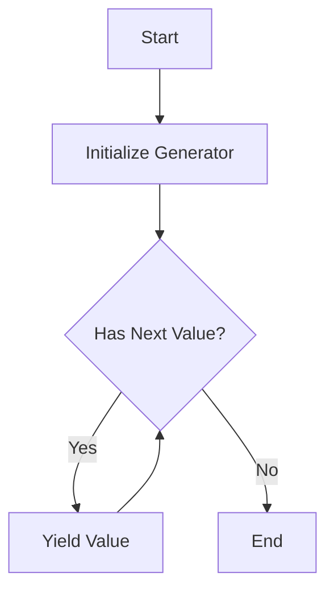

---

linkTitle: "4.3.4 Lazy Evaluation"
title: "Lazy Evaluation in JavaScript and TypeScript: Harnessing the Power of Deferred Computation"
description: "Explore the concept of Lazy Evaluation in JavaScript and TypeScript, its implementation using generator functions, and its application in handling large data sets efficiently."
categories:
- Functional Programming
- JavaScript
- TypeScript
tags:
- Lazy Evaluation
- Generators
- Performance Optimization
- Functional Design Patterns
- Deferred Computation
date: 2024-10-25
type: docs
nav_weight: 434000
canonical: "https://softwarepatternslexicon.com/patterns-js/4/3/4"
license: "© 2024 Tokenizer Inc. CC BY-NC-SA 4.0"
---

## 4.3.4 Lazy Evaluation

Lazy Evaluation is a powerful concept in functional programming that can significantly enhance performance by deferring the computation of expressions until their results are actually needed. This approach can be particularly beneficial when working with large data sets or infinite sequences, as it allows for efficient memory usage and potentially faster execution times.

### Understand the Concept

Lazy Evaluation delays the evaluation of an expression until its value is required. This can lead to performance improvements by avoiding unnecessary calculations and reducing memory consumption. In JavaScript and TypeScript, lazy evaluation can be implemented using generator functions, iterators, and thunks.

### Implementation Steps

1. **Generator Functions and Iterators:**
   - Use generator functions to create sequences that produce values on demand.
   - Generators allow you to iterate over potentially infinite sequences without computing all values upfront.

2. **Thunks:**
   - Implement functions that return thunks, which are functions encapsulating delayed computations.
   - Thunks can be invoked to perform the computation only when necessary.

### Code Examples

#### Lazy Range Generator

Let's create a lazy range generator that produces values on demand using JavaScript's generator functions.

```typescript
function* lazyRange(start: number, end: number, step: number = 1): Generator<number> {
    let current = start;
    while (current < end) {
        yield current;
        current += step;
    }
}

// Usage
const range = lazyRange(0, 10, 2);
for (const value of range) {
    console.log(value); // Outputs: 0, 2, 4, 6, 8
}
```

In this example, the `lazyRange` generator function yields numbers from `start` to `end` with a specified `step`, producing values only when requested.

#### Lazy Data Processor

Consider a scenario where you need to process a large file incrementally. You can implement a lazy data processor that reads and processes the file in chunks.

```typescript
import * as fs from 'fs';
import * as readline from 'readline';

async function* lazyFileReader(filePath: string): AsyncGenerator<string> {
    const fileStream = fs.createReadStream(filePath);
    const rl = readline.createInterface({
        input: fileStream,
        crlfDelay: Infinity
    });

    for await (const line of rl) {
        yield line;
    }
}

// Usage
(async () => {
    const filePath = 'largeFile.txt';
    const fileReader = lazyFileReader(filePath);

    for await (const line of fileReader) {
        console.log(line); // Process each line lazily
    }
})();
```

This example demonstrates reading a large file line by line using an asynchronous generator, allowing for efficient memory usage and processing.

### Use Cases

- **Large Data Sets:** Lazy evaluation is ideal for handling large data sets where loading everything into memory is impractical.
- **Infinite Sequences:** When dealing with infinite sequences, such as streams of data or mathematical series, lazy evaluation ensures that only the necessary portion of the sequence is computed.

### Practice

To practice implementing lazy evaluation, try creating a lazy data processor that reads and processes large files incrementally, as shown in the example above. Experiment with different file sizes and observe the memory usage and performance benefits.

### Considerations

- **Resource Management:** Ensure that lazy evaluations are managed properly to avoid holding unnecessary resources. For instance, close file streams when they are no longer needed.
- **Deferred Errors:** Lazy evaluation can lead to deferred errors, as computations are performed later. Handle exceptions appropriately to ensure robustness.

### Visual Aids

To better understand the flow of lazy evaluation, consider the following diagram illustrating the process of a lazy range generator:



### Advantages and Disadvantages

**Advantages:**
- **Performance:** Reduces unnecessary computations and memory usage.
- **Scalability:** Handles large data sets and infinite sequences efficiently.

**Disadvantages:**
- **Complexity:** Can introduce complexity in managing resources and handling deferred errors.
- **Debugging:** Deferred computations may complicate debugging.

### Best Practices

- **Resource Cleanup:** Always ensure resources like file streams are properly closed after use.
- **Error Handling:** Implement robust error handling to manage deferred errors effectively.
- **Testing:** Thoroughly test lazy evaluation implementations to ensure they behave as expected under various conditions.

### Comparisons

Lazy evaluation can be compared to eager evaluation, where expressions are evaluated immediately. While eager evaluation is simpler and often sufficient, lazy evaluation offers significant benefits in scenarios involving large or infinite data.

### Conclusion

Lazy Evaluation is a powerful technique in JavaScript and TypeScript that can improve performance and scalability by deferring computations until necessary. By leveraging generator functions, iterators, and thunks, developers can efficiently handle large data sets and infinite sequences. Understanding and implementing lazy evaluation can lead to more efficient and responsive applications.

## Quiz Time!



### What is the primary benefit of lazy evaluation?

- [x] Delaying computation until necessary
- [ ] Immediate computation of expressions
- [ ] Simplifying code structure
- [ ] Reducing code complexity

> **Explanation:** Lazy evaluation delays computation until the value is needed, improving performance and memory usage.

### Which JavaScript feature is commonly used to implement lazy evaluation?

- [x] Generator functions
- [ ] Promises
- [ ] Callbacks
- [ ] Async/await

> **Explanation:** Generator functions allow for creating sequences that yield values on demand, facilitating lazy evaluation.

### What is a thunk in the context of lazy evaluation?

- [x] A function that encapsulates a delayed computation
- [ ] A data structure for storing values
- [ ] A method for immediate execution
- [ ] A type of iterator

> **Explanation:** A thunk is a function that encapsulates a delayed computation, allowing it to be executed later.

### In which scenario is lazy evaluation particularly beneficial?

- [x] Handling large data sets
- [ ] Processing small arrays
- [ ] Immediate error handling
- [ ] Simplifying code logic

> **Explanation:** Lazy evaluation is beneficial for handling large data sets where loading everything into memory is impractical.

### What is a potential disadvantage of lazy evaluation?

- [x] Deferred errors
- [ ] Increased memory usage
- [ ] Immediate computation
- [ ] Simplified debugging

> **Explanation:** Deferred errors can occur because computations are performed later, complicating error handling.

### How does lazy evaluation affect memory usage?

- [x] Reduces memory usage
- [ ] Increases memory usage
- [ ] Has no effect on memory usage
- [ ] Doubles memory usage

> **Explanation:** Lazy evaluation reduces memory usage by computing values only when needed.

### What is the role of a generator function in lazy evaluation?

- [x] To yield values on demand
- [ ] To execute immediately
- [ ] To store data
- [ ] To handle exceptions

> **Explanation:** Generator functions yield values on demand, supporting lazy evaluation by deferring computation.

### How should resources be managed in lazy evaluation?

- [x] Properly close resources when no longer needed
- [ ] Keep resources open indefinitely
- [ ] Ignore resource management
- [ ] Use resources immediately

> **Explanation:** Proper resource management is crucial to avoid holding unnecessary resources in lazy evaluation.

### What is the difference between lazy and eager evaluation?

- [x] Lazy evaluation delays computation, eager evaluation computes immediately
- [ ] Lazy evaluation computes immediately, eager evaluation delays computation
- [ ] Both delay computation
- [ ] Both compute immediately

> **Explanation:** Lazy evaluation delays computation until needed, while eager evaluation computes immediately.

### True or False: Lazy evaluation can improve performance by avoiding unnecessary calculations.

- [x] True
- [ ] False

> **Explanation:** True. Lazy evaluation improves performance by deferring calculations until necessary, avoiding unnecessary work.


