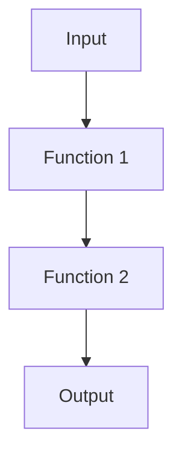

## 4.3.5 Point-Free Style

In the realm of functional programming, point-free style is a compelling paradigm that emphasizes writing functions without explicitly mentioning their arguments. This approach focuses on function composition and can lead to more concise and expressive code. In this article, we delve into the concept of point-free style, its implementation in JavaScript and TypeScript, and the considerations to keep in mind when using it.

### Understand the Concept

Point-free style, also known as tacit programming, is a way of defining functions where the function's arguments are not explicitly mentioned. Instead, the focus is on composing functions to achieve the desired result. This style can lead to cleaner and more readable code by reducing boilerplate and emphasizing the transformation of data through function composition.

### Implementation Steps

To implement point-free style in JavaScript and TypeScript, follow these steps:

1. **Use Function Composition:**
   - Combine multiple functions into a single function that applies them in sequence.
   - Libraries like `lodash` or `Ramda` provide utilities for function composition.

2. **Apply Currying:**
   - Transform functions so they can be partially applied, allowing for more flexible composition.
   - Currying enables the creation of point-free functions by pre-filling some arguments.

3. **Refactor Functions:**
   - Identify functions that can be refactored to point-free form.
   - Use utility functions to eliminate unnecessary parameters.

### Code Examples

Let's explore some code examples to illustrate the transformation to point-free style.

#### Example 1: Increment Function

Consider a simple increment function:

```javascript
const increment = x => x + 1;
```

Using point-free style, we can refactor this using a utility function like `add`:

```javascript
const add = a => b => a + b;
const increment = add(1);
```

Here, `add` is a curried function that returns a new function when partially applied with `1`.

#### Example 2: Composing Functions

Suppose we have two functions, `double` and `increment`, and we want to create a new function that doubles a number and then increments it:

```javascript
const double = x => x * 2;
const increment = x => x + 1;

// Traditional approach
const doubleThenIncrement = x => increment(double(x));

// Point-free style using composition
const compose = (f, g) => x => f(g(x));
const doubleThenIncrement = compose(increment, double);
```

In the point-free version, we use a `compose` function to create `doubleThenIncrement` without explicitly mentioning the argument `x`.

### Use Cases

Point-free style is particularly useful in scenarios where:

- **Conciseness is Key:** It allows for more concise code, reducing boilerplate and focusing on the transformation logic.
- **Function Composition is Frequent:** When functions are frequently composed, point-free style can enhance readability by emphasizing the flow of data.

### Practice

To master point-free style, practice converting existing functions to this style where appropriate. Start with simple functions and gradually move to more complex compositions.

### Considerations

While point-free style can lead to elegant code, it's essential to balance readability and brevity. Here are some considerations:

- **Readability:** Point-free style can sometimes reduce clarity, especially for developers unfamiliar with the paradigm. Ensure that the code remains understandable.
- **Team Environments:** In team settings, prioritize code readability and maintainability. Use point-free style judiciously and consider the team's familiarity with functional programming concepts.

### Visual Aids

To better understand point-free style, consider the following conceptual diagram illustrating function composition:



This diagram represents the flow of data through a series of composed functions, highlighting the essence of point-free style.

### Conclusion

Point-free style is a powerful tool in the functional programming toolkit, enabling developers to write concise and expressive code. By focusing on function composition and eliminating unnecessary parameters, point-free style can enhance code readability and maintainability. However, it's crucial to use this style judiciously, balancing brevity with clarity, especially in collaborative environments.

## Quiz Time!



### What is the main focus of point-free style in functional programming?

- [x] Function composition
- [ ] Explicit argument declaration
- [ ] Object-oriented design
- [ ] Procedural programming

> **Explanation:** Point-free style emphasizes function composition, avoiding explicit mention of arguments.

### Which utility function can help transform a function to point-free style by eliminating unnecessary parameters?

- [x] Currying
- [ ] Memoization
- [ ] Recursion
- [ ] Iteration

> **Explanation:** Currying transforms functions to allow partial application, facilitating point-free style.

### How can the function `const increment = x => x + 1;` be refactored to point-free style?

- [x] `const increment = add(1);`
- [ ] `const increment = x => x + 2;`
- [ ] `const increment = y => y + 1;`
- [ ] `const increment = add(2);`

> **Explanation:** Using a curried `add` function, `increment` can be defined as `add(1)`.

### What is a potential drawback of using point-free style?

- [x] Reduced code clarity
- [ ] Increased code verbosity
- [ ] Lack of function composition
- [ ] Difficulty in debugging

> **Explanation:** Point-free style can reduce clarity, especially for those unfamiliar with the paradigm.

### In which scenario is point-free style particularly useful?

- [x] When function composition is frequent
- [ ] When using object-oriented programming
- [ ] When writing procedural code
- [ ] When avoiding recursion

> **Explanation:** Point-free style is beneficial when functions are frequently composed.

### What should be prioritized in team environments when using point-free style?

- [x] Code readability and maintainability
- [ ] Maximum code brevity
- [ ] Avoiding all arguments
- [ ] Using only arrow functions

> **Explanation:** In team settings, prioritize readability and maintainability over brevity.

### Which library provides utilities for function composition in JavaScript?

- [x] Ramda
- [ ] jQuery
- [ ] Angular
- [ ] React

> **Explanation:** Ramda provides utilities for function composition, aiding in point-free style.

### What is the purpose of the `compose` function in point-free style?

- [x] To combine multiple functions into one
- [ ] To declare variables
- [ ] To create objects
- [ ] To handle exceptions

> **Explanation:** The `compose` function combines multiple functions into a single function.

### What is the key benefit of using point-free style?

- [x] More concise and expressive code
- [ ] Easier debugging
- [ ] Faster execution
- [ ] Simplified error handling

> **Explanation:** Point-free style leads to more concise and expressive code.

### True or False: Point-free style always improves code readability.

- [ ] True
- [x] False

> **Explanation:** Point-free style can sometimes reduce readability, especially for those unfamiliar with it.


