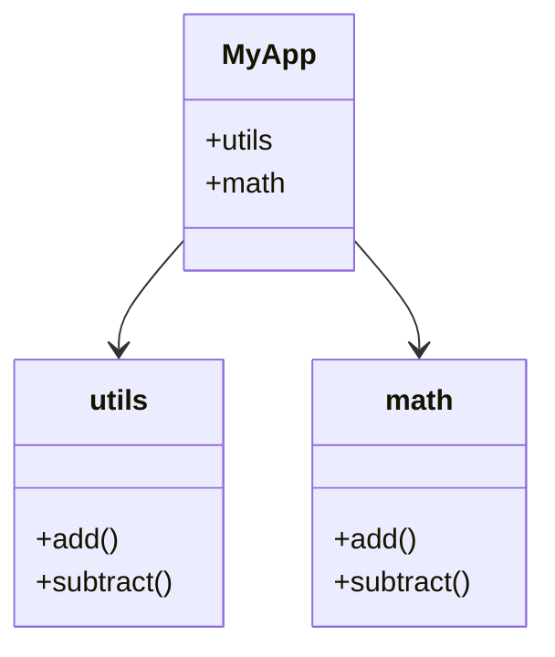
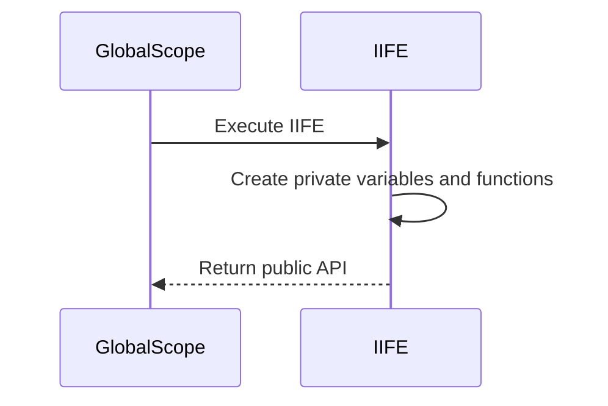

## 4.3 Namespacing and Encapsulation

In the vast ecosystem of JavaScript, where multiple libraries and scripts often coexist, maintaining a clean and conflict-free global scope is crucial. Namespacing and encapsulation are two powerful techniques that help developers organize their code, prevent naming collisions, and enhance modularity. In this section, we will delve into these concepts, explore their implementation, and compare them with modern module systems.

### Understanding Namespaces in JavaScript

**Namespaces** in JavaScript are a way to group related code under a single global identifier, thereby reducing the risk of name collisions. Unlike some other programming languages, JavaScript does not have built-in support for namespaces. However, developers can simulate namespaces using objects and other patterns.

#### Creating Namespaces with Objects

One of the simplest ways to create a namespace in JavaScript is by using objects. By encapsulating related functions and variables within an object, you can create a logical grouping that minimizes the pollution of the global scope.

```javascript
// Creating a namespace using an object
var MyApp = MyApp || {};

MyApp.utils = {
  add: function(a, b) {
    return a + b;
  },
  subtract: function(a, b) {
    return a - b;
  }
};

// Usage
console.log(MyApp.utils.add(5, 3)); // Outputs: 8
```

In this example, `MyApp` serves as a namespace, and `utils` is a sub-namespace containing utility functions. This approach ensures that all related functions are grouped together, reducing the likelihood of naming conflicts.

#### Using Immediately Invoked Function Expressions (IIFEs)

Another effective method for creating namespaces is through the use of **Immediately Invoked Function Expressions (IIFEs)**. IIFEs allow you to create a private scope, encapsulating variables and functions within it.

```javascript
// Creating a namespace using an IIFE
var MyApp = MyApp || {};

MyApp.math = (function() {
  var privateVariable = 42;

  function add(a, b) {
    return a + b;
  }

  function subtract(a, b) {
    return a - b;
  }

  return {
    add: add,
    subtract: subtract
  };
})();

// Usage
console.log(MyApp.math.add(10, 5)); // Outputs: 15
```

In this example, the `math` namespace is created using an IIFE, which encapsulates the `privateVariable` and exposes only the `add` and `subtract` functions. This pattern not only organizes code but also provides encapsulation, hiding implementation details from the outside world.

### Organizing Code with Namespaces

Organizing code into logical groupings under a namespace can significantly improve code readability and maintainability. Let's explore a more complex example where we organize a simple library for handling geometric shapes.

```javascript
// Creating a namespace for geometric shapes
var Geometry = Geometry || {};

Geometry.Shapes = (function() {
  function Circle(radius) {
    this.radius = radius;
  }

  Circle.prototype.area = function() {
    return Math.PI * this.radius * this.radius;
  };

  function Rectangle(width, height) {
    this.width = width;
    this.height = height;
  }

  Rectangle.prototype.area = function() {
    return this.width * this.height;
  };

  return {
    Circle: Circle,
    Rectangle: Rectangle
  };
})();

// Usage
var circle = new Geometry.Shapes.Circle(5);
console.log(circle.area()); // Outputs: 78.53981633974483

var rectangle = new Geometry.Shapes.Rectangle(10, 5);
console.log(rectangle.area()); // Outputs: 50
```

Here, the `Geometry.Shapes` namespace encapsulates the `Circle` and `Rectangle` classes, each with its own methods. This organization not only prevents naming conflicts but also makes the code more modular and easier to understand.

### Benefits of Encapsulation

**Encapsulation** is a fundamental principle of object-oriented programming that involves bundling data and methods that operate on that data within a single unit, or class. In JavaScript, encapsulation can be achieved through closures, objects, and classes.

#### Maintaining a Clean Global Scope

Encapsulation helps maintain a clean global scope by limiting the exposure of variables and functions. This is particularly important in large applications where multiple scripts and libraries are used.

```javascript
// Encapsulation using closures
var Counter = (function() {
  var count = 0;

  function increment() {
    count++;
  }

  function getCount() {
    return count;
  }

  return {
    increment: increment,
    getCount: getCount
  };
})();

// Usage
Counter.increment();
console.log(Counter.getCount()); // Outputs: 1
```

In this example, the `Counter` module encapsulates the `count` variable, exposing only the `increment` and `getCount` methods. This prevents direct manipulation of `count` from outside the module.

### Comparing Namespacing with Modern Module Systems

With the advent of modern JavaScript module systems like **CommonJS**, **AMD**, and **ES Modules**, namespacing has evolved. These systems provide built-in support for encapsulation and code organization.

#### ES Modules

ES Modules, introduced in ES6, offer a standardized way to organize code into modules. They provide a more robust solution for encapsulation and namespacing compared to traditional methods.

```javascript
// math.js - ES Module
export function add(a, b) {
  return a + b;
}

export function subtract(a, b) {
  return a - b;
}

// main.js
import { add, subtract } from './math.js';

console.log(add(2, 3)); // Outputs: 5
console.log(subtract(5, 2)); // Outputs: 3
```

ES Modules allow you to export and import functions, classes, and variables, providing a clean and efficient way to manage dependencies and encapsulate code.

#### Advantages of Modern Module Systems

- **Encapsulation**: Modules encapsulate code, exposing only what is necessary.
- **Dependency Management**: Modules handle dependencies automatically, reducing the risk of conflicts.
- **Lazy Loading**: Modules can be loaded on demand, improving performance.
- **Standardization**: ES Modules are a standardized solution, supported by all modern browsers.

### Visualizing Namespacing and Encapsulation

To better understand the relationship between namespaces, encapsulation, and module systems, let's visualize these concepts using Mermaid.js diagrams.

#### Namespace Structure



**Diagram Description**: This class diagram illustrates the `MyApp` namespace containing `utils` and `math` sub-namespaces, each with their own methods.

#### Encapsulation with IIFE



**Diagram Description**: This sequence diagram shows how an IIFE encapsulates private variables and functions, returning only the public API to the global scope.

### Try It Yourself

Experiment with the code examples provided by making the following modifications:

1. **Add New Methods**: Extend the `Geometry.Shapes` namespace with new shapes like `Triangle` or `Square`.
2. **Encapsulate More Data**: Modify the `Counter` example to include a `decrement` method and ensure `count` remains private.
3. **Convert to ES Modules**: Take the `MyApp` namespace and convert it into ES Modules, exploring the benefits of modern module systems.

### Knowledge Check

- What is a namespace, and why is it important in JavaScript?
- How can you create a namespace using an object?
- What are the benefits of using IIFEs for encapsulation?
- How do ES Modules improve upon traditional namespacing techniques?

### Summary

In this section, we've explored the concepts of namespacing and encapsulation in JavaScript, learning how to organize code effectively to prevent naming collisions and maintain a clean global scope. We've also compared traditional techniques with modern module systems, highlighting the advantages of ES Modules. Remember, mastering these techniques is just the beginning. As you continue your journey in JavaScript development, keep experimenting, stay curious, and enjoy the process!

### Quiz: Mastering Namespacing and Encapsulation in JavaScript



### What is the primary purpose of using namespaces in JavaScript?

- [x] To prevent naming collisions and organize code
- [ ] To increase code execution speed
- [ ] To enable asynchronous programming
- [ ] To improve error handling

> **Explanation:** Namespaces help prevent naming collisions and organize code into logical groupings.

### How can you create a namespace in JavaScript?

- [x] By using objects
- [x] By using IIFEs
- [ ] By using arrays
- [ ] By using loops

> **Explanation:** Namespaces can be created using objects and IIFEs to encapsulate related code.

### What is an IIFE in JavaScript?

- [x] An Immediately Invoked Function Expression
- [ ] An Inline Iterative Function Execution
- [ ] An Integrated Interface for Encapsulation
- [ ] An Internal Increment Function Expression

> **Explanation:** An IIFE is an Immediately Invoked Function Expression used to create a private scope.

### What is the benefit of using IIFEs for encapsulation?

- [x] They create a private scope for variables and functions
- [ ] They increase the execution speed of the code
- [ ] They allow for asynchronous execution
- [ ] They improve error handling

> **Explanation:** IIFEs create a private scope, encapsulating variables and functions.

### Which of the following is a feature of ES Modules?

- [x] Encapsulation of code
- [x] Automatic dependency management
- [ ] Built-in support for asynchronous programming
- [ ] Direct manipulation of the DOM

> **Explanation:** ES Modules encapsulate code and manage dependencies automatically.

### How do ES Modules differ from traditional namespacing techniques?

- [x] They provide a standardized way to organize code
- [x] They support lazy loading
- [ ] They require more memory
- [ ] They are not supported by modern browsers

> **Explanation:** ES Modules offer a standardized, efficient way to organize code with support for lazy loading.

### What is encapsulation in the context of JavaScript?

- [x] Bundling data and methods within a single unit
- [ ] Separating data and methods into different files
- [ ] Increasing the visibility of variables
- [ ] Allowing direct access to private variables

> **Explanation:** Encapsulation involves bundling data and methods within a single unit, such as a class or module.

### Why is maintaining a clean global scope important?

- [x] To prevent naming conflicts and improve code maintainability
- [ ] To increase the execution speed of the code
- [ ] To enable asynchronous programming
- [ ] To improve error handling

> **Explanation:** A clean global scope prevents naming conflicts and enhances code maintainability.

### What is the role of the `export` keyword in ES Modules?

- [x] To expose functions, classes, or variables from a module
- [ ] To import functions, classes, or variables into a module
- [ ] To execute a function immediately
- [ ] To create a private scope

> **Explanation:** The `export` keyword is used to expose functions, classes, or variables from a module.

### True or False: ES Modules are supported by all modern browsers.

- [x] True
- [ ] False

> **Explanation:** ES Modules are a standardized solution supported by all modern browsers.



By mastering namespacing and encapsulation, you can write cleaner, more maintainable JavaScript code. Keep experimenting with these techniques, and you'll find your code becoming more organized and modular. Happy coding!
