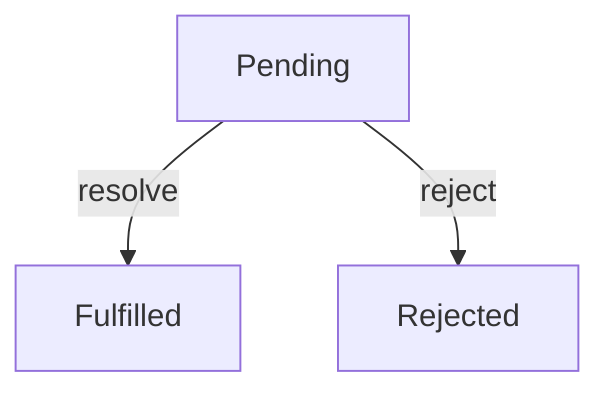
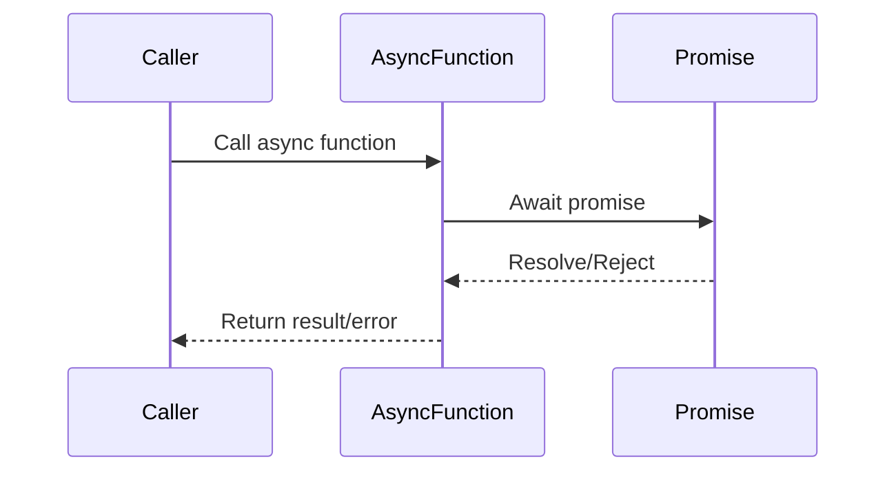

## 4.4.1 Promises and Async/Await

In modern JavaScript and TypeScript development, handling asynchronous operations efficiently is crucial. Promises and `async/await` are powerful tools that simplify asynchronous programming, making code more readable and maintainable. This section delves into these concepts, providing a comprehensive understanding of their implementation and use cases.

### Understand the Concepts

#### Promises

A Promise is an object representing the eventual completion or failure of an asynchronous operation. It allows you to attach callbacks to handle the result once it's available, providing a cleaner alternative to traditional callback-based approaches.

- **States of a Promise:**
  - **Pending:** The initial state, neither fulfilled nor rejected.
  - **Fulfilled:** The operation completed successfully.
  - **Rejected:** The operation failed.

#### Async/Await

`async/await` is syntactic sugar built on top of Promises, enabling you to write asynchronous code that looks synchronous. This makes it easier to read and reason about, especially when dealing with multiple asynchronous operations.

### Implementation Steps

#### Creating and Using Promises

To create a Promise, use the `new Promise()` constructor, passing a function with `resolve` and `reject` parameters. These functions are used to mark the Promise as fulfilled or rejected.

```javascript
const myPromise = new Promise((resolve, reject) => {
  const success = true; // Simulate an operation
  if (success) {
    resolve("Operation succeeded!");
  } else {
    reject("Operation failed!");
  }
});

myPromise
  .then(result => console.log(result))
  .catch(error => console.error(error));
```

#### Using Async/Await

To use `async/await`, define an `async` function and use the `await` keyword to pause execution until a Promise is resolved or rejected.

```javascript
async function fetchData() {
  try {
    const response = await fetch('https://api.example.com/data');
    const data = await response.json();
    console.log(data);
  } catch (error) {
    console.error('Error fetching data:', error);
  }
}

fetchData();
```

### Code Examples

#### Converting Callback-Based Functions to Promises

Suppose you have a callback-based function for reading a file. You can convert it to return a Promise:

```javascript
const fs = require('fs');

function readFilePromise(filePath) {
  return new Promise((resolve, reject) => {
    fs.readFile(filePath, 'utf8', (err, data) => {
      if (err) {
        reject(err);
      } else {
        resolve(data);
      }
    });
  });
}

readFilePromise('./file.txt')
  .then(data => console.log(data))
  .catch(err => console.error(err));
```

#### Implementing Async Functions with Multiple Await

You can use `async/await` to handle multiple asynchronous operations sequentially:

```javascript
async function processMultipleRequests() {
  try {
    const [data1, data2] = await Promise.all([
      fetch('https://api.example.com/data1').then(res => res.json()),
      fetch('https://api.example.com/data2').then(res => res.json())
    ]);
    console.log('Data 1:', data1);
    console.log('Data 2:', data2);
  } catch (error) {
    console.error('Error processing requests:', error);
  }
}

processMultipleRequests();
```

### Use Cases

- **I/O Operations:** Reading files, accessing databases, etc.
- **Network Requests:** Fetching data from APIs or servers.
- **Non-Blocking Tasks:** Any operation that should not block the main execution thread.

### Practice

Try writing an `async` function that fetches data from an API and processes it:

```javascript
async function fetchAndProcessData(url) {
  try {
    const response = await fetch(url);
    const data = await response.json();
    // Process data
    console.log('Processed Data:', data);
  } catch (error) {
    console.error('Error:', error);
  }
}

fetchAndProcessData('https://api.example.com/data');
```

### Considerations

- **Error Handling:** Use `try/catch` blocks within `async` functions to handle errors gracefully.
- **Performance:** Avoid using `await` inside loops; use `Promise.all` for parallel execution to improve performance.

### Visual Aids

#### Promise State Diagram



#### Async/Await Workflow



### Advantages and Disadvantages

#### Advantages

- **Readability:** `async/await` makes asynchronous code look synchronous, improving readability.
- **Error Handling:** Easier error handling with `try/catch`.
- **Chaining:** Promises allow chaining of asynchronous operations.

#### Disadvantages

- **Complexity:** Understanding the underlying Promise mechanism is essential.
- **Compatibility:** Older environments may not support `async/await` without transpilation.

### Best Practices

- **Use `async/await` for Readability:** Prefer `async/await` over `.then()` for cleaner code.
- **Error Handling:** Always handle errors using `try/catch` or `.catch()`.
- **Parallel Execution:** Use `Promise.all` for executing multiple Promises in parallel.

### Comparisons

- **Callbacks vs. Promises:** Promises provide a more manageable way to handle asynchronous operations compared to callbacks, reducing callback hell.
- **Promises vs. Async/Await:** `async/await` offers a more intuitive syntax for handling Promises, especially in complex scenarios.

### Conclusion

Promises and `async/await` are indispensable tools in modern JavaScript and TypeScript development for handling asynchronous operations. By understanding and implementing these patterns, you can write more efficient, readable, and maintainable code. Continue exploring these concepts to master asynchronous programming in your projects.

## Quiz Time!



### What is a Promise in JavaScript?

- [x] An object representing the eventual completion or failure of an asynchronous operation.
- [ ] A synchronous function that executes immediately.
- [ ] A method for handling synchronous operations.
- [ ] A type of JavaScript variable.

> **Explanation:** A Promise is an object that represents the eventual completion or failure of an asynchronous operation, allowing you to attach callbacks to handle the result.

### What are the three states of a Promise?

- [x] Pending, Fulfilled, Rejected
- [ ] Start, Process, End
- [ ] Open, Closed, Error
- [ ] Initialized, Running, Completed

> **Explanation:** A Promise can be in one of three states: Pending (initial state), Fulfilled (operation completed successfully), or Rejected (operation failed).

### How do you create a new Promise?

- [x] Using the `new Promise()` constructor
- [ ] By calling `Promise.create()`
- [ ] Using `Promise.start()`
- [ ] By defining a function with `async` keyword

> **Explanation:** A new Promise is created using the `new Promise()` constructor, which takes a function with `resolve` and `reject` parameters.

### What is the purpose of `async/await` in JavaScript?

- [x] To write asynchronous code that looks synchronous
- [ ] To execute synchronous code faster
- [ ] To handle errors in synchronous code
- [ ] To create new JavaScript variables

> **Explanation:** `async/await` is used to write asynchronous code that looks synchronous, making it easier to read and maintain.

### How do you handle errors in an `async` function?

- [x] Using `try/catch` blocks
- [ ] By ignoring them
- [ ] Using `await.catch()`
- [ ] By wrapping them in a synchronous function

> **Explanation:** Errors in an `async` function are handled using `try/catch` blocks, which allow you to catch and manage exceptions.

### What is the benefit of using `Promise.all()`?

- [x] It allows multiple Promises to be executed in parallel.
- [ ] It converts synchronous code to asynchronous.
- [ ] It ensures Promises are executed sequentially.
- [ ] It automatically resolves all Promises.

> **Explanation:** `Promise.all()` allows multiple Promises to be executed in parallel, improving performance by waiting for all Promises to resolve or reject.

### What happens if a Promise is rejected?

- [x] The `catch` block is executed.
- [ ] The `then` block is executed.
- [ ] The Promise is ignored.
- [ ] The Promise is automatically resolved.

> **Explanation:** If a Promise is rejected, the `catch` block is executed to handle the error.

### Can you use `await` outside of an `async` function?

- [ ] Yes, it works anywhere.
- [x] No, `await` can only be used inside an `async` function.
- [ ] Yes, but only in Node.js.
- [ ] Yes, but only in browsers.

> **Explanation:** `await` can only be used inside an `async` function; it pauses the execution until the Promise is resolved or rejected.

### What is a common mistake when using `await` in loops?

- [x] Using `await` inside loops can lead to sequential execution, reducing performance.
- [ ] Using `await` makes loops run faster.
- [ ] `await` cannot be used in loops.
- [ ] `await` automatically optimizes loop execution.

> **Explanation:** Using `await` inside loops can lead to sequential execution, which reduces performance. It's better to use `Promise.all` for parallel execution.

### True or False: Promises can be chained using `.then()`.

- [x] True
- [ ] False

> **Explanation:** True. Promises can be chained using `.then()` to handle multiple asynchronous operations in sequence.


