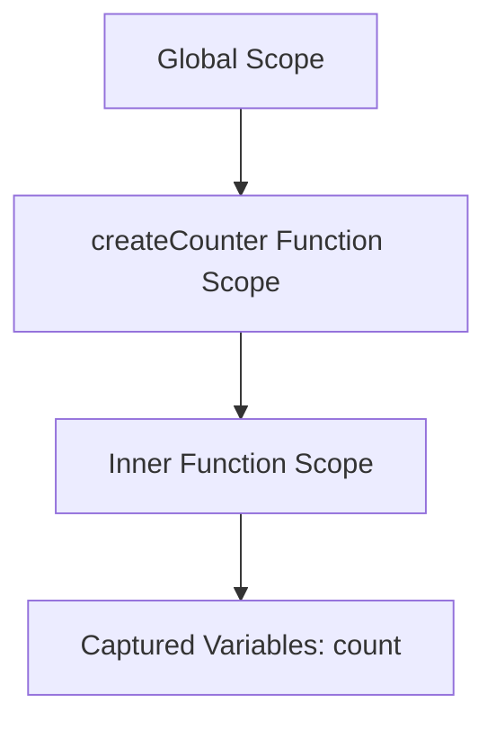

## 4.4 Using Closures Effectively

Closures are a fundamental concept in JavaScript that allow functions to capture and remember their lexical environment even after they have finished executing. This capability makes closures a powerful tool for creating private variables, implementing data privacy, and enhancing functional programming techniques. In this section, we will delve into the intricacies of closures, explore their practical applications, and provide best practices for using them effectively in your JavaScript projects.

### Understanding Closures

#### What is a Closure?

A closure is a function that retains access to its lexical scope, even when the function is executed outside that scope. This means that a closure can "close over" variables from its surrounding environment, allowing it to remember and access those variables even after the outer function has completed execution.

#### Lexical Environment

The lexical environment is the context in which a function is declared. It includes any local variables within the function as well as any variables from the outer scope that the function has access to. When a closure is created, it captures this environment, enabling it to access these variables later.

### Code Example: Basic Closure

Let's start with a simple example to illustrate how closures work:

```javascript
function createCounter() {
  let count = 0; // This variable is part of the lexical environment

  return function() {
    count += 1; // The inner function has access to the outer function's variables
    return count;
  };
}

const counter = createCounter();

console.log(counter()); // Output: 1
console.log(counter()); // Output: 2
console.log(counter()); // Output: 3
```

In this example, the `createCounter` function returns an inner function that increments and returns the `count` variable. The inner function forms a closure, capturing the lexical environment of `createCounter`, which includes the `count` variable. As a result, each call to `counter()` increments and remembers the `count` value.

### Practical Applications of Closures

Closures have numerous practical applications in JavaScript, including data privacy, memoization, and callback functions.

#### Data Privacy

One of the most common uses of closures is to create private variables and functions. By using closures, you can encapsulate data and expose only the necessary parts of your code, similar to private members in object-oriented programming.

**Example: Private Variables**

```javascript
function createPerson(name) {
  let age = 0; // Private variable

  return {
    getName: function() {
      return name;
    },
    getAge: function() {
      return age;
    },
    incrementAge: function() {
      age += 1;
    }
  };
}

const person = createPerson('Alice');

console.log(person.getName()); // Output: Alice
console.log(person.getAge()); // Output: 0
person.incrementAge();
console.log(person.getAge()); // Output: 1
```

In this example, the `createPerson` function returns an object with methods that can access and modify the `age` variable. The `age` variable is private and cannot be accessed directly from outside the closure.

#### Memoization

Memoization is an optimization technique that involves caching the results of expensive function calls and returning the cached result when the same inputs occur again. Closures are often used to implement memoization.

**Example: Memoization**

```javascript
function memoize(fn) {
  const cache = {};

  return function(...args) {
    const key = JSON.stringify(args);
    if (cache[key]) {
      return cache[key];
    }
    const result = fn(...args);
    cache[key] = result;
    return result;
  };
}

const factorial = memoize(function(n) {
  if (n === 0) return 1;
  return n * factorial(n - 1);
});

console.log(factorial(5)); // Output: 120
console.log(factorial(5)); // Output: 120 (retrieved from cache)
```

In this example, the `memoize` function creates a closure that captures the `cache` object. The inner function checks if the result for the given arguments is already cached; if so, it returns the cached result, otherwise, it computes the result and stores it in the cache.

#### Callback Functions

Closures are also commonly used in callback functions, allowing them to access variables from their enclosing scope. This is particularly useful in asynchronous programming.

**Example: Callback Function**

```javascript
function fetchData(url, callback) {
  setTimeout(() => {
    const data = `Data from ${url}`;
    callback(data);
  }, 1000);
}

function processData(url) {
  fetchData(url, function(data) {
    console.log(`Processing ${data}`);
  });
}

processData('https://example.com');
// Output after 1 second: Processing Data from https://example.com
```

In this example, the `fetchData` function uses a closure to access the `data` variable within the callback function, allowing it to process the fetched data asynchronously.

### Common Pitfalls of Closures

While closures are powerful, they can also lead to potential pitfalls if not used carefully.

#### Memory Leaks

Closures can inadvertently cause memory leaks if they retain references to large objects or DOM elements that are no longer needed. This can prevent garbage collection and lead to increased memory usage.

**Avoiding Memory Leaks**

To avoid memory leaks, ensure that closures do not capture unnecessary references, and explicitly nullify references when they are no longer needed.

#### Overuse of Closures

Overusing closures can lead to complex and hard-to-maintain code. It's important to use closures judiciously and only when they provide clear benefits, such as data encapsulation or performance optimization.

### Best Practices for Using Closures

To write clear and efficient code with closures, consider the following best practices:

- **Limit Scope**: Minimize the number of variables captured by a closure to reduce memory usage and improve performance.
- **Avoid Capturing Unnecessary Variables**: Only capture variables that are essential for the closure's functionality.
- **Use Descriptive Names**: Use descriptive names for variables and functions within closures to improve code readability.
- **Document Closure Usage**: Clearly document the purpose and behavior of closures to aid understanding and maintenance.

### Visualizing Closures

To better understand how closures capture lexical environments, let's visualize the process using a scope chain diagram.



**Diagram Description**: This diagram illustrates the scope chain for the `createCounter` example. The inner function scope captures the `count` variable from the `createCounter` function scope, which is part of the global scope.

### Try It Yourself

Experiment with closures by modifying the code examples provided. Try creating closures that capture different variables or implement additional functionality. For instance, modify the `createPerson` example to include a method for setting a new name.

### References and Further Reading

- [MDN Web Docs: Closures](https://developer.mozilla.org/en-US/docs/Web/JavaScript/Closures)
- [JavaScript.info: Closures](https://javascript.info/closure)
- [W3Schools: JavaScript Closures](https://www.w3schools.com/js/js_function_closures.asp)

### Knowledge Check

Test your understanding of closures with the following quiz questions.

## Mastering JavaScript Closures: Quiz



### What is a closure in JavaScript?

- [x] A function that retains access to its lexical scope
- [ ] A function that only executes once
- [ ] A function that does not return any value
- [ ] A function that is immediately invoked

> **Explanation:** A closure is a function that retains access to its lexical scope, allowing it to access variables from its surrounding environment even after the outer function has completed execution.

### Which of the following is a common use of closures?

- [x] Creating private variables
- [ ] Declaring global variables
- [ ] Defining constants
- [ ] Implementing loops

> **Explanation:** Closures are commonly used to create private variables, encapsulating data and exposing only necessary parts of the code.

### How can closures help in optimizing performance?

- [x] By caching results of expensive function calls
- [ ] By increasing the execution time of functions
- [ ] By reducing the number of variables in the code
- [ ] By making code more complex

> **Explanation:** Closures can be used for memoization, which involves caching the results of expensive function calls and returning the cached result when the same inputs occur again, optimizing performance.

### What is a potential pitfall of using closures?

- [x] Memory leaks due to retained references
- [ ] Increased readability of code
- [ ] Reduced execution time
- [ ] Simplified code structure

> **Explanation:** Closures can inadvertently cause memory leaks if they retain references to large objects or DOM elements that are no longer needed, preventing garbage collection.

### Which best practice should be followed when using closures?

- [x] Limit the scope of captured variables
- [ ] Capture as many variables as possible
- [ ] Avoid using descriptive names
- [ ] Use closures for all functions

> **Explanation:** To write clear and efficient code with closures, it's important to limit the scope of captured variables to reduce memory usage and improve performance.

### What is the lexical environment in the context of closures?

- [x] The context in which a function is declared
- [ ] The global scope of a program
- [ ] The execution context of a function
- [ ] The memory allocated for a function

> **Explanation:** The lexical environment is the context in which a function is declared, including any local variables within the function and any variables from the outer scope that the function has access to.

### How can closures be used in asynchronous programming?

- [x] By allowing callback functions to access variables from their enclosing scope
- [ ] By preventing functions from executing
- [ ] By making functions synchronous
- [ ] By removing variables from the scope

> **Explanation:** Closures are commonly used in callback functions, allowing them to access variables from their enclosing scope, which is particularly useful in asynchronous programming.

### What is memoization?

- [x] An optimization technique that involves caching results of expensive function calls
- [ ] A method for creating private variables
- [ ] A way to declare global variables
- [ ] A technique for defining constants

> **Explanation:** Memoization is an optimization technique that involves caching the results of expensive function calls and returning the cached result when the same inputs occur again.

### How can you avoid memory leaks when using closures?

- [x] By ensuring closures do not capture unnecessary references
- [ ] By capturing as many references as possible
- [ ] By avoiding the use of closures altogether
- [ ] By using closures only in global scope

> **Explanation:** To avoid memory leaks, ensure that closures do not capture unnecessary references and explicitly nullify references when they are no longer needed.

### True or False: Closures can only be used in functional programming.

- [ ] True
- [x] False

> **Explanation:** False. Closures can be used in various programming paradigms, including functional programming, object-oriented programming, and procedural programming.



Remember, mastering closures is just the beginning. As you continue your journey in JavaScript development, you'll find closures to be an invaluable tool for creating efficient, maintainable, and powerful code. Keep experimenting, stay curious, and enjoy the journey!

---
