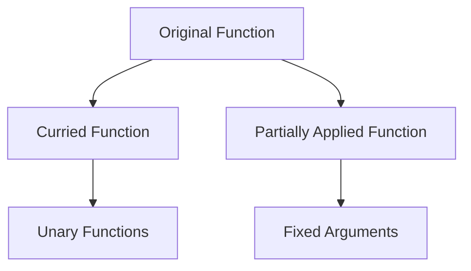

## 4.5 Currying and Partial Application

In the realm of functional programming, currying and partial application stand out as powerful techniques that enhance code reusability and simplify complex function calls. These concepts, while often used interchangeably, have distinct characteristics and applications. In this section, we will explore these techniques in depth, providing clear definitions, examples, and practical use cases. Additionally, we will highlight libraries such as [Ramda](https://ramdajs.com/) and [Lodash](https://lodash.com/) that facilitate currying and partial application in JavaScript.

### Understanding Currying

**Currying** is a functional programming technique where a function with multiple arguments is transformed into a sequence of functions, each taking a single argument. This transformation allows functions to be invoked with fewer arguments than they were originally designed to accept, returning a new function that takes the remaining arguments.

#### Definition and Example

Currying transforms a function `f(a, b, c)` into `f(a)(b)(c)`. This transformation is particularly useful when you want to create specialized functions from a general-purpose function.

```javascript
// A simple function that adds three numbers
function addThreeNumbers(a, b, c) {
    return a + b + c;
}

// Curried version of the function
function curriedAdd(a) {
    return function(b) {
        return function(c) {
            return a + b + c;
        };
    };
}

// Usage
const addFive = curriedAdd(5);
const addFiveAndSix = addFive(6);
console.log(addFiveAndSix(7)); // Output: 18
```

In this example, `curriedAdd` allows us to create specialized functions like `addFive` and `addFiveAndSix`, which can be reused with different arguments.

### Understanding Partial Application

**Partial Application** is a technique where a function is applied to some of its arguments, producing another function that takes the remaining arguments. Unlike currying, partial application does not necessarily transform a function into a sequence of unary functions.

#### Definition and Example

Partial application involves fixing a number of arguments to a function, producing another function of smaller arity.

```javascript
// A simple function that multiplies three numbers
function multiplyThreeNumbers(a, b, c) {
    return a * b * c;
}

// Partially applied function
function partialMultiply(a, b) {
    return function(c) {
        return multiplyThreeNumbers(a, b, c);
    };
}

// Usage
const multiplyByTwoAndThree = partialMultiply(2, 3);
console.log(multiplyByTwoAndThree(4)); // Output: 24
```

In this example, `partialMultiply` fixes the first two arguments, creating a new function `multiplyByTwoAndThree` that only requires the third argument.

### Differences Between Currying and Partial Application

While both currying and partial application involve transforming functions to handle fewer arguments, they differ in their approach and use cases:

- **Currying**: Transforms a function into a series of unary functions. It is more about transforming the function's structure.
- **Partial Application**: Fixes a number of arguments, creating a new function with fewer arguments. It is more about pre-filling some arguments.

### Simplifying Complex Function Calls

Both currying and partial application can simplify complex function calls by allowing you to break down functions into smaller, reusable components. This modularity leads to cleaner and more maintainable code.

#### Example: Event Handling

Consider a scenario where you need to handle multiple events with similar logic but different parameters. Currying and partial application can help streamline this process.

```javascript
// Event handler function
function handleEvent(eventType, element, callback) {
    element.addEventListener(eventType, callback);
}

// Curried version
function curriedHandleEvent(eventType) {
    return function(element) {
        return function(callback) {
            element.addEventListener(eventType, callback);
        };
    };
}

// Usage
const handleClick = curriedHandleEvent('click');
const handleButtonClick = handleClick(document.querySelector('button'));
handleButtonClick(() => console.log('Button clicked!'));
```

In this example, `curriedHandleEvent` allows us to create specialized event handlers like `handleClick`, which can be reused across different elements and callbacks.

### Libraries Supporting Currying and Partial Application

Several libraries provide built-in support for currying and partial application, making it easier to implement these techniques in JavaScript.

#### Ramda

[Ramda](https://ramdajs.com/) is a functional programming library for JavaScript that emphasizes immutability and side-effect-free functions. It provides a `curry` function to transform functions into curried versions.

```javascript
const R = require('ramda');

// Original function
const add = (a, b, c) => a + b + c;

// Curried function using Ramda
const curriedAdd = R.curry(add);

// Usage
console.log(curriedAdd(1)(2)(3)); // Output: 6
```

#### Lodash

[Lodash](https://lodash.com/) is a utility library that provides a wide range of functions for common programming tasks. It includes a `partial` function for partial application.

```javascript
const _ = require('lodash');

// Original function
function greet(greeting, name) {
    return `${greeting}, ${name}!`;
}

// Partially applied function using Lodash
const sayHelloTo = _.partial(greet, 'Hello');

// Usage
console.log(sayHelloTo('Alice')); // Output: Hello, Alice!
```

### Use Cases in Functional Composition

Currying and partial application are integral to functional composition, allowing you to build complex functions from simpler ones.

#### Example: Data Transformation Pipeline

Consider a data transformation pipeline where each step is a function that transforms the data. Currying and partial application can help create reusable transformation functions.

```javascript
const R = require('ramda');

// Transformation functions
const multiplyBy = R.curry((factor, value) => value * factor);
const add = R.curry((increment, value) => value + increment);

// Data pipeline
const transformData = R.pipe(
    multiplyBy(2),
    add(3)
);

// Usage
console.log(transformData(5)); // Output: 13
```

In this example, `multiplyBy` and `add` are curried functions that can be composed into a data transformation pipeline using `R.pipe`.

### Visualizing Currying and Partial Application

To better understand the flow of currying and partial application, let's visualize the transformation of a function into its curried and partially applied forms.



This diagram illustrates how an original function can be transformed into a curried function, resulting in a series of unary functions, or into a partially applied function with fixed arguments.

### Key Takeaways

- **Currying** transforms a function into a series of unary functions, enhancing modularity and reusability.
- **Partial Application** fixes a number of arguments, creating a new function with fewer arguments.
- Both techniques simplify complex function calls and are integral to functional composition.
- Libraries like Ramda and Lodash provide built-in support for currying and partial application.
- Use cases include event handling, data transformation pipelines, and more.

### Try It Yourself

Experiment with the code examples provided in this section. Try modifying the curried and partially applied functions to handle different scenarios. For instance, create a curried function for string manipulation or a partially applied function for mathematical operations.

### References and Further Reading

- [MDN Web Docs: Functions](https://developer.mozilla.org/en-US/docs/Web/JavaScript/Guide/Functions)
- [Ramda Documentation](https://ramdajs.com/docs/)
- [Lodash Documentation](https://lodash.com/docs/)

### Knowledge Check

## Test Your Understanding of Currying and Partial Application



### What is currying in JavaScript?

- [x] Transforming a function with multiple arguments into a sequence of functions each taking a single argument.
- [ ] Combining multiple functions into a single function.
- [ ] Creating a new function by fixing some arguments of an existing function.
- [ ] Transforming a function into a promise-based function.

> **Explanation:** Currying involves transforming a function with multiple arguments into a series of unary functions.

### What is partial application in JavaScript?

- [ ] Transforming a function with multiple arguments into a sequence of functions each taking a single argument.
- [ ] Combining multiple functions into a single function.
- [x] Creating a new function by fixing some arguments of an existing function.
- [ ] Transforming a function into a promise-based function.

> **Explanation:** Partial application involves fixing a number of arguments to a function, producing another function of smaller arity.

### Which library provides a `curry` function for currying in JavaScript?

- [x] Ramda
- [ ] jQuery
- [ ] Axios
- [ ] Express

> **Explanation:** Ramda is a functional programming library that provides a `curry` function for currying.

### Which library provides a `partial` function for partial application in JavaScript?

- [ ] Ramda
- [x] Lodash
- [ ] jQuery
- [ ] Express

> **Explanation:** Lodash provides a `partial` function for partial application.

### How does currying enhance code reusability?

- [x] By transforming functions into smaller, reusable components.
- [ ] By combining multiple functions into a single function.
- [ ] By converting functions into asynchronous functions.
- [ ] By optimizing function execution speed.

> **Explanation:** Currying enhances code reusability by breaking down functions into smaller, reusable components.

### What is a common use case for partial application?

- [ ] Transforming synchronous functions into asynchronous functions.
- [x] Creating specialized functions by pre-filling some arguments.
- [ ] Combining multiple functions into a single function.
- [ ] Optimizing function execution speed.

> **Explanation:** Partial application is commonly used to create specialized functions by pre-filling some arguments.

### Which of the following is a benefit of using currying and partial application?

- [x] Simplifying complex function calls.
- [ ] Increasing the execution speed of functions.
- [ ] Reducing the memory footprint of functions.
- [ ] Converting functions into promise-based functions.

> **Explanation:** Currying and partial application simplify complex function calls by breaking them into smaller, manageable parts.

### What is the output of the following code snippet?

```javascript
const curriedAdd = a => b => c => a + b + c;
const addFive = curriedAdd(5);
console.log(addFive(6)(7));
```

- [ ] 16
- [ ] 17
- [x] 18
- [ ] 19

> **Explanation:** The curried function adds 5, 6, and 7, resulting in 18.

### What is the output of the following code snippet?

```javascript
const _ = require('lodash');
const greet = (greeting, name) => `${greeting}, ${name}!`;
const sayHelloTo = _.partial(greet, 'Hello');
console.log(sayHelloTo('Alice'));
```

- [x] Hello, Alice!
- [ ] Hi, Alice!
- [ ] Hello, Bob!
- [ ] Hi, Bob!

> **Explanation:** The partially applied function `sayHelloTo` pre-fills the greeting as "Hello".

### Currying and partial application are integral to functional composition.

- [x] True
- [ ] False

> **Explanation:** Both currying and partial application are essential techniques in functional composition, allowing complex functions to be built from simpler ones.



Remember, this is just the beginning. As you progress, you'll build more complex and interactive web pages. Keep experimenting, stay curious, and enjoy the journey!
