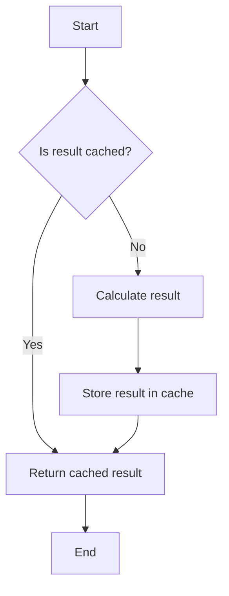
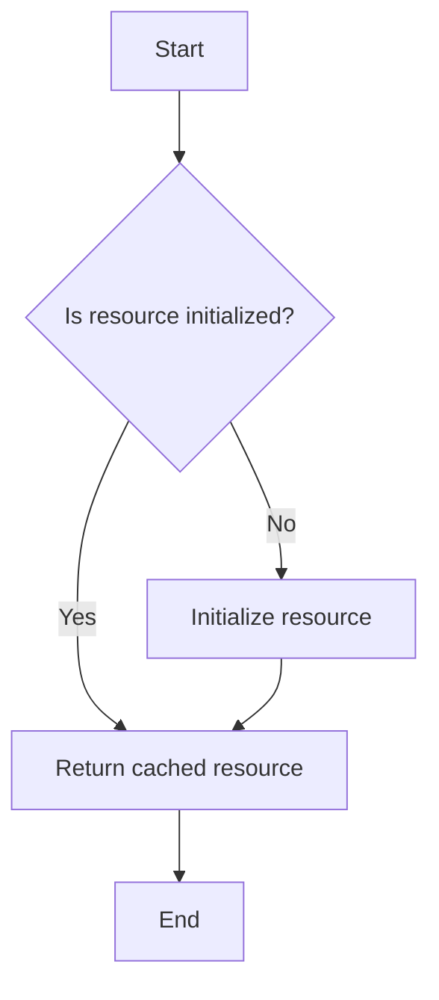

## 4.6 Memoization Techniques and Lazy Initialization

In the world of web development, performance optimization is a crucial aspect of creating efficient and responsive applications. Two powerful techniques that can significantly enhance performance are **memoization** and **lazy initialization**. These techniques help manage computational resources effectively, ensuring that your applications run smoothly even under heavy loads.

### Understanding Memoization

**Memoization** is a programming technique used to speed up function execution by storing the results of expensive function calls and returning the cached result when the same inputs occur again. This technique is particularly useful in scenarios where functions are called repeatedly with the same arguments.

#### How Memoization Improves Performance

Memoization improves performance by reducing the number of times a function needs to be executed. Instead of recalculating results for the same inputs, memoization allows the function to retrieve the result from a cache, thus saving computational time and resources.

Consider a scenario where you have a function that performs a complex calculation, such as computing Fibonacci numbers. Without memoization, each call to the function would involve recalculating the same values, leading to redundant computations.

#### Implementing Memoization in JavaScript

Let's explore how to implement memoization in JavaScript with a simple example. We'll create a memoized version of a function that calculates Fibonacci numbers.

```javascript
// A simple recursive function to calculate Fibonacci numbers
function fibonacci(n) {
  if (n <= 1) return n;
  return fibonacci(n - 1) + fibonacci(n - 2);
}

// Memoized version of the Fibonacci function
function memoize(fn) {
  const cache = {};
  return function(...args) {
    const key = JSON.stringify(args);
    if (cache[key]) {
      console.log(`Fetching from cache for ${key}`);
      return cache[key];
    }
    console.log(`Calculating result for ${key}`);
    const result = fn(...args);
    cache[key] = result;
    return result;
  };
}

const memoizedFibonacci = memoize(fibonacci);

console.log(memoizedFibonacci(10)); // Calculating result for [10]
console.log(memoizedFibonacci(10)); // Fetching from cache for [10]
```

In this example, we define a `memoize` function that takes another function `fn` as an argument. It returns a new function that checks if the result for the given arguments is already cached. If it is, the cached result is returned; otherwise, the function is executed, and the result is stored in the cache.

#### Visualizing Memoization

To better understand how memoization works, let's visualize the process using a flowchart.



**Caption**: This flowchart illustrates the memoization process, where a function checks if the result is cached before performing calculations.

### Lazy Initialization

**Lazy initialization** is a design pattern that defers the creation of an object, calculation of a value, or some other expensive process until it is needed. This technique is beneficial in managing resources efficiently, especially when dealing with operations that are costly in terms of time or memory.

#### Role of Lazy Initialization in Resource Management

Lazy initialization helps in resource management by ensuring that resources are only allocated when necessary. This can lead to significant performance improvements, particularly in applications that involve large datasets or complex computations.

For example, consider a scenario where you have a large dataset that needs to be processed. Instead of loading and processing the entire dataset at once, lazy initialization allows you to load and process data incrementally, as needed.

#### Implementing Lazy Initialization in JavaScript

Let's implement a simple example of lazy initialization in JavaScript. We'll create a class that initializes a resource only when it's accessed for the first time.

```javascript
class LazyResource {
  constructor() {
    this._resource = null;
  }

  get resource() {
    if (!this._resource) {
      console.log("Initializing resource...");
      this._resource = this.initializeResource();
    }
    return this._resource;
  }

  initializeResource() {
    // Simulate an expensive operation
    return { data: "Expensive Data" };
  }
}

const lazyResource = new LazyResource();
console.log(lazyResource.resource); // Initializing resource...
console.log(lazyResource.resource); // No initialization, returns cached resource
```

In this example, the `LazyResource` class has a `resource` getter that initializes the resource only when it is accessed for the first time. Subsequent accesses return the cached resource without reinitialization.

#### Visualizing Lazy Initialization

Let's visualize the lazy initialization process using a flowchart.



**Caption**: This flowchart illustrates the lazy initialization process, where a resource is initialized only when accessed for the first time.

### Benefits and Use Cases

#### Situations Where Memoization is Beneficial

- **Repeated Calculations**: Memoization is ideal for functions that are called multiple times with the same arguments, such as mathematical computations or data processing tasks.
- **Performance Optimization**: It can significantly reduce execution time by avoiding redundant calculations.
- **Resource-Intensive Operations**: Memoization is useful in scenarios where function execution is resource-intensive, such as network requests or database queries.

#### Situations Where Lazy Initialization is Beneficial

- **Resource Management**: Lazy initialization is beneficial when dealing with resources that are expensive to create or consume a lot of memory.
- **On-Demand Loading**: It is useful in applications where resources are only needed under certain conditions, such as loading images or data in a web application.
- **Improving Application Startup Time**: By deferring resource initialization, lazy initialization can improve application startup time.

### Potential Concerns

While memoization and lazy initialization offer significant performance benefits, they also come with potential concerns, particularly regarding memory usage.

#### Memory Usage Concerns with Caching

- **Cache Size**: Memoization can lead to increased memory usage if the cache grows too large. It's important to implement cache eviction strategies to manage cache size.
- **Memory Leaks**: Improper cache management can lead to memory leaks, where unused cache entries are not released, consuming memory unnecessarily.

### Best Practices

- **Cache Eviction**: Implement cache eviction strategies, such as Least Recently Used (LRU) or time-based expiration, to manage cache size effectively.
- **Resource Monitoring**: Monitor resource usage to ensure that lazy initialization does not lead to excessive memory consumption.
- **Testing and Profiling**: Test and profile your application to identify performance bottlenecks and optimize memoization and lazy initialization strategies accordingly.

### Try It Yourself

To deepen your understanding of memoization and lazy initialization, try modifying the code examples provided. Experiment with different functions and scenarios to see how memoization and lazy initialization can improve performance in various contexts.

### Knowledge Check

- **What is memoization, and how does it improve performance?**
- **How can lazy initialization help in resource management?**
- **What are some potential concerns with using memoization and lazy initialization?**
- **In what scenarios would you use memoization over lazy initialization, and vice versa?**

### Summary

Memoization and lazy initialization are powerful techniques for optimizing performance and managing resources in JavaScript applications. By caching results and deferring resource initialization, these techniques can significantly enhance application efficiency. However, it's important to be mindful of potential memory usage concerns and implement best practices to manage resources effectively.

Remember, this is just the beginning. As you progress, you'll build more complex and interactive web applications. Keep experimenting, stay curious, and enjoy the journey!

## Quiz: Mastering Memoization and Lazy Initialization in JavaScript



### What is the primary purpose of memoization?

- [x] To cache function results for repeated inputs
- [ ] To initialize resources lazily
- [ ] To manage memory usage
- [ ] To improve code readability

> **Explanation:** Memoization caches the results of function calls to avoid redundant calculations for the same inputs.

### Which of the following is a benefit of lazy initialization?

- [x] Deferring resource creation until needed
- [ ] Caching function results
- [ ] Improving code readability
- [ ] Reducing code complexity

> **Explanation:** Lazy initialization defers the creation of resources until they are actually needed, optimizing resource usage.

### What is a potential concern when using memoization?

- [x] Increased memory usage due to caching
- [ ] Delayed resource initialization
- [ ] Reduced code readability
- [ ] Increased code complexity

> **Explanation:** Memoization can lead to increased memory usage if the cache grows too large without proper management.

### How does lazy initialization improve application startup time?

- [x] By deferring resource initialization
- [ ] By caching function results
- [ ] By optimizing code readability
- [ ] By reducing code complexity

> **Explanation:** Lazy initialization defers resource initialization, which can improve application startup time by reducing initial resource allocation.

### Which of the following scenarios is ideal for memoization?

- [x] Repeated calculations with the same inputs
- [ ] On-demand resource loading
- [x] Resource-intensive operations
- [ ] Improving code readability

> **Explanation:** Memoization is ideal for repeated calculations with the same inputs and resource-intensive operations to avoid redundant computations.

### What is a common strategy for managing cache size in memoization?

- [x] Implementing cache eviction strategies
- [ ] Deferring resource initialization
- [ ] Optimizing code readability
- [ ] Reducing code complexity

> **Explanation:** Implementing cache eviction strategies, such as LRU, helps manage cache size effectively in memoization.

### What is the role of lazy initialization in resource management?

- [x] To defer resource creation until needed
- [ ] To cache function results
- [ ] To improve code readability
- [ ] To reduce code complexity

> **Explanation:** Lazy initialization defers resource creation until needed, optimizing resource management.

### Which of the following is a potential concern with lazy initialization?

- [x] Excessive memory consumption
- [ ] Increased memory usage due to caching
- [ ] Reduced code readability
- [ ] Increased code complexity

> **Explanation:** Lazy initialization can lead to excessive memory consumption if resources are not managed properly.

### How can you test the effectiveness of memoization and lazy initialization?

- [x] By profiling and monitoring resource usage
- [ ] By optimizing code readability
- [ ] By reducing code complexity
- [ ] By deferring resource initialization

> **Explanation:** Profiling and monitoring resource usage can help test the effectiveness of memoization and lazy initialization.

### Memoization and lazy initialization are both techniques for optimizing performance in JavaScript applications.

- [x] True
- [ ] False

> **Explanation:** Both memoization and lazy initialization are techniques used to optimize performance by caching results and deferring resource initialization, respectively.


