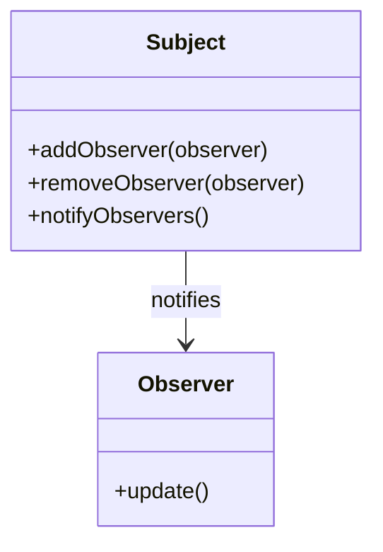

## 4.7 Event Handling and the Observer Pattern

In the realm of software design patterns, the Observer Pattern stands out as a powerful tool for promoting loose coupling between components. This pattern is particularly relevant in JavaScript, where event-driven programming is a cornerstone of both front-end and back-end development. In this section, we will delve into the intricacies of event handling and the Observer Pattern, exploring how they can be effectively utilized in JavaScript applications.

### Understanding the Observer Pattern

The Observer Pattern is a behavioral design pattern that defines a one-to-many dependency between objects. In this pattern, a subject (also known as an observable) maintains a list of its dependents, called observers, and notifies them automatically of any state changes, usually by calling one of their methods.

#### Key Components of the Observer Pattern

- **Subject**: The core component that holds the state and logic. It maintains a list of observers and provides methods to add, remove, and notify observers.
- **Observers**: These are components that need to be informed about changes in the subject. They register themselves with the subject to receive updates.

#### Diagram: Observer Pattern Structure



**Caption**: This diagram illustrates the relationship between the subject and its observers in the Observer Pattern.

### Event Handling in JavaScript

JavaScript's event handling mechanisms are deeply intertwined with the Observer Pattern. Events in JavaScript can be thought of as notifications that something has occurred, and event handlers are functions that respond to these notifications.

#### Built-in Event Handling

JavaScript provides a robust event handling system, particularly in the context of the Document Object Model (DOM). Events such as clicks, key presses, and mouse movements can be captured and handled using event listeners.

**Example: DOM Event Handling**

```javascript
// Select a button element
const button = document.querySelector('button');

// Add an event listener for the 'click' event
button.addEventListener('click', function(event) {
    console.log('Button was clicked!');
});
```

In this example, we attach an event listener to a button element. When the button is clicked, the anonymous function is executed, logging a message to the console.

#### Custom Events

JavaScript also allows the creation of custom events, enabling developers to define their own event types and dispatch them as needed.

**Example: Custom Event**

```javascript
// Create a new custom event
const customEvent = new Event('myCustomEvent');

// Add an event listener for the custom event
document.addEventListener('myCustomEvent', function(event) {
    console.log('Custom event triggered!');
});

// Dispatch the custom event
document.dispatchEvent(customEvent);
```

Here, we define a custom event named `myCustomEvent` and dispatch it, triggering the associated event listener.

### Node.js and the EventEmitter Class

In Node.js, event-driven programming is facilitated by the `EventEmitter` class, which is part of the `events` module. This class provides a mechanism for emitting and listening to events, making it a powerful tool for building scalable applications.

#### Example: Using EventEmitter

```javascript
const EventEmitter = require('events');

// Create a new instance of EventEmitter
const emitter = new EventEmitter();

// Define a listener for the 'greet' event
emitter.on('greet', () => {
    console.log('Hello, world!');
});

// Emit the 'greet' event
emitter.emit('greet');
```

In this example, we create an instance of `EventEmitter`, define a listener for the `greet` event, and then emit the event, triggering the listener.

### Use Cases in Front-End and Back-End Development

The Observer Pattern and event handling are applicable in various scenarios across both front-end and back-end development.

#### Front-End Development

In front-end development, the Observer Pattern is often used to manage UI components and their interactions. For instance, a form validation system might use the Observer Pattern to update error messages in response to user input.

#### Back-End Development

On the back-end, event-driven architectures are common, particularly in Node.js applications. The Observer Pattern can be used to manage asynchronous operations, such as handling incoming HTTP requests or processing data streams.

### Best Practices for Managing Event Subscriptions

When working with events and the Observer Pattern, it's important to follow best practices to ensure efficient and maintainable code.

#### Avoiding Memory Leaks

One common pitfall in event-driven programming is memory leaks, which can occur when event listeners are not properly removed. To prevent this, always remove event listeners when they are no longer needed.

**Example: Removing Event Listeners**

```javascript
// Define a function to handle the event
function handleClick(event) {
    console.log('Button clicked!');
}

// Add the event listener
button.addEventListener('click', handleClick);

// Remove the event listener
button.removeEventListener('click', handleClick);
```

#### Managing Event Subscriptions

In complex applications, managing event subscriptions can become challenging. Consider using a centralized event management system or library to keep track of all event listeners and their associated events.

### Conclusion

The Observer Pattern and event handling are fundamental concepts in JavaScript development. By understanding and applying these patterns, developers can create more modular, scalable, and maintainable applications. Remember to follow best practices, such as removing unused event listeners and managing subscriptions effectively, to avoid common pitfalls.

### Try It Yourself

Experiment with the examples provided in this section. Try creating custom events and using the `EventEmitter` class in Node.js. Modify the code to add additional functionality, such as passing data with events or chaining multiple event listeners.

### Knowledge Check

## Mastering JavaScript Event Handling and the Observer Pattern



### What is the primary purpose of the Observer Pattern?

- [x] To define a one-to-many dependency between objects
- [ ] To encapsulate a request as an object
- [ ] To provide a way to access the elements of an aggregate object sequentially
- [ ] To separate the construction of a complex object from its representation

> **Explanation:** The Observer Pattern defines a one-to-many dependency between objects, allowing a subject to notify multiple observers of state changes.

### Which component in the Observer Pattern is responsible for maintaining a list of observers?

- [x] Subject
- [ ] Observer
- [ ] EventEmitter
- [ ] Listener

> **Explanation:** The subject maintains a list of observers and notifies them of any state changes.

### In JavaScript, how can you create a custom event?

- [x] Using the `Event` constructor
- [ ] Using the `createEvent` function
- [ ] Using the `CustomEvent` constructor
- [ ] Using the `new Event` keyword

> **Explanation:** Custom events in JavaScript can be created using the `Event` constructor.

### What is the purpose of the `EventEmitter` class in Node.js?

- [x] To facilitate event-driven programming by emitting and listening to events
- [ ] To manage HTTP requests and responses
- [ ] To handle file system operations
- [ ] To provide a database connection

> **Explanation:** The `EventEmitter` class in Node.js is used for emitting and listening to events, enabling event-driven programming.

### How can you prevent memory leaks when using event listeners?

- [x] By removing event listeners when they are no longer needed
- [ ] By using global variables for event handlers
- [ ] By increasing the maximum number of listeners
- [ ] By using synchronous event handling

> **Explanation:** Removing event listeners when they are no longer needed helps prevent memory leaks.

### Which method is used to add an event listener in JavaScript?

- [x] `addEventListener`
- [ ] `attachEvent`
- [ ] `onEvent`
- [ ] `bindEvent`

> **Explanation:** The `addEventListener` method is used to add an event listener to an element in JavaScript.

### What is a common use case for the Observer Pattern in front-end development?

- [x] Managing UI components and their interactions
- [ ] Handling database transactions
- [ ] Performing file system operations
- [ ] Managing server configurations

> **Explanation:** In front-end development, the Observer Pattern is commonly used to manage UI components and their interactions.

### What is the relationship between a subject and its observers in the Observer Pattern?

- [x] One-to-many
- [ ] One-to-one
- [ ] Many-to-one
- [ ] Many-to-many

> **Explanation:** The Observer Pattern defines a one-to-many relationship between a subject and its observers.

### Which of the following is a best practice for managing event subscriptions?

- [x] Using a centralized event management system
- [ ] Using global variables for event handlers
- [ ] Avoiding the use of custom events
- [ ] Increasing the maximum number of listeners

> **Explanation:** Using a centralized event management system can help manage event subscriptions effectively.

### True or False: The Observer Pattern is only applicable in front-end development.

- [ ] True
- [x] False

> **Explanation:** The Observer Pattern is applicable in both front-end and back-end development, particularly in event-driven architectures.



Remember, this is just the beginning. As you progress, you'll build more complex and interactive web pages. Keep experimenting, stay curious, and enjoy the journey!


