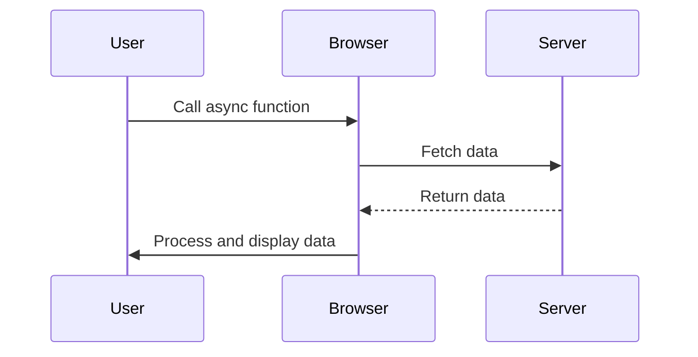

## 4.8 Promises and Async/Await Patterns

Asynchronous programming is a cornerstone of modern JavaScript development, enabling efficient handling of operations like network requests, file I/O, and timers without blocking the main execution thread. In this section, we delve into advanced usage patterns for Promises and async/await, focusing on improving code readability, error handling, and performance.

### Introduction to Promises

Promises in JavaScript represent the eventual completion (or failure) of an asynchronous operation and its resulting value. They provide a cleaner, more intuitive way to handle asynchronous tasks compared to traditional callback functions.

#### Basic Syntax

A Promise is an object that may produce a single value some time in the future: either a resolved value or a reason that it’s not resolved (e.g., a network error). Here's a simple example:

```javascript
let promise = new Promise((resolve, reject) => {
    // Simulating an asynchronous operation
    setTimeout(() => {
        resolve("Operation successful!");
    }, 1000);
});

promise.then(result => {
    console.log(result); // "Operation successful!"
}).catch(error => {
    console.error(error);
});
```

### Understanding Async/Await

Async/await is syntactic sugar built on top of Promises, making asynchronous code look and behave more like synchronous code. This improves readability and reduces the complexity of chaining multiple asynchronous operations.

#### Basic Syntax

To use async/await, you define an `async` function and use the `await` keyword to pause execution until a Promise is resolved:

```javascript
async function fetchData() {
    try {
        let response = await fetch('https://api.example.com/data');
        let data = await response.json();
        console.log(data);
    } catch (error) {
        console.error('Error fetching data:', error);
    }
}

fetchData();
```

### Chaining Promises and Error Handling

One of the key advantages of Promises is their ability to chain operations. This allows you to perform a series of asynchronous tasks in sequence, handling errors at each step or at the end of the chain.

#### Chaining Promises

Promises can be chained to perform sequential operations. Each `then` returns a new Promise, allowing further chaining:

```javascript
fetch('https://api.example.com/data')
    .then(response => response.json())
    .then(data => {
        console.log('Data received:', data);
        return fetch('https://api.example.com/other-data');
    })
    .then(response => response.json())
    .then(otherData => {
        console.log('Other data received:', otherData);
    })
    .catch(error => {
        console.error('Error:', error);
    });
```

#### Error Handling with `catch`

Errors in Promises can be caught using the `catch` method. This method is called when any of the Promises in the chain is rejected:

```javascript
fetch('https://api.example.com/data')
    .then(response => {
        if (!response.ok) {
            throw new Error('Network response was not ok');
        }
        return response.json();
    })
    .then(data => {
        console.log(data);
    })
    .catch(error => {
        console.error('Fetch error:', error);
    });
```

### Parallel and Sequential Asynchronous Operations

JavaScript provides several methods to handle multiple asynchronous operations efficiently, such as `Promise.all` for parallel execution and `for-await-of` for sequential execution.

#### Parallel Execution with `Promise.all`

`Promise.all` allows you to run multiple Promises in parallel and wait for all of them to resolve:

```javascript
let promise1 = fetch('https://api.example.com/data1');
let promise2 = fetch('https://api.example.com/data2');

Promise.all([promise1, promise2])
    .then(responses => Promise.all(responses.map(response => response.json())))
    .then(data => {
        console.log('Data from both requests:', data);
    })
    .catch(error => {
        console.error('Error with one of the requests:', error);
    });
```

#### Sequential Execution with `for-await-of`

When you need to perform asynchronous operations sequentially, `for-await-of` can be used within an `async` function:

```javascript
async function processUrls(urls) {
    for (const url of urls) {
        try {
            const response = await fetch(url);
            const data = await response.json();
            console.log('Data from', url, ':', data);
        } catch (error) {
            console.error('Error fetching', url, ':', error);
        }
    }
}

const urls = ['https://api.example.com/data1', 'https://api.example.com/data2'];
processUrls(urls);
```

### Avoiding Common Pitfalls

As with any powerful tool, Promises and async/await come with their own set of pitfalls. Here are some common issues and how to avoid them:

#### Unhandled Promise Rejections

Unhandled Promise rejections can lead to silent failures in your code. Always ensure that you handle rejections using `catch` or try/catch blocks in async functions.

```javascript
process.on('unhandledRejection', (reason, promise) => {
    console.error('Unhandled Rejection at:', promise, 'reason:', reason);
});
```

#### Blocking the Event Loop

Avoid long-running synchronous operations within async functions, as they can block the event loop and degrade performance. Use asynchronous alternatives whenever possible.

### Best Practices for Clean and Maintainable Asynchronous Code

- **Use async/await for readability**: Prefer async/await over chaining Promises for better readability and maintainability.
- **Handle errors gracefully**: Always use try/catch blocks in async functions to handle errors.
- **Avoid nesting**: Flatten Promise chains to avoid callback hell.
- **Use `Promise.all` for parallel tasks**: When tasks are independent, use `Promise.all` to execute them in parallel.
- **Be cautious with `Promise.allSettled`**: Use `Promise.allSettled` when you need to handle all results, regardless of success or failure.

### Visualizing Asynchronous Operations

To better understand how asynchronous operations work in JavaScript, let's visualize the flow of Promises and async/await using a sequence diagram.



This diagram illustrates the interaction between a user, the browser, and a server during an asynchronous operation. The browser fetches data from the server and processes it before displaying it to the user.

### Try It Yourself

Experiment with the following code examples to deepen your understanding of Promises and async/await. Try modifying the URLs, adding error handling, or chaining additional Promises.

### Knowledge Check

To reinforce your understanding, consider these questions:

- What is the difference between `Promise.all` and `Promise.allSettled`?
- How can you handle errors in async functions?
- What are the benefits of using async/await over traditional Promise chaining?

### Summary

In this section, we've explored advanced patterns for using Promises and async/await in JavaScript. By mastering these techniques, you can write cleaner, more efficient asynchronous code. Remember, this is just the beginning. As you progress, you'll build more complex and interactive web applications. Keep experimenting, stay curious, and enjoy the journey!

## Quiz: Mastering Promises and Async/Await in JavaScript



### What is a Promise in JavaScript?

- [x] An object representing the eventual completion or failure of an asynchronous operation
- [ ] A synchronous function that returns a value immediately
- [ ] A method for handling synchronous errors
- [ ] A type of JavaScript variable

> **Explanation:** A Promise is an object that represents the eventual completion (or failure) of an asynchronous operation and its resulting value.

### How do you handle errors in a Promise chain?

- [x] Using the `catch` method
- [ ] Using the `finally` method
- [ ] Using the `then` method
- [ ] Using the `await` keyword

> **Explanation:** Errors in a Promise chain can be caught using the `catch` method, which handles any rejections that occur in the chain.

### What does the `await` keyword do in an async function?

- [x] Pauses execution until the Promise is resolved
- [ ] Immediately resolves a Promise
- [ ] Rejects a Promise
- [ ] Converts a synchronous function to asynchronous

> **Explanation:** The `await` keyword pauses the execution of an async function until the Promise is resolved, allowing for more readable asynchronous code.

### Which method runs multiple Promises in parallel and waits for all to resolve?

- [x] `Promise.all`
- [ ] `Promise.race`
- [ ] `Promise.allSettled`
- [ ] `Promise.any`

> **Explanation:** `Promise.all` runs multiple Promises in parallel and waits for all of them to resolve before proceeding.

### What is the purpose of `Promise.allSettled`?

- [x] To wait for all Promises to settle, regardless of success or failure
- [ ] To resolve the first Promise that settles
- [ ] To reject all Promises if one fails
- [ ] To execute Promises sequentially

> **Explanation:** `Promise.allSettled` waits for all Promises to settle (either resolve or reject) and returns an array of their results.

### How can you avoid blocking the event loop in async functions?

- [x] Use asynchronous alternatives for long-running operations
- [ ] Use synchronous loops
- [ ] Avoid using Promises
- [ ] Use `await` for all operations

> **Explanation:** To avoid blocking the event loop, use asynchronous alternatives for long-running operations instead of synchronous ones.

### What is a common pitfall when using Promises?

- [x] Unhandled Promise rejections
- [ ] Using `await` in async functions
- [ ] Using `then` for chaining
- [ ] Handling errors with `catch`

> **Explanation:** A common pitfall is unhandled Promise rejections, which can lead to silent failures in your code.

### What is the benefit of using async/await over Promise chaining?

- [x] Improved readability and maintainability
- [ ] Faster execution
- [ ] Automatic error handling
- [ ] Synchronous execution

> **Explanation:** Async/await improves the readability and maintainability of asynchronous code by making it look more like synchronous code.

### Which keyword is used to define an asynchronous function?

- [x] `async`
- [ ] `await`
- [ ] `function`
- [ ] `promise`

> **Explanation:** The `async` keyword is used to define an asynchronous function, allowing the use of `await` within it.

### True or False: `Promise.race` resolves or rejects as soon as one of the Promises in the iterable resolves or rejects.

- [x] True
- [ ] False

> **Explanation:** `Promise.race` resolves or rejects as soon as one of the Promises in the iterable resolves or rejects, making it useful for timeout scenarios.


