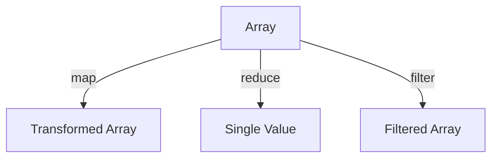

## 4.9 Functional Programming Paradigms

Functional programming (FP) is a programming paradigm that treats computation as the evaluation of mathematical functions and avoids changing state or mutable data. In JavaScript, functional programming has gained popularity due to its ability to create more predictable and testable code. In this section, we will delve into the core concepts of functional programming, explore how to transform data using functions like `map`, `reduce`, and `filter`, and discuss the benefits of adopting a functional approach.

### Key Concepts of Functional Programming

#### Immutability

Immutability is a core principle of functional programming. It refers to the idea that data should not be changed after it is created. Instead of modifying existing data, you create new data structures with the desired changes. This approach leads to more predictable code, as functions do not have side effects that alter the state of the program.

**Example of Immutability:**

```javascript
// Original array
const numbers = [1, 2, 3, 4, 5];

// Immutable transformation using map
const doubledNumbers = numbers.map(num => num * 2);

console.log(numbers); // [1, 2, 3, 4, 5]
console.log(doubledNumbers); // [2, 4, 6, 8, 10]
```

In this example, the `numbers` array remains unchanged, and a new array `doubledNumbers` is created with the transformed values.

#### Pure Functions

A pure function is a function that, given the same input, will always return the same output and does not have any side effects. Pure functions are deterministic and easier to test because they do not rely on or alter the state of the program.

**Example of a Pure Function:**

```javascript
// Pure function
function add(a, b) {
  return a + b;
}

console.log(add(2, 3)); // 5
console.log(add(2, 3)); // 5
```

The `add` function is pure because it consistently returns the same result for the same inputs and does not modify any external state.

#### Higher-Order Functions

Higher-order functions are functions that can take other functions as arguments or return them as results. They are a powerful tool in functional programming, enabling the creation of more abstract and reusable code.

**Example of a Higher-Order Function:**

```javascript
// Higher-order function
function applyOperation(a, b, operation) {
  return operation(a, b);
}

// Using the higher-order function
console.log(applyOperation(5, 3, add)); // 8
console.log(applyOperation(5, 3, (x, y) => x - y)); // 2
```

In this example, `applyOperation` is a higher-order function that takes another function `operation` as an argument and applies it to the numbers `a` and `b`.

### Transforming Data with Functional Techniques

Functional programming in JavaScript often involves transforming data using functions like `map`, `reduce`, and `filter`. These functions allow you to process collections of data in a declarative and concise manner.

#### Using `map`

The `map` function creates a new array by applying a function to each element of an existing array. It is commonly used for transforming data.

**Example of Using `map`:**

```javascript
const names = ['Alice', 'Bob', 'Charlie'];

// Transform names to uppercase
const uppercasedNames = names.map(name => name.toUpperCase());

console.log(uppercasedNames); // ['ALICE', 'BOB', 'CHARLIE']
```

#### Using `reduce`

The `reduce` function applies a function against an accumulator and each element in the array to reduce it to a single value. It is useful for aggregating data.

**Example of Using `reduce`:**

```javascript
const numbers = [1, 2, 3, 4, 5];

// Sum of all numbers
const sum = numbers.reduce((accumulator, currentValue) => accumulator + currentValue, 0);

console.log(sum); // 15
```

#### Using `filter`

The `filter` function creates a new array with all elements that pass the test implemented by the provided function. It is used to select elements based on a condition.

**Example of Using `filter`:**

```javascript
const numbers = [1, 2, 3, 4, 5];

// Filter out even numbers
const oddNumbers = numbers.filter(num => num % 2 !== 0);

console.log(oddNumbers); // [1, 3, 5]
```

### Benefits of Functional Programming

Adopting a functional programming approach in JavaScript offers several benefits:

- **Predictability**: Pure functions and immutability lead to more predictable code, making it easier to understand and debug.
- **Testability**: Pure functions are easier to test because they do not depend on external state or cause side effects.
- **Reusability**: Higher-order functions and function composition enable the creation of reusable and modular code.
- **Concurrency**: Immutability makes it easier to reason about concurrent code, as there are no shared mutable states.

### Libraries for Functional Programming

Several libraries facilitate functional programming in JavaScript by providing utility functions and tools. Two popular libraries are Ramda and Lodash/fp.

#### Ramda

Ramda is a functional programming library for JavaScript that emphasizes immutability and side-effect-free functions. It provides a wide range of utility functions for working with arrays, objects, and other data types.

**Example of Using Ramda:**

```javascript
const R = require('ramda');

const numbers = [1, 2, 3, 4, 5];

// Double each number using Ramda's map
const doubledNumbers = R.map(R.multiply(2), numbers);

console.log(doubledNumbers); // [2, 4, 6, 8, 10]
```

#### Lodash/fp

Lodash/fp is a version of Lodash with a functional programming style. It provides a set of functions that are auto-curried and immutable by default.

**Example of Using Lodash/fp:**

```javascript
const _ = require('lodash/fp');

const numbers = [1, 2, 3, 4, 5];

// Double each number using Lodash/fp's map
const doubledNumbers = _.map(num => num * 2, numbers);

console.log(doubledNumbers); // [2, 4, 6, 8, 10]
```

### Real-World Applications

Functional programming paradigms are particularly useful in scenarios where predictability, testability, and reusability are critical. Here are some real-world applications:

- **Data Transformation**: Functional programming is ideal for transforming and processing large datasets, such as in data analysis and ETL (Extract, Transform, Load) processes.
- **UI Development**: Libraries like React leverage functional programming concepts to create predictable and maintainable user interfaces.
- **Concurrency**: Functional programming simplifies reasoning about concurrent and parallel code, making it suitable for applications that require high performance and scalability.

### When to Use Functional Paradigms

Functional programming is not a one-size-fits-all solution. It is most beneficial in the following situations:

- When you need to process and transform large datasets.
- When building applications that require high testability and predictability.
- When working on projects that benefit from modular and reusable code.
- When dealing with concurrent or parallel processing.

### Try It Yourself

To deepen your understanding of functional programming in JavaScript, try modifying the code examples provided. For instance, experiment with different transformations using `map`, `reduce`, and `filter`. Consider using Ramda or Lodash/fp to explore additional functional programming utilities.

### Visualizing Functional Programming Concepts

Let's visualize how functional programming concepts like `map`, `reduce`, and `filter` work in JavaScript using Mermaid.js diagrams.



**Diagram Description:** This diagram illustrates how an array is transformed using `map`, reduced to a single value using `reduce`, and filtered to create a new array using `filter`.

### Knowledge Check

Before we conclude, let's reinforce your understanding with a few questions:

1. What is the main advantage of using pure functions in JavaScript?
2. How does immutability contribute to the predictability of code?
3. What is a higher-order function, and why is it useful?
4. How can libraries like Ramda and Lodash/fp enhance functional programming in JavaScript?

### Key Takeaways

- Functional programming emphasizes immutability, pure functions, and higher-order functions.
- Functions like `map`, `reduce`, and `filter` are essential tools for transforming data in a functional style.
- Adopting a functional approach can lead to more predictable, testable, and reusable code.
- Libraries like Ramda and Lodash/fp provide utilities that facilitate functional programming in JavaScript.

Remember, this is just the beginning. As you progress, you'll build more complex and interactive applications using functional programming paradigms. Keep experimenting, stay curious, and enjoy the journey!

## Quiz: Test Your Knowledge on Functional Programming Paradigms



### What is a pure function in JavaScript?

- [x] A function that returns the same output for the same input and has no side effects
- [ ] A function that can modify global variables
- [ ] A function that relies on external state
- [ ] A function that always returns a random value

> **Explanation:** A pure function consistently returns the same result for the same inputs and does not alter any external state.

### Which of the following functions is used to transform each element of an array?

- [x] map
- [ ] reduce
- [ ] filter
- [ ] sort

> **Explanation:** The `map` function is used to apply a transformation to each element of an array, creating a new array with the transformed values.

### What is the purpose of the `reduce` function in JavaScript?

- [x] To aggregate data into a single value
- [ ] To filter elements based on a condition
- [ ] To sort elements in an array
- [ ] To transform each element of an array

> **Explanation:** The `reduce` function processes each element in an array and reduces it to a single accumulated value.

### How does immutability benefit functional programming?

- [x] It leads to more predictable code by avoiding state changes
- [ ] It allows functions to modify global variables
- [ ] It makes code execution faster
- [ ] It enables functions to have side effects

> **Explanation:** Immutability ensures that data does not change, leading to more predictable and reliable code.

### Which library is known for providing functional programming utilities in JavaScript?

- [x] Ramda
- [ ] jQuery
- [x] Lodash/fp
- [ ] Axios

> **Explanation:** Ramda and Lodash/fp are libraries that offer functional programming utilities, emphasizing immutability and pure functions.

### What is a higher-order function?

- [x] A function that takes other functions as arguments or returns them
- [ ] A function that modifies global variables
- [ ] A function that always returns a random value
- [ ] A function that relies on external state

> **Explanation:** Higher-order functions can take other functions as arguments or return them, enabling more abstract and reusable code.

### Which of the following is NOT a benefit of functional programming?

- [ ] Predictability
- [ ] Testability
- [ ] Reusability
- [x] Increased complexity due to mutable state

> **Explanation:** Functional programming reduces complexity by avoiding mutable state, leading to more predictable and testable code.

### What does the `filter` function do in JavaScript?

- [x] Creates a new array with elements that pass a test
- [ ] Aggregates data into a single value
- [ ] Transforms each element of an array
- [ ] Sorts elements in an array

> **Explanation:** The `filter` function creates a new array containing elements that pass the test implemented by the provided function.

### How can functional programming improve concurrency?

- [x] By avoiding shared mutable state
- [ ] By allowing functions to modify global variables
- [ ] By making code execution slower
- [ ] By enabling functions to have side effects

> **Explanation:** Functional programming avoids shared mutable state, making it easier to reason about concurrent code.

### True or False: Functional programming is only suitable for small projects.

- [ ] True
- [x] False

> **Explanation:** Functional programming is suitable for projects of all sizes, especially those that benefit from predictability, testability, and reusability.




