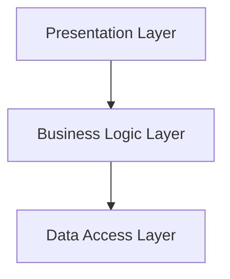

## 5.1.1 Layered Pattern

The Layered Architecture Pattern is a well-established architectural pattern used to separate concerns within an application by dividing it into distinct layers. This pattern enhances scalability, maintainability, and testability by organizing code into logical groupings. In this article, we will delve into the structure, implementation, best practices, and use cases of the Layered Pattern in JavaScript and TypeScript.

### Understand the Structure

The Layered Pattern typically consists of the following layers:

- **Presentation Layer:** Handles the user interface and user interaction.
- **Business Logic Layer:** Contains the core functionality and business rules.
- **Data Access Layer:** Manages data retrieval and storage.

Each layer has a specific responsibility, and communication between layers is typically unidirectional, from higher to lower layers.



### Implementation Steps

#### Identify Layers

The first step in implementing the Layered Pattern is to identify the layers required for your application. This depends on the application's complexity and functionality. For instance, a simple application might only need two layers, while a more complex one might require additional layers such as a Service Layer or an Integration Layer.

#### Define Interfaces

To promote loose coupling between layers, define clear interfaces. This ensures that each layer can be developed and tested independently.

```typescript
// Interface for Data Access Layer
interface IDataAccess {
    fetchData(): Promise<any>;
}

// Interface for Business Logic Layer
interface IBusinessLogic {
    processData(data: any): any;
}
```

#### Implement Layers

Develop each layer independently, focusing on its specific responsibility. Here is a simple example in TypeScript:

```typescript
// Data Access Layer
class DataAccess implements IDataAccess {
    async fetchData(): Promise<any> {
        // Simulate data fetching
        return { data: "Sample Data" };
    }
}

// Business Logic Layer
class BusinessLogic implements IBusinessLogic {
    constructor(private dataAccess: IDataAccess) {}

    async processData(): Promise<any> {
        const data = await this.dataAccess.fetchData();
        // Process data
        return { processedData: data.data.toUpperCase() };
    }
}

// Presentation Layer
class Presentation {
    constructor(private businessLogic: IBusinessLogic) {}

    async displayData() {
        const result = await this.businessLogic.processData();
        console.log("Displaying:", result.processedData);
    }
}

// Dependency Injection
const dataAccess = new DataAccess();
const businessLogic = new BusinessLogic(dataAccess);
const presentation = new Presentation(businessLogic);

presentation.displayData();
```

### Best Practices

#### Communication Direction

Ensure that higher layers only interact with the immediate lower layer. This maintains the separation of concerns and prevents tight coupling.

#### Dependency Injection

Use dependency injection to manage dependencies between layers. This approach enhances testability and flexibility.

### Use Cases

The Layered Pattern is suitable for applications that require:

- **Scalability:** Easily add new features by introducing new layers or expanding existing ones.
- **Maintainability:** Isolate changes to specific layers without affecting others.
- **Distinct Operations:** Clearly separate UI, business rules, and data handling.

### Considerations

- **Performance Overhead:** Be aware of potential performance issues due to multiple layer traversals. Optimize by minimizing unnecessary data transfers between layers.
- **Avoid Tight Coupling:** Maintain flexibility by avoiding tight coupling between layers. Use interfaces and dependency injection to achieve this.

### Advanced Topics

#### Domain-Driven Design (DDD)

Incorporating the Layered Pattern within a DDD framework can enhance the organization of complex applications. Consider using related patterns like Aggregates and Repositories for managing domain logic and data persistence.

#### Event Sourcing

Layered architectures can support event sourcing by structuring event handling and storage within distinct layers, ensuring clear separation of event processing and data storage.

### Conclusion

The Layered Architecture Pattern is a powerful tool for organizing code in a scalable and maintainable manner. By separating concerns into distinct layers, developers can create applications that are easier to manage and extend. By following best practices such as dependency injection and maintaining clear interfaces, you can maximize the benefits of this pattern.

## Quiz Time!



### What is the primary purpose of the Layered Architecture Pattern?

- [x] To separate concerns by dividing an application into distinct layers.
- [ ] To increase the complexity of an application.
- [ ] To reduce the number of classes in an application.
- [ ] To ensure that all code is in a single file.

> **Explanation:** The Layered Architecture Pattern is designed to separate concerns by organizing code into distinct layers, each with a specific responsibility.

### Which layer is responsible for handling user interactions?

- [x] Presentation Layer
- [ ] Business Logic Layer
- [ ] Data Access Layer
- [ ] Integration Layer

> **Explanation:** The Presentation Layer is responsible for handling user interactions and the user interface.

### What is a key benefit of using interfaces between layers?

- [x] Promotes loose coupling
- [ ] Increases code duplication
- [ ] Reduces the number of layers
- [ ] Ensures all layers are tightly coupled

> **Explanation:** Using interfaces between layers promotes loose coupling, allowing each layer to be developed and tested independently.

### What is the role of the Business Logic Layer?

- [x] Contains core functionality and business rules
- [ ] Manages data retrieval and storage
- [ ] Handles user interface and interactions
- [ ] Integrates with external systems

> **Explanation:** The Business Logic Layer contains the core functionality and business rules of the application.

### What is a potential drawback of the Layered Pattern?

- [x] Performance overhead due to multiple layer traversals
- [ ] Lack of scalability
- [ ] Difficulty in maintaining code
- [ ] Inability to separate concerns

> **Explanation:** A potential drawback of the Layered Pattern is performance overhead due to multiple layer traversals.

### How can dependency injection benefit a layered architecture?

- [x] Enhances testability and flexibility
- [ ] Increases coupling between layers
- [ ] Reduces the number of classes
- [ ] Ensures all layers are tightly coupled

> **Explanation:** Dependency injection enhances testability and flexibility by managing dependencies between layers.

### In a layered architecture, how should higher layers interact with lower layers?

- [x] Only with the immediate lower layer
- [ ] With all lower layers
- [ ] With the highest layer
- [ ] With no other layers

> **Explanation:** Higher layers should only interact with the immediate lower layer to maintain separation of concerns.

### Which pattern can be used alongside the Layered Pattern in a DDD framework?

- [x] Aggregates and Repositories
- [ ] Singleton Pattern
- [ ] Observer Pattern
- [ ] Factory Pattern

> **Explanation:** Aggregates and Repositories are patterns that can be used alongside the Layered Pattern in a DDD framework.

### What is a suitable use case for the Layered Pattern?

- [x] Applications requiring scalability and maintainability
- [ ] Small scripts with minimal functionality
- [ ] Applications with no distinct operations
- [ ] Systems with tightly coupled components

> **Explanation:** The Layered Pattern is suitable for applications requiring scalability and maintainability with distinct operations.

### True or False: The Layered Pattern is only applicable to web applications.

- [ ] True
- [x] False

> **Explanation:** False. The Layered Pattern is applicable to various types of applications, not just web applications.


