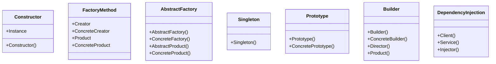

## 5.1 Overview of Creational Patterns in JavaScript

In the realm of software development, design patterns serve as time-tested solutions to common problems. Among these, creational design patterns play a pivotal role in managing object creation, ensuring that your code is both efficient and scalable. In JavaScript, a language renowned for its flexibility and dynamism, understanding and implementing these patterns can significantly enhance your development process.

### What Are Creational Design Patterns?

Creational design patterns are a category of design patterns that deal with object creation mechanisms. They abstract the instantiation process, making it more adaptable and efficient. By doing so, they help manage the complexities and dependencies involved in creating objects, allowing developers to focus on the behavior and interactions of these objects rather than the intricacies of their creation.

#### Purpose of Creational Patterns

The primary purpose of creational patterns is to provide a way to create objects while hiding the creation logic, rather than instantiating objects directly using the `new` operator. This approach promotes loose coupling and enhances the flexibility and scalability of your code. 

### Common Challenges in Object Creation

Before delving into specific patterns, it's essential to understand the challenges that creational patterns aim to address:

1. **Complex Initialization**: Some objects require complex setup processes that can lead to code duplication and errors if not managed properly.
2. **Dependency Management**: Objects often depend on other objects, which can lead to tight coupling and difficulties in testing and maintenance.
3. **Scalability**: As applications grow, the need to manage and create numerous objects efficiently becomes critical.
4. **Flexibility**: The ability to change the way objects are created without affecting the rest of the system is crucial for maintaining and extending applications.

### Overview of Creational Patterns in JavaScript

In this section, we will explore several key creational design patterns, each offering unique solutions to the challenges mentioned above. These patterns include:

- **Constructor Pattern**: A fundamental pattern in JavaScript that uses constructors to create and initialize objects.
- **Factory Method Pattern**: Provides an interface for creating objects in a superclass but allows subclasses to alter the type of objects that will be created.
- **Abstract Factory Pattern**: Encapsulates a group of individual factories with a common goal, providing an interface to create families of related or dependent objects without specifying their concrete classes.
- **Singleton Pattern**: Ensures a class has only one instance and provides a global point of access to it.
- **Prototype Pattern**: Creates new objects by copying an existing object, known as the prototype.
- **Builder Pattern**: Separates the construction of a complex object from its representation, allowing the same construction process to create different representations.
- **Dependency Injection Pattern**: A technique where an object receives other objects that it depends on, promoting loose coupling.

Each of these patterns addresses specific aspects of object creation, providing developers with tools to manage complexity, enhance flexibility, and improve code maintainability.

### Setting the Stage for Deeper Exploration

As we delve deeper into each pattern in the following subsections, we'll explore their implementation in JavaScript, discuss their applicability, and provide practical examples to illustrate their use. By understanding and applying these patterns, you'll be equipped to tackle complex object creation scenarios with confidence and precision.

Let's embark on this journey to master creational design patterns in JavaScript, enhancing our ability to build robust, scalable, and maintainable applications.

### Constructor Pattern

The Constructor Pattern is one of the most fundamental patterns in JavaScript. It involves using a constructor function to create and initialize objects. This pattern is particularly useful when you need to create multiple instances of an object with similar properties and methods.

#### Key Participants

- **Constructor Function**: A function that initializes an object.
- **Instance**: The object created by the constructor function.

#### Applicability

Use the Constructor Pattern when you need to create multiple instances of an object with similar properties and methods.

#### Sample Code Snippet

```javascript
// Constructor function
function Car(make, model, year) {
    this.make = make;
    this.model = model;
    this.year = year;
}

// Creating instances
const car1 = new Car('Toyota', 'Corolla', 2020);
const car2 = new Car('Honda', 'Civic', 2021);

console.log(car1.make); // Output: Toyota
console.log(car2.model); // Output: Civic
```

#### Design Considerations

- **When to Use**: Ideal for creating multiple objects with similar properties.
- **Pitfalls**: Be cautious of memory usage if creating a large number of objects.

#### JavaScript Unique Features

JavaScript's prototypal inheritance allows you to add methods to the constructor's prototype, ensuring all instances share the same method, saving memory.

### Factory Method Pattern

The Factory Method Pattern provides an interface for creating objects in a superclass but allows subclasses to alter the type of objects that will be created. This pattern is particularly useful when the exact type of object to be created is determined by subclasses.

#### Key Participants

- **Creator**: Declares the factory method, which returns an object of type Product.
- **ConcreteCreator**: Overrides the factory method to return an instance of a ConcreteProduct.
- **Product**: Defines the interface of objects the factory method creates.
- **ConcreteProduct**: Implements the Product interface.

#### Applicability

Use the Factory Method Pattern when:
- A class cannot anticipate the class of objects it must create.
- A class wants its subclasses to specify the objects it creates.

#### Sample Code Snippet

```javascript
// Product interface
class Car {
    constructor() {
        if (this.constructor === Car) {
            throw new Error("Cannot instantiate abstract class");
        }
    }
}

// ConcreteProduct
class Sedan extends Car {
    constructor() {
        super();
        console.log('Sedan created');
    }
}

// ConcreteProduct
class SUV extends Car {
    constructor() {
        super();
        console.log('SUV created');
    }
}

// Creator
class CarFactory {
    createCar(type) {
        switch (type) {
            case 'Sedan':
                return new Sedan();
            case 'SUV':
                return new SUV();
            default:
                throw new Error('Car type not recognized');
        }
    }
}

// Usage
const factory = new CarFactory();
const sedan = factory.createCar('Sedan');
const suv = factory.createCar('SUV');
```

#### Design Considerations

- **When to Use**: When a class cannot anticipate the class of objects it must create.
- **Pitfalls**: Can lead to a proliferation of classes.

#### JavaScript Unique Features

JavaScript's dynamic nature allows for flexible implementation of factory methods, enabling runtime decisions on object creation.

### Abstract Factory Pattern

The Abstract Factory Pattern provides an interface for creating families of related or dependent objects without specifying their concrete classes. It is particularly useful when a system must be independent of how its objects are created.

#### Key Participants

- **AbstractFactory**: Declares an interface for operations that create abstract products.
- **ConcreteFactory**: Implements the operations to create concrete product objects.
- **AbstractProduct**: Declares an interface for a type of product object.
- **ConcreteProduct**: Defines a product object to be created by the corresponding concrete factory.

#### Applicability

Use the Abstract Factory Pattern when:
- A system should be independent of how its products are created.
- A system should be configured with one of multiple families of products.

#### Sample Code Snippet

```javascript
// AbstractProduct
class Car {
    constructor() {
        if (this.constructor === Car) {
            throw new Error("Cannot instantiate abstract class");
        }
    }
}

// ConcreteProduct
class Sedan extends Car {
    constructor() {
        super();
        console.log('Sedan created');
    }
}

// ConcreteProduct
class SUV extends Car {
    constructor() {
        super();
        console.log('SUV created');
    }
}

// AbstractFactory
class CarFactory {
    createCar() {
        throw new Error("This method should be overridden");
    }
}

// ConcreteFactory
class SedanFactory extends CarFactory {
    createCar() {
        return new Sedan();
    }
}

// ConcreteFactory
class SUVFactory extends CarFactory {
    createCar() {
        return new SUV();
    }
}

// Usage
const sedanFactory = new SedanFactory();
const sedan = sedanFactory.createCar();

const suvFactory = new SUVFactory();
const suv = suvFactory.createCar();
```

#### Design Considerations

- **When to Use**: When a system should be independent of how its products are created.
- **Pitfalls**: Can lead to a complex class hierarchy.

#### JavaScript Unique Features

JavaScript's prototype-based inheritance allows for flexible and dynamic creation of objects, making it well-suited for implementing abstract factories.

### Singleton Pattern

The Singleton Pattern ensures a class has only one instance and provides a global point of access to it. This pattern is particularly useful when exactly one object is needed to coordinate actions across the system.

#### Key Participants

- **Singleton**: Defines an instance operation that lets clients access its unique instance.

#### Applicability

Use the Singleton Pattern when:
- There must be exactly one instance of a class, and it must be accessible to clients from a well-known access point.
- The sole instance should be extensible by subclassing, and clients should be able to use an extended instance without modifying their code.

#### Sample Code Snippet

```javascript
class Singleton {
    constructor() {
        if (Singleton.instance) {
            return Singleton.instance;
        }
        Singleton.instance = this;
    }

    someMethod() {
        console.log('Singleton method');
    }
}

// Usage
const instance1 = new Singleton();
const instance2 = new Singleton();

console.log(instance1 === instance2); // Output: true
```

#### Design Considerations

- **When to Use**: When exactly one instance of a class is needed.
- **Pitfalls**: Can be difficult to test due to its global state.

#### JavaScript Unique Features

JavaScript's closure capabilities can be used to implement singletons, providing encapsulation and privacy.

### Prototype Pattern

The Prototype Pattern creates new objects by copying an existing object, known as the prototype. This pattern is particularly useful when the cost of creating a new instance of a class is more expensive than copying an existing instance.

#### Key Participants

- **Prototype**: Declares an interface for cloning itself.
- **ConcretePrototype**: Implements an operation for cloning itself.

#### Applicability

Use the Prototype Pattern when:
- A system should be independent of how its products are created, composed, and represented.
- Classes to instantiate are specified at runtime.

#### Sample Code Snippet

```javascript
const carPrototype = {
    make: 'Generic',
    model: 'Car',
    clone() {
        return Object.create(this);
    }
};

// Usage
const car1 = carPrototype.clone();
car1.make = 'Toyota';
car1.model = 'Corolla';

const car2 = carPrototype.clone();
car2.make = 'Honda';
car2.model = 'Civic';

console.log(car1.make); // Output: Toyota
console.log(car2.model); // Output: Civic
```

#### Design Considerations

- **When to Use**: When creating a new instance is more expensive than copying an existing one.
- **Pitfalls**: Cloning complex objects can be challenging.

#### JavaScript Unique Features

JavaScript's `Object.create()` method facilitates the implementation of the Prototype Pattern, allowing for easy cloning of objects.

### Builder Pattern

The Builder Pattern separates the construction of a complex object from its representation, allowing the same construction process to create different representations. This pattern is particularly useful when an object needs to be created in multiple steps or when an object needs to be created with different configurations.

#### Key Participants

- **Builder**: Specifies an abstract interface for creating parts of a Product object.
- **ConcreteBuilder**: Constructs and assembles parts of the product by implementing the Builder interface.
- **Director**: Constructs an object using the Builder interface.
- **Product**: Represents the complex object under construction.

#### Applicability

Use the Builder Pattern when:
- The algorithm for creating a complex object should be independent of the parts that make up the object and how they're assembled.
- The construction process must allow different representations for the object that's constructed.

#### Sample Code Snippet

```javascript
// Product
class Car {
    constructor() {
        this.make = '';
        this.model = '';
        this.year = 0;
    }
}

// Builder
class CarBuilder {
    constructor() {
        this.car = new Car();
    }

    setMake(make) {
        this.car.make = make;
        return this;
    }

    setModel(model) {
        this.car.model = model;
        return this;
    }

    setYear(year) {
        this.car.year = year;
        return this;
    }

    build() {
        return this.car;
    }
}

// Usage
const carBuilder = new CarBuilder();
const car = carBuilder.setMake('Toyota').setModel('Corolla').setYear(2020).build();

console.log(car); // Output: Car { make: 'Toyota', model: 'Corolla', year: 2020 }
```

#### Design Considerations

- **When to Use**: When an object needs to be created in multiple steps or with different configurations.
- **Pitfalls**: Can lead to a complex class hierarchy if not managed properly.

#### JavaScript Unique Features

JavaScript's method chaining capabilities make it well-suited for implementing the Builder Pattern, allowing for a fluent interface.

### Dependency Injection Pattern

The Dependency Injection Pattern is a technique where an object receives other objects that it depends on, promoting loose coupling. This pattern is particularly useful when you want to decouple the creation of dependencies from the classes that use them.

#### Key Participants

- **Client**: The class that depends on the service.
- **Service**: The class that provides the service.
- **Injector**: The class that injects the service into the client.

#### Applicability

Use the Dependency Injection Pattern when:
- You want to decouple the creation of dependencies from the classes that use them.
- You want to make your code more testable and maintainable.

#### Sample Code Snippet

```javascript
// Service
class Engine {
    start() {
        console.log('Engine started');
    }
}

// Client
class Car {
    constructor(engine) {
        this.engine = engine;
    }

    start() {
        this.engine.start();
    }
}

// Injector
class Injector {
    static inject() {
        const engine = new Engine();
        return new Car(engine);
    }
}

// Usage
const car = Injector.inject();
car.start(); // Output: Engine started
```

#### Design Considerations

- **When to Use**: When you want to decouple the creation of dependencies from the classes that use them.
- **Pitfalls**: Can lead to increased complexity if not managed properly.

#### JavaScript Unique Features

JavaScript's dynamic nature and support for closures make it easy to implement dependency injection, allowing for flexible and testable code.

### Visualizing Creational Patterns

To better understand how these patterns interact and differ, let's visualize their relationships and roles in object creation.



### Conclusion

Creational design patterns in JavaScript provide powerful tools for managing object creation, addressing common challenges such as complex initialization, dependency management, scalability, and flexibility. By understanding and applying these patterns, you can enhance the maintainability, scalability, and efficiency of your code.

Remember, this is just the beginning. As you progress, you'll build more complex and interactive applications. Keep experimenting, stay curious, and enjoy the journey!

## Quiz: Mastering Creational Patterns in JavaScript



### What is the primary purpose of creational design patterns?

- [x] To provide a way to create objects while hiding the creation logic
- [ ] To manage the behavior of objects
- [ ] To define the structure of objects
- [ ] To optimize the performance of objects

> **Explanation:** Creational design patterns focus on object creation mechanisms, providing a way to create objects while hiding the creation logic.

### Which pattern ensures a class has only one instance?

- [x] Singleton Pattern
- [ ] Factory Method Pattern
- [ ] Prototype Pattern
- [ ] Builder Pattern

> **Explanation:** The Singleton Pattern ensures a class has only one instance and provides a global point of access to it.

### What is a key benefit of the Factory Method Pattern?

- [x] It allows subclasses to alter the type of objects that will be created.
- [ ] It ensures a class has only one instance.
- [ ] It creates new objects by copying an existing object.
- [ ] It separates the construction of a complex object from its representation.

> **Explanation:** The Factory Method Pattern provides an interface for creating objects in a superclass but allows subclasses to alter the type of objects that will be created.

### Which pattern is particularly useful when an object needs to be created in multiple steps?

- [x] Builder Pattern
- [ ] Singleton Pattern
- [ ] Prototype Pattern
- [ ] Factory Method Pattern

> **Explanation:** The Builder Pattern separates the construction of a complex object from its representation, allowing the same construction process to create different representations.

### What does the Prototype Pattern use to create new objects?

- [x] Cloning an existing object
- [ ] A constructor function
- [ ] A factory method
- [ ] A singleton instance

> **Explanation:** The Prototype Pattern creates new objects by copying an existing object, known as the prototype.

### What is a common challenge in object creation that creational patterns address?

- [x] Complex initialization
- [ ] Object destruction
- [ ] Object serialization
- [ ] Object comparison

> **Explanation:** Creational patterns address challenges such as complex initialization, dependency management, scalability, and flexibility in object creation.

### Which pattern involves using a constructor function to create and initialize objects?

- [x] Constructor Pattern
- [ ] Factory Method Pattern
- [ ] Abstract Factory Pattern
- [ ] Prototype Pattern

> **Explanation:** The Constructor Pattern involves using a constructor function to create and initialize objects.

### What is a key feature of the Dependency Injection Pattern?

- [x] It promotes loose coupling by injecting dependencies into objects.
- [ ] It ensures a class has only one instance.
- [ ] It creates new objects by copying an existing object.
- [ ] It separates the construction of a complex object from its representation.

> **Explanation:** The Dependency Injection Pattern is a technique where an object receives other objects that it depends on, promoting loose coupling.

### Which pattern provides an interface for creating families of related or dependent objects?

- [x] Abstract Factory Pattern
- [ ] Factory Method Pattern
- [ ] Singleton Pattern
- [ ] Prototype Pattern

> **Explanation:** The Abstract Factory Pattern provides an interface for creating families of related or dependent objects without specifying their concrete classes.

### True or False: Creational patterns can help manage the complexities and dependencies involved in creating objects.

- [x] True
- [ ] False

> **Explanation:** Creational patterns abstract the instantiation process, helping manage the complexities and dependencies involved in creating objects.


