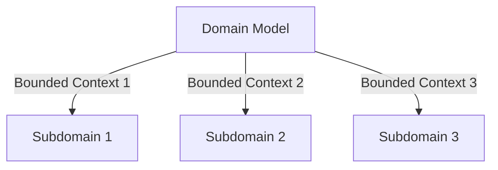

## 5.10.1 Domain-Driven Design Principles

Domain-Driven Design (DDD) is a strategic approach to software development that emphasizes collaboration between technical and domain experts to create a model that accurately reflects the business domain. This section delves into the core principles of DDD and how they can be effectively implemented using JavaScript and TypeScript.

### Introduction

Domain-Driven Design is particularly useful in complex domains where business logic and rules are intricate and require a deep understanding of the domain itself. By focusing on the core domain and its logic, DDD helps in creating software that is both flexible and aligned with business needs.

### Key Patterns in DDD

#### Entities

Entities are objects that have a distinct identity that runs through time and different states. This identity is often represented by a unique identifier.

```typescript
class User {
  constructor(private id: string, private name: string) {}

  getId(): string {
    return this.id;
  }

  getName(): string {
    return this.name;
  }

  changeName(newName: string): void {
    this.name = newName;
  }
}
```

#### Value Objects

Value objects are immutable and are defined by their attributes rather than a unique identity. They are often used to represent descriptive aspects of the domain.

```typescript
class Address {
  constructor(private street: string, private city: string, private zipCode: string) {}

  equals(other: Address): boolean {
    return this.street === other.street && this.city === other.city && this.zipCode === other.zipCode;
  }
}
```

#### Aggregates

Aggregates are clusters of objects that are treated as a single unit. Each aggregate has a root entity, known as the aggregate root, which is the only member of the aggregate that external objects can hold references to.

```typescript
class Order {
  private items: OrderItem[] = [];

  constructor(private id: string, private customerId: string) {}

  addItem(item: OrderItem): void {
    this.items.push(item);
  }

  getItems(): OrderItem[] {
    return [...this.items];
  }
}
```

#### Repositories

Repositories provide a way to access aggregates. They act as a collection of aggregates, offering methods to add, remove, and retrieve them.

```typescript
class OrderRepository {
  private orders: Map<string, Order> = new Map();

  save(order: Order): void {
    this.orders.set(order.getId(), order);
  }

  findById(orderId: string): Order | undefined {
    return this.orders.get(orderId);
  }
}
```

#### Services

Services are used for operations that do not naturally fit within entities or value objects. They often encapsulate domain logic that spans multiple entities.

```typescript
class OrderService {
  constructor(private orderRepository: OrderRepository) {}

  placeOrder(order: Order): void {
    // Business logic for placing an order
    this.orderRepository.save(order);
  }
}
```

### Implementation Steps

#### Model the Domain

Collaborate closely with domain experts to create a model that accurately reflects the business. This involves understanding the core domain and subdomains, and identifying key entities, value objects, and aggregates.

#### Define Bounded Contexts

A bounded context defines the scope within which a particular model is applicable. It helps in managing the complexity of large systems by breaking them down into smaller, more manageable parts.



### Best Practices

- **Use Ubiquitous Language:** Ensure that the language used in the code reflects the language of the domain experts. This helps in maintaining consistency and clarity.
- **Isolate the Domain Model:** Keep the domain model free from technical concerns such as database access or user interface logic. This separation ensures that the domain logic remains pure and focused.

### Use Cases

DDD is particularly suitable for domains with complex logic and rules, such as finance, healthcare, and logistics. It helps in managing complexity by focusing on the core domain and its intricacies.

### Considerations

Implementing DDD requires a significant investment in continuous collaboration with stakeholders. It is essential to maintain ongoing communication with domain experts to ensure that the model remains aligned with business needs.

### Conclusion

Domain-Driven Design offers a powerful approach to building complex software systems by aligning the software model with the business domain. By understanding and applying the key patterns of DDD, developers can create systems that are both flexible and closely aligned with business objectives.

## Quiz Time!



### What is the primary purpose of Domain-Driven Design?

- [x] To align software models with business domains
- [ ] To improve database performance
- [ ] To enhance user interface design
- [ ] To simplify network communication

> **Explanation:** Domain-Driven Design focuses on aligning software models with business domains to ensure that the software accurately reflects the business logic and rules.

### Which of the following is a key characteristic of an entity in DDD?

- [x] Unique identity
- [ ] Immutable attributes
- [ ] Defined by attributes
- [ ] Stateless operations

> **Explanation:** Entities have a unique identity that distinguishes them from other objects, even if their attributes are the same.

### What defines a value object in DDD?

- [x] Immutable and defined by attributes
- [ ] Unique identity
- [ ] Mutable state
- [ ] Stateless operations

> **Explanation:** Value objects are immutable and defined by their attributes rather than a unique identity.

### What is the role of a repository in DDD?

- [x] To provide access to aggregates
- [ ] To manage user sessions
- [ ] To handle network requests
- [ ] To render user interfaces

> **Explanation:** Repositories provide access to aggregates, acting as a collection of aggregates with methods to add, remove, and retrieve them.

### What is a bounded context in DDD?

- [x] A defined scope where a particular model is applicable
- [ ] A database schema
- [ ] A user interface component
- [ ] A network protocol

> **Explanation:** A bounded context defines the scope within which a particular model is applicable, helping manage complexity by breaking down large systems.

### Which pattern is used for operations that do not fit into entities or value objects?

- [x] Services
- [ ] Repositories
- [ ] Aggregates
- [ ] Value Objects

> **Explanation:** Services are used for operations that do not naturally fit within entities or value objects, often encapsulating domain logic that spans multiple entities.

### What is a key benefit of using ubiquitous language in DDD?

- [x] Consistency and clarity in communication
- [ ] Faster database queries
- [ ] Improved network performance
- [ ] Enhanced user interface design

> **Explanation:** Ubiquitous language ensures consistency and clarity in communication between developers and domain experts, aligning the code with the domain language.

### Why is it important to isolate the domain model from technical concerns?

- [x] To keep the domain logic pure and focused
- [ ] To improve user interface responsiveness
- [ ] To enhance network security
- [ ] To simplify database queries

> **Explanation:** Isolating the domain model from technical concerns ensures that the domain logic remains pure and focused, free from distractions like database access or UI logic.

### In which domains is DDD particularly suitable?

- [x] Domains with complex logic and rules
- [ ] Simple CRUD applications
- [ ] Static websites
- [ ] Single-page applications

> **Explanation:** DDD is particularly suitable for domains with complex logic and rules, such as finance, healthcare, and logistics.

### True or False: DDD requires continuous collaboration with stakeholders.

- [x] True
- [ ] False

> **Explanation:** Continuous collaboration with stakeholders is essential in DDD to ensure that the model remains aligned with business needs and accurately reflects the domain.


