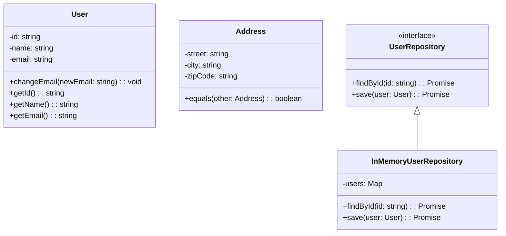

---

linkTitle: "5.10.2 Implementing DDD in JavaScript and TypeScript"
title: "Implementing Domain-Driven Design (DDD) in JavaScript and TypeScript"
description: "Explore how to implement Domain-Driven Design (DDD) using JavaScript and TypeScript, leveraging TypeScript features for robust domain models."
categories:
- Software Architecture
- Design Patterns
- JavaScript
tags:
- Domain-Driven Design
- TypeScript
- JavaScript
- Software Development
- Architectural Patterns
date: 2024-10-25
type: docs
nav_weight: 6020

canonical: "https://softwarepatternslexicon.com/patterns-js/5/10/2"
license: "© 2024 Tokenizer Inc. CC BY-NC-SA 4.0"
---

## 5.10.2 Implementing Domain-Driven Design (DDD) in JavaScript and TypeScript

Domain-Driven Design (DDD) is a strategic approach to software development that emphasizes collaboration between technical and domain experts to create software that reflects the complexities of the business domain. Implementing DDD in JavaScript and TypeScript involves leveraging the strengths of these languages to create robust, maintainable, and scalable domain models.

### Introduction to Domain-Driven Design (DDD)

DDD focuses on creating a shared understanding of the domain through a ubiquitous language and modeling the domain's core concepts directly in the code. It involves structuring the codebase around the domain model, which consists of entities, value objects, aggregates, repositories, and services.

### Leveraging TypeScript Features

TypeScript, with its strong typing and object-oriented features, is well-suited for implementing DDD. Here are some key TypeScript features that facilitate DDD:

- **Interfaces and Types:** Define clear contracts for domain entities and value objects.
- **Classes:** Encapsulate data and behavior in domain entities.
- **Modules and Namespaces:** Organize code into bounded contexts.
- **Immutability:** Use readonly properties and immutability patterns to ensure domain integrity.

### Implementation Steps

#### 1. Create Domain Entities

Domain entities are objects that have a distinct identity and lifecycle. They encapsulate both data and behavior. In TypeScript, entities can be implemented using classes.

```typescript
class User {
    private id: string;
    private name: string;
    private email: string;

    constructor(id: string, name: string, email: string) {
        this.id = id;
        this.name = name;
        this.email = email;
    }

    public changeEmail(newEmail: string): void {
        // Business logic for changing email
        this.email = newEmail;
    }

    public getId(): string {
        return this.id;
    }

    public getName(): string {
        return this.name;
    }

    public getEmail(): string {
        return this.email;
    }
}
```

#### 2. Define Value Objects

Value objects are immutable and represent descriptive aspects of the domain. They do not have an identity and are defined by their attributes.

```typescript
class Address {
    private readonly street: string;
    private readonly city: string;
    private readonly zipCode: string;

    constructor(street: string, city: string, zipCode: string) {
        this.street = street;
        this.city = city;
        this.zipCode = zipCode;
    }

    public equals(other: Address): boolean {
        return this.street === other.street &&
               this.city === other.city &&
               this.zipCode === other.zipCode;
    }
}
```

#### 3. Implement Repositories

Repositories abstract the data persistence layer, providing methods to access and manipulate domain entities.

```typescript
interface UserRepository {
    findById(id: string): Promise<User | null>;
    save(user: User): Promise<void>;
}

class InMemoryUserRepository implements UserRepository {
    private users: Map<string, User> = new Map();

    async findById(id: string): Promise<User | null> {
        return this.users.get(id) || null;
    }

    async save(user: User): Promise<void> {
        this.users.set(user.getId(), user);
    }
}
```

### Best Practices

- **Keep Domain Logic Pure:** Avoid direct dependencies on external libraries within the domain model to ensure it remains focused and maintainable.
- **Use Modules and Namespaces:** Organize your code into bounded contexts to reflect different areas of the domain.
- **Enforce Immutability and Type Safety:** Use TypeScript's readonly properties and immutability patterns to maintain domain integrity.

### Tools and Libraries

Consider using frameworks like **NestJS** that support DDD patterns and provide a structured way to build scalable applications. NestJS offers decorators and modules that align well with DDD principles.

### Considerations

- **Bounded Contexts:** Clearly define bounded contexts to manage complexity and ensure that each part of the domain is well understood.
- **Ubiquitous Language:** Develop a shared language between developers and domain experts to ensure clarity and consistency.
- **Event Sourcing and CQRS:** Consider these patterns for complex domains where tracking state changes and separating read/write operations are beneficial.

### Visual Aids

#### Domain Model Diagram



### Conclusion

Implementing Domain-Driven Design in JavaScript and TypeScript allows developers to create software that accurately reflects the business domain. By leveraging TypeScript's features, adhering to best practices, and utilizing appropriate tools and libraries, you can build robust and maintainable domain models.

## Quiz Time!



### What is the primary focus of Domain-Driven Design (DDD)?

- [x] Creating a shared understanding of the domain through a ubiquitous language
- [ ] Optimizing code for performance
- [ ] Reducing the number of lines of code
- [ ] Implementing microservices architecture

> **Explanation:** DDD focuses on creating a shared understanding of the domain through a ubiquitous language and modeling the domain's core concepts directly in the code.

### Which TypeScript feature is NOT typically used in DDD?

- [ ] Interfaces
- [ ] Classes
- [ ] Modules
- [x] Promises

> **Explanation:** While Promises are useful in JavaScript/TypeScript, they are not directly related to DDD, which focuses more on domain modeling using interfaces, classes, and modules.

### What is a key characteristic of value objects in DDD?

- [x] They are immutable
- [ ] They have a unique identity
- [ ] They are mutable
- [ ] They manage database connections

> **Explanation:** Value objects are immutable and represent descriptive aspects of the domain without a unique identity.

### What is the role of a repository in DDD?

- [x] Abstracting data persistence details
- [ ] Managing user authentication
- [ ] Handling HTTP requests
- [ ] Rendering UI components

> **Explanation:** Repositories abstract the data persistence layer, providing methods to access and manipulate domain entities.

### Which framework is recommended for supporting DDD patterns in JavaScript/TypeScript?

- [x] NestJS
- [ ] React
- [ ] Angular
- [ ] Vue.js

> **Explanation:** NestJS is a framework that supports DDD patterns and provides a structured way to build scalable applications.

### What is a bounded context in DDD?

- [x] A boundary within which a particular model is defined and applicable
- [ ] A database schema
- [ ] A UI component
- [ ] A network protocol

> **Explanation:** A bounded context is a boundary within which a particular model is defined and applicable, helping to manage complexity in DDD.

### Why is immutability important in DDD?

- [x] To maintain domain integrity
- [ ] To increase code execution speed
- [ ] To reduce memory usage
- [ ] To simplify UI rendering

> **Explanation:** Immutability is important in DDD to maintain domain integrity by ensuring that value objects do not change state once created.

### What is the purpose of using a ubiquitous language in DDD?

- [x] To ensure clarity and consistency between developers and domain experts
- [ ] To optimize database queries
- [ ] To enhance UI design
- [ ] To reduce server load

> **Explanation:** A ubiquitous language ensures clarity and consistency between developers and domain experts, facilitating better communication and understanding.

### Which of the following is NOT a component of a domain model in DDD?

- [ ] Entities
- [ ] Value Objects
- [ ] Repositories
- [x] CSS Stylesheets

> **Explanation:** CSS Stylesheets are not part of a domain model in DDD, which typically includes entities, value objects, and repositories.

### True or False: In DDD, domain logic should avoid direct dependencies on external libraries.

- [x] True
- [ ] False

> **Explanation:** True. Keeping domain logic pure and avoiding direct dependencies on external libraries ensures the domain model remains focused and maintainable.


