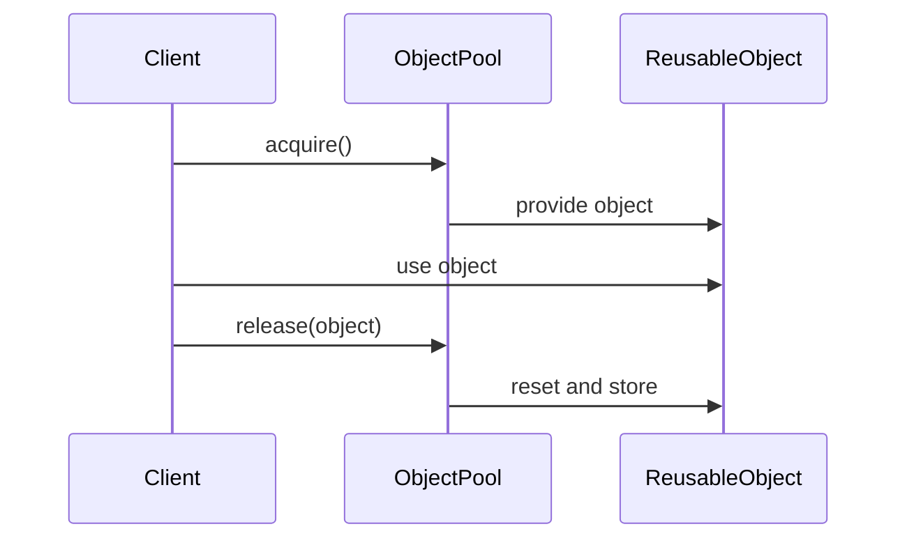

## 5.10 Object Pool Pattern

The Object Pool Pattern is a creational design pattern that focuses on the reuse of objects that are expensive to create. By maintaining a pool of reusable objects, this pattern can significantly enhance performance, especially in resource-constrained environments. In this section, we'll delve into the intricacies of the Object Pool Pattern, explore its implementation in JavaScript, and discuss scenarios where it can be particularly beneficial.

### Intent

The primary intent of the Object Pool Pattern is to manage a set of initialized objects ready for use, rather than creating and destroying them on demand. This approach is particularly useful when the cost of initializing a class instance is high, and the rate of instantiation is frequent.

### Key Participants

1. **Object Pool**: Manages the pool of reusable objects. It handles the allocation and deallocation of objects.
2. **Client**: Requests objects from the pool and returns them when no longer needed.
3. **Reusable Object**: The object that is being managed by the pool.

### Applicability

- **High Cost of Object Creation**: When the cost of creating an object is high due to resource allocation, complex initialization, or other factors.
- **Frequent Instantiation**: When objects are frequently created and destroyed, leading to performance bottlenecks.
- **Resource Constraints**: In environments where resources are limited, and efficient management is crucial.

### Sample Code Snippet

Let's explore a basic implementation of the Object Pool Pattern in JavaScript:

```javascript
class ObjectPool {
  constructor(createFn, size = 10) {
    this.createFn = createFn;
    this.size = size;
    this.pool = [];
    this.initializePool();
  }

  initializePool() {
    for (let i = 0; i < this.size; i++) {
      this.pool.push(this.createFn());
    }
  }

  acquire() {
    if (this.pool.length === 0) {
      console.warn('No objects available in the pool. Consider increasing the pool size.');
      return null;
    }
    return this.pool.pop();
  }

  release(obj) {
    this.pool.push(obj);
  }
}

// Example usage
const createObject = () => ({ /* object properties */ });
const pool = new ObjectPool(createObject, 5);

const obj1 = pool.acquire();
const obj2 = pool.acquire();

pool.release(obj1);
pool.release(obj2);
```

### Design Considerations

- **Thread Safety**: In environments like Node.js with worker threads, ensure that the pool is thread-safe to prevent race conditions.
- **Pool Size Management**: Carefully manage the pool size to balance between resource utilization and availability.
- **Object State Reset**: Ensure that objects are reset to a clean state before being reused to prevent data leakage or corruption.

### JavaScript Unique Features

JavaScript's asynchronous nature and event-driven architecture make it well-suited for implementing the Object Pool Pattern. However, care must be taken to manage concurrency, especially in server-side environments like Node.js.

### Differences and Similarities

The Object Pool Pattern is often confused with the Flyweight Pattern. While both aim to reduce memory usage, the Flyweight Pattern focuses on sharing immutable data, whereas the Object Pool Pattern manages a pool of reusable objects.

### Visualizing the Object Pool Pattern

To better understand the Object Pool Pattern, let's visualize the interaction between the client, the pool, and the reusable objects.



**Diagram Description**: This sequence diagram illustrates the interaction between the client, the object pool, and the reusable object. The client acquires an object from the pool, uses it, and then releases it back to the pool.

### Try It Yourself

Experiment with the object pool implementation by modifying the pool size or the object creation function. Observe how changes affect performance and resource utilization.

### Resource Management and Performance Enhancement

The Object Pool Pattern excels in scenarios where resource management is critical. By reusing objects, it reduces the overhead of frequent object creation and destruction, leading to improved performance and reduced memory usage.

### Potential Drawbacks

- **Increased Complexity**: Managing an object pool adds complexity to the codebase, which may not be justified for simple applications.
- **Memory Overhead**: Maintaining a pool of objects can lead to increased memory usage if not managed properly.

### Knowledge Check

To reinforce your understanding of the Object Pool Pattern, consider the following questions:

1. What are the key benefits of using the Object Pool Pattern?
2. How does the Object Pool Pattern differ from the Flyweight Pattern?
3. In what scenarios is the Object Pool Pattern most beneficial?
4. What considerations should be made for thread safety in Node.js?
5. How can the pool size affect performance and resource utilization?

### Embrace the Journey

Remember, mastering design patterns like the Object Pool Pattern is just the beginning. As you continue to explore and experiment, you'll uncover more ways to optimize and enhance your JavaScript applications. Stay curious and enjoy the journey!

### References and Links

- [MDN Web Docs: JavaScript](https://developer.mozilla.org/en-US/docs/Web/JavaScript)
- [JavaScript Design Patterns](https://addyosmani.com/resources/essentialjsdesignpatterns/book/)
- [Node.js Documentation](https://nodejs.org/en/docs/)

## Test Your Knowledge on the Object Pool Pattern in JavaScript



### What is the primary intent of the Object Pool Pattern?

- [x] To manage a set of initialized objects ready for use
- [ ] To create objects on demand
- [ ] To share immutable data
- [ ] To reduce memory usage by sharing objects

> **Explanation:** The Object Pool Pattern manages a set of initialized objects ready for use, reducing the overhead of frequent object creation.

### Which of the following is a key participant in the Object Pool Pattern?

- [x] Object Pool
- [ ] Singleton
- [ ] Adapter
- [ ] Decorator

> **Explanation:** The Object Pool is a key participant that manages the pool of reusable objects.

### In which scenario is the Object Pool Pattern most beneficial?

- [x] When the cost of creating an object is high
- [ ] When objects are immutable
- [ ] When memory usage needs to be minimized
- [ ] When objects are rarely used

> **Explanation:** The Object Pool Pattern is beneficial when the cost of creating an object is high and frequent instantiation occurs.

### What is a potential drawback of the Object Pool Pattern?

- [x] Increased complexity
- [ ] Reduced performance
- [ ] Increased memory usage
- [ ] Lack of thread safety

> **Explanation:** Managing an object pool adds complexity to the codebase, which may not be justified for simple applications.

### How does the Object Pool Pattern differ from the Flyweight Pattern?

- [x] Object Pool manages reusable objects, Flyweight shares immutable data
- [ ] Object Pool shares immutable data, Flyweight manages reusable objects
- [ ] Both patterns manage reusable objects
- [ ] Both patterns share immutable data

> **Explanation:** The Object Pool Pattern manages a pool of reusable objects, while the Flyweight Pattern focuses on sharing immutable data.

### What should be considered for thread safety in Node.js?

- [x] Preventing race conditions
- [ ] Reducing memory usage
- [ ] Sharing objects between threads
- [ ] Minimizing object creation

> **Explanation:** In Node.js, ensuring thread safety involves preventing race conditions when accessing shared resources.

### What is a key benefit of using the Object Pool Pattern?

- [x] Improved performance
- [ ] Reduced code complexity
- [ ] Increased memory usage
- [ ] Simplified object creation

> **Explanation:** The Object Pool Pattern improves performance by reducing the overhead of frequent object creation and destruction.

### What is the role of the client in the Object Pool Pattern?

- [x] To request and return objects from the pool
- [ ] To manage the pool of objects
- [ ] To create new objects
- [ ] To share objects between clients

> **Explanation:** The client requests objects from the pool and returns them when no longer needed.

### How can the pool size affect performance?

- [x] A larger pool size can improve availability but increase memory usage
- [ ] A smaller pool size always improves performance
- [ ] Pool size does not affect performance
- [ ] A larger pool size reduces memory usage

> **Explanation:** A larger pool size can improve object availability but may lead to increased memory usage.

### True or False: The Object Pool Pattern is only applicable in server-side environments.

- [ ] True
- [x] False

> **Explanation:** The Object Pool Pattern can be applied in both client-side and server-side environments where object reuse is beneficial.




