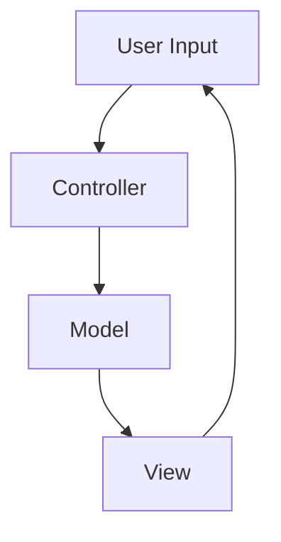

## 5.2.1 MVC Pattern

The Model-View-Controller (MVC) pattern is a foundational architectural pattern that separates an application into three interconnected components. This separation helps manage complex applications by dividing the responsibilities among different components, promoting organized and maintainable code.

### Understand the Components

The MVC pattern consists of three primary components:

- **Model:** 
  - Manages the data and business logic of the application.
  - Responsible for retrieving data from a database or an API, processing it, and notifying the View of any changes.
  
- **View:** 
  - Handles the display of information to the user.
  - Renders the data from the Model and sends user actions to the Controller.
  
- **Controller:** 
  - Acts as an intermediary between the Model and the View.
  - Processes user input, updates the Model, and selects the appropriate View for rendering.

### Implementation Steps

Implementing the MVC pattern involves several steps:

1. **Design the Model:**
   - Define the data structures and business rules.
   - Implement methods to retrieve, update, and manipulate data.
   
   ```typescript
   class UserModel {
       private users: Array<{ id: number, name: string }> = [];
       
       addUser(user: { id: number, name: string }) {
           this.users.push(user);
       }
       
       getUsers() {
           return this.users;
       }
   }
   ```

2. **Create the View:**
   - Develop UI components to display data from the Model.
   - Ensure that the View is passive and does not alter the Model directly.
   
   ```typescript
   class UserView {
       render(users: Array<{ id: number, name: string }>) {
           users.forEach(user => {
               console.log(`User: ${user.name}`);
           });
       }
   }
   ```

3. **Develop the Controller:**
   - Implement logic to handle user input and update the Model and View.
   
   ```typescript
   class UserController {
       private model: UserModel;
       private view: UserView;
       
       constructor(model: UserModel, view: UserView) {
           this.model = model;
           this.view = view;
       }
       
       addUser(user: { id: number, name: string }) {
           this.model.addUser(user);
           this.view.render(this.model.getUsers());
       }
   }
   ```

### Best Practices

- **Keep Controllers Thin:** 
  - Place business logic in the Model to ensure Controllers remain lightweight and focused on handling input and coordinating between the Model and View.
  
- **Ensure Views are Passive:** 
  - Views should not alter the Model directly. They should only display data and send user actions to the Controller.
  
- **Decouple Components:** 
  - Use interfaces or abstract classes to decouple the components, making it easier to test and maintain the application.

### Use Cases

The MVC pattern is particularly beneficial in web applications where a clear separation between the user interface and business logic is needed. It is commonly used in frameworks like Angular, React (with Redux), and Vue.js.

### Considerations

- **Managing Dependencies:** 
  - As applications grow, managing dependencies between components can become complex. Use dependency injection and service locators to manage these dependencies effectively.
  
- **Prevent Tight Coupling:** 
  - Proper organization and adherence to the MVC principles are essential to prevent the components from becoming tightly coupled, which can lead to maintenance challenges.

### Visual Representation

Below is a conceptual diagram illustrating the interactions between the Model, View, and Controller:



### Advanced Topics

- **Integration with Domain-Driven Design (DDD):** 
  - MVC can be integrated with DDD by using domain models within the Model component to encapsulate business logic and rules.
  
- **Event Sourcing:** 
  - Implement event sourcing within the Model to track changes and maintain a history of state changes.

### Conclusion

The MVC pattern is a powerful architectural pattern that promotes organized and maintainable code by separating concerns within an application. By understanding and implementing the MVC pattern, developers can build scalable and efficient web applications in JavaScript and TypeScript.

## Quiz Time!



### What is the primary role of the Model in the MVC pattern?

- [x] Manages data and business logic
- [ ] Handles the display of information
- [ ] Processes user input
- [ ] Manages user interface components

> **Explanation:** The Model is responsible for managing the data and business logic of the application.

### Which component in the MVC pattern is responsible for rendering data to the user?

- [ ] Model
- [x] View
- [ ] Controller
- [ ] Database

> **Explanation:** The View is responsible for rendering data from the Model to the user.

### What is the main responsibility of the Controller in the MVC pattern?

- [ ] Storing data
- [x] Processing user input and interacting with Model and View
- [ ] Displaying data
- [ ] Managing database connections

> **Explanation:** The Controller processes user input and coordinates interactions between the Model and the View.

### In the MVC pattern, which component should contain the business logic?

- [x] Model
- [ ] View
- [ ] Controller
- [ ] Database

> **Explanation:** The Model should contain the business logic to ensure separation of concerns.

### What is a key benefit of using the MVC pattern in web applications?

- [x] Clear separation between user interface and logic
- [ ] Faster database queries
- [ ] Reduced code complexity
- [ ] Improved graphics rendering

> **Explanation:** The MVC pattern provides a clear separation between the user interface and business logic, making the application more organized and maintainable.

### Which of the following is a best practice when implementing the MVC pattern?

- [x] Keep Controllers thin and place business logic in the Model
- [ ] Allow Views to directly alter the Model
- [ ] Use Controllers to manage data storage
- [ ] Combine Model and View into a single component

> **Explanation:** Keeping Controllers thin and placing business logic in the Model is a best practice to maintain separation of concerns.

### What can be a potential challenge when using the MVC pattern in large applications?

- [ ] Faster development time
- [x] Managing dependencies between components
- [ ] Improved performance
- [ ] Easier debugging

> **Explanation:** Managing dependencies between components can become complex in large applications using the MVC pattern.

### How can the MVC pattern be integrated with Domain-Driven Design (DDD)?

- [x] By using domain models within the Model component
- [ ] By combining the View and Controller
- [ ] By eliminating the Model component
- [ ] By using the View to manage business logic

> **Explanation:** Integrating domain models within the Model component allows MVC to work with Domain-Driven Design principles.

### What is the purpose of using interfaces or abstract classes in the MVC pattern?

- [x] To decouple components and facilitate testing
- [ ] To increase code complexity
- [ ] To combine Model and View
- [ ] To simplify database queries

> **Explanation:** Using interfaces or abstract classes helps decouple components, making the application easier to test and maintain.

### True or False: In the MVC pattern, the View should directly update the Model.

- [ ] True
- [x] False

> **Explanation:** The View should not directly update the Model; it should only display data and send user actions to the Controller.


