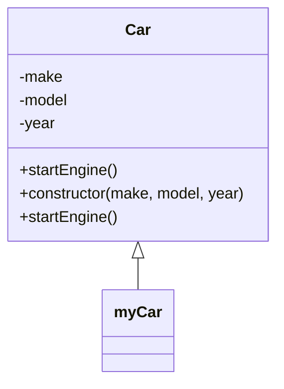

## 5.2 Constructor Pattern

The Constructor Pattern is a fundamental creational design pattern in JavaScript that provides a blueprint for creating objects. It leverages constructor functions or ES6 classes to initialize new objects and set up shared properties and methods. This pattern is essential for developers aiming to master object-oriented programming (OOP) in JavaScript.

### Understanding the Constructor Pattern

The Constructor Pattern is used to create instances of objects with similar properties and methods. It is particularly useful when you need to create multiple objects with the same structure but different values. In JavaScript, this pattern can be implemented using constructor functions or ES6 classes.

#### Constructor Functions

A constructor function is a regular function that is used with the `new` keyword to create an object. By convention, constructor function names are capitalized to distinguish them from regular functions.

```javascript
// Constructor function example
function Car(make, model, year) {
  this.make = make;
  this.model = model;
  this.year = year;
}

// Creating an instance of Car
const myCar = new Car('Toyota', 'Corolla', 2020);

console.log(myCar.make); // Output: Toyota
```

In this example, the `Car` function is a constructor that initializes a new object with `make`, `model`, and `year` properties.

#### ES6 Classes

ES6 introduced a more intuitive syntax for creating constructor functions through classes. Although classes in JavaScript are syntactic sugar over the existing prototype-based inheritance, they provide a clearer and more concise way to define constructors and methods.

```javascript
// ES6 class example
class Car {
  constructor(make, model, year) {
    this.make = make;
    this.model = model;
    this.year = year;
  }
}

// Creating an instance of Car
const myCar = new Car('Honda', 'Civic', 2021);

console.log(myCar.model); // Output: Civic
```

The `Car` class in this example serves the same purpose as the constructor function but with a more modern syntax.

### Prototypes and Method Sharing

One of the key advantages of using the Constructor Pattern is the ability to share methods between instances using prototypes. In JavaScript, every function has a `prototype` property that can be used to add methods that are shared across all instances.

```javascript
// Adding a method to the prototype
Car.prototype.startEngine = function() {
  console.log(`${this.make} ${this.model} engine started.`);
};

myCar.startEngine(); // Output: Honda Civic engine started.
```

By adding the `startEngine` method to the `Car` prototype, all instances of `Car` can access this method without duplicating it for each instance.

### Best Practices for Constructor Pattern

1. **Capitalize Constructor Function Names**: Always capitalize the names of constructor functions to distinguish them from regular functions.
2. **Use `new` Keyword**: Ensure that constructor functions are called with the `new` keyword to avoid unexpected behavior.
3. **Define Methods on Prototypes**: To save memory and improve performance, define methods on the constructor's prototype rather than within the constructor itself.
4. **Use ES6 Classes for Clarity**: Prefer ES6 classes for a more readable and maintainable codebase, especially in modern JavaScript environments.

### Comparing with Object Literals and Factory Functions

The Constructor Pattern is not the only way to create objects in JavaScript. Let's compare it with object literals and factory functions.

#### Object Literals

Object literals are the simplest way to create objects in JavaScript. They are best suited for creating single-use objects or when you don't need to create multiple instances with the same structure.

```javascript
// Object literal example
const car = {
  make: 'Ford',
  model: 'Mustang',
  year: 1969
};

console.log(car.make); // Output: Ford
```

#### Factory Functions

Factory functions are functions that return new objects. They provide more flexibility than constructor functions and can be used to create objects without the `new` keyword.

```javascript
// Factory function example
function createCar(make, model, year) {
  return {
    make,
    model,
    year,
    startEngine() {
      console.log(`${make} ${model} engine started.`);
    }
  };
}

const myCar = createCar('Chevrolet', 'Impala', 1967);
myCar.startEngine(); // Output: Chevrolet Impala engine started.
```

Factory functions are useful when you need to create objects with complex initialization logic or when you want to avoid using the `new` keyword.

### Design Considerations

- **When to Use**: Use the Constructor Pattern when you need to create multiple instances of an object with the same structure and shared methods.
- **Avoiding Pitfalls**: Always use the `new` keyword with constructor functions to ensure that `this` refers to the new object being created.
- **JavaScript Unique Features**: JavaScript's prototype-based inheritance allows for efficient method sharing, making the Constructor Pattern a powerful tool for object creation.

### Visualizing the Constructor Pattern

To better understand how the Constructor Pattern works, let's visualize the relationship between constructor functions, instances, and prototypes.



In this diagram, `Car` is the constructor class with properties and methods. `myCar` is an instance of `Car`, inheriting its properties and methods.

### Try It Yourself

Experiment with the following code examples to deepen your understanding of the Constructor Pattern:

1. Modify the `Car` class to include a method that calculates the car's age based on the current year.
2. Create a new constructor function or class for a different type of object, such as `Book` or `Person`.
3. Use prototypes to add shared methods to your new constructor function or class.

### Knowledge Check

To reinforce your understanding of the Constructor Pattern, try answering the following questions:

## Constructor Pattern Quiz: Test Your Knowledge



### What is the primary purpose of the Constructor Pattern in JavaScript?

- [x] To create objects with shared properties and methods
- [ ] To manage asynchronous operations
- [ ] To handle errors in JavaScript applications
- [ ] To optimize performance in web applications

> **Explanation:** The Constructor Pattern is used to create objects with shared properties and methods, making it a fundamental part of object-oriented programming in JavaScript.

### How do you define a constructor function in JavaScript?

- [x] By creating a regular function with a capitalized name
- [ ] By using the `function` keyword followed by a lowercase name
- [ ] By using the `class` keyword
- [ ] By using an arrow function

> **Explanation:** Constructor functions are defined using the `function` keyword and are typically capitalized to distinguish them from regular functions.

### What keyword is used to create an instance of a constructor function?

- [x] new
- [ ] create
- [ ] instance
- [ ] this

> **Explanation:** The `new` keyword is used to create an instance of a constructor function, ensuring that `this` refers to the new object being created.

### Which of the following is a benefit of using prototypes in the Constructor Pattern?

- [x] Reduces memory usage by sharing methods between instances
- [ ] Increases the complexity of the code
- [ ] Makes it harder to debug
- [ ] Requires more lines of code

> **Explanation:** Using prototypes allows methods to be shared between instances, reducing memory usage and improving performance.

### What is the advantage of using ES6 classes over constructor functions?

- [x] More readable and maintainable syntax
- [ ] Better performance
- [ ] More features
- [ ] Easier to debug

> **Explanation:** ES6 classes provide a more readable and maintainable syntax for defining constructors and methods, making them preferable in modern JavaScript development.

### How can you add a method to a constructor's prototype?

- [x] By using the `prototype` property of the constructor function
- [ ] By defining the method inside the constructor function
- [ ] By using the `class` keyword
- [ ] By using an arrow function

> **Explanation:** Methods can be added to a constructor's prototype using the `prototype` property, allowing them to be shared across all instances.

### What is a common convention when naming constructor functions?

- [x] Capitalize the first letter of the function name
- [ ] Use lowercase letters for the function name
- [ ] Use underscores between words
- [ ] Use camelCase for the function name

> **Explanation:** Constructor functions are typically capitalized to distinguish them from regular functions and indicate their purpose.

### Which of the following is NOT a way to create objects in JavaScript?

- [ ] Object literals
- [ ] Factory functions
- [ ] Constructor functions
- [x] Asynchronous functions

> **Explanation:** Asynchronous functions are not used for creating objects. Object literals, factory functions, and constructor functions are common methods for object creation.

### True or False: The `new` keyword is optional when using constructor functions.

- [ ] True
- [x] False

> **Explanation:** The `new` keyword is necessary when using constructor functions to ensure that `this` refers to the new object being created.

### What is the main difference between factory functions and constructor functions?

- [x] Factory functions do not require the `new` keyword
- [ ] Factory functions are faster
- [ ] Factory functions use prototypes
- [ ] Factory functions are only used in ES6

> **Explanation:** Factory functions do not require the `new` keyword and can return objects directly, providing more flexibility in object creation.



### Conclusion

The Constructor Pattern is a powerful tool in JavaScript for creating objects with shared properties and methods. By understanding how to use constructor functions, ES6 classes, and prototypes, you can create efficient and maintainable code. Remember to experiment with the examples provided and apply best practices to master this essential pattern. Keep exploring, stay curious, and enjoy the journey of mastering JavaScript design patterns!
