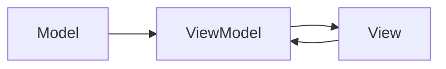

## 5.3.1 MVVM Pattern

The Model-View-ViewModel (MVVM) pattern is a powerful architectural pattern used to separate the development of the graphical user interface from the business logic in applications. It is particularly popular in applications with complex data presentation and user interactions, such as single-page applications (SPAs) built with frameworks like Angular, React, and Vue.js. This article delves into the components of the MVVM pattern, its implementation in JavaScript and TypeScript, best practices, and use cases.

### Understand the Components

The MVVM pattern consists of three core components:

- **Model:** Represents the application's data and business logic. It is responsible for managing the data, including retrieving, storing, and processing it.

- **View:** The visual representation of the Model. It is the user interface that displays the data and captures user interactions.

- **ViewModel:** An abstraction of the View, handling presentation logic and state. It acts as an intermediary between the View and the Model, providing data to the View and responding to user actions.

Here's a conceptual diagram illustrating the interaction between these components:



### Implementation Steps

Implementing the MVVM pattern involves several steps:

#### 1. Define the Model

The Model is responsible for the application's data and business logic. In JavaScript or TypeScript, you can define the Model using classes or interfaces.

```typescript
class Product {
    constructor(public id: number, public name: string, public price: number) {}
}

class ProductService {
    private products: Product[] = [];

    addProduct(product: Product): void {
        this.products.push(product);
    }

    getProducts(): Product[] {
        return this.products;
    }
}
```

#### 2. Implement the ViewModel

The ViewModel binds the Model data and exposes it to the View. It includes commands and properties for View interaction, often using observables or reactive properties for automatic UI updates.

```typescript
import { observable, action } from 'mobx';

class ProductViewModel {
    @observable products: Product[] = [];
    private productService: ProductService;

    constructor(productService: ProductService) {
        this.productService = productService;
        this.loadProducts();
    }

    @action
    loadProducts(): void {
        this.products = this.productService.getProducts();
    }

    @action
    addProduct(product: Product): void {
        this.productService.addProduct(product);
        this.loadProducts();
    }
}
```

#### 3. Develop the View

The View uses data binding to connect UI elements to the ViewModel. In frameworks like React, Vue.js, or Angular, this is achieved through declarative syntax and binding mechanisms.

```jsx
// React Component Example
import React from 'react';
import { observer } from 'mobx-react';

const ProductListView = observer(({ viewModel }) => (
    <div>
        <h1>Product List</h1>
        <ul>
            {viewModel.products.map(product => (
                <li key={product.id}>{product.name} - ${product.price}</li>
            ))}
        </ul>
        <button onClick={() => viewModel.addProduct(new Product(3, 'New Product', 29.99))}>
            Add Product
        </button>
    </div>
));

export default ProductListView;
```

### Best Practices

- **Separation of Concerns:** Keep the ViewModel independent of the View technology (e.g., HTML, XML). This ensures that the ViewModel can be tested independently and reused across different Views.

- **Reactive Programming:** Use observables or reactive properties for automatic UI updates. Libraries like MobX or RxJS can facilitate this in JavaScript and TypeScript applications.

- **Decoupling:** Ensure that the ViewModel does not directly manipulate the View. Instead, it should expose data and commands that the View can bind to.

### Use Cases

The MVVM pattern is particularly useful in applications with complex data presentation and user interactions, such as:

- **Single-Page Applications (SPAs):** Frameworks like Angular, React, and Vue.js leverage MVVM principles to manage complex UI states and interactions.

- **Desktop Applications:** MVVM is widely used in desktop applications built with technologies like WPF (Windows Presentation Foundation).

- **Mobile Applications:** MVVM is applicable in mobile app development frameworks like Xamarin and Flutter.

### Considerations

While the MVVM pattern offers numerous benefits, there are some considerations to keep in mind:

- **Performance Overheads:** The data binding mechanisms used in MVVM can introduce performance overheads, especially in applications with a large number of UI elements or complex data structures. It's essential to optimize data binding and update strategies to mitigate this.

- **Complexity:** Implementing MVVM can add complexity to the application architecture, particularly for smaller projects. It's crucial to assess whether the benefits of MVVM justify its use in a given project.

### Conclusion

The MVVM pattern is a robust architectural pattern that promotes separation of concerns and enhances maintainability in applications with complex data presentation and user interactions. By understanding its components, implementation steps, and best practices, developers can effectively apply MVVM in JavaScript and TypeScript applications, leveraging modern frameworks and libraries to streamline development.

## Quiz Time!



### What is the primary role of the ViewModel in the MVVM pattern?

- [x] To act as an intermediary between the View and the Model
- [ ] To directly manipulate the View
- [ ] To store the application's data
- [ ] To define the user interface

> **Explanation:** The ViewModel acts as an intermediary between the View and the Model, handling presentation logic and state.

### Which component of the MVVM pattern is responsible for managing the application's data?

- [ ] View
- [ ] ViewModel
- [x] Model
- [ ] Controller

> **Explanation:** The Model is responsible for managing the application's data and business logic.

### In the MVVM pattern, what is the View responsible for?

- [ ] Managing data
- [x] Displaying the data and capturing user interactions
- [ ] Handling business logic
- [ ] Acting as an intermediary between the Model and the ViewModel

> **Explanation:** The View is responsible for displaying the data and capturing user interactions.

### What is a best practice when implementing the ViewModel in MVVM?

- [ ] Directly manipulate the View
- [x] Keep the ViewModel independent of the View technology
- [ ] Store all application data in the ViewModel
- [ ] Use synchronous data updates

> **Explanation:** Keeping the ViewModel independent of the View technology ensures it can be tested independently and reused across different Views.

### Which library can be used in JavaScript/TypeScript to facilitate reactive programming in MVVM?

- [ ] jQuery
- [x] MobX
- [ ] Bootstrap
- [ ] Lodash

> **Explanation:** MobX is a library that facilitates reactive programming, making it suitable for implementing MVVM in JavaScript/TypeScript.

### What is a potential drawback of using the MVVM pattern?

- [ ] It simplifies the architecture
- [x] It can introduce performance overheads
- [ ] It eliminates the need for data binding
- [ ] It reduces code reusability

> **Explanation:** The data binding mechanisms in MVVM can introduce performance overheads, especially in complex applications.

### In which type of applications is the MVVM pattern particularly useful?

- [ ] Command-line applications
- [ ] Static websites
- [x] Single-Page Applications (SPAs)
- [ ] Database management systems

> **Explanation:** The MVVM pattern is particularly useful in Single-Page Applications (SPAs) due to their complex data presentation and user interactions.

### What is the benefit of using observables in the ViewModel?

- [ ] They make the code more complex
- [x] They enable automatic UI updates
- [ ] They eliminate the need for a Model
- [ ] They simplify the View

> **Explanation:** Observables enable automatic UI updates, which is a key benefit in the MVVM pattern.

### How does the View interact with the ViewModel in MVVM?

- [ ] By directly manipulating the ViewModel
- [x] Through data binding
- [ ] By storing data in the ViewModel
- [ ] By executing business logic

> **Explanation:** The View interacts with the ViewModel through data binding, which connects UI elements to the ViewModel's data and commands.

### True or False: The MVVM pattern is only applicable to web applications.

- [ ] True
- [x] False

> **Explanation:** False. The MVVM pattern is applicable to various types of applications, including web, desktop, and mobile applications.


