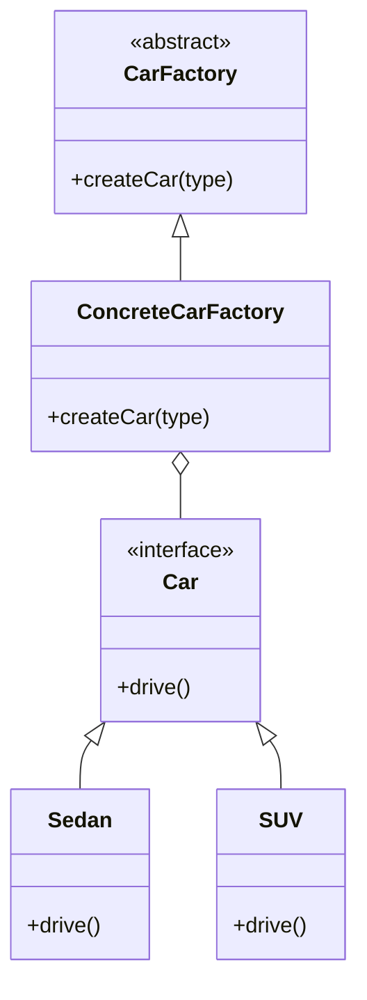

## 5.3 Factory Method Pattern

The Factory Method Pattern is a creational design pattern that provides an interface for creating objects in a superclass but allows subclasses to alter the type of objects that will be created. This pattern is particularly useful in scenarios where a class cannot anticipate the class of objects it must create or when a class wants its subclasses to specify the objects to be created.

### Intent

The primary intent of the Factory Method Pattern is to define an interface for creating an object, but let subclasses decide which class to instantiate. The Factory Method lets a class defer instantiation to subclasses, promoting loose coupling and enhancing flexibility in code design.

### Key Participants

- **Product**: Defines the interface of objects the factory method creates.
- **ConcreteProduct**: Implements the Product interface.
- **Creator**: Declares the factory method, which returns an object of type Product. It may also define a default implementation of the factory method that returns a default ConcreteProduct object.
- **ConcreteCreator**: Overrides the factory method to return an instance of a ConcreteProduct.

### Applicability

- When a class cannot anticipate the class of objects it must create.
- When a class wants its subclasses to specify the objects it creates.
- When classes delegate responsibility to one of several helper subclasses, and you want to localize the knowledge of which helper subclass is the delegate.

### Sample Code Snippet

Let's explore how to implement the Factory Method Pattern in JavaScript with a practical example.

```javascript
// Product Interface
class Car {
  constructor() {
    if (this.constructor === Car) {
      throw new Error("Cannot instantiate abstract class Car");
    }
  }

  drive() {
    throw new Error("Abstract method 'drive' must be implemented");
  }
}

// ConcreteProduct
class Sedan extends Car {
  drive() {
    console.log("Driving a sedan...");
  }
}

class SUV extends Car {
  drive() {
    console.log("Driving an SUV...");
  }
}

// Creator
class CarFactory {
  createCar(type) {
    throw new Error("Abstract method 'createCar' must be implemented");
  }
}

// ConcreteCreator
class ConcreteCarFactory extends CarFactory {
  createCar(type) {
    switch (type) {
      case "sedan":
        return new Sedan();
      case "suv":
        return new SUV();
      default:
        throw new Error("Unknown car type");
    }
  }
}

// Client code
const factory = new ConcreteCarFactory();
const sedan = factory.createCar("sedan");
sedan.drive(); // Output: Driving a sedan...

const suv = factory.createCar("suv");
suv.drive(); // Output: Driving an SUV...
```

### Design Considerations

- **Decoupling**: The Factory Method Pattern decouples the client code from the concrete classes it needs to instantiate, promoting flexibility and scalability.
- **Open/Closed Principle**: The pattern supports code that is open for extension but closed for modification. New product types can be added without altering existing code.
- **Single Responsibility Principle**: By delegating the responsibility of object creation to factory methods, classes adhere to the Single Responsibility Principle.

### JavaScript Unique Features

JavaScript's prototypal inheritance and dynamic typing make it particularly well-suited for implementing the Factory Method Pattern. JavaScript allows for flexible object creation and manipulation, which can be leveraged to create dynamic and adaptable factory methods.

### Differences and Similarities

The Factory Method Pattern is often confused with the Abstract Factory Pattern. While both patterns deal with object creation, the Factory Method Pattern focuses on creating a single product, whereas the Abstract Factory Pattern deals with creating families of related or dependent objects.

### Real-World Scenarios

- **UI Components**: In a UI library, different types of buttons, text fields, and other components can be created using factory methods, allowing for easy customization and extension.
- **Logging Frameworks**: A logging framework might use factory methods to create different types of loggers (e.g., console, file, remote) based on configuration.
- **Game Development**: In game development, factory methods can be used to create different types of game objects (e.g., enemies, power-ups) dynamically during gameplay.

### Visualizing the Factory Method Pattern



**Diagram Description**: This class diagram illustrates the Factory Method Pattern. The `Car` interface defines the `drive` method. `Sedan` and `SUV` are concrete implementations of `Car`. `CarFactory` is an abstract class with a `createCar` method, and `ConcreteCarFactory` implements this method to create instances of `Sedan` or `SUV`.

### Try It Yourself

Experiment with the provided code by adding new car types, such as `Truck` or `Convertible`. Implement these new classes and modify the `ConcreteCarFactory` to handle these types. This exercise will help reinforce your understanding of the Factory Method Pattern and its flexibility.

### Knowledge Check

- What is the primary intent of the Factory Method Pattern?
- How does the Factory Method Pattern promote the Open/Closed Principle?
- What are the key differences between the Factory Method Pattern and the Abstract Factory Pattern?
- In what scenarios is the Factory Method Pattern particularly useful?
- How does JavaScript's dynamic nature benefit the implementation of the Factory Method Pattern?

### Embrace the Journey

Remember, mastering design patterns like the Factory Method Pattern is a journey. As you continue to explore and apply these patterns, you'll gain deeper insights into creating flexible and maintainable code. Keep experimenting, stay curious, and enjoy the journey!

## Quiz: Mastering the Factory Method Pattern in JavaScript



### What is the primary intent of the Factory Method Pattern?

- [x] To define an interface for creating an object, but let subclasses decide which class to instantiate.
- [ ] To create a single instance of a class.
- [ ] To manage object lifecycles.
- [ ] To provide a global point of access to a resource.

> **Explanation:** The Factory Method Pattern is designed to define an interface for creating an object, allowing subclasses to decide which class to instantiate.

### How does the Factory Method Pattern promote the Open/Closed Principle?

- [x] By allowing new product types to be added without altering existing code.
- [ ] By requiring all classes to be open for modification.
- [ ] By enforcing strict type checking.
- [ ] By using global variables.

> **Explanation:** The Factory Method Pattern supports the Open/Closed Principle by enabling the addition of new product types without modifying existing code.

### What is a key difference between the Factory Method Pattern and the Abstract Factory Pattern?

- [x] The Factory Method Pattern focuses on creating a single product, while the Abstract Factory Pattern deals with families of related objects.
- [ ] The Factory Method Pattern is used for object pooling.
- [ ] The Abstract Factory Pattern is a subset of the Factory Method Pattern.
- [ ] The Factory Method Pattern requires more memory.

> **Explanation:** The Factory Method Pattern focuses on creating a single product, whereas the Abstract Factory Pattern deals with creating families of related or dependent objects.

### In what scenarios is the Factory Method Pattern particularly useful?

- [x] When a class cannot anticipate the class of objects it must create.
- [ ] When a class needs to manage multiple instances of the same object.
- [ ] When a class requires direct access to its dependencies.
- [ ] When a class needs to be instantiated only once.

> **Explanation:** The Factory Method Pattern is useful when a class cannot anticipate the class of objects it must create or when subclasses should specify the objects to be created.

### How does JavaScript's dynamic nature benefit the implementation of the Factory Method Pattern?

- [x] It allows for flexible object creation and manipulation.
- [ ] It enforces strict type safety.
- [ ] It requires less memory.
- [ ] It simplifies error handling.

> **Explanation:** JavaScript's dynamic nature allows for flexible object creation and manipulation, which is beneficial for implementing the Factory Method Pattern.

### What is a potential drawback of the Factory Method Pattern?

- [x] It can lead to a proliferation of classes.
- [ ] It enforces tight coupling between classes.
- [ ] It reduces code readability.
- [ ] It limits code reusability.

> **Explanation:** A potential drawback of the Factory Method Pattern is that it can lead to a proliferation of classes, as each product type may require a separate subclass.

### Which of the following is NOT a participant in the Factory Method Pattern?

- [x] Singleton
- [ ] Product
- [ ] ConcreteProduct
- [ ] Creator

> **Explanation:** Singleton is not a participant in the Factory Method Pattern. The participants include Product, ConcreteProduct, Creator, and ConcreteCreator.

### What is the role of the ConcreteCreator in the Factory Method Pattern?

- [x] To override the factory method to return an instance of a ConcreteProduct.
- [ ] To define the interface of objects the factory method creates.
- [ ] To manage the lifecycle of objects.
- [ ] To enforce strict type checking.

> **Explanation:** The ConcreteCreator's role is to override the factory method to return an instance of a ConcreteProduct.

### How can the Factory Method Pattern enhance code flexibility?

- [x] By decoupling the client code from the concrete classes it needs to instantiate.
- [ ] By enforcing strict type safety.
- [ ] By using global variables.
- [ ] By reducing the number of classes.

> **Explanation:** The Factory Method Pattern enhances code flexibility by decoupling the client code from the concrete classes it needs to instantiate, allowing for easier extension and modification.

### True or False: The Factory Method Pattern is only applicable in object-oriented programming languages.

- [ ] True
- [x] False

> **Explanation:** False. While the Factory Method Pattern is commonly used in object-oriented programming, it can be adapted and applied in other programming paradigms as well.



By understanding and applying the Factory Method Pattern, you can create more flexible and maintainable JavaScript applications. Keep exploring and experimenting with design patterns to enhance your development skills!
