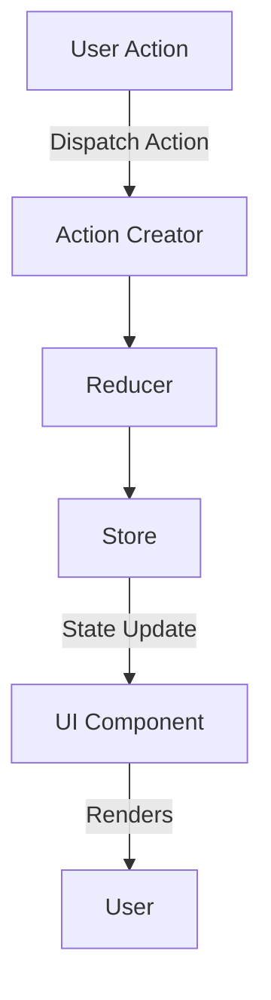

## 5.4.1 Flux/Redux Pattern

In the realm of JavaScript and TypeScript development, managing state efficiently is crucial for building scalable and maintainable applications. The Flux/Redux pattern offers a robust solution by providing a predictable state management architecture. This article delves into the principles, implementation steps, best practices, and use cases of the Flux/Redux pattern.

### Understand the Principles

The Flux/Redux pattern is grounded in three core principles that ensure a predictable and manageable state:

- **Unidirectional Data Flow:** Data flows in a single direction, which simplifies understanding and debugging. This flow enhances predictability and makes the application easier to reason about.

- **Single Source of Truth:** The entire state of the application is stored in a single, centralized store. This approach ensures consistency and makes it easier to track changes over time.

- **Pure Functions:** Reducers, which are responsible for state transitions, are pure functions. They take the current state and an action as inputs and return the next state without side effects.

### Implementation Steps

Implementing the Flux/Redux pattern involves several key steps:

#### Set Up the Store

The store is the heart of a Redux application. It holds the application's state and provides methods to access the state, dispatch actions, and register listeners.

```typescript
import { createStore } from 'redux';
import rootReducer from './reducers';

const store = createStore(rootReducer);
```

#### Define Actions

Actions are payloads of information that send data from your application to the Redux store. They are the only source of information for the store.

```typescript
// actionTypes.ts
export const INCREMENT = 'INCREMENT';
export const DECREMENT = 'DECREMENT';

// actions.ts
import { INCREMENT, DECREMENT } from './actionTypes';

export const increment = () => ({
  type: INCREMENT,
});

export const decrement = () => ({
  type: DECREMENT,
});
```

#### Implement Reducers

Reducers specify how the application's state changes in response to actions. They are pure functions that take the previous state and an action, and return the next state.

```typescript
// counterReducer.ts
import { INCREMENT, DECREMENT } from './actionTypes';

const initialState = { count: 0 };

const counterReducer = (state = initialState, action: any) => {
  switch (action.type) {
    case INCREMENT:
      return { count: state.count + 1 };
    case DECREMENT:
      return { count: state.count - 1 };
    default:
      return state;
  }
};

export default counterReducer;
```

#### Connect Components

To connect your UI components to the Redux store, use the `connect` function from `react-redux` to map state and dispatch to the component's props.

```typescript
// CounterComponent.tsx
import React from 'react';
import { connect } from 'react-redux';
import { increment, decrement } from './actions';

const CounterComponent = ({ count, increment, decrement }: any) => (
  <div>
    <p>Count: {count}</p>
    <button onClick={increment}>Increment</button>
    <button onClick={decrement}>Decrement</button>
  </div>
);

const mapStateToProps = (state: any) => ({
  count: state.count,
});

const mapDispatchToProps = {
  increment,
  decrement,
};

export default connect(mapStateToProps, mapDispatchToProps)(CounterComponent);
```

### Best Practices

- **Normalize State Shape:** Avoid deeply nested data structures to simplify state updates and improve performance.

- **Use Middleware:** Middleware like Redux Thunk or Redux Saga can handle asynchronous actions, making your code cleaner and more manageable.

- **Keep Reducers Pure:** Ensure reducers are pure functions to maintain predictability and avoid side effects.

- **Use Selectors:** Create selectors to encapsulate logic for deriving data from the state, improving reusability and testability.

### Use Cases

The Flux/Redux pattern is particularly suitable for:

- **Complex Applications:** Applications with a lot of interactive data and complex state transitions benefit from Redux's predictable state management.

- **Predictable State Needs:** When the state needs to be predictable and traceable, Redux provides tools like time-travel debugging to track state changes.

### Considerations

While the Flux/Redux pattern offers numerous benefits, it can introduce boilerplate code. To streamline development:

- **Use Redux Toolkit:** This library reduces boilerplate and simplifies common tasks like setting up the store and creating reducers.

- **Adopt TypeScript:** TypeScript can enhance the development experience by providing type safety and autocompletion, reducing runtime errors.

### Visual Aids

Below is a conceptual diagram illustrating the unidirectional data flow in a Redux application:



### Conclusion

The Flux/Redux pattern is a powerful tool for managing state in JavaScript and TypeScript applications. By adhering to its principles and best practices, developers can build scalable, maintainable, and predictable applications. Whether you're working on a complex application or need a predictable state management solution, understanding and implementing the Flux/Redux pattern can significantly enhance your development process.

## Quiz Time!



### What is the primary benefit of unidirectional data flow in the Flux/Redux pattern?

- [x] Predictability and easier debugging
- [ ] Faster data processing
- [ ] Reduced code complexity
- [ ] Enhanced security

> **Explanation:** Unidirectional data flow ensures that data flows in a single direction, making the application more predictable and easier to debug.

### In the Flux/Redux pattern, where is the application's state stored?

- [x] In a single, centralized store
- [ ] In multiple local components
- [ ] In the server database
- [ ] In session storage

> **Explanation:** The application's state is stored in a single, centralized store, providing a single source of truth.

### What are reducers in the Flux/Redux pattern?

- [x] Pure functions that return the next state
- [ ] Functions that dispatch actions
- [ ] Components that render UI
- [ ] Middleware for handling async actions

> **Explanation:** Reducers are pure functions that take the current state and an action as inputs and return the next state.

### Which of the following is a best practice when using Redux?

- [x] Normalize state shape
- [ ] Use deeply nested data structures
- [ ] Avoid using middleware
- [ ] Store state in components

> **Explanation:** Normalizing the state shape avoids deeply nested data structures, making state updates simpler and more efficient.

### What is the role of middleware like Redux Thunk?

- [x] Handling asynchronous actions
- [ ] Rendering UI components
- [ ] Managing component state
- [ ] Dispatching synchronous actions

> **Explanation:** Middleware like Redux Thunk is used to handle asynchronous actions, allowing for cleaner and more manageable code.

### Which library can help reduce boilerplate in Redux applications?

- [x] Redux Toolkit
- [ ] React Router
- [ ] Axios
- [ ] Lodash

> **Explanation:** Redux Toolkit helps reduce boilerplate and simplifies common tasks like setting up the store and creating reducers.

### What is the purpose of using selectors in Redux?

- [x] Encapsulating logic for deriving data from the state
- [ ] Dispatching actions to the store
- [ ] Rendering UI components
- [ ] Handling side effects

> **Explanation:** Selectors encapsulate logic for deriving data from the state, improving reusability and testability.

### Which principle ensures that the state in Redux is consistent and traceable?

- [x] Single Source of Truth
- [ ] Unidirectional Data Flow
- [ ] Pure Functions
- [ ] Component-based Architecture

> **Explanation:** The Single Source of Truth principle ensures that the state is consistent and traceable by storing it in a centralized location.

### What is a potential drawback of using Redux?

- [x] Introduction of boilerplate code
- [ ] Lack of predictability
- [ ] Difficulty in debugging
- [ ] Inability to handle complex applications

> **Explanation:** Redux can introduce boilerplate code, but this can be mitigated by using utilities and patterns to streamline development.

### True or False: Reducers in Redux can have side effects.

- [ ] True
- [x] False

> **Explanation:** Reducers in Redux should be pure functions and must not have side effects to maintain predictability.


