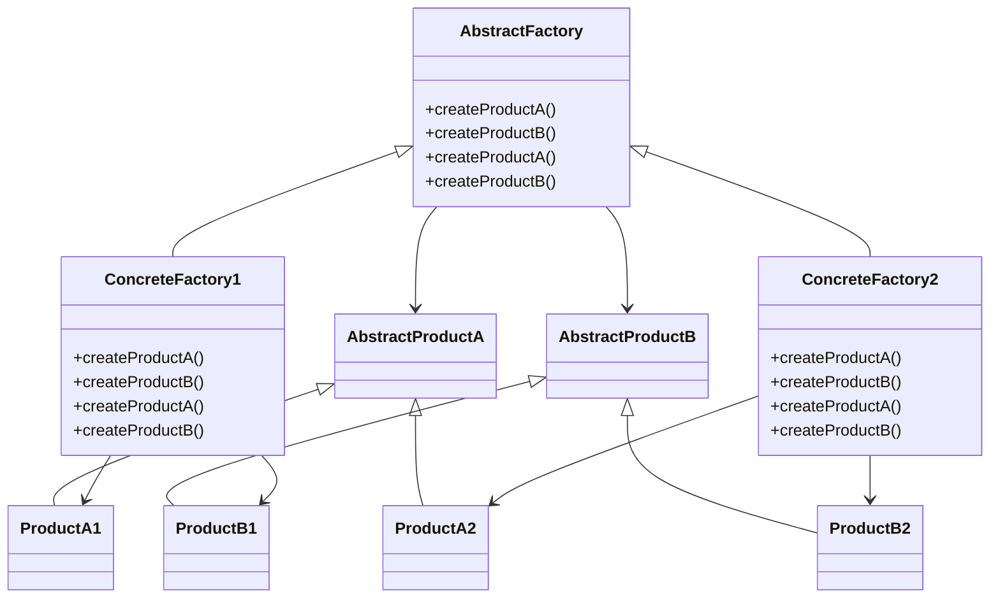

## 5.4 Abstract Factory Pattern

### Introduction

The Abstract Factory Pattern is a creational design pattern that provides an interface for creating families of related or dependent objects without specifying their concrete classes. This pattern is particularly useful in scenarios where a system needs to be independent of how its objects are created, composed, and represented. By using the Abstract Factory Pattern, developers can create a suite of related products without being tightly coupled to their specific implementations.

### Intent

The primary intent of the Abstract Factory Pattern is to encapsulate a group of individual factories that have a common theme. It allows for the creation of objects that follow a particular interface, promoting consistency and interchangeability among the products created by these factories.

### Key Participants

1. **AbstractFactory**: Declares an interface for operations that create abstract product objects.
2. **ConcreteFactory**: Implements the operations to create concrete product objects.
3. **AbstractProduct**: Declares an interface for a type of product object.
4. **ConcreteProduct**: Defines a product object to be created by the corresponding concrete factory; implements the AbstractProduct interface.
5. **Client**: Uses only interfaces declared by AbstractFactory and AbstractProduct classes.

### Applicability

Use the Abstract Factory Pattern when:
- A system should be independent of how its products are created, composed, and represented.
- A system should be configured with one of multiple families of products.
- A family of related product objects is designed to be used together, and you need to enforce this constraint.
- You want to provide a library of products, and you want to reveal just their interfaces, not their implementations.

### Diagram

Below is a class diagram illustrating the Abstract Factory Pattern:



### JavaScript Implementation

Let's explore how to implement the Abstract Factory Pattern in JavaScript. We'll create a simple example involving a family of products: `Car` and `Bike`.

#### Step 1: Define Abstract Products

First, define interfaces for the product types. In JavaScript, we can use classes to define these interfaces.

```javascript
// AbstractProductA
class Car {
    drive() {
        throw new Error("This method must be overridden!");
    }
}

// AbstractProductB
class Bike {
    ride() {
        throw new Error("This method must be overridden!");
    }
}
```

#### Step 2: Create Concrete Products

Next, implement concrete products that extend the abstract product interfaces.

```javascript
// ConcreteProductA1
class Sedan extends Car {
    drive() {
        console.log("Driving a sedan...");
    }
}

// ConcreteProductA2
class SUV extends Car {
    drive() {
        console.log("Driving an SUV...");
    }
}

// ConcreteProductB1
class MountainBike extends Bike {
    ride() {
        console.log("Riding a mountain bike...");
    }
}

// ConcreteProductB2
class RoadBike extends Bike {
    ride() {
        console.log("Riding a road bike...");
    }
}
```

#### Step 3: Define Abstract Factory

Create an abstract factory interface that declares methods for creating abstract products.

```javascript
class VehicleFactory {
    createCar() {
        throw new Error("This method must be overridden!");
    }

    createBike() {
        throw new Error("This method must be overridden!");
    }
}
```

#### Step 4: Implement Concrete Factories

Concrete factories implement the abstract factory interface to create concrete products.

```javascript
// ConcreteFactory1
class EconomyVehicleFactory extends VehicleFactory {
    createCar() {
        return new Sedan();
    }

    createBike() {
        return new MountainBike();
    }
}

// ConcreteFactory2
class LuxuryVehicleFactory extends VehicleFactory {
    createCar() {
        return new SUV();
    }

    createBike() {
        return new RoadBike();
    }
}
```

#### Step 5: Client Code

Finally, use the abstract factory to create families of related products.

```javascript
function clientCode(factory) {
    const car = factory.createCar();
    const bike = factory.createBike();

    car.drive();
    bike.ride();
}

// Using EconomyVehicleFactory
const economyFactory = new EconomyVehicleFactory();
clientCode(economyFactory);

// Using LuxuryVehicleFactory
const luxuryFactory = new LuxuryVehicleFactory();
clientCode(luxuryFactory);
```

### Design Considerations

- **Flexibility**: The Abstract Factory Pattern provides flexibility in terms of product creation. It allows for easy swapping of concrete factories to create different product families.
- **Scalability**: Adding new product families can be done by creating new concrete factories without altering existing code.
- **Complexity**: The pattern can introduce complexity due to the increased number of classes and interfaces.

### JavaScript Unique Features

JavaScript's dynamic nature allows for flexible implementations of the Abstract Factory Pattern. Unlike statically typed languages, JavaScript does not enforce strict interfaces, allowing for more fluid design patterns. However, this also means that developers must be diligent in ensuring that the correct methods are implemented and used.

### Differences and Similarities

The Abstract Factory Pattern is often confused with the Factory Method Pattern. While both patterns deal with object creation, the Abstract Factory Pattern focuses on creating families of related objects, whereas the Factory Method Pattern is concerned with creating a single product.

### Challenges and Solutions

- **Interface Enforcement**: JavaScript does not have built-in support for interfaces, which can lead to runtime errors if methods are not correctly implemented. To mitigate this, developers can use TypeScript or runtime checks.
- **Complexity Management**: The pattern can become complex with the addition of multiple product families. Proper documentation and adherence to design principles can help manage this complexity.

### Use Cases

The Abstract Factory Pattern is ideal for complex applications that require interchangeable families of objects. Examples include GUI toolkits that need to support different look-and-feel standards or applications that need to support multiple database backends.

### Try It Yourself

Experiment with the code examples provided by modifying the product families or adding new concrete factories. Try creating a new factory for electric vehicles and see how it integrates with the existing code.

### Knowledge Check

## Abstract Factory Pattern Quiz: Test Your Understanding



### What is the primary purpose of the Abstract Factory Pattern?

- [x] To create families of related or dependent objects without specifying their concrete classes.
- [ ] To create a single object with a factory method.
- [ ] To enforce a single interface for all objects.
- [ ] To provide a way to access elements of an aggregate object sequentially.

> **Explanation:** The Abstract Factory Pattern is used to create families of related or dependent objects without specifying their concrete classes.

### Which of the following is a key participant in the Abstract Factory Pattern?

- [x] AbstractFactory
- [ ] Singleton
- [ ] Adapter
- [ ] Decorator

> **Explanation:** AbstractFactory is a key participant in the Abstract Factory Pattern, responsible for declaring an interface for creating abstract product objects.

### How does the Abstract Factory Pattern enhance flexibility?

- [x] By allowing easy swapping of concrete factories to create different product families.
- [ ] By enforcing strict type checking at compile time.
- [ ] By reducing the number of classes needed.
- [ ] By eliminating the need for interfaces.

> **Explanation:** The Abstract Factory Pattern enhances flexibility by allowing easy swapping of concrete factories to create different product families.

### In JavaScript, what is a common challenge when implementing the Abstract Factory Pattern?

- [x] Lack of built-in support for interfaces.
- [ ] Difficulty in creating concrete products.
- [ ] Inability to use classes.
- [ ] Limited support for object-oriented programming.

> **Explanation:** A common challenge in JavaScript is the lack of built-in support for interfaces, which can lead to runtime errors if methods are not correctly implemented.

### What is the difference between the Abstract Factory Pattern and the Factory Method Pattern?

- [x] The Abstract Factory Pattern focuses on creating families of related objects, while the Factory Method Pattern is concerned with creating a single product.
- [ ] The Factory Method Pattern is used for creating families of related objects, while the Abstract Factory Pattern is for a single product.
- [ ] Both patterns are identical in purpose and implementation.
- [ ] The Abstract Factory Pattern is only used in JavaScript.

> **Explanation:** The Abstract Factory Pattern focuses on creating families of related objects, while the Factory Method Pattern is concerned with creating a single product.

### Which of the following is a benefit of using the Abstract Factory Pattern?

- [x] Scalability
- [ ] Reduced code complexity
- [ ] Elimination of all runtime errors
- [ ] Direct access to concrete classes

> **Explanation:** The Abstract Factory Pattern provides scalability by allowing new product families to be added without altering existing code.

### What is a potential drawback of the Abstract Factory Pattern?

- [x] Increased complexity due to the number of classes and interfaces.
- [ ] Inability to create new product families.
- [ ] Lack of flexibility in product creation.
- [ ] Difficulty in maintaining existing code.

> **Explanation:** A potential drawback of the Abstract Factory Pattern is increased complexity due to the number of classes and interfaces involved.

### How can developers address the challenge of interface enforcement in JavaScript?

- [x] By using TypeScript or runtime checks.
- [ ] By avoiding the use of interfaces altogether.
- [ ] By relying solely on documentation.
- [ ] By using global variables.

> **Explanation:** Developers can address the challenge of interface enforcement in JavaScript by using TypeScript or runtime checks to ensure methods are correctly implemented.

### What is a common use case for the Abstract Factory Pattern?

- [x] GUI toolkits that need to support different look-and-feel standards.
- [ ] Simple applications with a single product type.
- [ ] Applications that do not require object creation.
- [ ] Programs that only use procedural programming.

> **Explanation:** A common use case for the Abstract Factory Pattern is GUI toolkits that need to support different look-and-feel standards, requiring interchangeable families of objects.

### True or False: The Abstract Factory Pattern is only applicable to object-oriented programming languages.

- [x] False
- [ ] True

> **Explanation:** The Abstract Factory Pattern can be applied in various programming paradigms, including those that support object-oriented principles, but it is not limited to them.



### Conclusion

The Abstract Factory Pattern is a powerful tool in the arsenal of a JavaScript developer, especially when dealing with complex applications that require interchangeable families of objects. By understanding and implementing this pattern, developers can create flexible, scalable, and maintainable codebases. Remember, this is just the beginning. As you progress, you'll build more complex and interactive applications. Keep experimenting, stay curious, and enjoy the journey!
