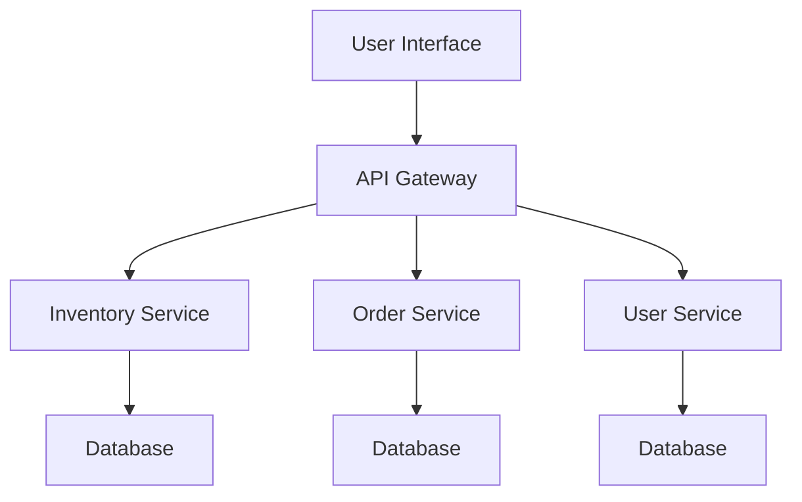

## 5.5.1 Microservices Principles

Microservices architecture has become a cornerstone of modern software development, offering a way to build applications as a suite of small, independently deployable services. This approach aligns closely with business capabilities and allows for greater flexibility, scalability, and resilience. In this article, we will delve into the principles of microservices architecture, explore implementation steps, and highlight best practices using JavaScript and TypeScript.

### Understand the Concepts

#### Independently Deployable and Scalable Services

One of the core principles of microservices architecture is designing services that can be deployed independently. This means each service can be updated, scaled, or restarted without affecting the others. This independence enhances the agility and scalability of the application.

#### Alignment with Business Capabilities

Microservices should be organized around business capabilities. Each service should represent a specific business function, allowing teams to develop, deploy, and scale services in alignment with business needs.

### Implementation Steps

#### Define Service Boundaries

The first step in implementing microservices is to define clear boundaries for each service. This involves identifying functionalities that can be isolated into separate services. For instance, in an e-commerce application, services could be divided into inventory management, order processing, and user authentication.

#### Develop Independent Services

Once boundaries are defined, the next step is to develop services that are independent in terms of codebase and database. Each service should have its own repository and database schema, ensuring that changes to one service do not impact others.

#### Implement Communication

Communication between services is crucial in a microservices architecture. This can be achieved using APIs for synchronous communication or message brokers for asynchronous communication. Tools like REST, GraphQL, or gRPC are commonly used for APIs, while RabbitMQ or Kafka can facilitate message brokering.

```typescript
// Example of a simple REST API using Express in Node.js
import express from 'express';

const app = express();
app.use(express.json());

app.get('/inventory', (req, res) => {
    // Logic to fetch inventory data
    res.send('Inventory data');
});

app.listen(3000, () => {
    console.log('Inventory service running on port 3000');
});
```

### Best Practices

#### Loose Coupling and High Cohesion

Ensure that services are loosely coupled but highly cohesive. This means that each service should have a single responsibility and minimal dependencies on other services. This design enhances maintainability and scalability.

#### Robust Monitoring and Logging

Implementing robust monitoring and logging is essential for managing microservices. Tools like Prometheus, Grafana, and ELK stack (Elasticsearch, Logstash, Kibana) can help track the performance and health of services, enabling quick identification and resolution of issues.

### Use Cases

Microservices architecture is particularly beneficial for large applications that require scalability, fault isolation, and independent deployment cycles. Examples include:

- E-commerce platforms
- Online streaming services
- Large-scale enterprise applications

### Considerations

While microservices offer numerous advantages, they also introduce complexity in managing distributed systems. Key considerations include:

- **Orchestration:** Tools like Kubernetes can help manage the deployment, scaling, and operation of microservices.
- **Service Discovery:** Implementing service discovery mechanisms, such as Consul or Eureka, is crucial for enabling services to find and communicate with each other dynamically.

### Visual Aids

#### Architectural Diagram

Below is a conceptual diagram illustrating a basic microservices architecture:



This diagram shows how an API Gateway can route requests to various services, each with its own database.

### Conclusion

Microservices architecture offers a powerful way to build scalable, resilient, and flexible applications. By adhering to the principles of independent deployment, alignment with business capabilities, and robust communication, developers can create systems that are easier to manage and evolve. However, it is important to consider the complexity of distributed systems and implement appropriate orchestration and service discovery mechanisms.

## Quiz Time!



### What is a core principle of microservices architecture?

- [x] Independently deployable services
- [ ] Monolithic codebase
- [ ] Single database for all services
- [ ] Tight coupling of services

> **Explanation:** Microservices architecture emphasizes independently deployable services, allowing for flexibility and scalability.

### How should microservices be organized?

- [x] Around business capabilities
- [ ] By programming language
- [ ] By developer preference
- [ ] By database type

> **Explanation:** Microservices should be organized around business capabilities to align development with business needs.

### What is a common tool for synchronous communication between microservices?

- [x] REST API
- [ ] RabbitMQ
- [ ] Kafka
- [ ] ELK stack

> **Explanation:** REST API is commonly used for synchronous communication between microservices.

### Which tool is used for orchestration in microservices?

- [x] Kubernetes
- [ ] Prometheus
- [ ] Grafana
- [ ] Express

> **Explanation:** Kubernetes is used for orchestrating the deployment, scaling, and operation of microservices.

### What is a benefit of loose coupling in microservices?

- [x] Enhanced maintainability
- [ ] Increased complexity
- [ ] Single point of failure
- [ ] Tight integration

> **Explanation:** Loose coupling enhances maintainability by reducing dependencies between services.

### Which tool is used for monitoring microservices?

- [x] Prometheus
- [ ] RabbitMQ
- [ ] GraphQL
- [ ] Consul

> **Explanation:** Prometheus is a tool used for monitoring the performance and health of microservices.

### What is a consideration when implementing microservices?

- [x] Complexity in managing distributed systems
- [ ] Single codebase for all services
- [ ] Lack of scalability
- [ ] Monolithic architecture

> **Explanation:** Managing distributed systems introduces complexity, which is a key consideration in microservices.

### What is a use case for microservices architecture?

- [x] Large applications needing scalability
- [ ] Small, static websites
- [ ] Single-user applications
- [ ] Simple CRUD applications

> **Explanation:** Microservices are beneficial for large applications that require scalability and independent deployment cycles.

### Which tool facilitates message brokering in microservices?

- [x] RabbitMQ
- [ ] REST API
- [ ] Express
- [ ] Grafana

> **Explanation:** RabbitMQ is a tool that facilitates message brokering for asynchronous communication between microservices.

### True or False: Microservices should have a single, shared database.

- [ ] True
- [x] False

> **Explanation:** Microservices should have independent databases to ensure that changes to one service do not impact others.


