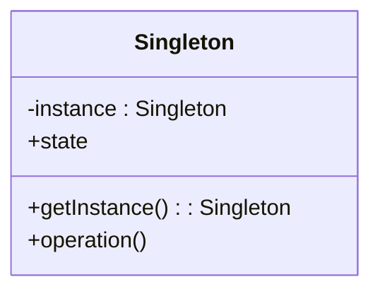

## 5.5 Singleton Pattern and Global State Management

### Introduction

In the realm of software design patterns, the Singleton Pattern stands out as a creational pattern that ensures a class has only one instance while providing a global point of access to that instance. This pattern is particularly useful in scenarios where a single object is needed to coordinate actions across a system. However, its use in JavaScript, especially in the context of global state management, comes with its own set of challenges and considerations.

### Understanding the Singleton Pattern

#### Definition

The Singleton Pattern restricts the instantiation of a class to a single object. This is achieved by ensuring that a class has only one instance and providing a global point of access to it. This pattern is commonly used for managing shared resources, such as configuration settings or connection pools.

#### Key Participants

- **Singleton Class**: The class that is restricted to a single instance.
- **Instance**: The single instance of the Singleton class.
- **Access Method**: A method that provides access to the Singleton instance.

#### Intent

The primary intent of the Singleton Pattern is to control object creation, limiting the number of instances to one. This is particularly useful for managing shared resources or coordinating actions across a system.

### Implementing the Singleton Pattern in JavaScript

JavaScript, being a prototype-based language, offers several ways to implement the Singleton Pattern. Let's explore a few common approaches:

#### Basic Singleton Implementation

```javascript
const Singleton = (function() {
    let instance;

    function createInstance() {
        const object = new Object("I am the instance");
        return object;
    }

    return {
        getInstance: function() {
            if (!instance) {
                instance = createInstance();
            }
            return instance;
        }
    };
})();

const instance1 = Singleton.getInstance();
const instance2 = Singleton.getInstance();

console.log(instance1 === instance2); // Output: true
```

**Explanation**: In this example, we use an immediately invoked function expression (IIFE) to create a closure that holds the instance. The `getInstance` method checks if an instance already exists; if not, it creates one.

#### ES6 Class-Based Singleton

```javascript
class Singleton {
    constructor() {
        if (Singleton.instance) {
            return Singleton.instance;
        }
        Singleton.instance = this;
        this.state = "I am the instance";
    }
}

const instance1 = new Singleton();
const instance2 = new Singleton();

console.log(instance1 === instance2); // Output: true
```

**Explanation**: Here, we use a class to define the Singleton. The constructor checks if an instance already exists and returns it if so, otherwise, it creates a new instance.

#### Using Modules for Singleton

JavaScript modules naturally lend themselves to the Singleton Pattern, as they are singletons by design.

```javascript
// singleton.js
let instance = null;

class Singleton {
    constructor() {
        if (!instance) {
            instance = this;
            this.state = "I am the instance";
        }
        return instance;
    }
}

export default Singleton;

// main.js
import Singleton from './singleton.js';

const instance1 = new Singleton();
const instance2 = new Singleton();

console.log(instance1 === instance2); // Output: true
```

**Explanation**: By exporting a class from a module, we ensure that only one instance of the class is created and shared across the application.

### Pros and Cons of Using Singletons

#### Pros

- **Controlled Access**: Singletons provide a controlled access point to a resource or service.
- **Resource Management**: They are useful for managing shared resources, such as configuration settings or connection pools.
- **Consistency**: Ensures that a single instance is used throughout the application, maintaining consistency.

#### Cons

- **Global State**: Singletons introduce global state, which can lead to hidden dependencies and make testing difficult.
- **Tight Coupling**: They can lead to tight coupling between components, making the system less flexible.
- **Concurrency Issues**: In multi-threaded environments, singletons can lead to concurrency issues if not implemented carefully.

### Global State Management in JavaScript Applications

Managing global state is a common requirement in modern web applications. While singletons can be used for this purpose, they are not always the best choice. Let's explore some patterns and libraries for managing global state effectively.

#### Redux for Global State Management

Redux is a popular library for managing global state in JavaScript applications, particularly in React. It provides a predictable state container and follows a unidirectional data flow.

```javascript
import { createStore } from 'redux';

// Reducer function
function counterReducer(state = { count: 0 }, action) {
    switch (action.type) {
        case 'INCREMENT':
            return { count: state.count + 1 };
        case 'DECREMENT':
            return { count: state.count - 1 };
        default:
            return state;
    }
}

// Create a Redux store
const store = createStore(counterReducer);

// Subscribe to state changes
store.subscribe(() => console.log(store.getState()));

// Dispatch actions
store.dispatch({ type: 'INCREMENT' });
store.dispatch({ type: 'INCREMENT' });
store.dispatch({ type: 'DECREMENT' });
```

**Explanation**: In this example, we define a reducer function that specifies how the state changes in response to actions. The `createStore` function creates a Redux store, and we can dispatch actions to update the state.

#### Context API in React

The Context API is another way to manage global state in React applications. It provides a way to pass data through the component tree without having to pass props down manually at every level.

```javascript
import React, { createContext, useContext, useState } from 'react';

// Create a Context
const CountContext = createContext();

// Create a provider component
function CountProvider({ children }) {
    const [count, setCount] = useState(0);
    return (
        <CountContext.Provider value={{ count, setCount }}>
            {children}
        </CountContext.Provider>
    );
}

// Custom hook to use the CountContext
function useCount() {
    return useContext(CountContext);
}

// Component that uses the CountContext
function Counter() {
    const { count, setCount } = useCount();
    return (
        <div>
            <p>Count: {count}</p>
            <button onClick={() => setCount(count + 1)}>Increment</button>
        </div>
    );
}

// App component
function App() {
    return (
        <CountProvider>
            <Counter />
        </CountProvider>
    );
}

export default App;
```

**Explanation**: In this example, we create a `CountContext` and a `CountProvider` component that provides the context value to its children. The `useCount` hook allows components to access the context value.

### Best Practices for Using Singletons and Managing Global State

- **Limit Singleton Use**: Use singletons sparingly and only when necessary. Consider alternatives like dependency injection or module patterns.
- **Encapsulate State**: Encapsulate global state within modules or contexts to avoid polluting the global scope.
- **Testability**: Design singletons and global state management solutions with testability in mind. Use dependency injection to make components easier to test.
- **Avoid Tight Coupling**: Avoid tight coupling between components and singletons. Use interfaces or abstractions to decouple components.
- **Concurrency Considerations**: In environments where concurrency is a concern, ensure that singletons are thread-safe.

### Visualizing the Singleton Pattern

To better understand the Singleton Pattern, let's visualize its structure using a class diagram.



**Description**: This diagram illustrates the Singleton class with a private `instance` variable and a public `getInstance` method that returns the single instance.

### Conclusion

The Singleton Pattern is a powerful tool for managing shared resources and ensuring consistency across a system. However, it comes with challenges, particularly in the context of global state management. By understanding the pros and cons of singletons and exploring alternative patterns and libraries, such as Redux and the Context API, we can make informed decisions about managing global state in our applications.

Remember, this is just the beginning. As you progress, you'll build more complex and interactive web applications. Keep experimenting, stay curious, and enjoy the journey!

## Quiz: Mastering the Singleton Pattern and Global State Management



### What is the primary intent of the Singleton Pattern?

- [x] To ensure a class has only one instance and provide a global point of access to it.
- [ ] To create multiple instances of a class.
- [ ] To manage state across multiple instances.
- [ ] To facilitate communication between different classes.

> **Explanation:** The Singleton Pattern ensures a class has only one instance and provides a global point of access to it.

### Which of the following is a disadvantage of using the Singleton Pattern?

- [x] It introduces global state, which can lead to hidden dependencies.
- [ ] It makes the code more modular.
- [ ] It simplifies testing.
- [ ] It reduces memory usage.

> **Explanation:** Singletons introduce global state, which can lead to hidden dependencies and make testing difficult.

### How can you implement a Singleton in JavaScript using ES6 classes?

- [x] By checking if an instance already exists in the constructor and returning it if so.
- [ ] By creating multiple instances and selecting one at random.
- [ ] By using the `new` keyword without any checks.
- [ ] By using a factory function to create instances.

> **Explanation:** In ES6 classes, you can implement a Singleton by checking if an instance already exists in the constructor and returning it if so.

### What is a common use case for the Singleton Pattern?

- [x] Managing configuration settings.
- [ ] Creating multiple instances of a service.
- [ ] Implementing complex algorithms.
- [ ] Handling user input.

> **Explanation:** A common use case for the Singleton Pattern is managing configuration settings, where a single instance is needed.

### Which library is commonly used for managing global state in React applications?

- [x] Redux
- [ ] Lodash
- [ ] Axios
- [ ] jQuery

> **Explanation:** Redux is a popular library for managing global state in React applications.

### What is the purpose of the `createStore` function in Redux?

- [x] To create a Redux store that holds the application state.
- [ ] To create a new component.
- [ ] To dispatch actions.
- [ ] To define a reducer function.

> **Explanation:** The `createStore` function in Redux is used to create a store that holds the application state.

### How does the Context API help in managing global state in React?

- [x] It provides a way to pass data through the component tree without passing props manually at every level.
- [ ] It creates a new instance of a component.
- [ ] It dispatches actions to update the state.
- [ ] It defines a reducer function.

> **Explanation:** The Context API provides a way to pass data through the component tree without passing props manually at every level.

### What is a best practice for using singletons in JavaScript?

- [x] Use singletons sparingly and only when necessary.
- [ ] Use singletons for every class.
- [ ] Avoid using singletons altogether.
- [ ] Use singletons to manage all application state.

> **Explanation:** It is best to use singletons sparingly and only when necessary to avoid issues with global state and tight coupling.

### Which of the following is a benefit of using the Singleton Pattern?

- [x] Controlled access to a resource or service.
- [ ] Increased memory usage.
- [ ] Complex code structure.
- [ ] Difficulty in testing.

> **Explanation:** The Singleton Pattern provides controlled access to a resource or service, ensuring consistency.

### True or False: JavaScript modules are singletons by design.

- [x] True
- [ ] False

> **Explanation:** JavaScript modules are singletons by design, as they are only loaded once and shared across the application.


