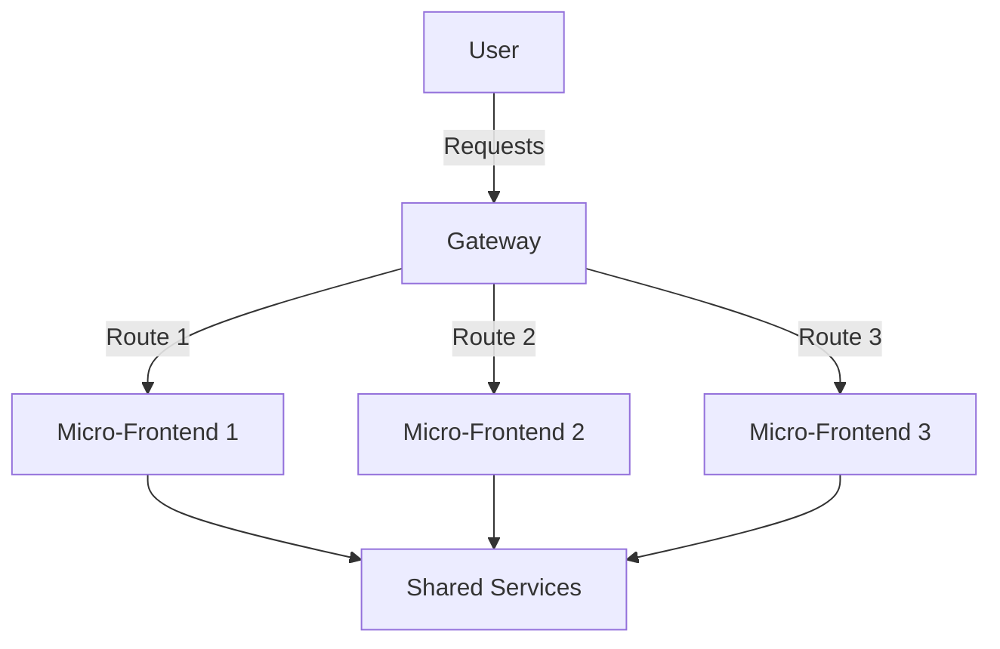

## 5.6.1 Micro-Frontends Pattern

In the evolving landscape of web development, the Micro-Frontends pattern emerges as a powerful architectural approach that extends the principles of microservices to the frontend. This pattern allows for the development of large-scale web applications by multiple autonomous teams, each responsible for different features or sections of the application. Let's delve into the concept, implementation, best practices, and considerations of the Micro-Frontends pattern.

### Understand the Concept

The Micro-Frontends pattern is inspired by microservices architecture, which breaks down backend services into smaller, independent units. Similarly, Micro-Frontends decompose the frontend into smaller, manageable fragments. This approach enables teams to work end-to-end on features, from the backend to the user interface, fostering faster development cycles and more scalable applications.

### Implementation Steps

#### 1. Divide Frontend into Fragments

The first step in implementing Micro-Frontends is to segment the application. This can be done based on:

- **Routes:** Each route corresponds to a different micro-frontend.
- **Features:** Different features or functionalities are handled by separate micro-frontends.
- **Components:** Specific components or UI elements are isolated into micro-frontends.

#### 2. Choose Integration Method

Deciding how to integrate these fragments is crucial. There are several methods:

- **Client-Side Composition:** Integrate micro-frontends in the browser using JavaScript frameworks like React or Angular.
- **Server-Side Rendering (SSR):** Assemble the micro-frontends on the server before sending them to the client, often using frameworks like Next.js.
- **Build-Time Integration:** Combine micro-frontends during the build process, resulting in a single deployable unit.

#### 3. Ensure Consistency

To maintain a consistent user experience across different micro-frontends:

- **Shared Libraries:** Use shared libraries for common functionalities.
- **Design Systems:** Implement a design system to ensure a uniform look and feel.

### Best Practices

- **Synchronize Shared Dependencies:** Keep shared dependencies up-to-date to prevent version conflicts.
- **Cross-Application Communication:** Implement communication between micro-frontends carefully to avoid tight coupling. Use event buses or shared state management solutions like Redux.

### Use Cases

Micro-Frontends are particularly beneficial for:

- **Large-Scale Web Applications:** Applications developed by multiple teams, each focusing on different features.
- **Continuous Deployment Environments:** Where independent deployment of features is required.

### Considerations

While Micro-Frontends offer numerous advantages, there are some considerations:

- **Performance Impacts:** Loading multiple scripts and styles can affect performance. Optimize by lazy loading and minimizing dependencies.
- **Complex Deployment:** Managing deployments and routing configurations can become complex. Use tools like Kubernetes or Docker to streamline deployment processes.

### Visual Aids

To better understand the Micro-Frontends pattern, let's visualize the architecture using a conceptual diagram.



> **Explanation:** The diagram illustrates how a user interacts with a gateway that routes requests to different micro-frontends based on the route. Each micro-frontend can access shared services to maintain consistency.

### Code Examples

Let's explore how to implement a basic Micro-Frontend using React and Module Federation, a feature of Webpack 5.

#### Host Application (Shell)

```javascript
// webpack.config.js
module.exports = {
  mode: 'development',
  devServer: {
    port: 3000,
  },
  module: {
    rules: [
      {
        test: /\.jsx?$/,
        use: 'babel-loader',
        exclude: /node_modules/,
      },
    ],
  },
  plugins: [
    new ModuleFederationPlugin({
      name: 'host',
      remotes: {
        microfrontend1: 'microfrontend1@http://localhost:3001/remoteEntry.js',
      },
    }),
  ],
};
```

#### Micro-Frontend 1

```javascript
// webpack.config.js
module.exports = {
  mode: 'development',
  devServer: {
    port: 3001,
  },
  module: {
    rules: [
      {
        test: /\.jsx?$/,
        use: 'babel-loader',
        exclude: /node_modules/,
      },
    ],
  },
  plugins: [
    new ModuleFederationPlugin({
      name: 'microfrontend1',
      filename: 'remoteEntry.js',
      exposes: {
        './Button': './src/Button',
      },
    }),
  ],
};
```

#### Button Component

```javascript
// src/Button.jsx
import React from 'react';

const Button = () => <button>Click Me!</button>;

export default Button;
```

### Advantages and Disadvantages

#### Advantages

- **Scalability:** Allows multiple teams to work independently, scaling development efforts.
- **Flexibility:** Teams can choose different technologies for different micro-frontends.
- **Faster Deployment:** Enables independent deployment of features.

#### Disadvantages

- **Complexity:** Increases complexity in terms of deployment and routing.
- **Performance:** Potential performance issues due to multiple assets.

### Best Practices

- **Consistent Communication:** Use standardized protocols for communication between micro-frontends.
- **Monitoring and Logging:** Implement robust monitoring to track performance and errors across micro-frontends.

### Comparisons

Micro-Frontends can be compared with traditional monolithic frontends:

- **Monolithic Frontends:** Easier to manage initially but become cumbersome as the application grows.
- **Micro-Frontends:** More complex to set up but offer greater flexibility and scalability.

### Conclusion

The Micro-Frontends pattern is a transformative approach to frontend development, enabling scalable and maintainable web applications. By dividing the frontend into smaller, independent units, teams can work more efficiently and deploy features faster. However, careful consideration of performance and complexity is essential to fully leverage the benefits of this pattern.

## Quiz Time!



### What is the primary inspiration for the Micro-Frontends pattern?

- [x] Microservices architecture
- [ ] Monolithic architecture
- [ ] Serverless architecture
- [ ] Event-driven architecture

> **Explanation:** The Micro-Frontends pattern is inspired by microservices architecture, which breaks down backend services into smaller, independent units.

### Which integration method involves assembling micro-frontends on the server?

- [ ] Client-side composition
- [x] Server-side rendering
- [ ] Build-time integration
- [ ] Static site generation

> **Explanation:** Server-side rendering (SSR) involves assembling the micro-frontends on the server before sending them to the client.

### What is a key benefit of using shared libraries in Micro-Frontends?

- [x] Consistent look and feel
- [ ] Faster build times
- [ ] Reduced code size
- [ ] Improved SEO

> **Explanation:** Shared libraries help maintain a consistent look and feel across different micro-frontends.

### Which of the following is a potential disadvantage of Micro-Frontends?

- [ ] Easier team collaboration
- [x] Increased complexity
- [ ] Improved scalability
- [ ] Faster deployment

> **Explanation:** Micro-Frontends can increase complexity in terms of deployment and routing configurations.

### What is a common use case for Micro-Frontends?

- [x] Large-scale web applications
- [ ] Small static websites
- [ ] Single-page applications
- [ ] Command-line tools

> **Explanation:** Micro-Frontends are particularly beneficial for large-scale web applications developed by multiple teams.

### How can performance impacts be mitigated in Micro-Frontends?

- [x] Lazy loading and minimizing dependencies
- [ ] Using more libraries
- [ ] Increasing server capacity
- [ ] Reducing the number of micro-frontends

> **Explanation:** Performance impacts can be mitigated by lazy loading and minimizing dependencies.

### What is a key consideration when implementing cross-application communication?

- [x] Avoiding tight coupling
- [ ] Increasing bandwidth
- [ ] Using more APIs
- [ ] Reducing server load

> **Explanation:** It's important to implement cross-application communication carefully to avoid tight coupling.

### Which tool can help streamline deployment processes in Micro-Frontends?

- [ ] GitHub
- [ ] Jenkins
- [x] Kubernetes
- [ ] Nginx

> **Explanation:** Kubernetes can help streamline deployment processes by managing containerized applications.

### What is the role of a gateway in a Micro-Frontends architecture?

- [x] Routing requests to different micro-frontends
- [ ] Storing user data
- [ ] Rendering UI components
- [ ] Managing database connections

> **Explanation:** The gateway routes requests to different micro-frontends based on the route.

### True or False: Micro-Frontends allow teams to choose different technologies for different parts of the application.

- [x] True
- [ ] False

> **Explanation:** Micro-Frontends offer flexibility, allowing teams to choose different technologies for different micro-frontends.


