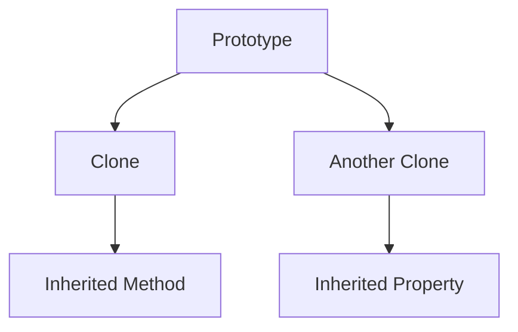

## 5.6 Prototype Pattern and Object Cloning

### Introduction

In the realm of JavaScript, the Prototype Pattern is a powerful creational design pattern that allows for the creation of new objects by cloning existing ones. This pattern leverages JavaScript's prototypal inheritance, which is fundamentally different from the class-based inheritance found in many other programming languages. In this section, we will delve into the Prototype Pattern, explore object cloning techniques, and discuss the differences between deep and shallow copies. We will also highlight scenarios where object cloning is beneficial and address considerations regarding performance and circular references.

### Understanding the Prototype Pattern

The Prototype Pattern is a design pattern that focuses on the creation of objects based on a template of an existing object. In JavaScript, this is achieved through prototypal inheritance, where objects inherit directly from other objects. This is in contrast to class-based inheritance, where objects are instances of classes.

#### Key Participants

- **Prototype**: The original object that serves as a template for creating new objects.
- **Cloner**: The mechanism or function that creates a new object by copying the prototype.

#### Intent

The intent of the Prototype Pattern is to enable the creation of new objects by copying an existing object, known as the prototype. This pattern is particularly useful when the cost of creating a new object is more expensive than copying an existing one.

#### Applicability

Use the Prototype Pattern when:

- You want to avoid the overhead of creating new objects from scratch.
- You need to create objects that are similar to existing ones.
- You want to leverage JavaScript's prototypal inheritance to share behavior among objects.

### JavaScript's Prototypal Inheritance

JavaScript's prototypal inheritance allows objects to inherit properties and methods from other objects. This is achieved through the prototype chain, where each object has a prototype, and properties are looked up along this chain.

```javascript
// Example of prototypal inheritance
const animal = {
  speak() {
    console.log("Animal speaks");
  }
};

const dog = Object.create(animal);
dog.speak(); // Output: Animal speaks
```

In this example, `dog` is created using `Object.create()`, which sets `animal` as its prototype. When `speak()` is called on `dog`, it is found on the prototype chain.

### Object Cloning in JavaScript

Object cloning is the process of creating a copy of an object. In JavaScript, this can be done using various techniques, including `Object.create()`, the spread operator, and utility functions like `Object.assign()`.

#### Shallow Copy

A shallow copy creates a new object with the same top-level properties as the original object. However, if the original object contains nested objects, the references to these nested objects are copied, not the objects themselves.

```javascript
// Shallow copy using Object.assign()
const original = { a: 1, b: { c: 2 } };
const shallowCopy = Object.assign({}, original);

shallowCopy.b.c = 3;
console.log(original.b.c); // Output: 3
```

In this example, modifying the nested object in `shallowCopy` affects the `original` object because the nested object is shared between them.

#### Deep Copy

A deep copy creates a new object and recursively copies all nested objects, ensuring that no references are shared between the original and the copy.

```javascript
// Deep copy using JSON methods
const original = { a: 1, b: { c: 2 } };
const deepCopy = JSON.parse(JSON.stringify(original));

deepCopy.b.c = 3;
console.log(original.b.c); // Output: 2
```

In this example, modifying the nested object in `deepCopy` does not affect the `original` object because the nested object is not shared.

#### Using `Object.create()` for Cloning

`Object.create()` is a powerful method for creating a new object with a specified prototype. It can be used to implement the Prototype Pattern by creating a new object that inherits from an existing one.

```javascript
// Cloning using Object.create()
const prototype = {
  greet() {
    console.log("Hello, world!");
  }
};

const clone = Object.create(prototype);
clone.greet(); // Output: Hello, world!
```

In this example, `clone` is created with `prototype` as its prototype, allowing it to inherit the `greet` method.

### Deep vs. Shallow Copy: When to Use Each

The choice between deep and shallow copy depends on the specific requirements of your application. Use a shallow copy when:

- You only need to copy the top-level properties of an object.
- The object does not contain nested objects or arrays.

Use a deep copy when:

- You need to copy all nested objects and arrays.
- You want to ensure that modifications to the copy do not affect the original object.

### Considerations for Object Cloning

#### Performance

Cloning objects, especially deep cloning, can be computationally expensive. Consider the performance implications when cloning large or complex objects. Use shallow copies when possible to minimize overhead.

#### Circular References

Circular references occur when two or more objects reference each other, creating a loop. This can cause issues when performing deep copies, as the JSON methods used for deep copying do not handle circular references.

```javascript
// Example of circular reference
const objA = {};
const objB = { a: objA };
objA.b = objB;

// Attempting to deep copy will result in an error
// const deepCopy = JSON.parse(JSON.stringify(objA)); // Throws error
```

To handle circular references, consider using libraries like `lodash` or `rfdc` that provide deep copy functions with support for circular references.

### Use Cases for Object Cloning

Object cloning is advantageous in scenarios where:

- You need to create multiple instances of an object with similar properties.
- You want to preserve the state of an object at a specific point in time.
- You need to implement undo/redo functionality by maintaining copies of object states.

### JavaScript Unique Features

JavaScript's unique prototypal inheritance model allows for flexible and dynamic object creation and cloning. The use of `Object.create()` and other cloning techniques enables developers to implement the Prototype Pattern effectively.

### Differences and Similarities with Other Patterns

The Prototype Pattern is often compared to the Factory Pattern. While both patterns deal with object creation, the Prototype Pattern focuses on cloning existing objects, whereas the Factory Pattern involves creating new objects from scratch.

### Try It Yourself

Experiment with the following code examples to gain a deeper understanding of the Prototype Pattern and object cloning:

```javascript
// Try modifying the prototype object and observe the changes in the clone
const prototype = {
  greet() {
    console.log("Hello, world!");
  }
};

const clone = Object.create(prototype);
prototype.greet = function() {
  console.log("Hi, universe!");
};

clone.greet(); // What will this output?
```

### Visualizing Prototypal Inheritance



**Figure 1**: This diagram illustrates how clones inherit methods and properties from the prototype.

### Knowledge Check

- What is the difference between a shallow copy and a deep copy?
- How does `Object.create()` facilitate the Prototype Pattern?
- What are some considerations when cloning objects with circular references?

### Summary

In this section, we explored the Prototype Pattern and object cloning in JavaScript. We discussed the differences between deep and shallow copies, highlighted use cases for object cloning, and addressed considerations regarding performance and circular references. By leveraging JavaScript's prototypal inheritance, developers can efficiently create and manage objects in their applications.

Remember, mastering the Prototype Pattern and object cloning is just the beginning. As you continue your journey in JavaScript development, keep experimenting, stay curious, and enjoy the process!

## Quiz: Mastering the Prototype Pattern and Object Cloning in JavaScript



### What is the primary purpose of the Prototype Pattern in JavaScript?

- [x] To create new objects by cloning existing ones
- [ ] To define a blueprint for creating objects
- [ ] To manage object dependencies
- [ ] To encapsulate object creation logic

> **Explanation:** The Prototype Pattern is used to create new objects by cloning existing ones, leveraging JavaScript's prototypal inheritance.

### Which method is commonly used in JavaScript to create a new object with a specified prototype?

- [ ] Object.assign()
- [x] Object.create()
- [ ] JSON.parse()
- [ ] JSON.stringify()

> **Explanation:** `Object.create()` is used to create a new object with a specified prototype.

### What is a shallow copy in JavaScript?

- [x] A copy that duplicates only the top-level properties of an object
- [ ] A copy that duplicates all nested objects and arrays
- [ ] A copy that shares references with the original object
- [ ] A copy that is created using JSON methods

> **Explanation:** A shallow copy duplicates only the top-level properties of an object, sharing references to nested objects.

### How can you create a deep copy of an object in JavaScript?

- [ ] Using Object.assign()
- [x] Using JSON.parse(JSON.stringify())
- [ ] Using Object.create()
- [ ] Using the spread operator

> **Explanation:** `JSON.parse(JSON.stringify())` is a common method for creating a deep copy of an object, although it has limitations with circular references.

### What is a potential issue when performing deep copies with JSON methods?

- [x] Circular references can cause errors
- [ ] The copy will be shallow
- [ ] The original object will be modified
- [ ] The copy will be faster to create

> **Explanation:** JSON methods do not handle circular references, which can cause errors during deep copying.

### When should you use a deep copy instead of a shallow copy?

- [x] When you need to copy all nested objects and arrays
- [ ] When you only need to copy top-level properties
- [ ] When performance is a primary concern
- [ ] When the object contains no nested structures

> **Explanation:** A deep copy is necessary when you need to copy all nested objects and arrays to ensure no shared references.

### What is a key advantage of using the Prototype Pattern?

- [x] It allows for efficient object creation by cloning
- [ ] It simplifies the creation of complex objects
- [ ] It reduces memory usage
- [ ] It eliminates the need for constructors

> **Explanation:** The Prototype Pattern allows for efficient object creation by cloning existing objects, leveraging prototypal inheritance.

### How does `Object.create()` differ from `Object.assign()`?

- [x] `Object.create()` sets the prototype of the new object
- [ ] `Object.assign()` sets the prototype of the new object
- [ ] `Object.create()` performs a deep copy
- [ ] `Object.assign()` performs a deep copy

> **Explanation:** `Object.create()` sets the prototype of the new object, while `Object.assign()` copies properties from one or more source objects to a target object.

### What is a common use case for object cloning?

- [x] Implementing undo/redo functionality
- [ ] Managing object dependencies
- [ ] Encapsulating object creation logic
- [ ] Defining a blueprint for objects

> **Explanation:** Object cloning is useful for implementing undo/redo functionality by preserving object states.

### True or False: The Prototype Pattern is similar to the Factory Pattern in that both involve creating new objects.

- [x] True
- [ ] False

> **Explanation:** Both the Prototype Pattern and the Factory Pattern involve creating new objects, but the Prototype Pattern focuses on cloning existing objects, while the Factory Pattern involves creating new objects from scratch.


