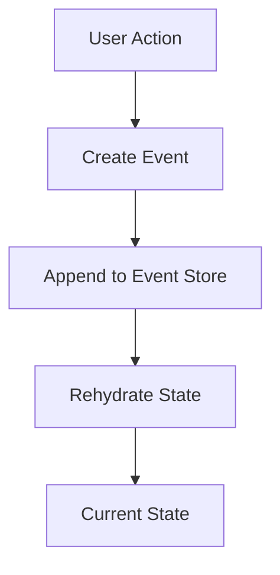

## 5.7.1 Event Sourcing

Event Sourcing is a powerful architectural pattern used in event-driven systems. It shifts the focus from storing the current state of an application to storing a sequence of events that represent state changes over time. This approach provides a robust mechanism for reconstructing past states, auditing changes, and ensuring data integrity.

### Understand the Concept

Event Sourcing involves capturing all changes to an application's state as a series of events. Instead of persisting the current state, each change is recorded as an event, which can be replayed to reconstruct the state at any point in time.

**Key Concepts:**

- **Event:** A record of a state change in the system.
- **Event Store:** A storage system that persists events immutably.
- **Rehydration:** The process of reconstructing the current state by replaying events.

### Implementation Steps

Implementing Event Sourcing involves several key steps:

#### Define Events

The first step is to determine which events represent meaningful changes in the system's state. Events should be descriptive and capture the intent of the change.

```typescript
// Define a TypeScript interface for an event
interface Event {
  type: string;
  timestamp: Date;
  payload: any;
}

// Example of a specific event
interface UserCreatedEvent extends Event {
  type: 'UserCreated';
  payload: {
    userId: string;
    name: string;
    email: string;
  };
}
```

#### Implement Event Store

An Event Store is responsible for persisting events in an immutable manner. It should support appending new events and retrieving events for rehydration.

```typescript
class EventStore {
  private events: Event[] = [];

  append(event: Event): void {
    this.events.push(event);
  }

  getEvents(): Event[] {
    return this.events;
  }
}
```

#### Rehydrate State

Rehydrating state involves replaying events to reconstruct the current state of the application. This process allows the system to derive the state from the sequence of events.

```typescript
class User {
  private userId: string;
  private name: string;
  private email: string;

  constructor(events: Event[]) {
    this.applyEvents(events);
  }

  private applyEvents(events: Event[]): void {
    events.forEach(event => {
      switch (event.type) {
        case 'UserCreated':
          this.userId = event.payload.userId;
          this.name = event.payload.name;
          this.email = event.payload.email;
          break;
        // Handle other event types
      }
    });
  }
}
```

### Best Practices

- **Use Snapshots:** For systems with long event streams, periodically capture snapshots of the state to optimize performance and reduce the time needed for rehydration.
- **Ensure Immutability:** Events should be immutable and timestamped to maintain a reliable audit trail.
- **Handle Event Versioning:** Carefully manage changes to event schemas to ensure backward compatibility.

### Use Cases

Event Sourcing is particularly useful in systems that require audit trails and historical data reconstruction. Common use cases include:

- **Financial Applications:** Track all transactions and changes for auditing purposes.
- **E-commerce Platforms:** Maintain a history of user actions and order changes.
- **Collaborative Tools:** Record all modifications to shared documents or projects.

### Considerations

While Event Sourcing offers many benefits, it also presents challenges:

- **Eventual Consistency:** Systems using Event Sourcing may experience eventual consistency issues, requiring careful design to handle these scenarios.
- **Complexity in Event Versioning:** As the system evolves, managing changes to event schemas can become complex.

### Visual Representation

Below is a conceptual diagram illustrating the flow of events in an Event Sourcing system:



### Conclusion

Event Sourcing is a powerful pattern that provides a robust framework for managing state changes and maintaining historical data. By capturing every change as an event, systems can achieve greater auditability, flexibility, and resilience. However, implementing Event Sourcing requires careful consideration of event design, storage, and rehydration processes.

## Quiz Time!



### What is the primary focus of Event Sourcing?

- [x] Storing a sequence of state-changing events
- [ ] Storing the current state of the application
- [ ] Storing only the initial state of the application
- [ ] Storing user interactions

> **Explanation:** Event Sourcing focuses on storing a sequence of events that represent changes in state, rather than just the current state.

### What is an Event Store responsible for?

- [x] Persisting events immutably
- [ ] Storing the current state
- [ ] Managing user sessions
- [ ] Handling network requests

> **Explanation:** An Event Store is responsible for persisting events in an immutable manner, allowing for state reconstruction.

### What is the process of reconstructing the current state by replaying events called?

- [x] Rehydration
- [ ] Serialization
- [ ] Deserialization
- [ ] Aggregation

> **Explanation:** Rehydration is the process of reconstructing the current state by replaying events.

### Which of the following is a best practice in Event Sourcing?

- [x] Use snapshots to optimize performance
- [ ] Store events as mutable objects
- [ ] Avoid timestamping events
- [ ] Store events in a relational database

> **Explanation:** Using snapshots can optimize performance for long event streams by reducing the time needed for rehydration.

### What type of applications commonly use Event Sourcing?

- [x] Financial applications
- [ ] Static websites
- [x] E-commerce platforms
- [ ] Single-page applications

> **Explanation:** Financial applications and e-commerce platforms often use Event Sourcing to maintain audit trails and historical data.

### What challenge might arise from using Event Sourcing?

- [x] Eventual consistency issues
- [ ] Lack of historical data
- [ ] Inability to track state changes
- [ ] Difficulty in handling user input

> **Explanation:** Eventual consistency issues may arise in systems using Event Sourcing, requiring careful design to manage.

### What should be ensured about events in Event Sourcing?

- [x] Events should be immutable
- [ ] Events should be mutable
- [x] Events should be timestamped
- [ ] Events should be stored in memory only

> **Explanation:** Events should be immutable and timestamped to maintain a reliable audit trail.

### What is a potential advantage of Event Sourcing?

- [x] Greater auditability
- [ ] Simplicity in implementation
- [ ] Reduced storage requirements
- [ ] Immediate consistency

> **Explanation:** Event Sourcing provides greater auditability by capturing all changes as events.

### What is a common use case for Event Sourcing?

- [x] Systems requiring audit trails
- [ ] Systems with no historical data needs
- [ ] Systems with static content
- [ ] Systems without user interactions

> **Explanation:** Event Sourcing is useful in systems that require audit trails and historical data reconstruction.

### True or False: Event Sourcing can lead to eventual consistency issues.

- [x] True
- [ ] False

> **Explanation:** Event Sourcing can lead to eventual consistency issues, which need to be managed carefully.


