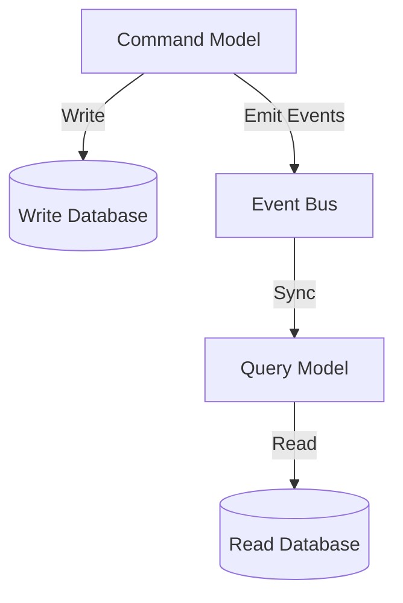

## 5.7.2 CQRS (Command Query Responsibility Segregation)

In the realm of software architecture, the CQRS (Command Query Responsibility Segregation) pattern stands out as a powerful approach to handling complex systems with high transaction volumes and intricate querying requirements. This pattern is particularly relevant in JavaScript and TypeScript applications, where performance and scalability are paramount.

### Understand the Concept

CQRS is an architectural pattern that separates the models for updating data (commands) and reading data (queries). This separation allows for optimized handling of both operations, enhancing performance and scalability.

- **Commands:** Responsible for making changes to the system's state. They encapsulate all the business logic and enforce invariants.
- **Queries:** Focused on retrieving data, optimized for performance and scalability.

### Detailed Explanation

The core idea behind CQRS is to decouple the command and query responsibilities, allowing each to evolve independently. This separation can lead to more maintainable and scalable systems, especially when combined with event-driven architectures.

#### Components and Workflow

1. **Command Model:**
   - **Purpose:** Handles all write operations. It is responsible for processing commands that change the state of the application.
   - **Focus:** Business logic and enforcing invariants.
   - **Example:** In a banking application, a command might be "Transfer Funds," which involves checking account balances and updating records.

2. **Query Model:**
   - **Purpose:** Handles read operations. It is optimized for fast data retrieval.
   - **Focus:** Performance and scalability.
   - **Example:** In the same banking application, a query might be "Get Account Balance," which retrieves the current balance without involving business logic.

3. **Data Synchronization:**
   - **Purpose:** Ensures that the read model is updated with changes from the command model.
   - **Method:** Often achieved through event-driven updates, where changes in the command model trigger events that update the read model.

### Visual Aids

#### CQRS Architecture Diagram



**Explanation:** This diagram illustrates the separation between the command and query models. The command model interacts with the write database, while the query model interacts with the read database. An event bus facilitates synchronization between the two models.

### Incorporate Up-to-Date Code Examples

Let's explore how to implement CQRS in a JavaScript/TypeScript application using modern libraries and frameworks.

#### Command Model Example

```typescript
// Command Interface
interface Command {
    execute(): Promise<void>;
}

// TransferFundsCommand
class TransferFundsCommand implements Command {
    constructor(private fromAccountId: string, private toAccountId: string, private amount: number) {}

    async execute(): Promise<void> {
        // Business logic for transferring funds
        const fromAccount = await AccountRepository.getAccount(this.fromAccountId);
        const toAccount = await AccountRepository.getAccount(this.toAccountId);

        if (fromAccount.balance < this.amount) {
            throw new Error('Insufficient funds');
        }

        fromAccount.balance -= this.amount;
        toAccount.balance += this.amount;

        await AccountRepository.saveAccount(fromAccount);
        await AccountRepository.saveAccount(toAccount);

        // Emit event for synchronization
        EventBus.emit('FundsTransferred', { fromAccountId: this.fromAccountId, toAccountId: this.toAccountId, amount: this.amount });
    }
}
```

#### Query Model Example

```typescript
// Query Interface
interface Query<T> {
    execute(): Promise<T>;
}

// GetAccountBalanceQuery
class GetAccountBalanceQuery implements Query<number> {
    constructor(private accountId: string) {}

    async execute(): Promise<number> {
        // Optimized read operation
        const account = await ReadModelRepository.getAccount(this.accountId);
        return account.balance;
    }
}
```

### Leverage Modern JavaScript/TypeScript Libraries and Tools

- **Event Bus:** Use libraries like `RxJS` or `Node.js EventEmitter` to facilitate event-driven updates.
- **Database Synchronization:** Tools like `TypeORM` can help manage data synchronization between command and query models.

### Emphasize Best Practices and Principles

- **SOLID Principles:** Adhering to SOLID principles, particularly the Single Responsibility Principle, is crucial in CQRS. Each command and query should have a single responsibility.
- **Consistency:** Ensure consistency between the command and query models, possibly using eventual consistency techniques.

### Introduce Advanced Topics

- **Domain-Driven Design (DDD):** CQRS fits well within the DDD framework, where complex business logic is encapsulated within aggregates, and events are used to synchronize state changes.
- **Event Sourcing:** Consider using event sourcing to persist state changes as a sequence of events, which can be replayed to reconstruct the state.

### Provide Comparative Analyses

- **CQRS vs. CRUD:**
  - **CQRS:** Suitable for complex systems with high transaction volumes and intricate querying requirements.
  - **CRUD:** Better for simple applications with straightforward data access patterns.

### Highlight Performance Considerations

- **Efficiency:** CQRS can improve performance by optimizing read and write operations separately.
- **Optimization Strategies:** Use caching and indexing to enhance query performance.

### Maintain Consistent Structure and Formatting

- **Introduction:** Briefly introduce CQRS and its relevance.
- **Detailed Explanation:** Provide an in-depth explanation of the pattern, including its components and workflow.
- **Visual Aids:** Include relevant diagrams and visuals with explanations.
- **Code Examples:** Present practical code snippets illustrating the pattern in action.
- **Use Cases:** Describe real-world scenarios where the pattern is applicable.
- **Advantages and Disadvantages:** Summarize the benefits and potential drawbacks.
- **Best Practices:** Offer recommendations for effective implementation.
- **Comparisons:** Compare with other similar patterns if applicable.
- **Conclusion:** Recap the key points and encourage further exploration.

### Conclusion

CQRS is a powerful architectural pattern that can significantly enhance the performance and scalability of JavaScript and TypeScript applications. By separating command and query responsibilities, developers can optimize each operation independently, leading to more maintainable and efficient systems. However, it is essential to consider the complexity introduced by synchronization and consistency challenges.

## Quiz Time!



### What is the primary purpose of the CQRS pattern?

- [x] To separate the models for updating and reading data
- [ ] To combine command and query operations into a single model
- [ ] To simplify CRUD operations
- [ ] To eliminate the need for event-driven architectures

> **Explanation:** The CQRS pattern separates the models for updating (commands) and reading (queries) data to optimize performance and scalability.

### Which component in CQRS handles write operations?

- [x] Command Model
- [ ] Query Model
- [ ] Event Bus
- [ ] Read Database

> **Explanation:** The Command Model is responsible for handling write operations and processing commands that change the system's state.

### What is the role of the Query Model in CQRS?

- [x] To handle read operations optimized for performance
- [ ] To process commands and enforce business logic
- [ ] To synchronize data between models
- [ ] To emit events for data changes

> **Explanation:** The Query Model handles read operations and is optimized for fast data retrieval, focusing on performance and scalability.

### How is data synchronization typically achieved in CQRS?

- [x] Through event-driven updates
- [ ] By directly updating both models
- [ ] By using a single database for both models
- [ ] By eliminating the need for synchronization

> **Explanation:** Data synchronization in CQRS is often achieved through event-driven updates, where changes in the command model trigger events that update the read model.

### What is a potential drawback of using CQRS?

- [x] It may introduce complexity with synchronization and consistency
- [ ] It simplifies CRUD operations
- [ ] It eliminates the need for business logic
- [ ] It reduces the need for scalability

> **Explanation:** CQRS can introduce complexity with synchronization and consistency, especially in systems with high transaction volumes.

### Which principle is crucial to adhere to in CQRS?

- [x] Single Responsibility Principle
- [ ] Open/Closed Principle
- [ ] Liskov Substitution Principle
- [ ] Interface Segregation Principle

> **Explanation:** The Single Responsibility Principle is crucial in CQRS, ensuring that each command and query has a single responsibility.

### In which scenario is CQRS most suitable?

- [x] Applications with high transaction volumes and complex querying requirements
- [ ] Simple CRUD applications
- [ ] Applications with minimal data access
- [ ] Systems with no need for scalability

> **Explanation:** CQRS is most suitable for applications with high transaction volumes and complex querying requirements, where performance and scalability are critical.

### What is a common tool used for event-driven updates in JavaScript?

- [x] RxJS
- [ ] TypeORM
- [ ] Express.js
- [ ] Lodash

> **Explanation:** RxJS is a common tool used for event-driven updates in JavaScript, facilitating reactive programming and event handling.

### How does CQRS relate to Domain-Driven Design (DDD)?

- [x] CQRS fits well within the DDD framework, encapsulating complex business logic
- [ ] CQRS eliminates the need for DDD
- [ ] CQRS and DDD are unrelated
- [ ] CQRS simplifies DDD by removing aggregates

> **Explanation:** CQRS fits well within the DDD framework, where complex business logic is encapsulated within aggregates, and events are used to synchronize state changes.

### True or False: CQRS is suitable for simple CRUD applications.

- [ ] True
- [x] False

> **Explanation:** False. CQRS is not suitable for simple CRUD applications due to the complexity it introduces with synchronization and consistency.


