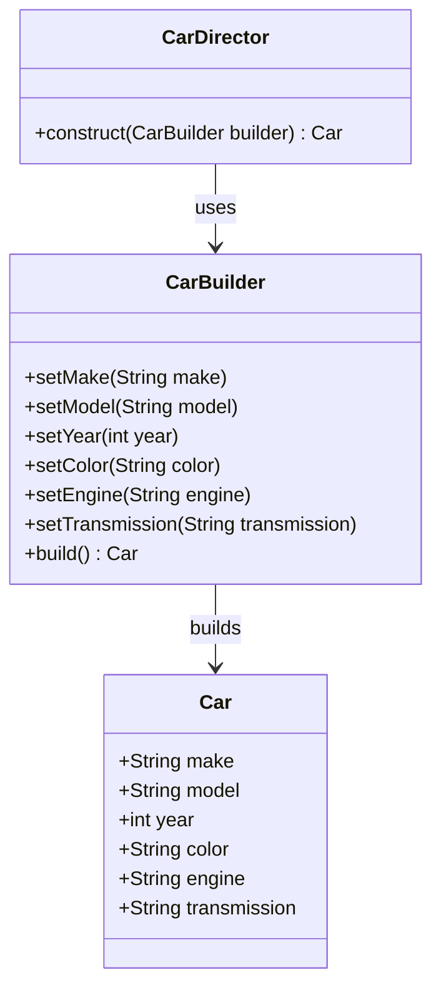

## 5.7 Builder Pattern for Complex Object Creation

In the realm of software design patterns, the Builder Pattern stands out as a powerful tool for constructing complex objects. This pattern is particularly useful when an object requires numerous parameters or when the construction process involves multiple steps. By separating the construction of an object from its representation, the Builder Pattern provides a flexible solution that enhances code readability and maintainability.

### Understanding the Builder Pattern

The Builder Pattern is a creational design pattern that allows you to construct complex objects step by step. It involves several key components:

- **Builder**: An interface or abstract class that defines the methods for creating different parts of the product.
- **Concrete Builder**: A class that implements the Builder interface and provides specific implementations for building parts of the product.
- **Director**: A class that constructs the object using the Builder interface. It orchestrates the construction process.
- **Product**: The complex object that is being constructed.

#### Intent

The primary intent of the Builder Pattern is to separate the construction of a complex object from its representation, allowing the same construction process to create different representations.

#### Key Participants

- **Builder**: Declares the interface for creating parts of a Product object.
- **ConcreteBuilder**: Constructs and assembles parts of the product by implementing the Builder interface.
- **Director**: Constructs an object using the Builder interface.
- **Product**: Represents the complex object under construction.

#### Applicability

Use the Builder Pattern when:

- The algorithm for creating a complex object should be independent of the parts that make up the object and how they are assembled.
- The construction process must allow different representations for the object that is constructed.

### Implementing the Builder Pattern in JavaScript

Let's explore how to implement the Builder Pattern in JavaScript with a practical example. Consider a scenario where we need to build a complex `Car` object with various customizable features.

```javascript
// Product
class Car {
  constructor() {
    this.make = '';
    this.model = '';
    this.year = 0;
    this.color = '';
    this.engine = '';
    this.transmission = '';
  }
}

// Builder Interface
class CarBuilder {
  constructor() {
    this.car = new Car();
  }

  setMake(make) {
    this.car.make = make;
    return this;
  }

  setModel(model) {
    this.car.model = model;
    return this;
  }

  setYear(year) {
    this.car.year = year;
    return this;
  }

  setColor(color) {
    this.car.color = color;
    return this;
  }

  setEngine(engine) {
    this.car.engine = engine;
    return this;
  }

  setTransmission(transmission) {
    this.car.transmission = transmission;
    return this;
  }

  build() {
    return this.car;
  }
}

// Director
class CarDirector {
  static construct(builder) {
    return builder
      .setMake('Toyota')
      .setModel('Corolla')
      .setYear(2022)
      .setColor('Red')
      .setEngine('V6')
      .setTransmission('Automatic')
      .build();
  }
}

// Usage
const carBuilder = new CarBuilder();
const car = CarDirector.construct(carBuilder);
console.log(car);
```

In this example, the `CarBuilder` class provides methods to set various attributes of the `Car` object. The `CarDirector` class orchestrates the construction process, ensuring that the `Car` is built with the desired specifications.

### Benefits of the Builder Pattern

The Builder Pattern offers several advantages:

- **Improved Readability**: By breaking down the construction process into discrete steps, the Builder Pattern makes the code more readable and easier to understand.
- **Flexibility**: The pattern allows for different representations of the product, enabling the creation of various configurations of the object.
- **Maintainability**: Changes to the construction process or the product's attributes can be made in a single location, reducing the risk of errors and improving maintainability.

### Comparing with Telescoping Constructors and Object Literals

The Builder Pattern is often compared with telescoping constructors and object literals. Let's examine these alternatives and understand why the Builder Pattern might be preferred in certain scenarios.

#### Telescoping Constructors

Telescoping constructors involve creating multiple constructors with varying numbers of parameters to handle different configurations of an object. This approach can quickly become unwieldy and difficult to manage as the number of parameters increases.

```javascript
class Car {
  constructor(make, model, year, color, engine, transmission) {
    this.make = make;
    this.model = model;
    this.year = year;
    this.color = color;
    this.engine = engine;
    this.transmission = transmission;
  }
}

const car = new Car('Toyota', 'Corolla', 2022, 'Red', 'V6', 'Automatic');
```

While telescoping constructors are straightforward for simple objects, they lack the flexibility and readability of the Builder Pattern for more complex objects.

#### Object Literals

Object literals provide a flexible way to create objects with named properties. However, they can become cumbersome when dealing with complex objects that require validation or specific construction logic.

```javascript
const car = {
  make: 'Toyota',
  model: 'Corolla',
  year: 2022,
  color: 'Red',
  engine: 'V6',
  transmission: 'Automatic'
};
```

While object literals are useful for simple objects, they do not provide the same level of control over the construction process as the Builder Pattern.

### JavaScript Unique Features

JavaScript's dynamic nature and prototypal inheritance model make it uniquely suited for implementing the Builder Pattern. The use of method chaining and fluent interfaces, as demonstrated in the `CarBuilder` class, allows for a clean and expressive syntax.

### Design Considerations

When implementing the Builder Pattern in JavaScript, consider the following:

- **Method Chaining**: Use method chaining to provide a fluent interface, allowing for a more readable and expressive construction process.
- **Immutability**: Consider making the product immutable once it is built to prevent unintended modifications.
- **Validation**: Implement validation logic within the builder to ensure that the constructed object meets the required specifications.

### Visualizing the Builder Pattern

To better understand the Builder Pattern, let's visualize the interaction between its components using a class diagram.



This diagram illustrates the relationships between the `Car`, `CarBuilder`, and `CarDirector` classes, highlighting how the Builder Pattern orchestrates the construction of complex objects.

### Try It Yourself

To deepen your understanding of the Builder Pattern, try modifying the `CarBuilder` class to include additional features, such as `sunroof` or `GPS`. Experiment with different configurations and observe how the pattern facilitates the construction process.

### Knowledge Check

- What are the key components of the Builder Pattern?
- How does the Builder Pattern improve code readability and maintainability?
- In what scenarios is the Builder Pattern particularly useful?
- Compare the Builder Pattern with telescoping constructors and object literals.
- How does JavaScript's dynamic nature enhance the implementation of the Builder Pattern?

### Embrace the Journey

Remember, mastering design patterns is a journey. As you continue to explore and experiment with the Builder Pattern, you'll gain a deeper understanding of how to construct complex objects efficiently. Keep experimenting, stay curious, and enjoy the journey!

### References and Further Reading

- [MDN Web Docs: Object-oriented JavaScript](https://developer.mozilla.org/en-US/docs/Learn/JavaScript/Objects/Object-oriented_JS)
- [Refactoring Guru: Builder Pattern](https://refactoring.guru/design-patterns/builder)
- [W3Schools: JavaScript Objects](https://www.w3schools.com/js/js_objects.asp)

## Test Your Knowledge on the Builder Pattern in JavaScript



### What is the primary intent of the Builder Pattern?

- [x] To separate the construction of a complex object from its representation
- [ ] To provide a single method for object creation
- [ ] To allow objects to be created without exposing the creation logic
- [ ] To enable objects to be cloned

> **Explanation:** The Builder Pattern's primary intent is to separate the construction of a complex object from its representation, allowing the same construction process to create different representations.

### Which component of the Builder Pattern is responsible for orchestrating the construction process?

- [ ] Builder
- [x] Director
- [ ] Product
- [ ] Concrete Builder

> **Explanation:** The Director is responsible for orchestrating the construction process using the Builder interface.

### How does the Builder Pattern improve code readability?

- [x] By breaking down the construction process into discrete steps
- [ ] By reducing the number of classes
- [ ] By using fewer lines of code
- [ ] By eliminating the need for constructors

> **Explanation:** The Builder Pattern improves code readability by breaking down the construction process into discrete steps, making the code easier to understand.

### In what scenario is the Builder Pattern particularly useful?

- [x] When constructing complex objects with many parameters
- [ ] When creating simple objects with few parameters
- [ ] When cloning objects
- [ ] When objects require no validation

> **Explanation:** The Builder Pattern is particularly useful when constructing complex objects with many parameters or when the construction process involves multiple steps.

### How does JavaScript's dynamic nature enhance the Builder Pattern?

- [x] By allowing method chaining and fluent interfaces
- [ ] By reducing the need for classes
- [ ] By enabling object cloning
- [ ] By simplifying inheritance

> **Explanation:** JavaScript's dynamic nature enhances the Builder Pattern by allowing method chaining and fluent interfaces, resulting in a clean and expressive syntax.

### What is a potential drawback of telescoping constructors?

- [x] They can become unwieldy and difficult to manage
- [ ] They provide too much flexibility
- [ ] They are too simple for complex objects
- [ ] They require too many classes

> **Explanation:** Telescoping constructors can become unwieldy and difficult to manage as the number of parameters increases, making them less suitable for complex objects.

### How does the Builder Pattern differ from object literals?

- [x] It provides more control over the construction process
- [ ] It uses fewer lines of code
- [ ] It eliminates the need for constructors
- [ ] It requires fewer parameters

> **Explanation:** The Builder Pattern differs from object literals by providing more control over the construction process, allowing for validation and specific construction logic.

### What is a key benefit of using the Builder Pattern?

- [x] Improved maintainability
- [ ] Reduced number of classes
- [ ] Simplified inheritance
- [ ] Faster object creation

> **Explanation:** A key benefit of using the Builder Pattern is improved maintainability, as changes to the construction process or the product's attributes can be made in a single location.

### True or False: The Builder Pattern is only useful for creating simple objects.

- [ ] True
- [x] False

> **Explanation:** False. The Builder Pattern is particularly useful for creating complex objects with many parameters or when the construction process involves multiple steps.

### Which of the following is NOT a component of the Builder Pattern?

- [ ] Builder
- [ ] Director
- [ ] Product
- [x] Singleton

> **Explanation:** Singleton is not a component of the Builder Pattern. The Builder Pattern consists of the Builder, Director, and Product components.




