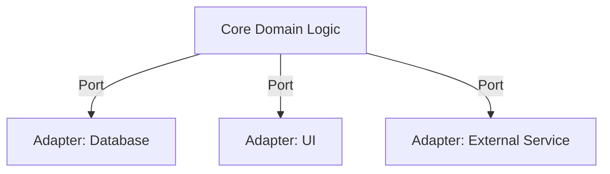

## 5.8.1 Hexagonal Architecture

Hexagonal Architecture, also known as Ports and Adapters, is an architectural pattern that aims to create a flexible and maintainable system by decoupling the core business logic from external systems. This pattern centers the system around the domain logic, with secondary layers for input/output operations. Let's dive into the details of Hexagonal Architecture, its implementation, best practices, and use cases.

### Understand the Structure

Hexagonal Architecture organizes the system into three main components:

1. **Core Domain Logic:** The heart of the application, containing all the business rules and logic.
2. **Ports:** Interfaces that define the operations required by the domain logic.
3. **Adapters:** Implementations that connect the core domain to external systems like databases, user interfaces, or other services.

Here's a conceptual diagram illustrating Hexagonal Architecture:



### Implementation Steps

#### 1. Identify Core Domain

The first step is to identify and implement the core domain logic independently. This involves defining the business rules and processes that are central to the application. The core domain should be free from any external dependencies to ensure it remains pure and focused on the business logic.

#### 2. Define Ports

Ports are interfaces that declare the operations required by the domain. They act as a contract between the core domain and the external systems. By defining ports, you ensure that the core domain remains decoupled from the specifics of the external systems.

Example of a port in TypeScript:

```typescript
// Define a port for a repository
export interface UserRepository {
    findUserById(id: string): Promise<User | null>;
    saveUser(user: User): Promise<void>;
}
```

#### 3. Implement Adapters

Adapters are the concrete implementations that connect external systems to the core domain via ports. They handle the specifics of interacting with databases, user interfaces, or other services.

Example of an adapter in TypeScript:

```typescript
import { UserRepository } from './ports/UserRepository';
import { User } from './domain/User';

class DatabaseUserRepository implements UserRepository {
    async findUserById(id: string): Promise<User | null> {
        // Implement database logic to find a user by ID
    }

    async saveUser(user: User): Promise<void> {
        // Implement database logic to save a user
    }
}
```

### Best Practices

- **Keep the Domain Model Pure:** Ensure that the domain logic is free from external concerns and dependencies.
- **Use Dependency Inversion:** Apply the Dependency Inversion Principle to decouple components and allow for flexible implementations.
- **Test the Core Domain Independently:** Since the core domain is decoupled from external systems, it can be tested independently, leading to more reliable and maintainable code.

### Use Cases

Hexagonal Architecture is particularly useful in scenarios where:

- The system needs to support multiple clients or interfaces.
- There is a need to swap or replace external systems without affecting the core domain.
- The application requires high maintainability and flexibility.

### Considerations

While Hexagonal Architecture offers numerous benefits, it may introduce an initial overhead in setting up the architecture. The separation of concerns and the need to define interfaces and adapters can require additional effort during the initial development phase.

### Advantages and Disadvantages

#### Advantages

- **Flexibility:** Easily adapt to changes in external systems without affecting the core domain.
- **Maintainability:** The separation of concerns leads to cleaner and more maintainable code.
- **Testability:** The core domain can be tested independently from external systems.

#### Disadvantages

- **Initial Complexity:** Setting up the architecture can be complex and time-consuming.
- **Overhead:** Additional layers and interfaces may introduce some overhead.

### Conclusion

Hexagonal Architecture provides a robust framework for building flexible and maintainable systems by decoupling the core domain logic from external systems. By following the implementation steps and best practices outlined in this guide, you can leverage the benefits of Hexagonal Architecture in your JavaScript and TypeScript applications.

## Quiz Time!



### What is the primary goal of Hexagonal Architecture?

- [x] To decouple the core business logic from external systems
- [ ] To increase the complexity of the system
- [ ] To focus solely on user interface design
- [ ] To eliminate the need for testing

> **Explanation:** Hexagonal Architecture aims to decouple the core business logic from external systems, making the system more flexible and maintainable.

### In Hexagonal Architecture, what are Ports?

- [x] Interfaces that define operations required by the domain
- [ ] Concrete implementations of external systems
- [ ] The core business logic
- [ ] Database connections

> **Explanation:** Ports are interfaces that define the operations required by the domain, acting as a contract between the core domain and external systems.

### What is the role of Adapters in Hexagonal Architecture?

- [x] To connect external systems to the core domain via ports
- [ ] To define the core business logic
- [ ] To act as the user interface
- [ ] To replace the need for ports

> **Explanation:** Adapters are concrete implementations that connect external systems to the core domain via ports.

### Which principle is crucial for maintaining decoupling in Hexagonal Architecture?

- [x] Dependency Inversion Principle
- [ ] Single Responsibility Principle
- [ ] Open/Closed Principle
- [ ] Liskov Substitution Principle

> **Explanation:** The Dependency Inversion Principle is crucial for maintaining decoupling in Hexagonal Architecture, allowing for flexible implementations.

### What is a potential disadvantage of Hexagonal Architecture?

- [x] Initial complexity and overhead
- [ ] Lack of flexibility
- [ ] Poor maintainability
- [ ] Difficulty in testing

> **Explanation:** Hexagonal Architecture can introduce initial complexity and overhead due to the need for additional layers and interfaces.

### Which of the following is a best practice in Hexagonal Architecture?

- [x] Keep the domain model pure and free from external concerns
- [ ] Integrate all external systems directly into the core domain
- [ ] Avoid using interfaces for ports
- [ ] Focus solely on database interactions

> **Explanation:** Keeping the domain model pure and free from external concerns is a best practice in Hexagonal Architecture.

### What is the benefit of testing the core domain independently?

- [x] It leads to more reliable and maintainable code
- [ ] It eliminates the need for adapters
- [ ] It focuses solely on user interface testing
- [ ] It reduces the need for ports

> **Explanation:** Testing the core domain independently leads to more reliable and maintainable code, as it is decoupled from external systems.

### In which scenario is Hexagonal Architecture particularly useful?

- [x] Systems that need to support multiple clients or interfaces
- [ ] Applications with a single user interface
- [ ] Systems that do not require flexibility
- [ ] Projects with minimal external dependencies

> **Explanation:** Hexagonal Architecture is useful in systems that need to support multiple clients or interfaces, providing flexibility and maintainability.

### What does the core domain contain in Hexagonal Architecture?

- [x] Business rules and logic
- [ ] User interface components
- [ ] Database connections
- [ ] External service integrations

> **Explanation:** The core domain contains business rules and logic, which are central to the application.

### True or False: Hexagonal Architecture eliminates the need for testing.

- [ ] True
- [x] False

> **Explanation:** False. Hexagonal Architecture does not eliminate the need for testing; instead, it allows for more focused and independent testing of the core domain.


