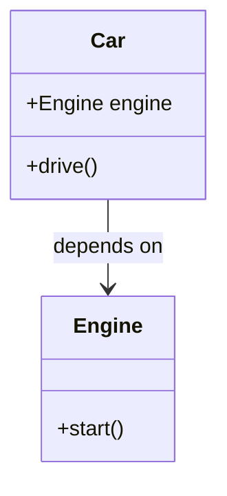

## 5.8 Dependency Injection Pattern

### Introduction

In the realm of software design patterns, the **Dependency Injection (DI) Pattern** stands out as a powerful technique for achieving loose coupling between components. By decoupling the creation of an object from its dependencies, DI enhances the modularity and testability of code. This section will delve into the intricacies of the Dependency Injection Pattern in JavaScript, exploring its implementation, benefits, and best practices.

### What is Dependency Injection?

**Dependency Injection** is a design pattern used to implement IoC (Inversion of Control), allowing the creation of dependent objects outside of a class and providing those objects to a class through various means. This pattern is particularly useful in managing dependencies and promoting loose coupling between components.

#### Purpose of Dependency Injection

- **Decoupling**: By injecting dependencies, we reduce the direct dependencies between components, making the system more modular.
- **Testability**: DI facilitates testing by allowing mock dependencies to be injected during testing.
- **Maintainability**: With DI, changes to dependencies require minimal changes to the classes that use them.

### Implementing Dependency Injection in JavaScript

JavaScript, being a dynamic language, offers several ways to implement Dependency Injection. The most common methods include constructor injection, setter injection, and method injection.

#### Constructor Injection

Constructor Injection involves passing dependencies to a class through its constructor. This method ensures that a class is always initialized with its required dependencies.

```javascript
class Engine {
  start() {
    console.log('Engine started');
  }
}

class Car {
  constructor(engine) {
    this.engine = engine;
  }

  drive() {
    this.engine.start();
    console.log('Car is driving');
  }
}

// Dependency Injection
const engine = new Engine();
const car = new Car(engine);
car.drive();
```

In this example, the `Car` class receives an `Engine` instance through its constructor, promoting loose coupling.

#### Setter Injection

Setter Injection uses setter methods to inject dependencies after the object is constructed. This approach provides flexibility in changing dependencies at runtime.

```javascript
class Car {
  setEngine(engine) {
    this.engine = engine;
  }

  drive() {
    if (this.engine) {
      this.engine.start();
      console.log('Car is driving');
    } else {
      console.log('Engine not set');
    }
  }
}

// Dependency Injection
const engine = new Engine();
const car = new Car();
car.setEngine(engine);
car.drive();
```

Setter Injection allows for optional dependencies and can be useful in scenarios where dependencies may change.

#### Method Injection

Method Injection involves passing dependencies as parameters to methods. This technique is useful for injecting dependencies that are only needed for specific operations.

```javascript
class Car {
  drive(engine) {
    engine.start();
    console.log('Car is driving');
  }
}

// Dependency Injection
const engine = new Engine();
const car = new Car();
car.drive(engine);
```

Method Injection provides the most flexibility but can lead to more verbose code if not managed properly.

### Benefits of Dependency Injection

#### Enhanced Testability

By decoupling dependencies, DI makes it easier to substitute real dependencies with mock objects during testing. This capability is crucial for unit testing, where isolating the unit under test is essential.

#### Improved Maintainability

With DI, changes to a dependency do not necessitate changes to the dependent classes. This separation of concerns leads to cleaner, more maintainable code.

#### Increased Flexibility

DI allows for dynamic configuration of dependencies, enabling different implementations to be injected based on the environment or context.

### Frameworks Supporting Dependency Injection

Several JavaScript frameworks support Dependency Injection, with Angular being one of the most prominent.

#### Angular

Angular's DI system is a core feature that provides a robust mechanism for managing dependencies. It allows developers to define providers that supply dependencies to components and services.

For more information, visit the [Angular Dependency Injection Guide](https://angular.io/guide/dependency-injection).

### Potential Drawbacks and Best Practices

While Dependency Injection offers numerous benefits, it also comes with potential drawbacks:

- **Complexity**: Introducing DI can add complexity to the codebase, especially for developers unfamiliar with the pattern.
- **Overhead**: In some cases, DI can introduce performance overhead due to the additional abstraction layers.

#### Best Practices

- **Use DI Judiciously**: Apply DI where it adds value, such as in complex systems with multiple dependencies.
- **Keep It Simple**: Avoid over-engineering with DI; use it to solve specific problems rather than applying it universally.
- **Document Dependencies**: Clearly document the dependencies of each component to aid understanding and maintenance.

### Visualizing Dependency Injection

To better understand how Dependency Injection works, let's visualize the flow of dependencies in a system using a class diagram.



**Diagram Description**: This class diagram illustrates the relationship between the `Car` and `Engine` classes, where `Car` depends on `Engine`. The dependency is injected into `Car`, promoting loose coupling.

### Try It Yourself

Experiment with the code examples provided by modifying the dependencies. For instance, create a new `ElectricEngine` class and inject it into the `Car` class to observe how DI facilitates flexibility.

### Knowledge Check

Test your understanding of the Dependency Injection Pattern with the following quiz.

## Mastering Dependency Injection Pattern Quiz



### What is the primary purpose of Dependency Injection?

- [x] To achieve loose coupling between components
- [ ] To increase the number of dependencies
- [ ] To make code more complex
- [ ] To eliminate the need for testing

> **Explanation:** Dependency Injection aims to decouple components, making them more modular and easier to test.

### Which method of Dependency Injection involves passing dependencies through a class constructor?

- [x] Constructor Injection
- [ ] Setter Injection
- [ ] Method Injection
- [ ] Interface Injection

> **Explanation:** Constructor Injection involves passing dependencies through the constructor, ensuring they are available when the object is created.

### What is a potential drawback of using Dependency Injection?

- [x] Increased complexity
- [ ] Reduced testability
- [ ] Tight coupling
- [ ] Lack of flexibility

> **Explanation:** Dependency Injection can introduce complexity, especially for developers unfamiliar with the pattern.

### Which JavaScript framework prominently supports Dependency Injection?

- [x] Angular
- [ ] React
- [ ] Vue.js
- [ ] Ember.js

> **Explanation:** Angular has a built-in Dependency Injection system that is a core part of its architecture.

### What is a benefit of using Dependency Injection for testing?

- [x] Easier substitution of mock dependencies
- [ ] Increased code complexity
- [ ] Reduced test coverage
- [ ] Harder to isolate units

> **Explanation:** Dependency Injection allows for easy substitution of real dependencies with mock objects, facilitating unit testing.

### Which type of injection allows dependencies to be changed at runtime?

- [x] Setter Injection
- [ ] Constructor Injection
- [ ] Method Injection
- [ ] Interface Injection

> **Explanation:** Setter Injection allows dependencies to be set or changed after object creation, providing runtime flexibility.

### What is a best practice when using Dependency Injection?

- [x] Use DI judiciously where it adds value
- [ ] Apply DI universally to all components
- [ ] Avoid documenting dependencies
- [ ] Use DI to increase code complexity

> **Explanation:** It's best to use Dependency Injection where it adds value and to document dependencies clearly.

### Which injection method involves passing dependencies as parameters to methods?

- [x] Method Injection
- [ ] Constructor Injection
- [ ] Setter Injection
- [ ] Interface Injection

> **Explanation:** Method Injection involves passing dependencies as parameters to specific methods.

### What is a key benefit of Dependency Injection in terms of maintainability?

- [x] Changes to dependencies require minimal changes to dependent classes
- [ ] Dependencies are tightly coupled
- [ ] Code becomes harder to understand
- [ ] Dependencies are hidden

> **Explanation:** Dependency Injection promotes maintainability by decoupling dependencies, allowing for easier updates and changes.

### True or False: Dependency Injection can help reduce the complexity of a codebase.

- [ ] True
- [x] False

> **Explanation:** While Dependency Injection promotes loose coupling and testability, it can introduce complexity due to additional abstraction layers.



### Conclusion

The Dependency Injection Pattern is a powerful tool in the software developer's arsenal, promoting loose coupling, enhancing testability, and improving maintainability. By understanding and implementing DI effectively, developers can create more modular and flexible applications. Remember, this is just the beginning. As you progress, you'll build more complex and interactive applications. Keep experimenting, stay curious, and enjoy the journey!
