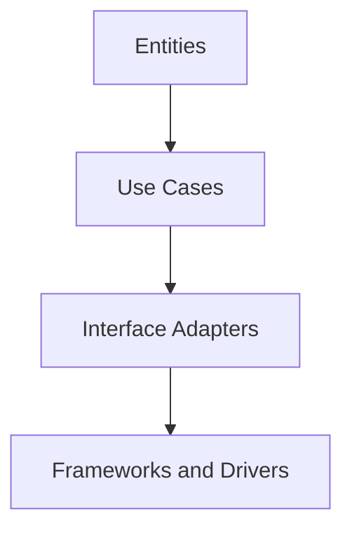

---

linkTitle: "5.9.1 Clean Architecture Principles"
title: "Clean Architecture Principles: A Guide to Building Robust Software"
description: "Explore Clean Architecture principles in JavaScript and TypeScript, focusing on layer separation, dependency management, and best practices for maintainable and testable software."
categories:
- Software Architecture
- JavaScript
- TypeScript
tags:
- Clean Architecture
- Software Design
- JavaScript
- TypeScript
- Best Practices
date: 2024-10-25
type: docs
nav_weight: 591000
canonical: "https://softwarepatternslexicon.com/patterns-js/5/9/1"
license: "© 2024 Tokenizer Inc. CC BY-NC-SA 4.0"
---

## 5.9.1 Clean Architecture Principles

Clean Architecture is a software design philosophy that emphasizes the separation of concerns, making applications more maintainable, testable, and scalable. This approach is particularly beneficial in JavaScript and TypeScript applications, where the complexity of modern web applications demands robust architectural patterns.

### Understand the Layers

Clean Architecture is structured around four primary layers, each with distinct responsibilities:

- **Entities:** These are the core business models and rules. They encapsulate the most general and high-level business logic, independent of any specific application or framework.

- **Use Cases:** This layer contains application-specific business rules. It orchestrates the flow of data to and from the entities and directs the application to execute specific tasks.

- **Interface Adapters:** This layer is responsible for converting data from the use case and entity layers to a format suitable for external agencies, such as user interfaces or APIs.

- **Frameworks and Drivers:** The outermost layer, which includes external tools and delivery mechanisms like databases, web frameworks, and UI components.

#### Diagram: Clean Architecture Layers



### Implementation Steps

#### Establish Boundaries

1. **Define Clear Boundaries Between Layers:**
   - Each layer should have a well-defined role and should not depend on the specifics of other layers. This separation ensures that changes in one layer do not ripple through the entire system.

2. **Implement Dependency Rules:**
   - Inner layers should not depend on outer layers. Instead, outer layers can depend on inner layers. This rule is crucial for maintaining the independence and testability of the core business logic.

#### Implement Interactions

1. **Use Interfaces for Communication Between Layers:**
   - Interfaces act as contracts between layers, allowing them to interact without knowing the specifics of each other's implementations. This abstraction facilitates easier testing and swapping of components.

### Best Practices

- **Inner Layers Should Not Depend on Outer Layers:**
  - This principle ensures that the core business logic remains unaffected by changes in external frameworks or delivery mechanisms.

- **Details Depend on Abstractions, Not the Other Way Around:**
  - By depending on abstractions, the system remains flexible and adaptable to changes in technology or business requirements.

### Use Cases

Clean Architecture is particularly useful in scenarios where long-term maintainability and testability are priorities. It is ideal for large-scale applications that require a robust structure to manage complexity and facilitate ongoing development.

### Considerations

- **Complexity May Not Be Justified for Small Applications:**
  - For smaller projects, the overhead of implementing Clean Architecture might outweigh its benefits. It is essential to assess the project's scope and future needs before adopting this architecture.

- **Requires Strict Adherence to Principles:**
  - Successful implementation of Clean Architecture demands discipline in maintaining boundaries and adhering to dependency rules. Deviations can lead to increased complexity and reduced maintainability.

### Code Example: Implementing Clean Architecture in TypeScript

Below is a simplified example demonstrating how Clean Architecture can be implemented in a TypeScript application:

```typescript
// Entities
class User {
    constructor(public id: number, public name: string) {}
}

// Use Cases
interface UserRepository {
    findUserById(id: number): User | null;
}

class GetUserUseCase {
    constructor(private userRepository: UserRepository) {}

    execute(id: number): User | null {
        return this.userRepository.findUserById(id);
    }
}

// Interface Adapters
class UserController {
    constructor(private getUserUseCase: GetUserUseCase) {}

    getUser(id: number): User | null {
        return this.getUserUseCase.execute(id);
    }
}

// Frameworks and Drivers
class InMemoryUserRepository implements UserRepository {
    private users = [new User(1, 'Alice'), new User(2, 'Bob')];

    findUserById(id: number): User | null {
        return this.users.find(user => user.id === id) || null;
    }
}

// Application Setup
const userRepository = new InMemoryUserRepository();
const getUserUseCase = new GetUserUseCase(userRepository);
const userController = new UserController(getUserUseCase);

console.log(userController.getUser(1)); // Output: User { id: 1, name: 'Alice' }
```

### Advantages and Disadvantages

**Advantages:**

- **Maintainability:** Clear separation of concerns makes the application easier to maintain and extend.
- **Testability:** Independent layers facilitate unit testing and integration testing.
- **Flexibility:** The architecture allows for easy adaptation to new requirements or technologies.

**Disadvantages:**

- **Complexity:** The architecture can introduce complexity, especially in smaller projects.
- **Learning Curve:** Developers need to understand and adhere to the principles strictly.

### Best Practices for Effective Implementation

- **Consistent Layer Separation:** Maintain strict boundaries between layers to prevent coupling.
- **Use Dependency Injection:** Facilitate the decoupling of components and enhance testability.
- **Regular Refactoring:** Continuously refactor to maintain the integrity of the architecture.

### Conclusion

Clean Architecture offers a robust framework for building scalable and maintainable applications in JavaScript and TypeScript. By adhering to its principles, developers can create systems that are resilient to change and easy to test. However, it is crucial to weigh the benefits against the complexity it introduces, especially for smaller projects.

## Quiz Time!



### What is the primary purpose of the Entities layer in Clean Architecture?

- [x] To encapsulate core business models and rules
- [ ] To handle user interface interactions
- [ ] To manage external frameworks and tools
- [ ] To convert data formats

> **Explanation:** The Entities layer is responsible for encapsulating the core business models and rules, independent of specific applications or frameworks.

### Which layer in Clean Architecture is responsible for application-specific business rules?

- [x] Use Cases
- [ ] Entities
- [ ] Interface Adapters
- [ ] Frameworks and Drivers

> **Explanation:** The Use Cases layer contains application-specific business rules and orchestrates the flow of data to and from the entities.

### What is the role of Interface Adapters in Clean Architecture?

- [x] To convert data formats between layers
- [ ] To manage core business logic
- [ ] To handle external frameworks
- [ ] To define application-specific rules

> **Explanation:** Interface Adapters are responsible for converting data from the use case and entity layers to a format suitable for external agencies.

### In Clean Architecture, which layers should not depend on each other?

- [x] Inner layers should not depend on outer layers
- [ ] Outer layers should not depend on inner layers
- [ ] All layers can depend on each other
- [ ] Interface Adapters should depend on Entities

> **Explanation:** Inner layers should not depend on outer layers to maintain independence and testability.

### What is a key consideration when implementing Clean Architecture in small applications?

- [x] Complexity may not be justified
- [ ] It simplifies the architecture
- [ ] It reduces the need for testing
- [ ] It eliminates the need for interfaces

> **Explanation:** The complexity introduced by Clean Architecture may not be justified for small applications.

### Which principle is crucial for maintaining the independence of core business logic in Clean Architecture?

- [x] Details depend on abstractions
- [ ] Abstractions depend on details
- [ ] All layers are tightly coupled
- [ ] Use cases depend on frameworks

> **Explanation:** Details should depend on abstractions to keep the core business logic independent and adaptable.

### What is a disadvantage of Clean Architecture?

- [x] It can introduce complexity
- [ ] It reduces maintainability
- [ ] It limits testability
- [ ] It increases coupling

> **Explanation:** Clean Architecture can introduce complexity, especially in smaller projects.

### How does Clean Architecture enhance testability?

- [x] By maintaining independent layers
- [ ] By coupling all components
- [ ] By eliminating interfaces
- [ ] By using a single layer for all logic

> **Explanation:** Independent layers facilitate unit testing and integration testing, enhancing testability.

### What is the benefit of using interfaces between layers in Clean Architecture?

- [x] They act as contracts for communication
- [ ] They increase dependency
- [ ] They eliminate the need for testing
- [ ] They simplify the architecture

> **Explanation:** Interfaces act as contracts between layers, allowing them to interact without knowing the specifics of each other's implementations.

### True or False: Clean Architecture is only suitable for large-scale applications.

- [ ] True
- [x] False

> **Explanation:** While Clean Architecture is beneficial for large-scale applications, it can also be applied to smaller projects if the complexity is justified.


