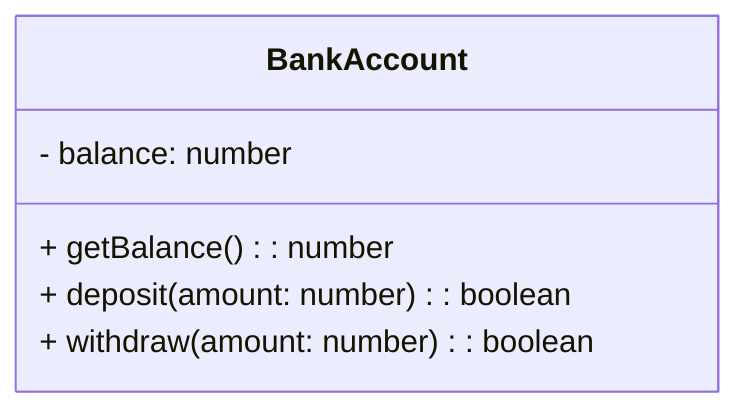

## 5.9 Revealing Constructor Pattern

### Introduction

In the realm of JavaScript design patterns, the Revealing Constructor Pattern stands out as a sophisticated approach to object creation, combining the principles of the Revealing Module Pattern with constructors. This pattern is particularly useful for creating objects with private and privileged members, enhancing data privacy and encapsulation. In this section, we will delve into the intricacies of the Revealing Constructor Pattern, explore its implementation, and discuss its benefits and trade-offs.

### Understanding the Revealing Constructor Pattern

The Revealing Constructor Pattern is a design pattern that leverages the concept of closures to create objects with private variables and methods. It builds upon the traditional constructor pattern by incorporating the principles of the Revealing Module Pattern, which focuses on exposing only the necessary parts of an object while keeping the rest private.

#### Key Concepts

- **Private Members**: Variables and methods that are not accessible from outside the object.
- **Privileged Methods**: Methods that have access to private members and can manipulate them.
- **Encapsulation**: The practice of bundling data and methods that operate on that data within a single unit, restricting access to some of the object's components.

### Implementing the Revealing Constructor Pattern

Let's explore how to implement the Revealing Constructor Pattern in JavaScript with a practical example.

#### Example: Creating a Bank Account Object

```javascript
function BankAccount(initialBalance) {
    // Private variable
    let balance = initialBalance;

    // Privileged method to get the balance
    this.getBalance = function() {
        return balance;
    };

    // Privileged method to deposit money
    this.deposit = function(amount) {
        if (amount > 0) {
            balance += amount;
            return true;
        }
        return false;
    };

    // Privileged method to withdraw money
    this.withdraw = function(amount) {
        if (amount > 0 && amount <= balance) {
            balance -= amount;
            return true;
        }
        return false;
    };
}

// Usage
const myAccount = new BankAccount(100);
console.log(myAccount.getBalance()); // 100
myAccount.deposit(50);
console.log(myAccount.getBalance()); // 150
myAccount.withdraw(30);
console.log(myAccount.getBalance()); // 120
```

In this example, the `BankAccount` constructor function creates an object with a private `balance` variable. The methods `getBalance`, `deposit`, and `withdraw` are privileged methods that have access to the private `balance` variable, allowing controlled interaction with it.

### Benefits of the Revealing Constructor Pattern

- **Data Privacy**: By keeping variables private, the pattern ensures that sensitive data is not exposed to the outside world.
- **Encapsulation**: It encapsulates the data and methods within a single unit, promoting a clean and organized code structure.
- **Controlled Access**: Privileged methods provide controlled access to private members, allowing for validation and error handling.

### Trade-offs and Considerations

While the Revealing Constructor Pattern offers significant benefits, it also comes with trade-offs:

- **Memory Usage**: Each instance of an object created using this pattern has its own copy of the privileged methods, which can lead to increased memory usage.
- **Performance**: The use of closures can impact performance, especially when creating a large number of objects.

### Comparing with Closures and Traditional Constructors

The Revealing Constructor Pattern shares similarities with closures and traditional constructors but also has distinct differences.

- **Closures**: Both closures and the Revealing Constructor Pattern use closures to maintain private state. However, the Revealing Constructor Pattern explicitly exposes privileged methods, providing a structured approach to accessing private members.
- **Traditional Constructors**: Traditional constructors do not inherently provide private members. The Revealing Constructor Pattern enhances traditional constructors by incorporating data privacy and encapsulation.

### When to Use the Revealing Constructor Pattern

The Revealing Constructor Pattern is particularly useful in scenarios where:

- **Data Privacy is Crucial**: When sensitive data needs to be protected from external access.
- **Encapsulation is Desired**: When a clean and organized code structure is needed, with clear separation between public and private members.
- **Controlled Access is Required**: When access to certain members needs to be controlled and validated.

### Visualizing the Revealing Constructor Pattern

To better understand the Revealing Constructor Pattern, let's visualize the structure of an object created using this pattern.



In this diagram, the `BankAccount` class has a private `balance` variable and three public methods: `getBalance`, `deposit`, and `withdraw`. The private `balance` variable is not accessible from outside the class, ensuring data privacy.

### Try It Yourself

To gain a deeper understanding of the Revealing Constructor Pattern, try modifying the code example provided earlier. Here are a few suggestions:

- **Add a new method**: Implement a `transfer` method that transfers money between two `BankAccount` instances.
- **Implement error handling**: Add error handling to the `deposit` and `withdraw` methods to handle invalid inputs.
- **Create a subclass**: Extend the `BankAccount` class to create a `SavingsAccount` class with additional features.

### Conclusion

The Revealing Constructor Pattern is a powerful tool in the JavaScript developer's toolkit, offering enhanced data privacy and encapsulation. By combining the principles of the Revealing Module Pattern with constructors, this pattern provides a structured approach to object creation, with controlled access to private members. While it comes with trade-offs in terms of memory usage and performance, its benefits make it a valuable pattern in scenarios where data privacy and encapsulation are paramount.

### Knowledge Check

## Test Your Understanding of the Revealing Constructor Pattern



### What is the main advantage of the Revealing Constructor Pattern?

- [x] It enhances data privacy by keeping variables private.
- [ ] It reduces memory usage by sharing methods across instances.
- [ ] It simplifies code by exposing all members publicly.
- [ ] It improves performance by avoiding closures.

> **Explanation:** The Revealing Constructor Pattern enhances data privacy by keeping variables private and exposing only necessary methods.

### How does the Revealing Constructor Pattern differ from traditional constructors?

- [x] It provides private members and privileged methods.
- [ ] It does not use the `new` keyword for object creation.
- [ ] It exposes all variables and methods publicly.
- [ ] It avoids using closures for data encapsulation.

> **Explanation:** The Revealing Constructor Pattern provides private members and privileged methods, unlike traditional constructors that do not inherently offer private members.

### What is a trade-off of using the Revealing Constructor Pattern?

- [x] Increased memory usage due to instance-specific methods.
- [ ] Lack of data privacy and encapsulation.
- [ ] Difficulty in creating new instances.
- [ ] Inability to use closures for private state.

> **Explanation:** The Revealing Constructor Pattern can lead to increased memory usage because each instance has its own copy of the privileged methods.

### In which scenario is the Revealing Constructor Pattern particularly useful?

- [x] When data privacy and controlled access are crucial.
- [ ] When performance is the primary concern.
- [ ] When all members need to be publicly accessible.
- [ ] When memory usage needs to be minimized.

> **Explanation:** The Revealing Constructor Pattern is particularly useful when data privacy and controlled access are crucial.

### What is a privileged method in the context of the Revealing Constructor Pattern?

- [x] A method that has access to private members.
- [ ] A method that is publicly accessible.
- [ ] A method that does not use closures.
- [ ] A method that is shared across all instances.

> **Explanation:** A privileged method in the Revealing Constructor Pattern has access to private members and can manipulate them.

### How does the Revealing Constructor Pattern achieve encapsulation?

- [x] By bundling data and methods within a single unit.
- [ ] By exposing all variables and methods publicly.
- [ ] By avoiding the use of closures.
- [ ] By sharing methods across instances.

> **Explanation:** The Revealing Constructor Pattern achieves encapsulation by bundling data and methods within a single unit, restricting access to private members.

### What is a potential downside of using closures in the Revealing Constructor Pattern?

- [x] Impact on performance due to closure creation.
- [ ] Lack of data privacy and encapsulation.
- [ ] Difficulty in accessing private members.
- [ ] Inability to create new instances.

> **Explanation:** The use of closures in the Revealing Constructor Pattern can impact performance due to the creation of closures for each instance.

### How can you modify the `BankAccount` example to add a `transfer` method?

- [x] Implement a method that transfers money between two `BankAccount` instances.
- [ ] Expose the `balance` variable publicly.
- [ ] Remove the `withdraw` method.
- [ ] Avoid using closures for private state.

> **Explanation:** To add a `transfer` method, implement a method that transfers money between two `BankAccount` instances, ensuring controlled access to private members.

### What is the role of the `balance` variable in the `BankAccount` example?

- [x] It is a private variable that stores the account balance.
- [ ] It is a public variable accessible from outside the object.
- [ ] It is a method that calculates the account balance.
- [ ] It is a privileged method that manipulates the account balance.

> **Explanation:** The `balance` variable in the `BankAccount` example is a private variable that stores the account balance, ensuring data privacy.

### True or False: The Revealing Constructor Pattern is a type of creational design pattern.

- [x] True
- [ ] False

> **Explanation:** True. The Revealing Constructor Pattern is a type of creational design pattern that focuses on object creation with private and privileged members.



Remember, mastering design patterns like the Revealing Constructor Pattern is just the beginning of your journey in JavaScript development. Keep experimenting, stay curious, and enjoy the process of building robust and secure applications!
