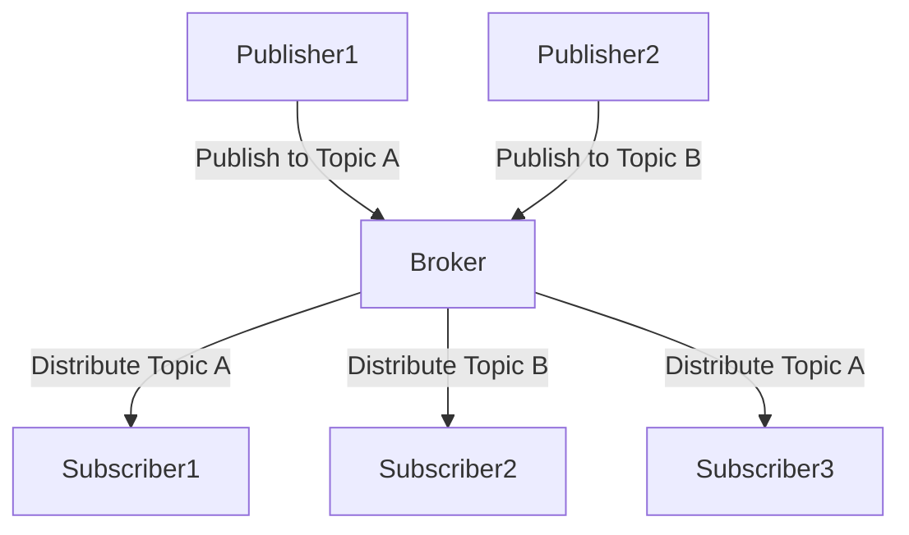

## 6.1.1 Publish/Subscribe

### Introduction

The Publish/Subscribe (Pub/Sub) pattern is a messaging pattern that decouples message producers, known as publishers, from message consumers, known as subscribers. This pattern is widely used in scenarios where real-time communication and event-driven architectures are required. By using topics or channels, publishers can broadcast messages without needing to know which subscribers will receive them, and subscribers can listen to specific topics without needing to know who is publishing the messages.

### Detailed Explanation

#### Conceptual Overview

In the Publish/Subscribe pattern, the communication between components is managed through a message broker or event bus. The broker is responsible for receiving messages from publishers and distributing them to the appropriate subscribers based on the topics or channels they are interested in.



#### Implementation Steps

1. **Choose a Message Broker:**
   - Select a suitable message broker or event bus for your application. Popular choices include Redis Pub/Sub, MQTT, and Apache Kafka.

2. **Define Topics or Channels:**
   - Identify the topics or channels that will be used for communication. These should align with your application's messaging needs.

3. **Implement Publishers:**
   - Write code that publishes messages to specific topics. Publishers should not have any knowledge of the subscribers.

4. **Implement Subscribers:**
   - Write code that subscribes to topics and processes incoming messages. Subscribers should be able to handle messages asynchronously.

### Code Examples

#### Node.js with Redis

Redis is a popular in-memory data structure store that supports the Pub/Sub pattern. Below is a simple implementation using Node.js.

**Publisher:**

```javascript
const redis = require('redis');
const publisher = redis.createClient();

publisher.publish('news', 'Breaking News: New JavaScript feature released!', (err, reply) => {
    if (err) {
        console.error('Error publishing message:', err);
    } else {
        console.log('Message published to', reply, 'subscribers.');
    }
    publisher.quit();
});
```

**Subscriber:**

```javascript
const redis = require('redis');
const subscriber = redis.createClient();

subscriber.subscribe('news');

subscriber.on('message', (channel, message) => {
    console.log(`Received message from ${channel}: ${message}`);
});

// Handle graceful shutdown
process.on('SIGINT', () => {
    subscriber.unsubscribe();
    subscriber.quit();
});
```

#### MQTT.js for MQTT Protocol

MQTT is a lightweight messaging protocol ideal for IoT and real-time applications. Here's how you can implement Pub/Sub using MQTT.js.

**Publisher:**

```javascript
const mqtt = require('mqtt');
const client = mqtt.connect('mqtt://broker.hivemq.com');

client.on('connect', () => {
    client.publish('home/temperature', '23°C');
    client.end();
});
```

**Subscriber:**

```javascript
const mqtt = require('mqtt');
const client = mqtt.connect('mqtt://broker.hivemq.com');

client.on('connect', () => {
    client.subscribe('home/temperature', (err) => {
        if (!err) {
            console.log('Subscribed to home/temperature');
        }
    });
});

client.on('message', (topic, message) => {
    console.log(`Received message from ${topic}: ${message.toString()}`);
});
```

### Use Cases

- **Real-time Updates:** Ideal for applications like live chat, notifications, and news feeds where users need to receive updates in real-time.
- **Event-Driven Architectures:** Components can react to events asynchronously, making it suitable for microservices and distributed systems.

### Practice

To get hands-on experience, try building a live chat application where users can join different channels and receive messages in real-time. This will help you understand how to manage topics and handle message delivery effectively.

### Considerations

- **Message Delivery Guarantees:** Depending on your application's requirements, you may need to ensure that messages are delivered reliably and in order.
- **Security:** Implement authentication and authorization mechanisms to control access to topics and ensure that only authorized users can publish or subscribe to certain channels.

### Advantages and Disadvantages

**Advantages:**

- **Decoupling:** Publishers and subscribers are decoupled, allowing for more flexible and scalable systems.
- **Scalability:** Easily scale the number of publishers and subscribers without affecting each other.
- **Asynchronous Communication:** Supports asynchronous message delivery, which can improve performance and responsiveness.

**Disadvantages:**

- **Complexity:** Introducing a message broker adds complexity to the system architecture.
- **Latency:** Depending on the broker and network conditions, there may be some latency in message delivery.

### Best Practices

- Use a reliable message broker that fits your application's needs.
- Ensure that your subscribers can handle messages asynchronously to avoid blocking operations.
- Regularly monitor and maintain your messaging infrastructure to ensure optimal performance.

### Comparative Analysis

The Publish/Subscribe pattern is often compared to other messaging patterns like Request/Response. While Pub/Sub is suitable for broadcasting messages to multiple consumers, Request/Response is more appropriate for direct communication between two parties.

### Conclusion

The Publish/Subscribe pattern is a powerful tool for building scalable and decoupled systems in JavaScript and TypeScript. By understanding its implementation and use cases, you can leverage this pattern to build robust real-time applications.

## Quiz Time!



### What is the primary purpose of the Publish/Subscribe pattern?

- [x] To decouple message producers from consumers
- [ ] To ensure synchronous communication between components
- [ ] To provide direct communication between two parties
- [ ] To replace HTTP requests

> **Explanation:** The Publish/Subscribe pattern is designed to decouple message producers from consumers, allowing for more flexible and scalable communication.

### Which of the following is a popular message broker for implementing Pub/Sub?

- [x] Redis
- [ ] MySQL
- [ ] HTTP
- [ ] FTP

> **Explanation:** Redis is a popular in-memory data structure store that supports the Publish/Subscribe pattern.

### In the Publish/Subscribe pattern, what is the role of a subscriber?

- [x] To receive messages from specific topics
- [ ] To publish messages to specific topics
- [ ] To manage the message broker
- [ ] To replace the publisher

> **Explanation:** Subscribers in the Publish/Subscribe pattern receive messages from specific topics they have subscribed to.

### What is a key advantage of using the Publish/Subscribe pattern?

- [x] It allows for decoupling between publishers and subscribers
- [ ] It ensures messages are delivered synchronously
- [ ] It simplifies direct communication between two components
- [ ] It eliminates the need for a message broker

> **Explanation:** The Publish/Subscribe pattern allows for decoupling between publishers and subscribers, making systems more flexible and scalable.

### Which protocol is commonly used for IoT applications in the Publish/Subscribe pattern?

- [x] MQTT
- [ ] HTTP
- [ ] FTP
- [ ] SMTP

> **Explanation:** MQTT is a lightweight messaging protocol commonly used for IoT applications in the Publish/Subscribe pattern.

### What should be considered when implementing the Publish/Subscribe pattern?

- [x] Message delivery guarantees and ordering
- [ ] Direct communication between components
- [ ] Eliminating the need for a message broker
- [ ] Synchronous message delivery

> **Explanation:** When implementing the Publish/Subscribe pattern, it's important to consider message delivery guarantees and ordering based on application requirements.

### What is a disadvantage of the Publish/Subscribe pattern?

- [x] It adds complexity to the system architecture
- [ ] It simplifies direct communication between components
- [ ] It ensures synchronous message delivery
- [ ] It eliminates the need for a message broker

> **Explanation:** The Publish/Subscribe pattern adds complexity to the system architecture due to the introduction of a message broker.

### How can security be ensured in the Publish/Subscribe pattern?

- [x] By implementing authentication and authorization mechanisms
- [ ] By eliminating the message broker
- [ ] By ensuring synchronous communication
- [ ] By using direct HTTP requests

> **Explanation:** Security in the Publish/Subscribe pattern can be ensured by implementing authentication and authorization mechanisms to control access to topics.

### Which of the following is a use case for the Publish/Subscribe pattern?

- [x] Real-time updates in live chat applications
- [ ] Direct file transfer between two servers
- [ ] Synchronous database queries
- [ ] Static web page rendering

> **Explanation:** Real-time updates in live chat applications are a common use case for the Publish/Subscribe pattern.

### True or False: The Publish/Subscribe pattern is suitable for event-driven architectures.

- [x] True
- [ ] False

> **Explanation:** True. The Publish/Subscribe pattern is suitable for event-driven architectures where components react to events asynchronously.


