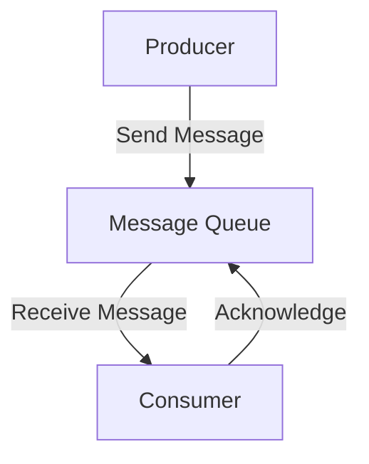

---

linkTitle: "6.1.2 Message Queueing"
title: "Message Queueing in JavaScript and TypeScript: A Comprehensive Guide"
description: "Explore the concept of Message Queueing in JavaScript and TypeScript, including implementation steps, code examples, and best practices for asynchronous communication between services."
categories:
- Integration Patterns
- Messaging Patterns
- Software Architecture
tags:
- Message Queueing
- JavaScript
- TypeScript
- RabbitMQ
- Microservices
date: 2024-10-25
type: docs
nav_weight: 6120

canonical: "https://softwarepatternslexicon.com/patterns-js/6/1/2"
license: "© 2024 Tokenizer Inc. CC BY-NC-SA 4.0"
---

## 6.1.2 Message Queueing

### Introduction

Message Queueing is a fundamental pattern in software architecture that facilitates asynchronous communication between services. By decoupling the sender and receiver, message queues allow systems to handle tasks efficiently without waiting for immediate responses. This pattern is particularly beneficial in distributed systems and microservices architectures, where it enhances scalability and reliability.

### Detailed Explanation

#### Understanding the Concept

Message Queueing involves placing messages in a queue where they wait to be processed by a consumer. This mechanism allows producers (senders) to continue their operations without being blocked by the time it takes to process the message. Consumers (receivers) can process these messages at their own pace, ensuring that the system remains responsive and efficient.

#### Implementation Steps

1. **Select a Message Queue System:**
   - Choose a message queue system that fits your needs. Popular options include RabbitMQ, AWS SQS, and Apache ActiveMQ. Each system has its own strengths and integration capabilities.

2. **Define Queues:**
   - Create queues that will hold messages. Each queue can be dedicated to specific tasks or services, allowing for organized and efficient message processing.

3. **Implement Producers:**
   - Develop components that send messages to the queues. Producers are responsible for generating messages and ensuring they are correctly formatted and sent to the appropriate queue.

4. **Implement Consumers:**
   - Develop components that receive and process messages from the queues. Consumers should be designed to handle messages efficiently and perform the necessary operations.

5. **Handle Acknowledgments:**
   - Ensure that messages are acknowledged upon successful processing. This prevents messages from being reprocessed and ensures that the system maintains data integrity.

### Visual Aids

#### Conceptual Diagram



This diagram illustrates the basic flow of message queueing, where a producer sends a message to a queue, and a consumer processes the message and sends an acknowledgment back to the queue.

### Incorporate Up-to-Date Code Examples

Let's explore how to implement message queueing using RabbitMQ in a Node.js application with the `amqplib` library.

#### Setting Up RabbitMQ

First, ensure RabbitMQ is installed and running on your system. You can download it from the [official RabbitMQ website](https://www.rabbitmq.com/download.html).

#### Installing `amqplib`

Install the `amqplib` library in your Node.js project:

```bash
npm install amqplib
```

#### Producer Example

Here's a simple producer that sends a message to a RabbitMQ queue:

```javascript
const amqp = require('amqplib');

async function sendMessage() {
    try {
        const connection = await amqp.connect('amqp://localhost');
        const channel = await connection.createChannel();
        const queue = 'task_queue';

        await channel.assertQueue(queue, { durable: true });
        const message = 'Hello, World!';

        channel.sendToQueue(queue, Buffer.from(message), { persistent: true });
        console.log(`Sent: ${message}`);

        setTimeout(() => {
            connection.close();
        }, 500);
    } catch (error) {
        console.error('Error sending message:', error);
    }
}

sendMessage();
```

#### Consumer Example

Here's a simple consumer that receives and processes messages from the RabbitMQ queue:

```javascript
const amqp = require('amqplib');

async function receiveMessage() {
    try {
        const connection = await amqp.connect('amqp://localhost');
        const channel = await connection.createChannel();
        const queue = 'task_queue';

        await channel.assertQueue(queue, { durable: true });
        console.log(`Waiting for messages in ${queue}. To exit press CTRL+C`);

        channel.consume(queue, (msg) => {
            if (msg !== null) {
                console.log(`Received: ${msg.content.toString()}`);
                channel.ack(msg);
            }
        }, { noAck: false });
    } catch (error) {
        console.error('Error receiving message:', error);
    }
}

receiveMessage();
```

### Use Cases

- **Task Scheduling and Background Job Processing:** Message queues are ideal for scheduling tasks and processing jobs in the background, allowing the main application to remain responsive.
- **Decoupling Services in a Microservices Architecture:** By using message queues, services can communicate without being tightly coupled, enhancing the flexibility and scalability of the system.

### Best Practices

- **Error Handling and Retries:** Implement robust error handling and retry mechanisms for failed message processing to ensure reliability.
- **Monitor Queue Lengths and Processing Rates:** Regularly monitor the length of queues and the rate at which messages are processed to maintain optimal system performance.
- **Security Considerations:** Ensure that your message queue system is secure, especially when dealing with sensitive data. Use encryption and authentication mechanisms where necessary.

### Advanced Topics

#### Domain-Driven Design (DDD) Integration

In a DDD context, message queueing can be used to handle domain events, allowing different parts of the system to react to changes in the domain model asynchronously.

#### Event Sourcing

Message queues can support event sourcing architectures by ensuring that all changes to the application state are stored as a sequence of events, which can be replayed or processed by different consumers.

### Comparative Analysis

#### Message Queueing vs. Direct Communication

- **Advantages of Message Queueing:**
  - Asynchronous processing allows for better resource utilization.
  - Decouples services, making the system more flexible and scalable.
  - Provides a buffer that can handle bursts of traffic.

- **Disadvantages:**
  - Added complexity in managing queues and ensuring message delivery.
  - Potential latency introduced by the queuing process.

### Conclusion

Message Queueing is a powerful pattern that enhances the scalability and reliability of distributed systems. By decoupling producers and consumers, it allows for efficient asynchronous communication and task processing. Implementing message queueing with modern JavaScript and TypeScript tools like RabbitMQ and `amqplib` can significantly improve the architecture of your applications.

## Quiz Time!



### What is the primary benefit of using message queueing?

- [x] Asynchronous communication between services
- [ ] Synchronous communication between services
- [ ] Direct communication between services
- [ ] None of the above

> **Explanation:** Message queueing allows asynchronous communication, enabling services to interact without waiting for immediate responses.

### Which of the following is NOT a message queue system?

- [ ] RabbitMQ
- [ ] AWS SQS
- [ ] Apache ActiveMQ
- [x] MySQL

> **Explanation:** MySQL is a relational database management system, not a message queue system.

### In message queueing, what is the role of a producer?

- [x] To send messages to queues
- [ ] To receive messages from queues
- [ ] To process messages
- [ ] To delete messages from queues

> **Explanation:** Producers are responsible for sending messages to queues.

### What library is used in Node.js to interact with RabbitMQ?

- [x] amqplib
- [ ] express
- [ ] mongoose
- [ ] axios

> **Explanation:** `amqplib` is a library used in Node.js to interact with RabbitMQ.

### What should a consumer do upon successfully processing a message?

- [x] Acknowledge the message
- [ ] Delete the message
- [ ] Ignore the message
- [ ] Resend the message

> **Explanation:** Consumers should acknowledge messages upon successful processing to prevent reprocessing.

### Which of the following is a use case for message queueing?

- [x] Task scheduling and background job processing
- [ ] Real-time video streaming
- [ ] Direct database access
- [ ] Static file serving

> **Explanation:** Message queueing is ideal for task scheduling and background job processing.

### What is a potential disadvantage of message queueing?

- [x] Added complexity in managing queues
- [ ] Improved system flexibility
- [ ] Enhanced scalability
- [ ] Asynchronous processing

> **Explanation:** Managing queues and ensuring message delivery adds complexity to the system.

### How can message queueing support event sourcing architectures?

- [x] By ensuring all changes are stored as events
- [ ] By providing direct communication between services
- [ ] By eliminating the need for databases
- [ ] By synchronizing all services

> **Explanation:** Message queues can store changes as events, supporting event sourcing architectures.

### What is a best practice for maintaining system performance in message queueing?

- [x] Monitor queue lengths and processing rates
- [ ] Ignore queue lengths
- [ ] Process all messages synchronously
- [ ] Use a single queue for all messages

> **Explanation:** Monitoring queue lengths and processing rates helps maintain optimal system performance.

### True or False: Message queueing can decouple services in a microservices architecture.

- [x] True
- [ ] False

> **Explanation:** Message queueing decouples services, enhancing flexibility and scalability in microservices architectures.


