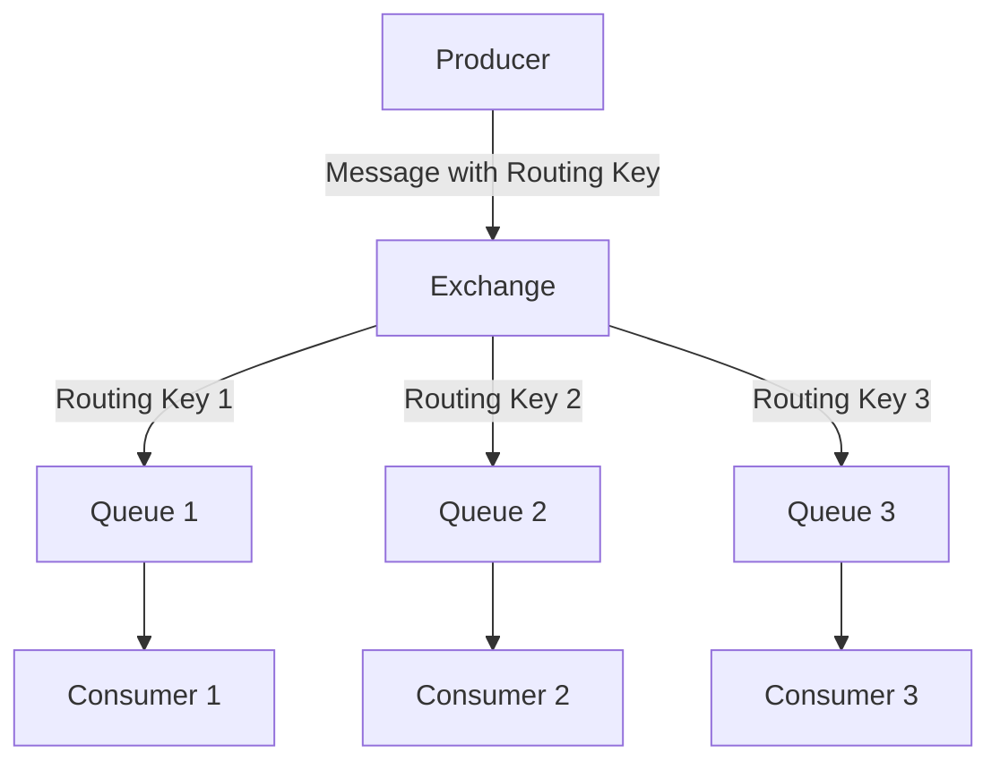

---

linkTitle: "6.1.3 Message Router"
title: "Message Router in JavaScript and TypeScript: A Comprehensive Guide"
description: "Explore the Message Router pattern in JavaScript and TypeScript, its implementation, use cases, and best practices for efficient message routing in distributed systems."
categories:
- Design Patterns
- Integration Patterns
- Messaging Systems
tags:
- Message Router
- JavaScript
- TypeScript
- RabbitMQ
- Messaging Patterns
date: 2024-10-25
type: docs
nav_weight: 613000
canonical: "https://softwarepatternslexicon.com/patterns-js/6/1/3"
license: "© 2024 Tokenizer Inc. CC BY-NC-SA 4.0"
---

## 6.1.3 Message Router

### Introduction

In modern distributed systems, efficient message routing is crucial for ensuring that messages reach the appropriate consumers. The Message Router pattern is a design pattern that directs messages to designated consumers based on specific routing rules or message content. This pattern is particularly useful in systems where messages need to be dynamically distributed to various components or services.

### Detailed Explanation

The Message Router pattern involves several key components and steps:

1. **Set Up an Exchange or Router:**
   - In messaging systems like RabbitMQ, exchanges are configured to route messages to appropriate queues based on routing rules.

2. **Define Routing Rules:**
   - Routing rules are established based on message attributes such as headers or routing keys. These rules determine how messages are directed to different consumers.

3. **Implement Binding Queues:**
   - Queues are bound to the exchange with specific routing criteria, ensuring that only messages matching the criteria are delivered to the queue.

4. **Publish Messages with Routing Information:**
   - When sending messages, necessary routing keys or attributes are included to guide the message to the correct destination.

### Visual Aids

Below is a conceptual diagram illustrating the Message Router pattern:



### Code Examples

Let's explore how to implement the Message Router pattern using RabbitMQ in a Node.js application with the `amqplib` library.

#### Setting Up the Exchange and Queues

```javascript
const amqp = require('amqplib');

async function setup() {
  const connection = await amqp.connect('amqp://localhost');
  const channel = await connection.createChannel();

  const exchangeName = 'topic_logs';
  await channel.assertExchange(exchangeName, 'topic', { durable: false });

  const queues = ['queue1', 'queue2', 'queue3'];
  const routingKeys = ['key1.*', '*.key2', 'key3.#'];

  for (let i = 0; i < queues.length; i++) {
    const queueName = queues[i];
    const routingKey = routingKeys[i];
    await channel.assertQueue(queueName, { durable: false });
    await channel.bindQueue(queueName, exchangeName, routingKey);
  }

  console.log('Exchange and queues set up successfully.');
  await channel.close();
  await connection.close();
}

setup().catch(console.error);
```

#### Publishing Messages

```javascript
async function publishMessage(routingKey, message) {
  const connection = await amqp.connect('amqp://localhost');
  const channel = await connection.createChannel();

  const exchangeName = 'topic_logs';
  await channel.assertExchange(exchangeName, 'topic', { durable: false });

  channel.publish(exchangeName, routingKey, Buffer.from(message));
  console.log(`Message sent: ${message} with routing key: ${routingKey}`);

  await channel.close();
  await connection.close();
}

publishMessage('key1.test', 'Message for key1').catch(console.error);
publishMessage('test.key2', 'Message for key2').catch(console.error);
publishMessage('key3.test', 'Message for key3').catch(console.error);
```

### Use Cases

- **Dynamic Message Distribution:** In content-based systems, messages can be routed dynamically to different consumers based on the content or attributes of the message.
- **Filtering Messages:** Messages can be filtered and routed to different services or departments, such as routing customer orders to different fulfillment centers based on location.

### Best Practices

- **Efficient Routing Logic:** Ensure that the routing logic is efficient to prevent bottlenecks in the message flow.
- **Handling Unmatched Messages:** Implement strategies to handle cases where messages do not match any routing criteria, such as logging or sending to a dead-letter queue.

### Considerations

- **Scalability:** The Message Router pattern should be designed to scale with the system's growth, handling increased message volumes without degrading performance.
- **Reliability:** Ensure that the message routing mechanism is reliable and fault-tolerant, with mechanisms for retrying or handling failed message deliveries.

### Conclusion

The Message Router pattern is a powerful tool for directing messages to appropriate consumers in distributed systems. By implementing this pattern using modern JavaScript and TypeScript libraries, developers can create scalable, efficient, and maintainable messaging solutions.

## Quiz Time!



### What is the primary purpose of a Message Router in distributed systems?

- [x] To direct messages to designated consumers based on routing rules
- [ ] To store messages temporarily
- [ ] To encrypt messages for security
- [ ] To compress messages for faster transmission

> **Explanation:** The primary purpose of a Message Router is to direct messages to designated consumers based on specific routing rules or message content.

### Which component in RabbitMQ is responsible for routing messages?

- [x] Exchange
- [ ] Queue
- [ ] Consumer
- [ ] Producer

> **Explanation:** In RabbitMQ, the exchange is responsible for routing messages to the appropriate queues based on routing rules.

### What is a common use case for the Message Router pattern?

- [x] Dynamic message distribution in content-based systems
- [ ] Storing large files
- [ ] Encrypting sensitive data
- [ ] Generating random numbers

> **Explanation:** A common use case for the Message Router pattern is dynamic message distribution in content-based systems, where messages are routed based on their content.

### What should be included when publishing messages to guide them to the correct destination?

- [x] Routing keys or attributes
- [ ] Encryption keys
- [ ] File paths
- [ ] User credentials

> **Explanation:** When publishing messages, routing keys or attributes should be included to guide the message to the correct destination.

### What is a potential consideration when implementing a Message Router?

- [x] Ensuring routing logic is efficient
- [ ] Reducing the number of consumers
- [ ] Increasing message size
- [ ] Decreasing network bandwidth

> **Explanation:** A potential consideration when implementing a Message Router is ensuring that the routing logic is efficient to prevent bottlenecks.

### How can unmatched messages be handled in a Message Router system?

- [x] Logging or sending to a dead-letter queue
- [ ] Ignoring them completely
- [ ] Encrypting them
- [ ] Compressing them

> **Explanation:** Unmatched messages can be handled by logging them or sending them to a dead-letter queue for further analysis or processing.

### What is a benefit of using the Message Router pattern?

- [x] Scalability and dynamic message routing
- [ ] Increased message size
- [ ] Reduced system complexity
- [ ] Decreased processing time

> **Explanation:** A benefit of using the Message Router pattern is scalability and dynamic message routing, allowing messages to be directed to appropriate consumers efficiently.

### Which library is commonly used in Node.js for implementing message routing with RabbitMQ?

- [x] amqplib
- [ ] express
- [ ] mongoose
- [ ] lodash

> **Explanation:** The `amqplib` library is commonly used in Node.js for implementing message routing with RabbitMQ.

### What is the role of queues in the Message Router pattern?

- [x] To hold messages until they are consumed
- [ ] To encrypt messages
- [ ] To compress messages
- [ ] To generate routing keys

> **Explanation:** In the Message Router pattern, queues hold messages until they are consumed by the appropriate consumer.

### True or False: The Message Router pattern can be used to filter messages for different services.

- [x] True
- [ ] False

> **Explanation:** True. The Message Router pattern can be used to filter messages and route them to different services or departments based on routing criteria.




