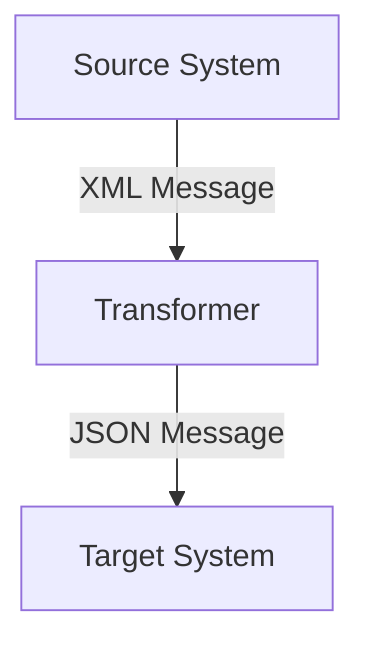

## 6.1.4 Message Transformation

In the realm of software integration, systems often need to communicate despite having different data formats and protocols. This is where **Message Transformation** comes into play. It modifies messages to match the format or protocol required by different systems, ensuring seamless communication and data exchange.

### Understand the Concept

Message Transformation is a crucial pattern in integration scenarios where different systems need to communicate with each other. It involves altering the structure, format, or protocol of a message so that it can be correctly interpreted by the receiving system.

#### Key Objectives:
- **Format Conversion:** Transform messages from one format to another (e.g., XML to JSON).
- **Protocol Adaptation:** Modify messages to comply with different communication protocols.
- **Data Enrichment:** Add or modify data within a message to meet the requirements of the target system.

### Implementation Steps

#### 1. Identify Transformation Requirements
Before implementing message transformation, it's essential to determine the source and target message formats. This involves understanding the data structures and protocols used by both the sending and receiving systems.

#### 2. Implement Transformer Components
Create functions or middleware that perform the necessary transformations. These components should be capable of converting data formats, adapting protocols, and enriching message content as needed.

#### 3. Integrate Transformation into Workflow
Position the transformer components at appropriate points in the message flow. This ensures that messages are transformed before they reach their destination, allowing for seamless integration between disparate systems.

### Code Examples

Let's explore how to implement a simple message transformation using JavaScript/TypeScript. We'll create a middleware function that converts message payloads from XML to JSON.

```typescript
import { parseStringPromise } from 'xml2js';

async function xmlToJsonMiddleware(req, res, next) {
    try {
        if (req.headers['content-type'] === 'application/xml') {
            const json = await parseStringPromise(req.body);
            req.body = json;
            req.headers['content-type'] = 'application/json';
        }
        next();
    } catch (error) {
        res.status(400).send('Invalid XML format');
    }
}

// Usage in an Express.js application
import express from 'express';

const app = express();
app.use(express.text({ type: 'application/xml' }));
app.use(xmlToJsonMiddleware);

app.post('/api/data', (req, res) => {
    // Handle JSON data
    res.json(req.body);
});

app.listen(3000, () => {
    console.log('Server running on port 3000');
});
```

In this example, we use the `xml2js` library to parse XML data into JSON format. The middleware checks the content type of incoming requests and transforms the payload accordingly.

### Use Cases

- **Integrating Disparate Systems:** When integrating systems with different data formats, message transformation ensures that data is correctly interpreted by each system.
- **Data Normalization:** In enterprise application integration, message transformation helps normalize data, making it consistent across various systems.
- **API Gateways:** Transform incoming requests to match the internal APIs, ensuring compatibility and seamless communication.

### Practice

To practice message transformation, try building an API gateway that transforms incoming requests to match the internal APIs of your application. This involves identifying the required transformations and implementing middleware to handle them.

### Considerations

- **Validate Transformed Messages:** Ensure that transformed messages maintain data integrity and meet the requirements of the target system.
- **Performance Impacts:** Be mindful of the processing time required for transformations, especially in high-throughput systems. Optimize transformation logic to minimize latency.

### Visual Aids

#### Conceptual Diagram



This diagram illustrates a simple message transformation flow, where a message from the source system is transformed before reaching the target system.

### Best Practices

- **Use Efficient Libraries:** Leverage libraries like `xml2js` for XML to JSON conversion and `json2xml` for the reverse process.
- **Error Handling:** Implement robust error handling to manage transformation failures gracefully.
- **Scalability:** Design transformer components to handle varying loads and ensure scalability.

### Conclusion

Message Transformation is a vital pattern for integrating systems with different data formats and protocols. By following the implementation steps and best practices outlined in this guide, you can ensure seamless communication and data exchange between disparate systems.

## Quiz Time!



### What is the primary purpose of Message Transformation?

- [x] To modify messages to match the format or protocol required by different systems.
- [ ] To encrypt messages for secure transmission.
- [ ] To compress messages to reduce size.
- [ ] To duplicate messages for redundancy.

> **Explanation:** Message Transformation modifies messages to match the format or protocol required by different systems, ensuring seamless communication.

### Which library is used in the code example for XML to JSON conversion?

- [x] xml2js
- [ ] xml-js
- [ ] fast-xml-parser
- [ ] xmlbuilder

> **Explanation:** The `xml2js` library is used in the code example to parse XML data into JSON format.

### What is a common use case for Message Transformation?

- [x] Integrating disparate systems with different data formats.
- [ ] Encrypting data for security.
- [ ] Caching data for faster access.
- [ ] Logging messages for auditing.

> **Explanation:** Message Transformation is commonly used to integrate disparate systems with different data formats, ensuring compatibility.

### What should be considered to ensure data integrity during transformation?

- [x] Validate transformed messages.
- [ ] Compress transformed messages.
- [ ] Encrypt transformed messages.
- [ ] Duplicate transformed messages.

> **Explanation:** Validating transformed messages ensures that data integrity is maintained and that the messages meet the requirements of the target system.

### What is a potential performance concern with Message Transformation?

- [x] Processing time required for transformations.
- [ ] Increased message size after transformation.
- [ ] Loss of data during transformation.
- [ ] Incompatibility with target systems.

> **Explanation:** The processing time required for transformations can impact performance, especially in high-throughput systems.

### In the provided code example, what content type is the middleware checking for?

- [x] application/xml
- [ ] application/json
- [ ] text/xml
- [ ] text/json

> **Explanation:** The middleware checks for the `application/xml` content type to determine if transformation is needed.

### What is a best practice when implementing message transformation?

- [x] Use efficient libraries for data conversion.
- [ ] Always encrypt transformed messages.
- [ ] Duplicate messages for redundancy.
- [ ] Compress messages to reduce size.

> **Explanation:** Using efficient libraries for data conversion ensures that transformations are performed quickly and accurately.

### What is the role of the transformer component in the message flow?

- [x] To convert data formats and adapt protocols.
- [ ] To encrypt messages for security.
- [ ] To log messages for auditing.
- [ ] To compress messages for storage.

> **Explanation:** The transformer component converts data formats and adapts protocols to ensure compatibility between systems.

### Which of the following is NOT a key objective of Message Transformation?

- [x] Message Encryption
- [ ] Format Conversion
- [ ] Protocol Adaptation
- [ ] Data Enrichment

> **Explanation:** Message Encryption is not a key objective of Message Transformation, which focuses on format conversion, protocol adaptation, and data enrichment.

### True or False: Message Transformation can help normalize data in enterprise application integration.

- [x] True
- [ ] False

> **Explanation:** True. Message Transformation helps normalize data, making it consistent across various systems in enterprise application integration.


