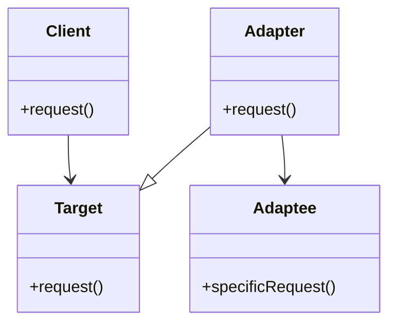

## 6.1 Adapter Pattern for Interface Compatibility

### Introduction to the Adapter Pattern

The Adapter Pattern is a structural design pattern that allows objects with incompatible interfaces to collaborate. It acts as a bridge between two incompatible interfaces, enabling them to work together seamlessly. This pattern is particularly useful when integrating third-party libraries or legacy systems into your application, where the interfaces do not match the expected ones.

### Intent of the Adapter Pattern

The primary intent of the Adapter Pattern is to convert the interface of a class into another interface that clients expect. It allows classes to work together that couldn't otherwise because of incompatible interfaces. By using an adapter, you can reuse existing code without modifying it, thus promoting code reuse and flexibility.

### Key Participants

1. **Target**: This is the interface that the client expects.
2. **Client**: The entity that interacts with the target interface.
3. **Adaptee**: The existing interface that needs to be adapted.
4. **Adapter**: The class that implements the target interface and translates the requests from the client to the adaptee.

### Applicability

Use the Adapter Pattern when:

- You want to use an existing class, and its interface does not match the one you need.
- You need to create a reusable class that cooperates with unrelated or unforeseen classes, that is, classes that don't necessarily have compatible interfaces.
- You want to use several existing subclasses, but it's impractical to adapt their interface by subclassing every one. An object adapter can adapt the interface of its parent class.

### Sample Code Snippet

Let's explore a simple example of the Adapter Pattern in JavaScript. Suppose we have a legacy system that provides temperature in Celsius, but our new system requires temperature in Fahrenheit.

```javascript
// Adaptee: Legacy system providing temperature in Celsius
class CelsiusTemperature {
  constructor(celsius) {
    this.celsius = celsius;
  }

  getTemperature() {
    return this.celsius;
  }
}

// Target: New system expects temperature in Fahrenheit
class FahrenheitTemperature {
  getTemperature() {
    throw new Error("This method should be overridden!");
  }
}

// Adapter: Converts Celsius to Fahrenheit
class TemperatureAdapter extends FahrenheitTemperature {
  constructor(celsiusTemperature) {
    super();
    this.celsiusTemperature = celsiusTemperature;
  }

  getTemperature() {
    return this.celsiusTemperature.getTemperature() * 9/5 + 32;
  }
}

// Client code
const celsiusTemp = new CelsiusTemperature(25);
const adapter = new TemperatureAdapter(celsiusTemp);

console.log(`Temperature in Fahrenheit: ${adapter.getTemperature()}°F`); // Output: Temperature in Fahrenheit: 77°F
```

### Class Adapters vs. Object Adapters

In JavaScript, the Adapter Pattern can be implemented using either class adapters or object adapters.

#### Class Adapters

Class adapters use inheritance to adapt one interface to another. This approach is less common in JavaScript due to its prototypal inheritance model. However, it can be useful when you have control over the class hierarchy and can extend the adaptee class.

#### Object Adapters

Object adapters use composition to achieve the same goal. This approach is more flexible and aligns well with JavaScript's dynamic nature. It allows you to wrap an existing object and provide the necessary interface without altering the original object's structure.

### Benefits of Using Adapters

- **Promotes Code Reuse**: By adapting existing interfaces, you can reuse code without modification.
- **Enhances Flexibility**: Adapters allow you to integrate third-party libraries or legacy systems without changing their code.
- **Improves Maintainability**: By isolating the adaptation logic in a separate class, you can maintain and update the adapter without affecting the rest of the system.

### Scenarios for Using Adapters

1. **Integrating Third-Party Libraries**: When a third-party library provides an interface that doesn't match your application's needs, an adapter can bridge the gap.
2. **Legacy System Integration**: Adapters can help integrate legacy systems with modern applications by translating their interfaces.
3. **API Compatibility**: When consuming APIs with different data structures, adapters can standardize the interface for your application.

### Design Considerations

- **Performance Overhead**: Adapters introduce an additional layer of abstraction, which may impact performance. Consider this when designing performance-critical applications.
- **Complexity**: Overuse of adapters can lead to increased complexity. Use them judiciously to avoid unnecessary complications.

### JavaScript Unique Features

JavaScript's dynamic nature and prototypal inheritance model make it particularly suited for implementing object adapters. The language's flexibility allows you to create adapters that can handle a wide range of scenarios without the constraints of a static type system.

### Differences and Similarities with Other Patterns

The Adapter Pattern is often confused with the Facade Pattern. While both patterns provide a simplified interface, the Adapter Pattern focuses on converting one interface to another, whereas the Facade Pattern provides a unified interface to a set of interfaces in a subsystem.

### Visualizing the Adapter Pattern

To better understand the Adapter Pattern, let's visualize the relationship between the client, adapter, and adaptee using a class diagram.



**Diagram Description**: The diagram shows the client interacting with the target interface. The adapter implements the target interface and delegates the request to the adaptee's specific request method.

### Try It Yourself

To solidify your understanding of the Adapter Pattern, try modifying the code example to adapt a different interface. For instance, create an adapter that converts kilometers to miles.

### Knowledge Check

- What is the primary purpose of the Adapter Pattern?
- How does the Adapter Pattern promote code reuse?
- What are the key differences between class adapters and object adapters?
- In what scenarios would you use the Adapter Pattern?

### Summary

The Adapter Pattern is a powerful tool for achieving interface compatibility in JavaScript applications. By understanding and applying this pattern, you can integrate disparate systems, promote code reuse, and enhance the flexibility of your codebase. Remember, this is just the beginning. As you progress, you'll build more complex and interactive applications. Keep experimenting, stay curious, and enjoy the journey!

## Quiz: Mastering the Adapter Pattern in JavaScript



### What is the primary purpose of the Adapter Pattern?

- [x] To convert the interface of a class into another interface that clients expect.
- [ ] To provide a simplified interface to a set of interfaces in a subsystem.
- [ ] To ensure a class has only one instance.
- [ ] To define a family of algorithms and make them interchangeable.

> **Explanation:** The Adapter Pattern is used to convert the interface of a class into another interface that clients expect, allowing incompatible interfaces to work together.

### Which of the following is a key participant in the Adapter Pattern?

- [x] Target
- [x] Adapter
- [x] Adaptee
- [ ] Singleton

> **Explanation:** The key participants in the Adapter Pattern are the Target, Adapter, and Adaptee. The Singleton is not part of this pattern.

### How does the Adapter Pattern promote code reuse?

- [x] By allowing existing code to be used without modification.
- [ ] By creating new classes for each interface.
- [ ] By duplicating code across different modules.
- [ ] By enforcing strict type checking.

> **Explanation:** The Adapter Pattern promotes code reuse by allowing existing code to be used without modification, adapting it to new interfaces as needed.

### What is a common scenario for using the Adapter Pattern?

- [x] Integrating third-party libraries with incompatible interfaces.
- [ ] Creating a new user interface for an application.
- [ ] Optimizing database queries.
- [ ] Implementing a caching mechanism.

> **Explanation:** A common scenario for using the Adapter Pattern is integrating third-party libraries with incompatible interfaces, allowing them to work with your application.

### What is the difference between class adapters and object adapters?

- [x] Class adapters use inheritance, while object adapters use composition.
- [ ] Class adapters use composition, while object adapters use inheritance.
- [ ] Both use inheritance.
- [ ] Both use composition.

> **Explanation:** Class adapters use inheritance to adapt interfaces, while object adapters use composition, making them more flexible in JavaScript.

### Which pattern is often confused with the Adapter Pattern?

- [x] Facade Pattern
- [ ] Singleton Pattern
- [ ] Observer Pattern
- [ ] Strategy Pattern

> **Explanation:** The Facade Pattern is often confused with the Adapter Pattern, but they serve different purposes. The Adapter Pattern converts interfaces, while the Facade Pattern provides a simplified interface.

### What is a potential drawback of using the Adapter Pattern?

- [x] Performance overhead due to an additional layer of abstraction.
- [ ] Increased memory usage.
- [ ] Reduced code readability.
- [ ] Limited scalability.

> **Explanation:** A potential drawback of using the Adapter Pattern is the performance overhead introduced by an additional layer of abstraction.

### In JavaScript, which approach is more common for implementing adapters?

- [x] Object adapters
- [ ] Class adapters
- [ ] Singleton adapters
- [ ] Prototype adapters

> **Explanation:** In JavaScript, object adapters are more common due to the language's dynamic nature and prototypal inheritance model.

### What is the role of the Adaptee in the Adapter Pattern?

- [x] It is the existing interface that needs to be adapted.
- [ ] It is the interface that the client expects.
- [ ] It is the class that implements the target interface.
- [ ] It is the entity that interacts with the target interface.

> **Explanation:** The Adaptee is the existing interface that needs to be adapted to work with the target interface expected by the client.

### True or False: The Adapter Pattern can only be used with object-oriented programming languages.

- [ ] True
- [x] False

> **Explanation:** False. The Adapter Pattern can be used in any programming paradigm, including functional and procedural, as long as there is a need to adapt interfaces.


