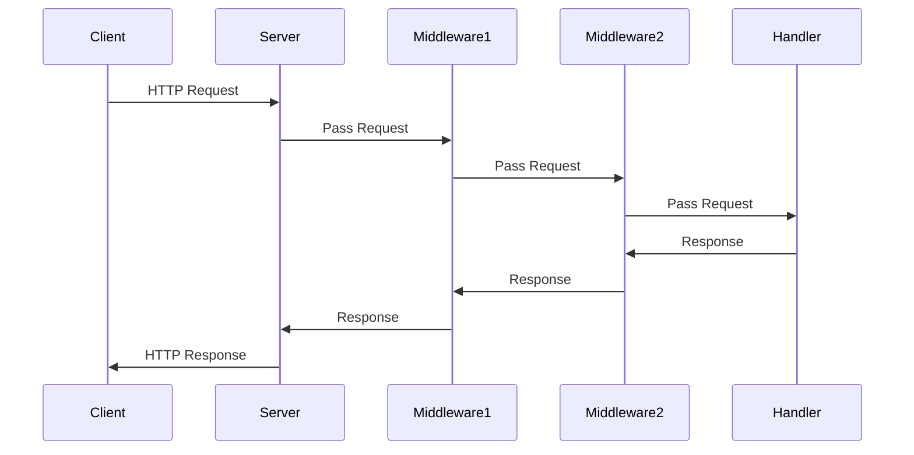

## 6.10 Implementing Wrappers and Middleware

In modern web development, managing cross-cutting concerns such as logging, authentication, and error handling is crucial. Wrappers and middleware are powerful patterns that allow developers to extend and enhance function behavior without altering the core logic. This section delves into the concepts of wrappers and middleware, providing practical examples and best practices for their implementation in JavaScript.

### Understanding Wrappers

Wrappers are functions that encapsulate other functions, allowing you to modify or extend their behavior. By wrapping a function, you can add pre-processing or post-processing logic, handle exceptions, or modify input and output values.

#### Key Concepts of Wrappers

- **Encapsulation**: Wrappers encapsulate the original function, providing a layer of abstraction.
- **Extensibility**: They allow you to extend the behavior of a function without modifying its source code.
- **Reusability**: Wrappers can be reused across different functions, promoting DRY (Don't Repeat Yourself) principles.

#### Example: Logging Wrapper

Let's create a simple logging wrapper that logs the input and output of a function.

```javascript
function logWrapper(fn) {
    return function(...args) {
        console.log(`Arguments: ${args}`);
        const result = fn(...args);
        console.log(`Result: ${result}`);
        return result;
    };
}

// Original function
function add(a, b) {
    return a + b;
}

// Wrapped function
const loggedAdd = logWrapper(add);

// Usage
loggedAdd(2, 3); // Logs: Arguments: 2,3 and Result: 5
```

In this example, `logWrapper` is a higher-order function that takes a function `fn` as an argument and returns a new function. This new function logs the arguments and result of the original function.

### Middleware Patterns

Middleware is a design pattern commonly used in web frameworks to handle requests and responses. It allows you to create a pipeline of functions that process requests in a sequential manner. Middleware functions can perform tasks such as logging, authentication, and error handling.

#### Middleware in Express

[Express](https://expressjs.com/en/guide/using-middleware.html) is a popular web framework for Node.js that heavily relies on middleware. Middleware functions in Express have access to the request and response objects and can modify them or end the request-response cycle.

##### Example: Express Middleware

```javascript
const express = require('express');
const app = express();

// Middleware function to log request details
function requestLogger(req, res, next) {
    console.log(`${req.method} ${req.url}`);
    next(); // Pass control to the next middleware
}

// Use the middleware
app.use(requestLogger);

// Route handler
app.get('/', (req, res) => {
    res.send('Hello, World!');
});

// Start the server
app.listen(3000, () => {
    console.log('Server is running on port 3000');
});
```

In this example, `requestLogger` is a middleware function that logs the HTTP method and URL of each request. The `next` function is called to pass control to the next middleware in the stack.

#### Middleware in Koa

[Koa](https://koajs.com/) is another Node.js framework that uses middleware. Unlike Express, Koa uses async functions, making it more suitable for modern asynchronous JavaScript.

##### Example: Koa Middleware

```javascript
const Koa = require('koa');
const app = new Koa();

// Middleware function to log request details
app.use(async (ctx, next) => {
    console.log(`${ctx.method} ${ctx.url}`);
    await next(); // Pass control to the next middleware
});

// Route handler
app.use(async ctx => {
    ctx.body = 'Hello, World!';
});

// Start the server
app.listen(3000, () => {
    console.log('Server is running on port 3000');
});
```

In Koa, middleware functions are async, allowing you to use `await` for asynchronous operations. The `ctx` object represents the request and response context.

### Implementing Wrappers and Middleware

#### Use Cases

- **Logging**: Capture and log request details, errors, or performance metrics.
- **Authentication**: Verify user credentials and manage sessions.
- **Error Handling**: Catch and handle errors gracefully.
- **Data Transformation**: Modify request or response data.

#### Best Practices

- **Order Matters**: The order in which middleware is applied can affect the behavior of your application. Ensure that middleware is applied in the correct sequence.
- **Modularity**: Keep middleware functions small and focused on a single task.
- **Error Handling**: Ensure that middleware functions handle errors appropriately and do not disrupt the request-response cycle.
- **Reusability**: Create reusable middleware functions that can be shared across different parts of your application.

### Composing Middleware

Composing middleware involves chaining multiple middleware functions together to create a processing pipeline. This is a powerful technique for managing complex request processing logic.

#### Example: Composing Middleware in Express

```javascript
const express = require('express');
const app = express();

// Middleware to log request details
function requestLogger(req, res, next) {
    console.log(`${req.method} ${req.url}`);
    next();
}

// Middleware to authenticate users
function authenticate(req, res, next) {
    if (req.headers.authorization) {
        next();
    } else {
        res.status(401).send('Unauthorized');
    }
}

// Use middleware
app.use(requestLogger);
app.use(authenticate);

// Route handler
app.get('/', (req, res) => {
    res.send('Hello, Authenticated User!');
});

// Start the server
app.listen(3000, () => {
    console.log('Server is running on port 3000');
});
```

In this example, the `requestLogger` and `authenticate` middleware functions are composed to create a processing pipeline. The request is first logged and then authenticated before reaching the route handler.

### Visualizing Middleware Flow

To better understand how middleware functions are processed, let's visualize the flow using a sequence diagram.



This diagram illustrates the sequential flow of a request through multiple middleware functions before reaching the final handler.

### Try It Yourself

Experiment with the code examples provided by modifying the middleware functions. For instance, try adding a new middleware function that checks for a specific header or logs additional request details. Observe how the order of middleware affects the request processing flow.

### Knowledge Check

- What are the benefits of using wrappers in JavaScript?
- How do middleware functions in Express differ from those in Koa?
- Why is the order of middleware important in a processing pipeline?
- What are some common use cases for middleware in web applications?

### Summary

Wrappers and middleware are essential patterns in JavaScript for managing cross-cutting concerns and extending function behavior. By understanding and implementing these patterns, you can create more modular, maintainable, and scalable applications. Remember, this is just the beginning. As you progress, you'll build more complex and interactive web applications. Keep experimenting, stay curious, and enjoy the journey!

## Quiz: Mastering Wrappers and Middleware in JavaScript



### What is the primary purpose of a wrapper function in JavaScript?

- [x] To extend or modify the behavior of another function
- [ ] To execute multiple functions simultaneously
- [ ] To create a new variable scope
- [ ] To handle asynchronous operations

> **Explanation:** Wrapper functions are used to extend or modify the behavior of another function without altering its source code.

### In Express, what does the `next` function do in a middleware function?

- [x] Passes control to the next middleware function
- [ ] Terminates the request-response cycle
- [ ] Sends a response to the client
- [ ] Logs the request details

> **Explanation:** The `next` function is used to pass control to the next middleware function in the stack.

### How does Koa differ from Express in terms of middleware?

- [x] Koa uses async functions for middleware
- [ ] Koa does not support middleware
- [ ] Koa middleware functions cannot access the request object
- [ ] Koa middleware functions are synchronous

> **Explanation:** Koa uses async functions for middleware, allowing for more modern asynchronous JavaScript patterns.

### What is a common use case for middleware in web applications?

- [x] Authentication and authorization
- [ ] Rendering HTML templates
- [ ] Compiling JavaScript code
- [ ] Managing database connections

> **Explanation:** Middleware is commonly used for authentication and authorization, among other cross-cutting concerns.

### Why is the order of middleware important in a processing pipeline?

- [x] It affects the sequence in which requests are processed
- [ ] It determines the number of requests a server can handle
- [ ] It influences the server's memory usage
- [ ] It changes the server's IP address

> **Explanation:** The order of middleware affects the sequence in which requests are processed, which can impact the application's behavior.

### What is the role of the `ctx` object in Koa middleware?

- [x] Represents the request and response context
- [ ] Stores the server configuration
- [ ] Manages database connections
- [ ] Handles file uploads

> **Explanation:** The `ctx` object in Koa represents the request and response context, allowing middleware to access and modify them.

### Which of the following is a best practice for creating middleware functions?

- [x] Keep them small and focused on a single task
- [ ] Combine multiple tasks into a single middleware
- [ ] Avoid using the `next` function
- [ ] Use global variables extensively

> **Explanation:** Middleware functions should be small and focused on a single task to promote modularity and maintainability.

### What is a benefit of using wrappers in JavaScript?

- [x] They promote code reusability
- [ ] They increase the execution speed of functions
- [ ] They eliminate the need for error handling
- [ ] They simplify complex algorithms

> **Explanation:** Wrappers promote code reusability by allowing the same logic to be applied to multiple functions.

### How can you modify a middleware function to handle errors?

- [x] Use a try-catch block within the middleware
- [ ] Remove the `next` function call
- [ ] Use synchronous code exclusively
- [ ] Avoid logging errors

> **Explanation:** Using a try-catch block within the middleware allows you to handle errors gracefully.

### True or False: Middleware functions in Express can modify both the request and response objects.

- [x] True
- [ ] False

> **Explanation:** Middleware functions in Express can modify both the request and response objects, allowing for flexible request processing.




