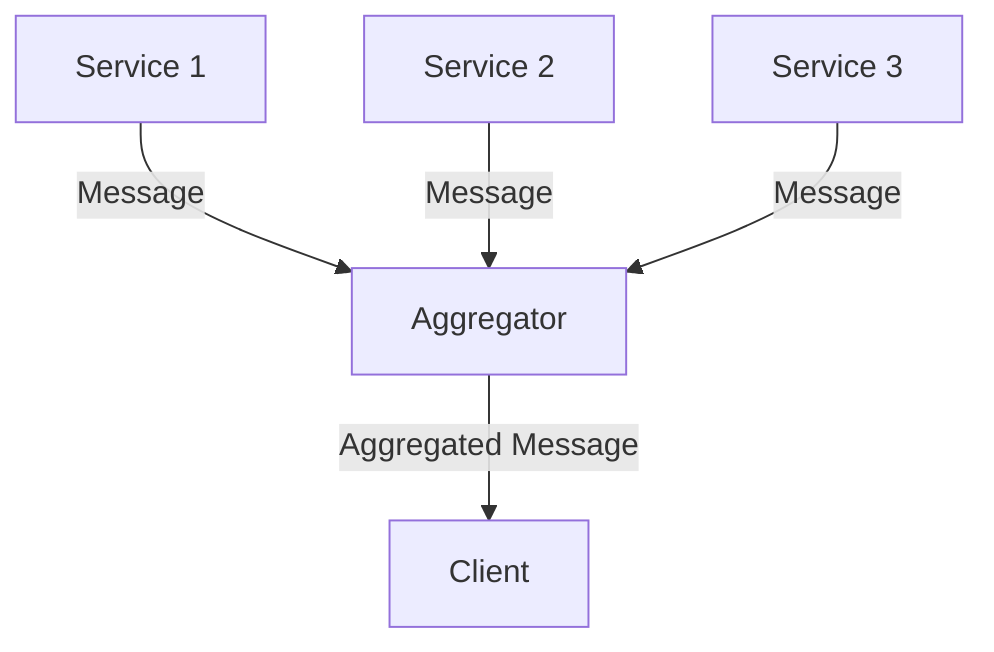

---

linkTitle: "6.2.1 Aggregator"
title: "Aggregator Pattern in JavaScript and TypeScript: Mastering Enterprise Integration"
description: "Learn how to implement the Aggregator pattern in JavaScript and TypeScript to efficiently collect and combine messages from multiple sources into a single message."
categories:
- Design Patterns
- JavaScript
- TypeScript
tags:
- Aggregator Pattern
- Enterprise Integration
- Node.js
- Microservices
- Middleware
date: 2024-10-25
type: docs
nav_weight: 621000
canonical: "https://softwarepatternslexicon.com/patterns-js/6/2/1"
license: "© 2024 Tokenizer Inc. CC BY-NC-SA 4.0"
---

## 6.2.1 Aggregator

### Introduction

In the world of enterprise integration, the Aggregator pattern plays a crucial role in simplifying the process of collecting and combining messages from multiple sources into a single, cohesive message. This pattern is particularly useful in scenarios where data needs to be gathered from various services or components to provide a unified response. In this article, we will explore the Aggregator pattern in the context of JavaScript and TypeScript, providing practical examples and best practices for implementation.

### Understand the Concept

The Aggregator pattern is designed to handle the complexity of integrating multiple data sources by collecting and combining their outputs into a single message. This pattern is essential in microservices architectures, where services often need to collaborate to fulfill a request.

#### Key Components:

- **Message Sources:** These are the individual services or components that provide data.
- **Aggregator:** A middleware component or service that collects and combines messages.
- **Aggregation Criteria:** Rules that define when and how messages should be aggregated.
- **Completion Conditions:** Criteria that determine when the aggregation is complete and ready for processing.

### Implementation Steps

#### 1. Define Aggregation Criteria

Establish rules for when and how messages should be aggregated. This involves determining the conditions under which messages from different sources should be combined.

#### 2. Implement Aggregation Logic

Use a middleware component or service that accumulates messages. This component should be capable of handling incoming messages, applying the aggregation criteria, and storing intermediate results.

#### 3. Handle Completion Conditions

Determine when the aggregated message is complete and ready for processing. This could involve waiting for a certain number of messages, a timeout, or a specific event.

### Code Examples

Let's explore a practical example using Node.js to collect responses from multiple API calls and combine them.

```javascript
const axios = require('axios');

async function fetchDataFromSources() {
    const sources = [
        'https://api.example.com/service1',
        'https://api.example.com/service2',
        'https://api.example.com/service3'
    ];

    const promises = sources.map(source => axios.get(source));

    try {
        const responses = await Promise.all(promises);
        const aggregatedData = responses.map(response => response.data);
        return aggregatedData.reduce((acc, data) => ({ ...acc, ...data }), {});
    } catch (error) {
        console.error('Error fetching data:', error);
        throw error;
    }
}

fetchDataFromSources().then(aggregatedData => {
    console.log('Aggregated Data:', aggregatedData);
});
```

In this example, we use `axios` to make concurrent API calls to multiple services. The responses are aggregated into a single object using `reduce`.

### Use Cases

- **Combining Data from Multiple Services:** Aggregate data from various microservices to provide a unified response to clients.
- **Batch Processing:** Collect and process messages in batches to improve efficiency and throughput.

### Practice

Create a service that aggregates user profile information from different microservices. For instance, you might have separate services for user details, preferences, and activity logs. The Aggregator pattern can combine these into a comprehensive user profile.

### Considerations

- **Timeouts and Failures:** Manage timeouts and handle failures of individual message sources gracefully. Implement retry mechanisms or fallback strategies as needed.
- **Thread Safety:** Ensure thread safety if aggregation occurs in a concurrent environment. Use appropriate synchronization mechanisms to prevent race conditions.

### Visual Aids

Below is a conceptual diagram illustrating the Aggregator pattern:



### Advantages and Disadvantages

#### Advantages

- **Simplifies Integration:** Reduces complexity by centralizing message aggregation.
- **Improves Efficiency:** Allows for batch processing and reduces the number of client requests.

#### Disadvantages

- **Single Point of Failure:** The aggregator can become a bottleneck or a single point of failure if not properly managed.
- **Complexity in Error Handling:** Requires robust error handling and retry mechanisms.

### Best Practices

- **Use Promises and Async/Await:** Leverage modern JavaScript features like Promises and async/await for handling asynchronous operations efficiently.
- **Implement Circuit Breakers:** Use circuit breakers to prevent cascading failures in case of service outages.
- **Monitor Performance:** Continuously monitor the performance of the aggregator to identify and address bottlenecks.

### Comparisons

The Aggregator pattern is often compared to the **Composite Pattern**, which also deals with combining objects. However, the Composite Pattern is more focused on treating individual objects and compositions uniformly, while the Aggregator is specifically about message aggregation.

### Conclusion

The Aggregator pattern is a powerful tool in the arsenal of enterprise integration patterns, especially in the context of microservices and distributed systems. By understanding and implementing this pattern effectively, developers can create robust, efficient, and scalable systems that seamlessly integrate multiple data sources.

## Quiz Time!



### What is the primary purpose of the Aggregator pattern?

- [x] To collect and combine messages from multiple sources into a single message.
- [ ] To distribute messages to multiple recipients.
- [ ] To filter messages based on specific criteria.
- [ ] To transform messages into different formats.

> **Explanation:** The Aggregator pattern is designed to collect and combine messages from multiple sources into a single, cohesive message.

### Which component is responsible for applying aggregation criteria in the Aggregator pattern?

- [ ] Message Source
- [x] Aggregator
- [ ] Client
- [ ] Middleware

> **Explanation:** The Aggregator is the component responsible for applying aggregation criteria and combining messages.

### What is a common use case for the Aggregator pattern?

- [x] Combining data from multiple services for a unified response.
- [ ] Sending notifications to multiple users.
- [ ] Encrypting messages before transmission.
- [ ] Logging messages for auditing purposes.

> **Explanation:** A common use case for the Aggregator pattern is combining data from multiple services to provide a unified response.

### What is a potential disadvantage of the Aggregator pattern?

- [ ] It simplifies integration.
- [x] It can become a single point of failure.
- [ ] It improves efficiency.
- [ ] It reduces complexity.

> **Explanation:** The Aggregator can become a single point of failure if not properly managed, making it a potential disadvantage.

### How can you ensure thread safety in an Aggregator implementation?

- [x] Use appropriate synchronization mechanisms.
- [ ] Avoid using Promises.
- [ ] Implement a single-threaded model.
- [x] Use locks or mutexes.

> **Explanation:** Ensuring thread safety involves using synchronization mechanisms like locks or mutexes to prevent race conditions.

### Which JavaScript feature is recommended for handling asynchronous operations in the Aggregator pattern?

- [x] Promises
- [ ] Callbacks
- [ ] Synchronous functions
- [x] Async/Await

> **Explanation:** Promises and async/await are recommended for handling asynchronous operations efficiently in JavaScript.

### What should be considered when handling timeouts and failures in the Aggregator pattern?

- [x] Implement retry mechanisms.
- [ ] Ignore failures.
- [x] Use fallback strategies.
- [ ] Always wait indefinitely for responses.

> **Explanation:** Implementing retry mechanisms and using fallback strategies are important considerations for handling timeouts and failures.

### What is the role of completion conditions in the Aggregator pattern?

- [ ] To initiate message aggregation.
- [x] To determine when the aggregated message is complete.
- [ ] To transform messages.
- [ ] To distribute messages.

> **Explanation:** Completion conditions determine when the aggregated message is complete and ready for processing.

### Which of the following is a best practice for implementing the Aggregator pattern?

- [x] Use circuit breakers to prevent cascading failures.
- [ ] Avoid monitoring performance.
- [ ] Use synchronous operations only.
- [ ] Ignore error handling.

> **Explanation:** Using circuit breakers is a best practice to prevent cascading failures in case of service outages.

### True or False: The Aggregator pattern is primarily used for message transformation.

- [ ] True
- [x] False

> **Explanation:** False. The Aggregator pattern is primarily used for collecting and combining messages, not transforming them.


