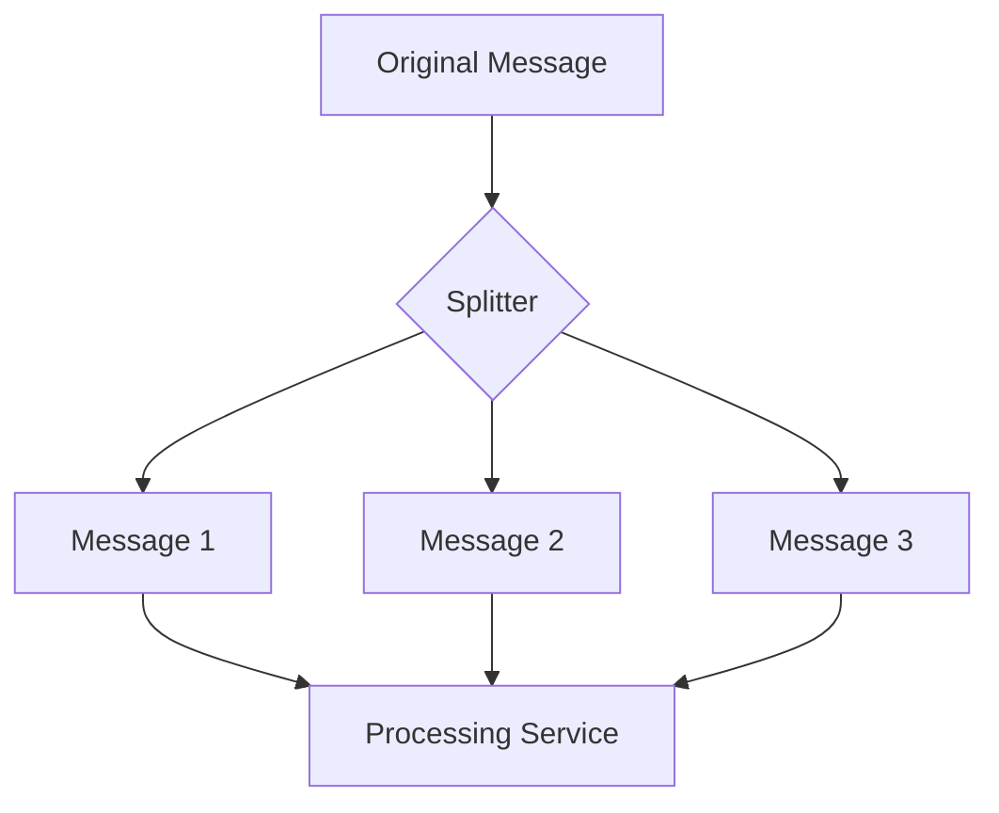

---

linkTitle: "6.2.2 Splitter"
title: "Splitter Design Pattern in JavaScript and TypeScript: Efficient Message Processing"
description: "Learn how to implement the Splitter design pattern in JavaScript and TypeScript for efficient message processing in enterprise integration scenarios."
categories:
- Design Patterns
- JavaScript
- TypeScript
tags:
- Splitter Pattern
- Enterprise Integration
- Message Processing
- JavaScript
- TypeScript
date: 2024-10-25
type: docs
nav_weight: 622000
canonical: "https://softwarepatternslexicon.com/patterns-js/6/2/2"
license: "© 2024 Tokenizer Inc. CC BY-NC-SA 4.0"
---

## 6.2.2 Splitter

### Introduction

In the realm of enterprise integration, the Splitter design pattern plays a crucial role in handling complex data processing tasks. The Splitter pattern is used to break a single message into multiple smaller messages, each of which can be processed independently. This pattern is particularly useful when dealing with large datasets or batch processing, allowing for more efficient and scalable data handling.

### Detailed Explanation

The Splitter pattern is an essential component of the Enterprise Integration Patterns (EIP) catalog. It is designed to decompose a complex message into smaller, more manageable pieces. This decomposition enables parallel processing, improves throughput, and enhances the scalability of the system.

#### Components and Workflow

1. **Determine Splitting Logic:**
   - Define the criteria for splitting a message. This could involve dividing a batch of records into individual entries or segmenting a large JSON array into separate objects.

2. **Implement Splitting Mechanism:**
   - Develop a mechanism that takes the original message and generates smaller messages based on the defined logic.

3. **Route Split Messages:**
   - Direct the split messages to appropriate channels or services for further processing.

### Visual Aids

#### Conceptual Diagram



*Figure 1: The Splitter pattern breaks down an original message into multiple smaller messages, each processed individually.*

### Incorporate Up-to-Date Code Examples

Let's explore how to implement the Splitter pattern in JavaScript and TypeScript using modern syntax and libraries.

#### JavaScript Example

Suppose we have a JSON array of user data that needs to be processed individually:

```javascript
const users = [
  { id: 1, name: 'Alice' },
  { id: 2, name: 'Bob' },
  { id: 3, name: 'Charlie' }
];

function splitMessages(dataArray) {
  return dataArray.map(user => JSON.stringify(user));
}

const splitMessagesArray = splitMessages(users);
splitMessagesArray.forEach(message => {
  // Simulate sending each message to a processing service
  console.log(`Processing message: ${message}`);
});
```

#### TypeScript Example

Using TypeScript, we can add type safety to our implementation:

```typescript
interface User {
  id: number;
  name: string;
}

const users: User[] = [
  { id: 1, name: 'Alice' },
  { id: 2, name: 'Bob' },
  { id: 3, name: 'Charlie' }
];

function splitMessages<T>(dataArray: T[]): string[] {
  return dataArray.map(item => JSON.stringify(item));
}

const splitMessagesArray = splitMessages(users);
splitMessagesArray.forEach(message => {
  // Simulate sending each message to a processing service
  console.log(`Processing message: ${message}`);
});
```

### Use Cases

The Splitter pattern is ideal for scenarios where bulk data needs to be processed efficiently. Common use cases include:

- **Batch Processing:** Breaking down large datasets into individual records for processing.
- **Data Transformation:** Converting complex data structures into simpler, more manageable formats.
- **Parallel Processing:** Distributing workload across multiple services or processors to enhance performance.

### Best Practices

- **Preserve Correlation Information:** Ensure that split messages retain any necessary correlation data to recombine results if needed.
- **Scalability Considerations:** Be mindful of the potential increase in message volume and design the system to handle the additional load effectively.
- **Error Handling:** Implement robust error handling to manage failures in processing individual messages.

### Comparative Analyses

The Splitter pattern can be compared with other integration patterns such as the Aggregator, which combines multiple messages into a single message. While the Splitter focuses on decomposition, the Aggregator emphasizes composition. Choosing between these patterns depends on the specific requirements of the integration scenario.

### Performance Considerations

Implementing the Splitter pattern can significantly improve performance by enabling parallel processing. However, it is essential to balance the benefits with the potential overhead of managing increased message traffic. Consider using message queues or event-driven architectures to optimize throughput and reliability.

### Conclusion

The Splitter design pattern is a powerful tool for managing complex data processing tasks in enterprise integration scenarios. By breaking down large messages into smaller, more manageable pieces, the Splitter pattern enhances scalability, improves throughput, and facilitates parallel processing. Implementing this pattern in JavaScript and TypeScript allows developers to leverage modern language features and libraries to build efficient, maintainable systems.

## Quiz Time!



### What is the primary purpose of the Splitter design pattern?

- [x] To break a single message into multiple smaller messages for individual processing.
- [ ] To combine multiple messages into a single message.
- [ ] To encrypt messages for secure transmission.
- [ ] To compress messages to save bandwidth.

> **Explanation:** The Splitter pattern is designed to decompose a complex message into smaller, more manageable pieces for individual processing.

### Which of the following is a key component of the Splitter pattern?

- [x] Splitting Logic
- [ ] Message Encryption
- [ ] Data Compression
- [ ] Load Balancing

> **Explanation:** Splitting Logic is crucial for defining how a message should be divided into smaller messages.

### In the provided JavaScript example, what does the `splitMessages` function do?

- [x] It converts each user object into a JSON string.
- [ ] It combines user objects into a single array.
- [ ] It encrypts user data for security.
- [ ] It compresses user data to reduce size.

> **Explanation:** The `splitMessages` function maps each user object to a JSON string, effectively splitting the array into individual messages.

### What is a common use case for the Splitter pattern?

- [x] Efficient processing of bulk data by handling elements individually.
- [ ] Encrypting messages for secure communication.
- [ ] Compressing data to save storage space.
- [ ] Aggregating data from multiple sources.

> **Explanation:** The Splitter pattern is commonly used to process bulk data efficiently by handling each element individually.

### Why is it important to preserve correlation information in the Splitter pattern?

- [x] To recombine results if necessary.
- [ ] To encrypt messages for security.
- [ ] To compress messages for efficiency.
- [ ] To balance the load across servers.

> **Explanation:** Preserving correlation information is crucial for recombining results if necessary after processing split messages.

### What is a potential consideration when implementing the Splitter pattern?

- [x] Handling increased message volume and ensuring system scalability.
- [ ] Ensuring messages are encrypted for security.
- [ ] Compressing messages to save bandwidth.
- [ ] Balancing the load across multiple servers.

> **Explanation:** Implementing the Splitter pattern can lead to increased message volume, so it's important to ensure the system can scale accordingly.

### How does the Splitter pattern enhance performance?

- [x] By enabling parallel processing of smaller messages.
- [ ] By encrypting messages for faster transmission.
- [ ] By compressing messages to reduce size.
- [ ] By aggregating data from multiple sources.

> **Explanation:** The Splitter pattern enhances performance by allowing smaller messages to be processed in parallel.

### What is the difference between the Splitter and Aggregator patterns?

- [x] The Splitter breaks down messages, while the Aggregator combines them.
- [ ] The Splitter encrypts messages, while the Aggregator compresses them.
- [ ] The Splitter compresses messages, while the Aggregator encrypts them.
- [ ] The Splitter balances load, while the Aggregator routes messages.

> **Explanation:** The Splitter pattern breaks down messages into smaller parts, whereas the Aggregator pattern combines multiple messages into one.

### Which modern JavaScript feature is used in the provided TypeScript example?

- [x] Type Annotations
- [ ] Promises
- [ ] Async/Await
- [ ] Generators

> **Explanation:** The TypeScript example uses type annotations to add type safety to the implementation.

### True or False: The Splitter pattern can be used to enhance the scalability of a system.

- [x] True
- [ ] False

> **Explanation:** True. The Splitter pattern enhances scalability by allowing messages to be processed independently and in parallel.



---
